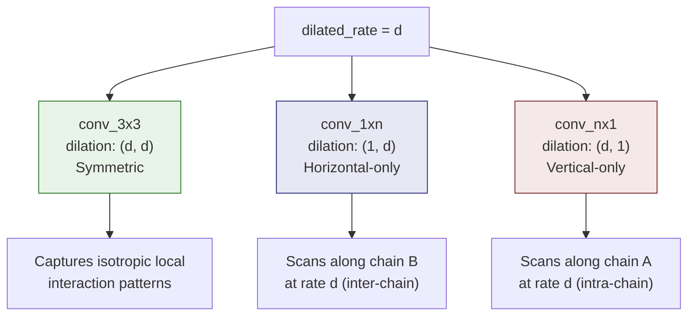
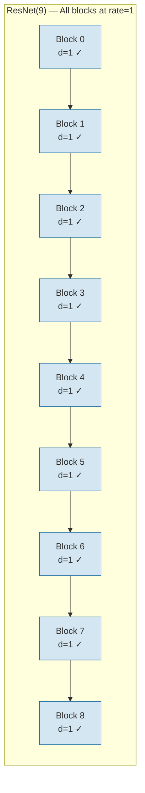

---
slug:7-dilation-rate-strategy
blog_type:normal
---

膨胀率策略是一种架构机制，用于控制每个 `BasicBlock` 内混合 1D-2D 卷积路径上的**感受野缩放**。DRN-1D2D_Inter 设计并未对所有卷积核应用统一的单一膨胀率，而是采用了**轴非对称膨胀**——即水平轴和垂直轴接收独立的膨胀因子——并结合**阈值门控激活**，仅在特定膨胀率下有条件地启用 1D-2D 混合路径。这种双重机制使网络能够在截然不同的空间尺度上捕获蛋白质间接触模式，同时维持维度混合结构，从而将局部序列特征与成对相互作用图区分开来。

来源: [model.py](/model.py#L78-L116)

## 阈值门控混合激活

`BasicBlock` 定义了一个阈值列表 `self.threshold = [1, 20, 40]`，它充当混合 1D-2D 卷积路径的守门人。当该模块的 `dilated_rate` 属于此阈值集合时，`conv_1xn` 和 `conv_nx1` 分支将被实例化并参与前向传播；否则，该模块退化为带有残差连接的纯 3×3 膨胀卷积。这种条件分支在 `__init__` 期间通过 `if dilated_rate in self.threshold` 检查来实现，这意味着架构是**在构建时静态确定的**——在推理期间不会发生动态路由。

来源: [model.py](/model.py#L89-L101), [model.py](/model.py#L127-L151)

这三个阈值对应于蛋白质间接触预测的三种不同操作模式：

| 阈值 | 有效水平感受野 (1×N) | 有效垂直感受野 (N×1) | 接触尺度 | 生物学解释 |
|-----------|-------------------------------|-----------------------------|---------------|--------------------------|
| **1** | 15 个残基 | 15 个残基 | 局部 | 相邻残基-残基接触 |
| **20** | 281 个残基 | 281 个残基 | 中程 | 结构域-结构域界面模式 |
| **40** | 561 个残基 | 561 个残基 | 长程 | 全长链间拓扑 |

感受野数值源自标准膨胀卷积公式：**RF = 1 + (k − 1) × d**，其中 1D 卷积核的 k = 15，d 为膨胀率。这种几何级数缩放意味着每个后续阈值大约使空间覆盖范围翻倍，使网络能够在单一架构框架内，推理从局部邻域模式直至全局链-链几何形状的接触。

来源: [model.py](/model.py#L101-L116)

## 轴非对称膨胀模式

DRN 膨胀策略的决定性特征在于，每个 `BasicBlock` 内的三个卷积路径接收**结构上截然不同的膨胀配置**，尽管它们共享相同的标量 `dilated_rate` 参数。这种非对称性并非实现上的伪影——它是一种刻意的设计，将 2D 接触图的两个轴映射到语义不同的生物学维度上。

具体的膨胀分配如下：

- **`conv_3x3`** 接收 `(dilated_rate, dilated_rate)`——**对称膨胀**，同等地应用于两个空间轴。此路径捕获接触图中的各向同性局部模式，其中相互作用邻域大致呈方形。当膨胀率为 1 时，这是标准的 3×3 卷积；在更高的膨胀率下，它从越来越稀疏但空间上均衡的区域中进行采样。

- **`conv_1xn`** 接收 `(1, dilated_rate)`——**仅水平膨胀**。垂直轴（链 A 残基）以单位间距进行采样，而水平轴（链 B 残基）以速率 `d` 进行采样。此路径专用于检测链 B 中跨度为 `d` 个残基的接触，同时在链 A 上保持细粒度分辨率——有效地沿链间方向扫描周期性相互作用模式。

- **`conv_nx1`** 接收 `(dilated_rate, 1)`——**仅垂直膨胀**。作为 `conv_1xn` 的镜像配置，此路径沿链 A 膨胀，同时沿链 B 保持单位间距。它捕获链 A 中相距 `d` 个位置的残基与链 B 中连续区域相互作用的接触。

来源: [model.py](/model.py#L93-L116)

## 膨胀下的填充一致性

一个关键的实现细节是计算填充值，以在膨胀下保持空间维度。对于非对称的 1D 卷积核，填充必须与膨胀率呈线性缩放，以维持输出尺寸的一致性：

- 核为 `(1, 15)` 且膨胀率为 `d` 的 **`conv_1xn`**：padding = `(0, 7d)`。`7 × dilated_rate` 的水平填充确保了有效宽度为 `1 + 14d` 的膨胀 1×15 卷积核，能够生成与输入具有相同水平维度的输出图。垂直填充为 0，因为卷积核高度为 1（没有需填充的空间跨度）。

- 核为 `(15, 1)` 且膨胀率为 `d` 的 **`conv_nx1`**：padding = `(7d, 0)`。相同的逻辑适用于垂直方向。

- 核为 `(3, 3)` 且膨胀率为 `d` 的 **`conv_3x3`**：padding = `(1, 1)`。值得注意的是，3×3 路径无论膨胀率如何，都使用**固定填充 1**。这在数学上仅在 `d = 1` 时才是正确的（此时有效卷积核大小为 3，填充 1 可保持维度不变）。对于 `d > 1`，有效卷积核大小变为 `1 + 2d`，需要填充 `d` 才能保持维度。这意味着较高膨胀率下的 3×3 路径会产生**空间缩小的输出**——这种行为可能是作为隐式下采样形式的刻意设计，也可能是受限于当前默认配置使用 `dilated_rate = 1` 而被掩盖的实现约束。

<CgxTip>当扩展网络以使用超过 1 的膨胀率时，必须将 3×3 的填充从 `(1, 1)` 更新为 `(dilated_rate, dilated_rate)`，以保持空间维度的一致性。若无此修正，3×3 的输出将缩小，导致在残差相加 `out = out + identity` 期间出现张量尺寸不匹配。</CgxTip>

来源: [model.py](/model.py#L93-L116), [model.py](/model.py#L28-L55)

## 当前配置与可扩展性

默认的网络实例化为 `resnet18() → ResNet(9)`，它构建了 9 个 `BasicBlock` 实例，所有实例均处于**膨胀率 1**。由于 1 ∈ [1, 20, 40]，每个模块都会激活包含所有三个卷积路径的完整混合 1D-2D 架构。因此，网络完全在**局部模式**下运行，其 1D 感受野为 15 个残基，3×3 各向同性感受野为 3 个残基。

`_make_layer` 方法目前为层内的所有模块分配了单一的 `dilated_rate`。为了构建**多尺度膨胀层次结构**（类似于计算机视觉中的 DRN 架构），该架构支持扩展至渐进式膨胀调度，例如 `[1, 1, 1, 1, 1, 1, 1, 20, 40]`——其中最后的模块切换至中程和长程感受野。在此调度下：

- 膨胀率为 1 的 **模块 0–6**：具有 15 残基 1D 感受野的细粒度接触特征
- 膨胀率为 20 的 **模块 7**：具有 281 残基 1D 感受野的中程结构域界面模式  
- 膨胀率为 40 的 **模块 8**：具有 561 残基 1D 感受野的全局链-链拓扑

这种渐进式方案遵循**“由粗到精”的残差学习**原则，其中早期模块建立局部相互作用模体，后期模块精炼全局接触拓扑，而残差连接确保每个尺度的信息无退化地传播。

<CgxTip>`BasicBlock` 中的 `concatenate` 标志（当前为 `False`）为三个卷积路径提供了一种替代融合策略。当为 `True` 时，`conv_3x3`、`conv_1xn` 和 `conv_nx1` 的输出将沿通道维度拼接，并通过 1×1 卷积（`conv_1x1`）进行投影，而非直接求和。在以异构膨胀率运行时，这种保通道拼接可能更好地保留特定尺度的特征。</CgxTip>

来源: [model.py](/model.py#L154-L193), [model.py](/model.py#L214-L215), [model.py](/model.py#L118-L125), [model.py](/model.py#L137-L141)

## 前向传播中的膨胀策略

在 `BasicBlock.forward` 方法内部，膨胀策略表现为条件执行路径。当 `self.dilated_rate in self.threshold` 时，计算所有三个分支并融合其输出（通过逐元素求和，或通过由 `self.concatenate` 控制的 1×1 投影进行通道拼接）。随后，融合后的结果与输入残差相加。当膨胀率不在阈值范围内时，仅有 `conv_3x3` 贡献，生成不带维度混合增强的标准膨胀残差模块。

这意味着**膨胀率起到了双重作用**：它同时控制 (1) 所有卷积路径上卷积核元素的空间间距，以及 (2) 模块的架构宽度——即其作为 3 分支混合模块运行，还是单分支标准残差单元运行。这种耦合是刻意的：在非阈值膨胀率下（例如 2、5 或 10 等中间值），架构故意回退到更简单的纯 3×3 路径，将这些尺度视为不值得为完整的混合结构付出计算成本。

来源: [model.py](/model.py#L127-L151)

## 后续步骤

膨胀率策略在 `BasicBlock` 内部运作，是更广泛的网络前向传播的一部分。要了解这些模块如何从输入特征端到端地组合成接触概率图，请参阅 [网络前向传播](8-network-forward-pass)。有关膨胀策略所门控的混合 1D-2D 卷积路径的结构细节，请参阅 [混合 1D-2D 残差块](6-hybrid-1d-2d-residual-block)。