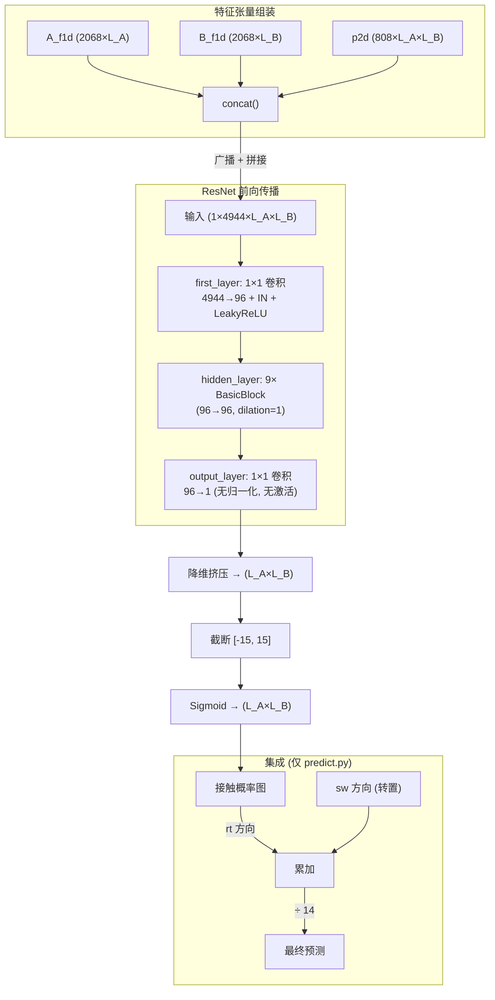
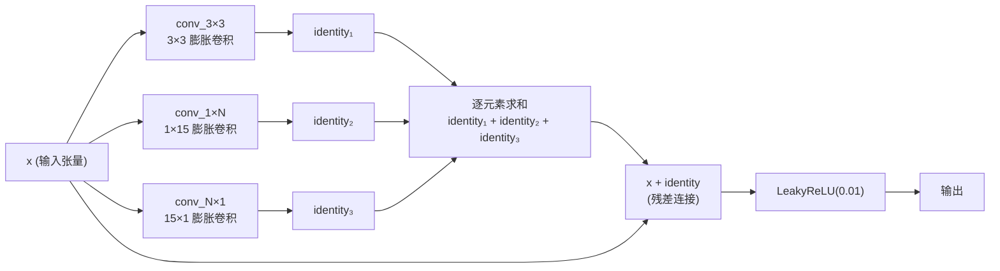

---
slug:8-network-forward-pass
blog_type:normal
---


网络前向传播通过三阶段膨胀残差架构，将 4,944 通道的特征张量转换为蛋白质间接触概率图：**通道投影**（4,944→96）、**残差块处理**（9 个混合 1D-2D 块）以及 **logit 读取**（96→1）并后接 Sigmoid 激活。在推理时，该前向传播会在 **14 种模型-方向组合**（7 个检查点 × 2 种链排列顺序）上执行并取平均，利用了蛋白质间交互特征固有的不对称性。

## 端到端数据流

下图描绘了从预组装特征张量到最终平均接触预测的完整计算路径：



来源: [model.py](/model.py#L154-L209), [predict.py](/predict.py#L153-L177)

## 输入张量构建

在进入网络之前，单链 1D 特征和链间 2D 特征通过 `concat()` 函数融合为一个 4D 张量。该操作将每条链的 1D 特征向量在对侧链的每个位置上进行**广播**，然后沿通道维度拼接所有信号。

`concat(A_f1d, B_f1d, p2d)` 函数的运作方式如下：对于形状为 `(C, L_A)` 的链 A 1D 特征，它将每个位置的特征向量沿新轴重复 `L_B` 次，生成 `(C, L_A, L_B)` 的行广播张量。链 B 的特征也进行对称处理，生成 `(C, L_B, L_A)` 张量后转置为 `(C, L_A, L_B)`。这两个广播张量与配对特征 `p2d` 沿通道轴拼接，并扩展批量维度：

$$\text{Input} = \text{unsqueeze}\big(\text{cat}\big(\text{repeat}(A_{\text{1d}}, L_B, \text{axis}{=}2),\;\text{repeat}(B_{\text{1d}}, L_A, \text{axis}{=}1),\;p_{\text{2d}}\big), \text{axis}{=}0\big)\big)$$

4,944 维输入的通道构成如下：

| 特征组 | 来源 | 通道数 | 维度 |
|---|---|---|---|
| A 广播 (行) | PSSM + ESM-1b repr + MSA-1b repr | 20 + 1280 + 768 | **2,068** |
| B 广播 (列) | PSSM + ESM-1b repr + MSA-1b repr | 20 + 1280 + 768 | **2,068** |
| 配对特征 (2D) | CCMpred + alnstats + ESM-1b attn + MSA-1b attn | 1 + 3 + 660 + 144 | **808** |
| **总计** | | | **4,944** |

注意力通道数由展平的 (层数 × 头数) 结构计算得出：ESM-1b 贡献 33 层 × 20 头 = 660 个通道，ESM-MSA-1b 贡献 12 层 × 12 头 = 144 个通道。在预测时，会构建**两个方向的输入**：`rt_input = concat(A, B, rt_p2d)` 用于右方向注意力，`sw_input = concat(B, A, sw_p2d)` 用于交换方向注意力及转置的共进化信号。

来源: [model.py](/model.py#L13-L25), [load_feature.py](/load_feature.py#L16-L27), [predict.py](/predict.py#L153-L154)

## 三阶段前向架构

`ResNet.forward()` 方法实现了一个严格顺序的三阶段流水线。每个阶段具有独特的架构作用：

### 阶段 1 — 通道投影 (`first_layer`)

1×1 卷积将 4,944 个输入通道降维至网络内部宽度 96 个通道，后接实例归一化和 LeakyReLU。此阶段充当**可学习的特征压缩器**，将异质输入信号（进化、语言和共进化信号）投影到统一的 96 维表示空间。1×1 卷积核确保这纯粹是逐位置操作，不涉及空间混合。

### 阶段 2 — 残差处理 (`hidden_layer`)

九个 `BasicBlock` 实例以膨胀率 1 处理 96 通道张量。每个块应用混合 1D-2D 膨胀卷积及残差跳跃连接（详见下一节）。通过同值填充约定，空间维度 (L_A × L_B) 在全过程中保持不变，因此输出形状仍为 `(1, 96, L_A, L_B)`。

### 阶段 3 — Logit 读取 (`output_layer`)

1×1 卷积将 96 个通道映射为每个位置的单个标量 logit，**不应用归一化和激活函数**。这是一种线性投影，在最终非线性后处理之前产生原始回归信号。

来源: [model.py](/model.py#L154-L209), [model.py](/model.py#L160-L179)

## BasicBlock 前向计算

`BasicBlock` 是网络的计算核心。其前向传播实现了一个**多分支膨胀残差单元**，结合了三种具有不同感受野几何特征的卷积路径：



每个分支由 `make_conv_layer()` 构建，该方法生成一个**双卷积**子网络，其内部序列如下：

```
Conv2d → [InstanceNorm2d] → [LeakyReLU] → Conv2d → [InstanceNorm2d]
```

方括号中的可选组件由 `instance_norm` 和 `non_linearity` 标志控制。在默认配置下（`Bool_in=True`、`Bool_nl=True`），所有组件均处于激活状态，产生带有逐卷积归一化的完整双卷积模式。值得注意的是，**未应用 Dropout** —— 被注释掉的 `Dropout2d(p=0.3)` 在最终架构中被禁用。

### 分支激活逻辑

1×N 和 N×1 分支基于块的膨胀率是否落在阈值集合 `{1, 20, 40}` 内进行**条件实例化**。对于 `resnet18()` 配置（9 个块，膨胀率全为 1），所有块均激活三个分支。当膨胀率超出此阈值时，仅执行 3×3 分支，使该块退化为标准的单分支膨胀残差单元。

### 分支组合模式

该块支持由 `self.concatenate` 标志（默认为 `False`）控制的两种组合策略：

| 模式 | 标志 | 操作 | 通道流 |
|---|---|---|---|
| **相加** (默认) | `concatenate=False` | `identity₁ + identity₂ + identity₃` | 每个分支: in_ch → out_ch |
| **拼接** | `concatenate=True` | `Conv1×1(cat(identity₁, identity₂, identity₃))` | 分支: 各 in_ch → out_ch; 拼接: 3×out_ch → out_ch 经 1×1 卷积 |

在相加模式下，三个分支的输出直接进行逐元素求和 —— 这是一种参数高效的方案，避免了额外的 1×1 投影。在拼接模式下，分支的通道输出被堆叠，并通过 1×1 卷积（由 `make_1x1_layer` 构建）投影回 `out_channels`。

来源: [model.py](/model.py#L78-L151), [model.py](/model.py#L28-L76)

## 输出后处理

在 `output_layer` 生成形状为 `(1, 1, L_A, L_B)` 的单通道 logit 图后，前向传播应用确定性的后处理链：

| 步骤 | 操作 | 输入形状 | 输出形状 | 目的 |
|---|---|---|---|---|
| 1 | `torch.squeeze()` | (1, 1, L_A, L_B) | (L_A, L_B) | 移除批量和通道维度 |
| 2 | `torch.clamp(min=-15, max=15)` | (L_A, L_B) | (L_A, L_B) | 防止 Sigmoid 饱和 |
| 3 | `nn.Sigmoid()` | (L_A, L_B) | (L_A, L_B) | 映射至概率区间 [0, 1] |

<CgxTip>Sigmoid 前截断至 [-15, 15] 是关键的数值稳定性措施。若不如此，超过约 ±15 的 logit 将产生接近零的梯度（Sigmoid 饱和），导致训练停滞。此操作将有效概率范围限定在约 [3.1×10⁻⁷, 1 − 3.1×10⁻⁷]，足以进行二元接触分类，同时维持健康的梯度流。</CgxTip>

权重初始化采用 **Kaiming 正态**初始化，参数为 `a=0.01`（LeakyReLU 负斜率）和 `mode='fan_in'`，统一应用于网络中所有 `Conv2d` 模块。此初始化专为 LeakyReLU 激活校准，以在前向传播中维持层间方差。

来源: [model.py](/model.py#L195-L209), [model.py](/model.py#L181-L183)

## 集成推理策略

在预测时，前向传播被嵌入到一个利用蛋白质间特征方向性结构的**不对称集成**中。`predict.py` 流水线构建两种不同的输入：

- **`rt_input`**：`concat(A_f1d, B_f1d, rt_p2d)` —— 链 A 特征沿行广播，链 B 沿列广播，附右方向注意力图
- **`sw_input`**：`concat(B_f1d, A_f1d, sw_p2d)` —— 链 B 特征沿行广播，链 A 沿列广播，附交换方向注意力图（及转置的共进化信号）

7 个训练好的模型检查点分别应用于**这两种**方向输入，每个位置产生 14 个原始预测。交换方向的预测在累加前被**转置**，以重新对齐至 rt 方向的坐标系：

```python
for weight_file in weight_list:         # 7 个检查点
    model.load_state_dict(torch.load(weight_file, map_location=device))
    preds  = model(rt_input)             # (L_A, L_B)
    preds2 = model(sw_input)             # (L_B, L_A) → 转置 → (L_A, L_B)
    all_preds += preds + preds2.T
final = all_preds / 14
```

这种双向平均在无需额外检查点的情况下将有效集成规模翻倍，并捕获了蛋白质间注意力固有的不对称性：拼接序列 A+B 的 ESM-1b 注意力不同于 B+A，二者均携带互补的结构信号。

来源: [predict.py](/predict.py#L158-L177), [load_feature.py](/load_feature.py#L61-L102)

## 模型配置摘要

`resnet18()` 工厂函数通过单一配置参数实例化完整架构：

| 参数 | 值 | 作用 |
|---|---|---|
| `blocks_num` | 9 | hidden_layer 中包含 9 个 BasicBlock |
| `in_channel` | 96 | 所有块的内部通道宽度 |
| 首层输入/输出 | 4944 → 96 | 从异质输入进行特征压缩 |
| 输出层输入/输出 | 96 → 1 | 每个空间位置的标量 logit |
| 膨胀率 | 1 | 所有块使用均匀膨胀（按阈值激活分支） |
| 分支数 | 每块 3 个 | 3×3 + 1×15 + 15×1 (dilation=1 ∈ 阈值 {1,20,40}) |
| 组合方式 | 相加 | `identity₁ + identity₂ + identity₃` |
| 激活函数 | LeakyReLU(0.01) | 在每对卷积后及残差相加后应用 |
| 归一化 | InstanceNorm2d | Momentum=0.1, affine=True, track_running_stats=False |
| 卷积偏置 | False | 所有 Conv2d 层无偏置项运作 |

配置了 `track_running_stats=False` 的 InstanceNorm2d 意味着归一化统计量在训练和推理时均**按实例**计算，而非使用运行平均值。这非常契合蛋白质结构预测中遇到的可变尺寸接触图，其中每个输入具有独特的空间维度。

来源: [model.py](/model.py#L154-L183), [model.py](/model.py#L214-L215)

如需深入理解混合 1D-2D 分支设计与膨胀率调度，请参阅 [混合 1D-2D 残差块](6-hybrid-1d-2d-residual-block) 和 [膨胀率策略](7-dilation-rate-strategy)。关于前向传播之前的特征准备，请参阅 [特征工程流水线](5-feature-engineering-pipeline)。