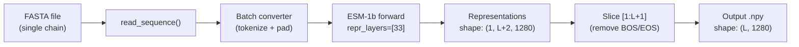
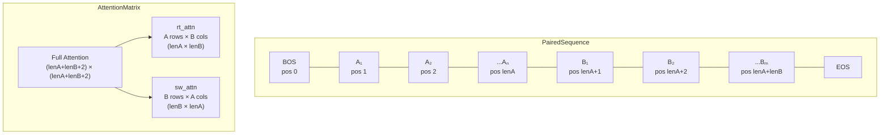

---
slug:9-esm-1b-attention-and-representation
blog_type:normal
---


ESM-1b 蛋白质语言模型在 DRN-1D2D_Inter 中作为**主要特征提取器**，为蛋白质间接触预测流程提供两种互补的信号类型：**逐残基表示**，用于编码单链的进化和结构上下文；以及**跨链注意力图**，用于在两条链作为拼接序列输入时捕获残基对耦合信号。这两个模块——`esm1b_repr.py` 和 `esm1b_attn.py`——在根本不同的输入模式上运行，并产生不同维度的特征，但两者均源自同一个 650M 参数的 ESM-1b Transformer（33 层，20 个注意力头，1280 维嵌入），从而确保了 1D 和 2D 特征通道之间的表示一致性。

## 模型加载与推理上下文

两个模块共享相同的初始化模式：通过 `esm.pretrained.load_model_and_alphabet_local()` 从本地文件加载预训练的 ESM-1b 检查点，将其置于评估模式，并移动至目标计算设备。**字母表的批量转换器**负责分词——将氨基酸字符映射为整数标记，并自动进行 BOS/EOS 填充。推理始终在 `torch.no_grad()` 上下文中进行以禁用梯度计算，并通过 `repr_layers=[33]` 参数显式请求第 33 层（即 Transformer 的最后一层）的表示。选择最后一层是为了在所有 33 个 Transformer 层通过多头自注意力和前馈变换迭代精炼标记表示后，捕获最抽象且与任务相关的嵌入。

```python
repr_layers = [33]
model, alphabet = pretrained.load_model_and_alphabet_local(esm1b_location)
model = model.eval().to(device)
batch_converter = alphabet.get_batch_converter()
```

来源: [esm1b_repr.py](plm/esm1b_repr.py#L40-L43), [esm1b_attn.py](plm/esm1b_attn.py#L45-L48)

## 序列 I/O 工具

两个模块共享三个用于读取和清洗序列数据的工具函数。`read_sequence()` 函数从 FASTA 文件中提取第一条记录，返回一个 `(description, sequence)` 元组。`remove_insertions()` 函数去除比对序列中的小写字符、点号和星号——这些代表 MSA 格式中的插入状态，必须在将序列输入 ESM 分词器之前移除。`read_msa()` 函数将其推广到多序列比对，通过 `itertools.islice` 读取最多 `nseq` 条记录，并自动移除插入标记。

| 函数 | 输入 | 输出 | 用途 |
|----------|-------|--------|---------|
| `read_sequence` | FASTA 文件路径 | `(description, sequence)` | 单序列提取 |
| `remove_insertions` | 比对序列字符串 | 清洗后的序列字符串 | 去除 MSA 插入标记 |
| `read_msa` | MSA 文件路径, `nseq` | `List[(description, sequence)]` | 批量 MSA 读取 |

来源: [esm1b_attn.py](plm/esm1b_attn.py#L23-L35), [esm1b_repr.py](plm/esm1b_repr.py#L24-L36)

## 逐残基表示提取

`esm1b_repr.main()` 函数为单个蛋白质链中的每个残基提取一个 **1D 特征向量**。给定一条链的 FASTA 文件，它读取序列，通过 ESM-1b 批量转换器对其进行分词，并运行前向传播以获得第 33 层的表示张量。关键的后处理步骤是 **BOS/EOS 标记移除**：ESM-1b 在位置 0 前置一个序列起始标记，并在末尾追加一个序列结束标记，因此表示切片 `out['representations'][33][0, 1:(len_seq+1), :]` 会丢弃这些哨兵嵌入，从而生成干净的逐残基矩阵。



输出形状为 **(L, 1280)**，其中 L 为序列长度，1280 为 ESM-1b 的嵌入维度。该表示被保存为 NumPy `.npy` 文件，随后在 `load_feature.chain_feature()` 的 1D 特征组装步骤中，与 PSSM 和 ESM-MSA-1b 表示进行拼接，形成维度为 20 (PSSM) + 1280 (ESM-1b) + 768 (ESM-MSA-1b) = **2068 通道**的单链 1D 特征。

<CgxTip>`repr_layers=[33]` 参数被传递给模型的前向方法，但输出字典由整数键 `33` 索引——而非列表位置。如果你修改了 `repr_layers`，则必须相应地更新字典键（例如，`out['representations'][your_layer]`）。</CgxTip>

来源: [esm1b_repr.py](plm/esm1b_repr.py#L39-L54), [load_feature.py](load_feature.py#L42-L58)

## 跨链注意力提取

`esm1b_attn.main()` 函数在架构上更具意义——它通过利用 ESM-1b 对拼接链对的自注意力来提取**蛋白质间注意力信号**。给定一个包含 `seqA + seqB`（两条链无分隔符拼接）的配对 FASTA 文件，模型计算所有残基对之间的完全自注意力。核心见解在于，**链 A 位置与链 B 位置之间的注意力权重构成了一种跨链耦合信号**，尽管该模型仅在单链序列上受过训练——这些注意力模式仍可作为可迁移的结构先验涌现出来。

注意力张量 `out['attentions']` 的形状为 `(1, 33, 20, L_total+2, L_total+2)`，其中 33 为层数，20 为注意力头数，`L_total = lenA + lenB`。提取两个跨链子张量：

| 注意力类型 | 切片表达式 | 形状 | 语义含义 |
|---------------|-----------------|-------|------------------|
| **rt_attn** (right) | `[:, :, 1:(lenA+1), 1+lenA:(len_seq+1)]` | (33, 20, lenA, lenB) | A→B：链 A 残基如何关注链 B |
| **sw_attn** (swap) | `[:, :, 1+lenA:(len_seq+1), 1:(lenA+1)]` | (33, 20, lenB, lenA) | B→A：链 B 残基如何关注链 A |



BOS/EOS 偏移逻辑与表示模块相同：位置 0 为 BOS 标记，位置 1 到 `lenA` 为链 A 残基，位置 `1+lenA` 到 `len_seq` 为链 B 残基，位置 `len_seq+1` 为 EOS。`.squeeze()` 调用会在转换为 NumPy 之前移除批量维度。

来源: [esm1b_attn.py](plm/esm1b_attn.py#L39-L61), [predict.py](predict.py#L76-L100)

## 用于 2D 通道组装的注意力特征重塑

由 `esm1b_attn.main()` 保存的原始注意力张量形状为 **(33, 20, lenA, lenB)**——包含三个“元”维度（层数、头数）和两个空间维度。然而，下游的 DRN-1D2D 网络将每个 (层, 头) 组合视为一个独立的 2D 特征通道。在 `load_feature.paired_feature()` 中，重塑操作 `np.reshape(rtattn_esm1b, (l*h, la, lb))` 将层和头维度展平为单一的通道轴，从而生成 **660 个通道**（33 层 × 20 个头），每个通道的形状为 `(lenA, lenB)`。

这种重塑至关重要，因为它允许膨胀残差网络通过其 1×1 输入投影层学习**层头特定模式**，该投影层将所有 2D 通道（包括 CCmpred、alnstats、ESM-1b 注意力和 ESM-MSA-1b 注意力）混合为一个 96 通道的内部表示。不同层中不同的注意力头捕获性质不同的结构信号——早期层关注局部序列模式，而后期层捕获长程接触——网络通过学习哪些组合对蛋白质间接触具有预测性。

来源: [load_feature.py](load_feature.py#L61-L102), [model.py](model.py#L154-L166)

## 流程集成与特征组装

这两个 ESM-1b 模块在 `predict.py` 定义的预测流程中的特定阶段被调用。注意力模块在两条链的**配对拼接**上运行（步骤 5），而表示模块**独立**地在每条链上运行（步骤 8）。这种不对称性是有意为之的：表示是表征单个残基环境的链局部特征，而注意力是需要联合上下文的链对特征。

| 流程步骤 | 模块 | 输入 | 输出文件 | 下游角色 |
|--------------|--------|-------|-------------|-----------------|
| 5 | `esm1b_attn.main` | paired.fasta, chain A FASTA | `esm1b_rt.attn.npy`, `esm1b_sw.attn.npy` | 2D 跨链特征 (660 通道) |
| 8 | `esm1b_repr.main` | chain A FASTA | `A_esm1b.repr.npy` | 1D 逐残基特征 (1280 通道) |
| 8 | `esm1b_repr.main` | chain B FASTA | `B_esm1b.repr.npy` | 1D 逐残基特征 (1280 通道) |

**rt**（right）方向的完整 2D 特征通道组成为：1 (CCmpred) + 3 (alnstats) + 660 (ESM-1b attn) + 144 (ESM-MSA-1b attn) = **808 通道**。加上在 2D 网格上广播的 1D 特征（2068 + 2068 = 4136 通道），DRN-1D2D 网络的总输入为 **4944 通道**——与模型第一个 1×1 卷积层中的 `in_channels=4944` 相匹配。

<CgxTip>`sw_attn` 特征使用转置的 CCmpred 和 alnstats（`swapaxes(-2,-1)`），而非 `rt_attn` 使用的同向版本。这反映了问题的方向对称性：rt 特征对 A→B 接触进行建模，而 sw 特征对 B→A 接触进行建模，网络集成对两个方向的预测进行平均以增强鲁棒性。</CgxTip>

来源: [predict.py](predict.py#L96-L131), [load_feature.py](load_feature.py#L61-L102), [model.py](model.py#L159-L161)

## ESM-1b 与 ESM-MSA-1b：互补角色

尽管本页侧重于 ESM-1b，但理解它如何与 [ESM-MSA-1b Attention and Representation](10-esm-msa-1b-attention-and-representation) 中记载的 MSA 感知模型互补也很重要。ESM-1b 在**单序列**（或其拼接）上运行，并捕获在 UniRef50 上预训练期间学习到的隐式进化信号。相比之下，ESM-MSA-1b 接收**显式 MSA 输入**，并能跨同源序列进行关注。这两个模型提供非冗余的信息：ESM-1b 提供 1280 维表示和 660 个注意力通道，而 ESM-MSA-1b 提供 768 维表示和 144 个注意力通道。它们共同构成了 [Feature Engineering Pipeline](5-feature-engineering-pipeline) 中描述的特征工程流程的蛋白质语言模型主干。

| 属性 | ESM-1b | ESM-MSA-1b |
|----------|--------|------------|
| 参数量 | 650M | 100M |
| 层数 | 33 | 12 |
| 注意力头数 | 20 | 12 |
| 嵌入维度 | 1280 | 768 |
| 输入类型 | 单序列 / 拼接 | 多序列比对 |
| 注意力通道数 (L×H) | 660 | 144 |
| 表示维度 | 1280 | 768 |