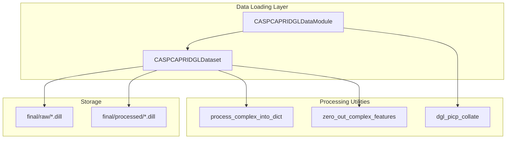
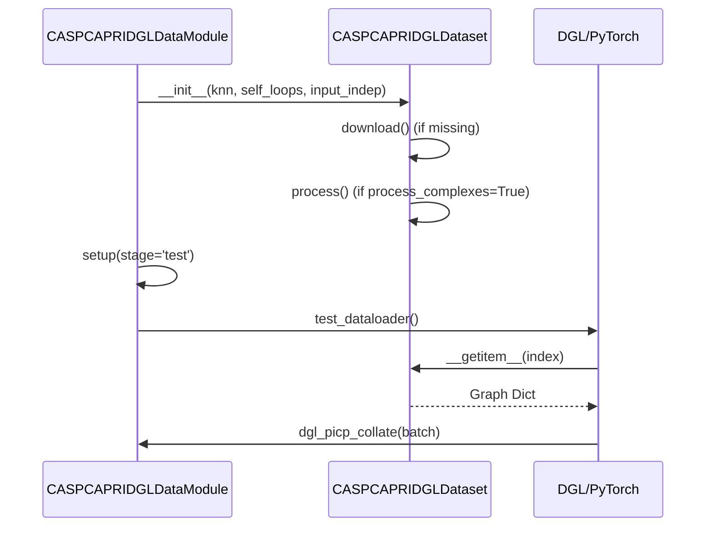

# CASP-CAPRI Dataset

> **Relevant source files**
> * [project/datasets/CASP_CAPRI/casp_capri_dgl_data_module.py](https://github.com/BioinfoMachineLearning/DeepInteract/blob/c78d2054/project/datasets/CASP_CAPRI/casp_capri_dgl_data_module.py)
> * [project/datasets/CASP_CAPRI/casp_capri_dgl_dataset.py](https://github.com/BioinfoMachineLearning/DeepInteract/blob/c78d2054/project/datasets/CASP_CAPRI/casp_capri_dgl_dataset.py)

The CASP-CAPRI dataset is a specialized test set within DeepInteract used to evaluate the model's performance on high-quality, biologically relevant protein complexes. It consists of 19 dimers derived from CASP (Critical Assessment of Structure Prediction) and CAPRI (Critical Assessment of Predicted Interactions) challenges [project/datasets/CASP_CAPRI/casp_capri_dgl_dataset.py L18-L22](https://github.com/BioinfoMachineLearning/DeepInteract/blob/c78d2054/project/datasets/CASP_CAPRI/casp_capri_dgl_dataset.py#L18-L22)

## Dataset Composition and Statistics

The dataset is strictly a testing resource and is partitioned into two main categories:

* **Homodimers**: 14 complexes [project/datasets/CASP_CAPRI/casp_capri_dgl_dataset.py L18](https://github.com/BioinfoMachineLearning/DeepInteract/blob/c78d2054/project/datasets/CASP_CAPRI/casp_capri_dgl_dataset.py#L18-L18)
* **Heterodimers**: 5 complexes [project/datasets/CASP_CAPRI/casp_capri_dgl_dataset.py L19](https://github.com/BioinfoMachineLearning/DeepInteract/blob/c78d2054/project/datasets/CASP_CAPRI/casp_capri_dgl_dataset.py#L19-L19)

Each entry in the dataset represents a bound protein complex with two structures (dimers) [project/datasets/CASP_CAPRI/casp_capri_dgl_dataset.py L20-L22](https://github.com/BioinfoMachineLearning/DeepInteract/blob/c78d2054/project/datasets/CASP_CAPRI/casp_capri_dgl_dataset.py#L20-L22)

## CASPCAPRIDGLDataset Implementation

The `CASPCAPRIDGLDataset` class inherits from `dgl.data.DGLDataset` and handles the lifecycle of the data, from downloading raw archives to processing them into graph-ready formats [project/datasets/CASP_CAPRI/casp_capri_dgl_dataset.py L13](https://github.com/BioinfoMachineLearning/DeepInteract/blob/c78d2054/project/datasets/CASP_CAPRI/casp_capri_dgl_dataset.py#L13-L13)

### Initialization and Sampling

During initialization, the dataset constructs file paths based on the `mode` (which must be 'test') and handles optional random sampling if `percent_to_use` is less than 1.0 [project/datasets/CASP_CAPRI/casp_capri_dgl_dataset.py L74-L89](https://github.com/BioinfoMachineLearning/DeepInteract/blob/c78d2054/project/datasets/CASP_CAPRI/casp_capri_dgl_dataset.py#L74-L89)

 It maintains a record of filenames in a `.txt` file to ensure consistency across reloads [project/datasets/CASP_CAPRI/casp_capri_dgl_dataset.py L92-L116](https://github.com/BioinfoMachineLearning/DeepInteract/blob/c78d2054/project/datasets/CASP_CAPRI/casp_capri_dgl_dataset.py#L92-L116)

### Data Flow: From Archive to Graph

The dataset follows a standard DGL data flow:

1. **Download**: If the raw directory is missing, it downloads a `.tar.gz` archive and verifies its integrity using SHA-1 [project/datasets/CASP_CAPRI/casp_capri_dgl_dataset.py L124-L136](https://github.com/BioinfoMachineLearning/DeepInteract/blob/c78d2054/project/datasets/CASP_CAPRI/casp_capri_dgl_dataset.py#L124-L136)
2. **Process**: It iterates through `.dill` files in the raw directory. If a complex hasn't been processed, it calls `process_complex_into_dict` to generate the DGL graph representations [project/datasets/CASP_CAPRI/casp_capri_dgl_dataset.py L145-L156](https://github.com/BioinfoMachineLearning/DeepInteract/blob/c78d2054/project/datasets/CASP_CAPRI/casp_capri_dgl_dataset.py#L145-L156)
3. **Loading**: Processed dictionaries are loaded from the `processed/` directory into memory [project/datasets/CASP_CAPRI/casp_capri_dgl_dataset.py L160-L167](https://github.com/BioinfoMachineLearning/DeepInteract/blob/c78d2054/project/datasets/CASP_CAPRI/casp_capri_dgl_dataset.py#L160-L167)

### Input-Independent Baseline

A unique feature of this dataset is the `input_indep` flag. If set to `True`, the dataset invokes `zero_out_complex_features` [project/datasets/CASP_CAPRI/casp_capri_dgl_dataset.py L10](https://github.com/BioinfoMachineLearning/DeepInteract/blob/c78d2054/project/datasets/CASP_CAPRI/casp_capri_dgl_dataset.py#L10-L10)

 This function zeroes out all node and edge features, allowing the model to be tested for its ability to learn from structural geometry alone without relying on specific evolutionary or chemical features [project/datasets/CASP_CAPRI/casp_capri_dgl_dataset.py L41-L42](https://github.com/BioinfoMachineLearning/DeepInteract/blob/c78d2054/project/datasets/CASP_CAPRI/casp_capri_dgl_dataset.py#L41-L42)

**Sources:**

* [project/datasets/CASP_CAPRI/casp_capri_dgl_dataset.py L1-L167](https://github.com/BioinfoMachineLearning/DeepInteract/blob/c78d2054/project/datasets/CASP_CAPRI/casp_capri_dgl_dataset.py#L1-L167)
* [project/utils/deepinteract_utils.py L9-L10](https://github.com/BioinfoMachineLearning/DeepInteract/blob/c78d2054/project/utils/deepinteract_utils.py#L9-L10)

## Data Management and Loading

The following diagram illustrates the relationship between the dataset class, the Lightning Data Module, and the external utilities used for processing.

### CASP-CAPRI Entity Relationship

**Sources:**

* [project/datasets/CASP_CAPRI/casp_capri_dgl_data_module.py L15-L41](https://github.com/BioinfoMachineLearning/DeepInteract/blob/c78d2054/project/datasets/CASP_CAPRI/casp_capri_dgl_data_module.py#L15-L41)
* [project/datasets/CASP_CAPRI/casp_capri_dgl_dataset.py L145-L160](https://github.com/BioinfoMachineLearning/DeepInteract/blob/c78d2054/project/datasets/CASP_CAPRI/casp_capri_dgl_dataset.py#L145-L160)

## CASPCAPRIDGLDataModule

The `CASPCAPRIDGLDataModule` wraps the dataset for use with PyTorch Lightning, providing a standardized interface for testing [project/datasets/CASP_CAPRI/casp_capri_dgl_data_module.py L15](https://github.com/BioinfoMachineLearning/DeepInteract/blob/c78d2054/project/datasets/CASP_CAPRI/casp_capri_dgl_data_module.py#L15-L15)

### Configuration

The module is configured with parameters that control graph construction and batching:

* `knn`: The number of nearest neighbors for graph edges [project/datasets/CASP_CAPRI/casp_capri_dgl_data_module.py L28](https://github.com/BioinfoMachineLearning/DeepInteract/blob/c78d2054/project/datasets/CASP_CAPRI/casp_capri_dgl_data_module.py#L28-L28)
* `self_loops`: Whether nodes are connected to themselves [project/datasets/CASP_CAPRI/casp_capri_dgl_data_module.py L29](https://github.com/BioinfoMachineLearning/DeepInteract/blob/c78d2054/project/datasets/CASP_CAPRI/casp_capri_dgl_data_module.py#L29-L29)
* `batch_size`: Number of complexes per batch [project/datasets/CASP_CAPRI/casp_capri_dgl_data_module.py L26](https://github.com/BioinfoMachineLearning/DeepInteract/blob/c78d2054/project/datasets/CASP_CAPRI/casp_capri_dgl_data_module.py#L26-L26)

### Data Partitioning

Since CASP-CAPRI is a test set, the `setup` method only instantiates the `casp_capri_test` member [project/datasets/CASP_CAPRI/casp_capri_dgl_data_module.py L35-L41](https://github.com/BioinfoMachineLearning/DeepInteract/blob/c78d2054/project/datasets/CASP_CAPRI/casp_capri_dgl_data_module.py#L35-L41)

 However, to satisfy the `LightningDataModule` interface, the `train_dataloader` and `val_dataloader` methods also return the test set [project/datasets/CASP_CAPRI/casp_capri_dgl_data_module.py L43-L53](https://github.com/BioinfoMachineLearning/DeepInteract/blob/c78d2054/project/datasets/CASP_CAPRI/casp_capri_dgl_data_module.py#L43-L53)

 All dataloaders utilize `dgl_picp_collate` to handle the collation of DGL graphs into batches [project/datasets/CASP_CAPRI/casp_capri_dgl_data_module.py L33](https://github.com/BioinfoMachineLearning/DeepInteract/blob/c78d2054/project/datasets/CASP_CAPRI/casp_capri_dgl_data_module.py#L33-L33)

### Technical Data Flow

The following diagram maps the logic from the DataModule to the underlying Dataset methods.

**Sources:**

* [project/datasets/CASP_CAPRI/casp_capri_dgl_data_module.py L35-L53](https://github.com/BioinfoMachineLearning/DeepInteract/blob/c78d2054/project/datasets/CASP_CAPRI/casp_capri_dgl_data_module.py#L35-L53)
* [project/datasets/CASP_CAPRI/casp_capri_dgl_dataset.py L63-L121](https://github.com/BioinfoMachineLearning/DeepInteract/blob/c78d2054/project/datasets/CASP_CAPRI/casp_capri_dgl_dataset.py#L63-L121)
* [project/utils/deepinteract_utils.py L7](https://github.com/BioinfoMachineLearning/DeepInteract/blob/c78d2054/project/utils/deepinteract_utils.py#L7-L7)