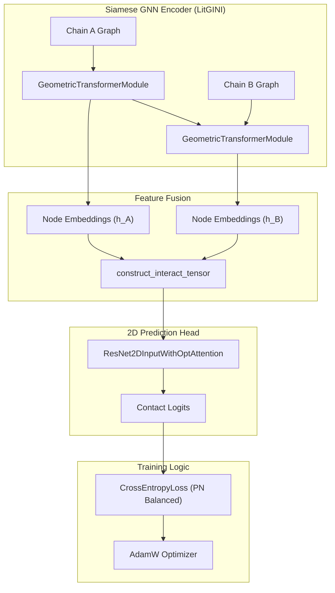

# Core Model Architecture

> **Relevant source files**
> * [img/Geometric_Transformer.png](https://github.com/BioinfoMachineLearning/DeepInteract/blob/c78d2054/img/Geometric_Transformer.png)
> * [project/utils/deepinteract_modules.py](https://github.com/BioinfoMachineLearning/DeepInteract/blob/c78d2054/project/utils/deepinteract_modules.py)

The core of DeepInteract is the **LitGINI-GeoTran-DilResNet** model, a deep learning architecture designed to predict residue-residue contact maps between protein chains. The model utilizes a Siamese Graph Neural Network (GNN) encoder to process individual protein chains and a 2D convolutional head to predict interactions between them.

## High-Level Pipeline

The architecture follows a modular flow:

1. **Siamese GNN Encoder**: Two identical weight-sharing encoders process Chain A and Chain B independently, transforming structural and evolutionary features into rich node and edge embeddings.
2. **Geometric Transformer**: A specialized GNN layer that integrates 3D geometric constraints (distances, orientations, and angles) into the node representations.
3. **Interaction Tensor Construction**: Node embeddings from both chains are combined into a 2D grid representation (interaction tensor).
4. **2D Interaction Predictor**: A dilated residual network (DilResNet) or DeepLabV3+ model processes the interaction tensor to output a probability map of inter-chain contacts.

### System Architecture Diagram

This diagram maps the high-level conceptual components to their corresponding classes and modules in the codebase.

**Sources:**

* `project/utils/deepinteract_modules.py:1255-1280` (LitGINI `forward` logic)
* `project/utils/deepinteract_utils.py:20-22` (Utility functions for tensor construction)

---

## 1. Siamese GNN Encoder (Geometric Transformer)

The encoder is implemented within the `LitGINI` Lightning module and primarily relies on the `DGLGeometricTransformer`. It processes `dgl.DGLGraph` objects where nodes represent residues and edges represent spatial proximity (K-Nearest Neighbors).

* **Initialization**: The `InitEdgeModule` embeds raw node features and projects geometric edge features (RBF distances, quaternions, amide plane angles) into a shared hidden dimension [project/utils/deepinteract_modules.py L128-L159](https://github.com/BioinfoMachineLearning/DeepInteract/blob/c78d2054/project/utils/deepinteract_modules.py#L128-L159)
* **Geometric Attention**: The `MultiHeadGeometricAttentionLayer` uses edge features to gate the attention scores between nodes, ensuring that the 3D spatial arrangement of residues directly informs the learned representations [project/utils/deepinteract_modules.py L34-L75](https://github.com/BioinfoMachineLearning/DeepInteract/blob/c78d2054/project/utils/deepinteract_modules.py#L34-L75)
* **Conformation Awareness**: The `ConformationModule` updates node positions and orientations, though this can be toggled via the `disable_geometric_mode` flag [project/utils/deepinteract_modules.py L1075-L1088](https://github.com/BioinfoMachineLearning/DeepInteract/blob/c78d2054/project/utils/deepinteract_modules.py#L1075-L1088)

For details, see [Geometric Transformer (DGLGeometricTransformer)](/BioinfoMachineLearning/DeepInteract/2.1-geometric-transformer-(dglgeometrictransformer)).

**Sources:**

* `project/utils/deepinteract_modules.py:34-122` (Attention Layer)
* `project/utils/deepinteract_modules.py:873-900` (Geometric Transformer Module)

---

## 2. 2D Interaction Predictor

Once node embeddings are generated for both chains, they are concatenated and tiled into a 2D interaction tensor of shape `(Batch, Channels, Length_A, Length_B)`.

* **ResNet2D**: The default predictor is `ResNet2DInputWithOptAttention`, which uses dilated convolutions to capture long-range dependencies across the interaction interface without losing resolution [project/utils/deepinteract_modules.py L1186-L1210](https://github.com/BioinfoMachineLearning/DeepInteract/blob/c78d2054/project/utils/deepinteract_modules.py#L1186-L1210)
* **Squeeze-and-Excitation**: Optional SE-blocks provide channel-wise attention to highlight the most informative feature maps [project/utils/deepinteract_modules.py L1162-L1184](https://github.com/BioinfoMachineLearning/DeepInteract/blob/c78d2054/project/utils/deepinteract_modules.py#L1162-L1184)
* **Subsequencing**: For large protein complexes that exceed GPU memory, the model employs a tiling strategy to process the interaction matrix in smaller patches [project/utils/deepinteract_utils.py L21-L22](https://github.com/BioinfoMachineLearning/DeepInteract/blob/c78d2054/project/utils/deepinteract_utils.py#L21-L22)

For details, see [Interaction Prediction Module (ResNet2D and DeepLabV3+)](/BioinfoMachineLearning/DeepInteract/2.2-interaction-prediction-module-(resnet2d-and-deeplabv3+)).

**Sources:**

* `project/utils/deepinteract_modules.py:1133-1160` (ResNet blocks)
* `project/utils/deepinteract_utils.py:400-450` (Subsequencing logic)

---

## 3. Training and Optimization

The `LitGINI` class (extending `pytorch_lightning.LightningModule`) orchestrates the training process.

* **Loss Function**: Uses Cross-Entropy loss, often adjusted by the `pos_weight` to handle the extreme class imbalance (most residue pairs are not in contact) [project/utils/deepinteract_modules.py L1330-L1350](https://github.com/BioinfoMachineLearning/DeepInteract/blob/c78d2054/project/utils/deepinteract_modules.py#L1330-L1350)
* **Optimization**: Employs `AdamW` with `CosineAnnealingWarmRestarts` for robust convergence [project/utils/deepinteract_modules.py L1550-L1570](https://github.com/BioinfoMachineLearning/DeepInteract/blob/c78d2054/project/utils/deepinteract_modules.py#L1550-L1570)
* **Metrics**: Evaluates performance using AUPRC and top-k precision/recall (where $k$ is related to the sequence length $L$, e.g., $L/10, L/5$) [project/utils/deepinteract_modules.py L1450-L1480](https://github.com/BioinfoMachineLearning/DeepInteract/blob/c78d2054/project/utils/deepinteract_modules.py#L1450-L1480)

For details, see [Training and Optimization (LitGINI Lightning Module)](/BioinfoMachineLearning/DeepInteract/2.3-training-and-optimization-(litgini-lightning-module)).

**Sources:**

* `project/utils/deepinteract_modules.py:1225-1250` (LitGINI definition)
* `project/utils/deepinteract_modules.py:1400-1430` (Training step)

---

## Code Entity Map: Model Components

The following table summarizes the key classes and their roles within the architecture.

| Component | Code Entity (Class/Function) | File Path |
| --- | --- | --- |
| **Main Model** | `LitGINI` | [project/utils/deepinteract_modules.py L1225](https://github.com/BioinfoMachineLearning/DeepInteract/blob/c78d2054/project/utils/deepinteract_modules.py#L1225-L1225) |
| **Geometric GNN** | `DGLGeometricTransformer` | [project/utils/deepinteract_modules.py L1005](https://github.com/BioinfoMachineLearning/DeepInteract/blob/c78d2054/project/utils/deepinteract_modules.py#L1005-L1005) |
| **Edge Initializer** | `InitEdgeModule` | [project/utils/deepinteract_modules.py L128](https://github.com/BioinfoMachineLearning/DeepInteract/blob/c78d2054/project/utils/deepinteract_modules.py#L128-L128) |
| **2D ResNet** | `ResNet2DInputWithOptAttention` | [project/utils/deepinteract_modules.py L1186](https://github.com/BioinfoMachineLearning/DeepInteract/blob/c78d2054/project/utils/deepinteract_modules.py#L1186-L1186) |
| **Interaction Grid** | `construct_interact_tensor` | [project/utils/deepinteract_utils.py L20](https://github.com/BioinfoMachineLearning/DeepInteract/blob/c78d2054/project/utils/deepinteract_utils.py#L20-L20) |
| **Segmentation Head** | `DeepLabV3Plus` | [project/utils/vision_modules.py L24](https://github.com/BioinfoMachineLearning/DeepInteract/blob/c78d2054/project/utils/vision_modules.py#L24-L24) |

**Sources:**

* `project/utils/deepinteract_modules.py`
* `project/utils/deepinteract_utils.py`
* `project/utils/vision_modules.py`