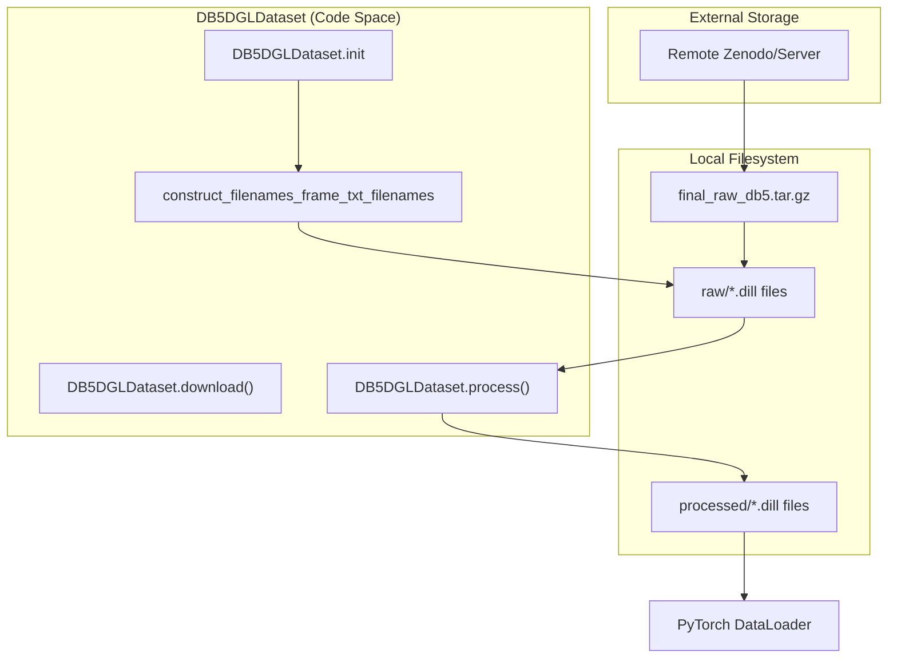
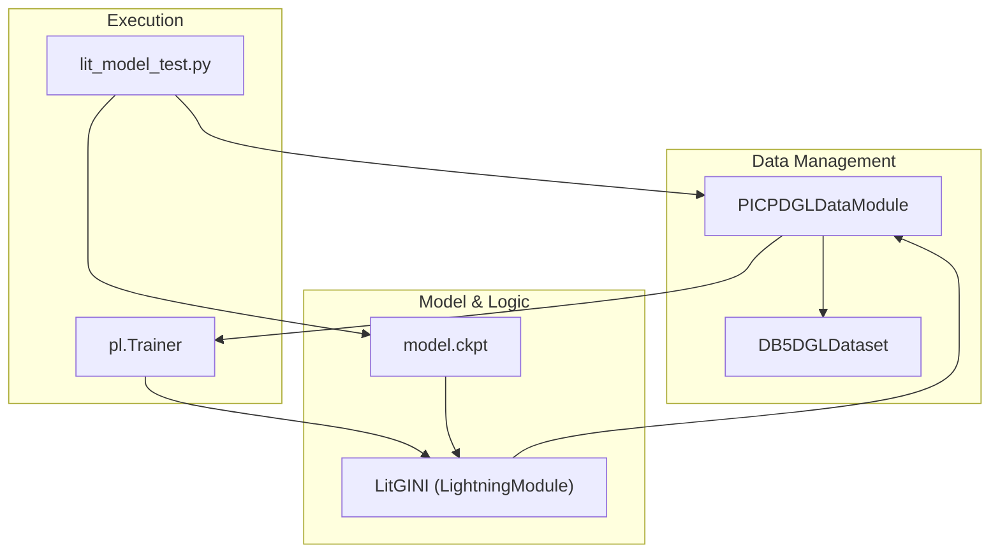

# DB5-Plus Dataset

> **Relevant source files**
> * [project/datasets/DB5/db5_dgl_data_module.py](https://github.com/BioinfoMachineLearning/DeepInteract/blob/c78d2054/project/datasets/DB5/db5_dgl_data_module.py)
> * [project/datasets/DB5/db5_dgl_dataset.py](https://github.com/BioinfoMachineLearning/DeepInteract/blob/c78d2054/project/datasets/DB5/db5_dgl_dataset.py)
> * [project/lit_model_test.py](https://github.com/BioinfoMachineLearning/DeepInteract/blob/c78d2054/project/lit_model_test.py)

The **DB5-Plus Dataset** is a specialized version of the Protein-Protein Docking Benchmark 5.0 (DB5), adapted for the DeepInteract pipeline. It serves as the primary dataset for fine-tuning the pretrained DIPS-Plus model and evaluating its performance on unbound protein structures [project/datasets/DB5/db5_dgl_dataset.py L14-L25](https://github.com/BioinfoMachineLearning/DeepInteract/blob/c78d2054/project/datasets/DB5/db5_dgl_dataset.py#L14-L25)

 Unlike DIPS-Plus, which primarily uses bound structures, DB5-Plus focuses on the more challenging task of predicting interfaces from unbound components.

### Dataset Structure and Statistics

The dataset is partitioned into three subsets to support fine-tuning and evaluation [project/datasets/DB5/db5_dgl_dataset.py L18-L24](https://github.com/BioinfoMachineLearning/DeepInteract/blob/c78d2054/project/datasets/DB5/db5_dgl_dataset.py#L18-L24)

:

| Subset | Number of Dimers |
| --- | --- |
| **Train** | 140 |
| **Validation** | 35 |
| **Test** | 55 |
| **Total** | 230 |

Each sample in the dataset represents a protein complex consisting of two chains (dimers) [project/datasets/DB5/db5_dgl_dataset.py L62-L63](https://github.com/BioinfoMachineLearning/DeepInteract/blob/c78d2054/project/datasets/DB5/db5_dgl_dataset.py#L62-L63)

### DB5DGLDataset Implementation

The `DB5DGLDataset` class manages the lifecycle of DB5 data, including downloading, filename sampling, and processing raw files into DGL-compatible graphs [project/datasets/DB5/db5_dgl_dataset.py L13-L76](https://github.com/BioinfoMachineLearning/DeepInteract/blob/c78d2054/project/datasets/DB5/db5_dgl_dataset.py#L13-L76)

#### Initialization and Sampling

During `__init__`, the dataset identifies the target split (`train`, `val`, or `test`) and determines the file paths for the raw and processed data [project/datasets/DB5/db5_dgl_dataset.py L79-L89](https://github.com/BioinfoMachineLearning/DeepInteract/blob/c78d2054/project/datasets/DB5/db5_dgl_dataset.py#L79-L89)

 It supports a `percent_to_use` parameter, which allows for training on a subset of the data for rapid experimentation [project/datasets/DB5/db5_dgl_dataset.py L98-L112](https://github.com/BioinfoMachineLearning/DeepInteract/blob/c78d2054/project/datasets/DB5/db5_dgl_dataset.py#L98-L112)

#### Processing Pipeline

The `process` method transforms raw `.dill` files into processed dictionaries that contain the geometric and structural features required by the model [project/datasets/DB5/db5_dgl_dataset.py L148-L159](https://github.com/BioinfoMachineLearning/DeepInteract/blob/c78d2054/project/datasets/DB5/db5_dgl_dataset.py#L148-L159)

1. **File Verification**: Checks if a processed version of the complex already exists in the `processed_dir` [project/datasets/DB5/db5_dgl_dataset.py L157-L159](https://github.com/BioinfoMachineLearning/DeepInteract/blob/c78d2054/project/datasets/DB5/db5_dgl_dataset.py#L157-L159)
2. **Transformation**: Invokes `process_complex_into_dict` to generate node and edge features, including KNN-based graph construction and geometric neighborhood indexing [project/datasets/DB5/db5_dgl_dataset.py L9-L10](https://github.com/BioinfoMachineLearning/DeepInteract/blob/c78d2054/project/datasets/DB5/db5_dgl_dataset.py#L9-L10)
3. **Baseline Mode**: If `input_indep` is set to `True`, the dataset uses `zero_out_complex_features` to strip features, creating a structural-only baseline [project/datasets/DB5/db5_dgl_dataset.py L10](https://github.com/BioinfoMachineLearning/DeepInteract/blob/c78d2054/project/datasets/DB5/db5_dgl_dataset.py#L10-L10)

**Sources:** [project/datasets/DB5/db5_dgl_dataset.py L13-L159](https://github.com/BioinfoMachineLearning/DeepInteract/blob/c78d2054/project/datasets/DB5/db5_dgl_dataset.py#L13-L159)

 [project/utils/deepinteract_utils.py L9-L10](https://github.com/BioinfoMachineLearning/DeepInteract/blob/c78d2054/project/utils/deepinteract_utils.py#L9-L10)

### Data Flow: From Raw Archive to DGL Graphs

The following diagram illustrates the data flow within the `DB5DGLDataset` and how it interacts with the broader system.

**DB5-Plus Data Loading and Processing Flow**

**Sources:** [project/datasets/DB5/db5_dgl_dataset.py L91-L93](https://github.com/BioinfoMachineLearning/DeepInteract/blob/c78d2054/project/datasets/DB5/db5_dgl_dataset.py#L91-L93)

 [project/datasets/DB5/db5_dgl_dataset.py L130-L146](https://github.com/BioinfoMachineLearning/DeepInteract/blob/c78d2054/project/datasets/DB5/db5_dgl_dataset.py#L130-L146)

 [project/datasets/DB5/db5_dgl_dataset.py L154-L159](https://github.com/BioinfoMachineLearning/DeepInteract/blob/c78d2054/project/datasets/DB5/db5_dgl_dataset.py#L154-L159)

 [project/datasets/DB5/db5_dgl_data_module.py L30](https://github.com/BioinfoMachineLearning/DeepInteract/blob/c78d2054/project/datasets/DB5/db5_dgl_data_module.py#L30-L30)

### DB5 Data Module

The `DB5DGLDataModule` encapsulates the dataset instances for use within the PyTorch Lightning training loop [project/datasets/DB5/db5_dgl_data_module.py L10-L11](https://github.com/BioinfoMachineLearning/DeepInteract/blob/c78d2054/project/datasets/DB5/db5_dgl_data_module.py#L10-L11)

* **Setup**: The `setup()` method instantiates the `train`, `val`, and `test` versions of `DB5DGLDataset` [project/datasets/DB5/db5_dgl_data_module.py L32-L48](https://github.com/BioinfoMachineLearning/DeepInteract/blob/c78d2054/project/datasets/DB5/db5_dgl_data_module.py#L32-L48)
* **Collation**: It uses `dgl_picp_collate` to batch DGL graphs and their associated interaction tensors [project/datasets/DB5/db5_dgl_data_module.py L30](https://github.com/BioinfoMachineLearning/DeepInteract/blob/c78d2054/project/datasets/DB5/db5_dgl_data_module.py#L30-L30)
* **DataLoaders**: Provides standard methods (`train_dataloader`, `val_dataloader`, `test_dataloader`) with configurable `batch_size` and `num_workers` [project/datasets/DB5/db5_dgl_data_module.py L50-L60](https://github.com/BioinfoMachineLearning/DeepInteract/blob/c78d2054/project/datasets/DB5/db5_dgl_data_module.py#L50-L60)

**Sources:** [project/datasets/DB5/db5_dgl_data_module.py L10-L60](https://github.com/BioinfoMachineLearning/DeepInteract/blob/c78d2054/project/datasets/DB5/db5_dgl_data_module.py#L10-L60)

### Fine-tuning and Evaluation Pipeline

DB5-Plus is frequently used for evaluating models pretrained on DIPS-Plus. This process is orchestrated by `lit_model_test.py`.

#### Evaluation Configuration

In `lit_model_test.py`, the `PICPDGLDataModule` is used to aggregate datasets, including DB5-Plus [project/lit_model_test.py L31-L45](https://github.com/BioinfoMachineLearning/DeepInteract/blob/c78d2054/project/lit_model_test.py#L31-L45)

 A key constraint for DB5 evaluation is enforcing a `test_batch_size = 1` to accommodate the memory requirements of large unbound complexes [project/lit_model_test.py L24](https://github.com/BioinfoMachineLearning/DeepInteract/blob/c78d2054/project/lit_model_test.py#L24-L24)

#### Model Loading and Testing

1. **Initialization**: The `LitGINI` model is initialized with parameters matching the checkpoint [project/lit_model_test.py L57-L89](https://github.com/BioinfoMachineLearning/DeepInteract/blob/c78d2054/project/lit_model_test.py#L57-L89)
2. **Checkpoint Restoration**: The model weights are loaded from a specific `.ckpt` file [project/lit_model_test.py L133-L138](https://github.com/BioinfoMachineLearning/DeepInteract/blob/c78d2054/project/lit_model_test.py#L133-L138)
3. **Execution**: The `pl.Trainer.test()` method is called using the DB5 test dataloader provided by the data module [project/lit_model_test.py L109](https://github.com/BioinfoMachineLearning/DeepInteract/blob/c78d2054/project/lit_model_test.py#L109-L109)

**Sources:** [project/lit_model_test.py L24-L138](https://github.com/BioinfoMachineLearning/DeepInteract/blob/c78d2054/project/lit_model_test.py#L24-L138)

 [project/datasets/PICP/picp_dgl_data_module.py L9](https://github.com/BioinfoMachineLearning/DeepInteract/blob/c78d2054/project/datasets/PICP/picp_dgl_data_module.py#L9-L9)

### System Integration Diagram

This diagram shows how the DB5 components integrate with the `LitGINI` model and the `Trainer` for evaluation.

**DB5 Integration with LitGINI and Trainer**

**Sources:** [project/lit_model_test.py L31-L45](https://github.com/BioinfoMachineLearning/DeepInteract/blob/c78d2054/project/lit_model_test.py#L31-L45)

 [project/lit_model_test.py L109](https://github.com/BioinfoMachineLearning/DeepInteract/blob/c78d2054/project/lit_model_test.py#L109-L109)

 [project/lit_model_test.py L133-L138](https://github.com/BioinfoMachineLearning/DeepInteract/blob/c78d2054/project/lit_model_test.py#L133-L138)

 [project/datasets/DB5/db5_dgl_data_module.py L58-L60](https://github.com/BioinfoMachineLearning/DeepInteract/blob/c78d2054/project/datasets/DB5/db5_dgl_data_module.py#L58-L60)