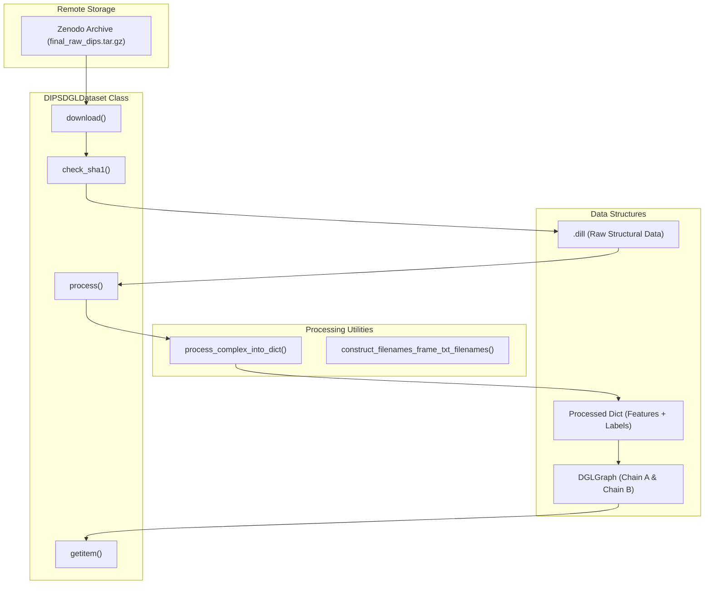
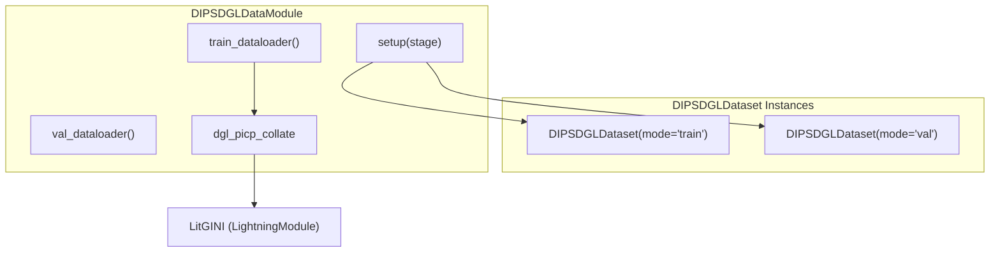

# DIPS-Plus Dataset

> **Relevant source files**
> * [project/datasets/DIPS/dips_dgl_data_module.py](https://github.com/BioinfoMachineLearning/DeepInteract/blob/c78d2054/project/datasets/DIPS/dips_dgl_data_module.py)
> * [project/datasets/DIPS/dips_dgl_dataset.py](https://github.com/BioinfoMachineLearning/DeepInteract/blob/c78d2054/project/datasets/DIPS/dips_dgl_dataset.py)
> * [project/datasets/builder/process_complexes_into_dicts.py](https://github.com/BioinfoMachineLearning/DeepInteract/blob/c78d2054/project/datasets/builder/process_complexes_into_dicts.py)

The **DIPS-Plus** dataset is the primary training and validation resource for DeepInteract. It consists of a large-scale collection of bound protein-protein complexes derived from the Database of Interacting Protein Structures (DIPS), augmented with evolutionary and structural features. The dataset is implemented via the `DIPSDGLDataset` class, which handles automated downloading, integrity verification, and the transformation of raw structural data into graph representations.

### Dataset Overview and Statistics

DIPS-Plus contains approximately 19,198 protein complexes, partitioned into standard splits for machine learning workflows [project/datasets/DIPS/dips_dgl_dataset.py L24-L30](https://github.com/BioinfoMachineLearning/DeepInteract/blob/c78d2054/project/datasets/DIPS/dips_dgl_dataset.py#L24-L30)

:

| Split | Count | Description |
| --- | --- | --- |
| **Train** | 15,618 | Primary training set. |
| **Val** | 3,548 | Validation set for hyperparameter tuning. |
| **Test** | 32 | A small subset for initial evaluation (external sets like DB5-Plus are typically used for final benchmarking). |
| **Total** | 19,198 | Total curated complexes. |

---

### Data Lifecycle: From Zenodo to DGLGraph

The `DIPSDGLDataset` manages the transition from remote archives to in-memory graph objects. The process is governed by the `DGLDataset` lifecycle, involving downloading, raw file processing, and caching.

#### 1. Download and Verification

If the raw data is not present in the specified `raw_dir`, the dataset automatically downloads the `final_raw_dips.tar.gz` archive from the project's Zenodo repository [project/datasets/DIPS/dips_dgl_dataset.py L149-L155](https://github.com/BioinfoMachineLearning/DeepInteract/blob/c78d2054/project/datasets/DIPS/dips_dgl_dataset.py#L149-L155)

. To ensure data integrity, the class performs a SHA-1 checksum verification after the download completes [project/datasets/DIPS/dips_dgl_dataset.py L158](https://github.com/BioinfoMachineLearning/DeepInteract/blob/c78d2054/project/datasets/DIPS/dips_dgl_dataset.py#L158-L158)

.

#### 2. Processing Raw .dill Files

The raw data consists of `.dill` files (pickled Python objects) containing protein structure information. The dataset processes these into a dictionary format suitable for graph construction using `process_complex_into_dict` [project/datasets/DIPS/dips_dgl_dataset.py L10-L11](https://github.com/BioinfoMachineLearning/DeepInteract/blob/c78d2054/project/datasets/DIPS/dips_dgl_dataset.py#L10-L11)

.

#### 3. Graph Construction Logic

For every complex, the dataset generates two `DGLGraph` objects (one per protein chain). Key parameters during this phase include:

* **KNN Graph Construction**: Nodes (residues) are connected to their $k$ nearest neighbors based on Euclidean distance (default $k=20$) [project/datasets/DIPS/dips_dgl_dataset.py L38-L39](https://github.com/BioinfoMachineLearning/DeepInteract/blob/c78d2054/project/datasets/DIPS/dips_dgl_dataset.py#L38-L39) .
* **Geometric Neighborhoods**: Edge features are updated based on a neighborhood of size `geo_nbrhd_size` (default 2) [project/datasets/DIPS/dips_dgl_dataset.py L40-L41](https://github.com/BioinfoMachineLearning/DeepInteract/blob/c78d2054/project/datasets/DIPS/dips_dgl_dataset.py#L40-L41) .
* **Self-Loops**: Optional self-loops can be added to nodes to ensure information persistence during message passing [project/datasets/DIPS/dips_dgl_dataset.py L42-L43](https://github.com/BioinfoMachineLearning/DeepInteract/blob/c78d2054/project/datasets/DIPS/dips_dgl_dataset.py#L42-L43) .

**Sources:** [project/datasets/DIPS/dips_dgl_dataset.py L19-L107](https://github.com/BioinfoMachineLearning/DeepInteract/blob/c78d2054/project/datasets/DIPS/dips_dgl_dataset.py#L19-L107)

, [project/utils/deepinteract_utils.py L10-L11](https://github.com/BioinfoMachineLearning/DeepInteract/blob/c78d2054/project/utils/deepinteract_utils.py#L10-L11)

---

### Implementation Mapping: Data Space to Code Entities

The following diagram maps the logical components of the DIPS-Plus dataset to their specific implementations within the codebase.

**Data Flow Architecture**

**Sources:** [project/datasets/DIPS/dips_dgl_dataset.py L19-L160](https://github.com/BioinfoMachineLearning/DeepInteract/blob/c78d2054/project/datasets/DIPS/dips_dgl_dataset.py#L19-L160)

, [project/utils/deepinteract_utils.py L8-L11](https://github.com/BioinfoMachineLearning/DeepInteract/blob/c78d2054/project/utils/deepinteract_utils.py#L8-L11)

---

### Key Features and Sampling

#### PN Ratio Sampling

During training, the dataset manages the balance between positive (interacting) and negative (non-interacting) residue pairs. The `pn_ratio` parameter (default 0.1) controls the fraction of negative samples retained relative to positive samples to handle the inherent sparsity of interaction interfaces [project/datasets/DIPS/dips_dgl_dataset.py L44-L45](https://github.com/BioinfoMachineLearning/DeepInteract/blob/c78d2054/project/datasets/DIPS/dips_dgl_dataset.py#L44-L45)

.

#### Train Visualization Mode (train_viz)

A specialized debugging mode is available for monitoring training dynamics. When `train_viz=True`, the dataset curates a specific subset of samples (repeating the first complex $N$ times) to allow consistent visualization of the model's predictions across epochs on a fixed set of inputs [project/datasets/DIPS/dips_dgl_dataset.py L137-L142](https://github.com/BioinfoMachineLearning/DeepInteract/blob/c78d2054/project/datasets/DIPS/dips_dgl_dataset.py#L137-L142)

.

#### Input Independence Baseline

The dataset supports an `input_indep` flag. If set to `True`, the `zero_out_complex_features` function is called, which wipes all node and edge features [project/datasets/DIPS/dips_dgl_dataset.py L85-L86](https://github.com/BioinfoMachineLearning/DeepInteract/blob/c78d2054/project/datasets/DIPS/dips_dgl_dataset.py#L85-L86)

. This allows researchers to verify if the model is learning from the structural features or simply exploiting biases in the graph topology or label distribution.

**Sources:** [project/datasets/DIPS/dips_dgl_dataset.py L76-L101](https://github.com/BioinfoMachineLearning/DeepInteract/blob/c78d2054/project/datasets/DIPS/dips_dgl_dataset.py#L76-L101)

, [project/utils/deepinteract_utils.py L10-L11](https://github.com/BioinfoMachineLearning/DeepInteract/blob/c78d2054/project/utils/deepinteract_utils.py#L10-L11)

---

### Integration with PyTorch Lightning

The `DIPSDGLDataModule` wraps the dataset for use in the Lightning training pipeline. It handles the instantiation of train, validation, and test splits and configures the `DataLoader` with the specialized `dgl_picp_collate` function.

**DataModule Component Interaction**

The `setup` method ensures that all dataset partitions are initialized on every GPU during distributed training [project/datasets/DIPS/dips_dgl_data_module.py L38-L48](https://github.com/BioinfoMachineLearning/DeepInteract/blob/c78d2054/project/datasets/DIPS/dips_dgl_data_module.py#L38-L48)

. The `dgl_picp_collate` function is critical as it handles the batching of DGL graphs, which requires special handling compared to standard PyTorch tensors [project/datasets/DIPS/dips_dgl_data_module.py L36](https://github.com/BioinfoMachineLearning/DeepInteract/blob/c78d2054/project/datasets/DIPS/dips_dgl_data_module.py#L36-L36)

.

**Sources:** [project/datasets/DIPS/dips_dgl_data_module.py L15-L60](https://github.com/BioinfoMachineLearning/DeepInteract/blob/c78d2054/project/datasets/DIPS/dips_dgl_data_module.py#L15-L60)

---

### Offline Preprocessing

For large-scale training, the script `process_complexes_into_dicts.py` can be used to pre-process the entire dataset into dictionaries. This avoids the overhead of feature extraction during the training loop. It utilizes `submit_jobs` from the `parallel` module to distribute the processing of `.dill` files across multiple CPU cores [project/datasets/builder/process_complexes_into_dicts.py L56-L65](https://github.com/BioinfoMachineLearning/DeepInteract/blob/c78d2054/project/datasets/builder/process_complexes_into_dicts.py#L56-L65)

.

**Sources:** [project/datasets/builder/process_complexes_into_dicts.py L27-L65](https://github.com/BioinfoMachineLearning/DeepInteract/blob/c78d2054/project/datasets/builder/process_complexes_into_dicts.py#L27-L65)