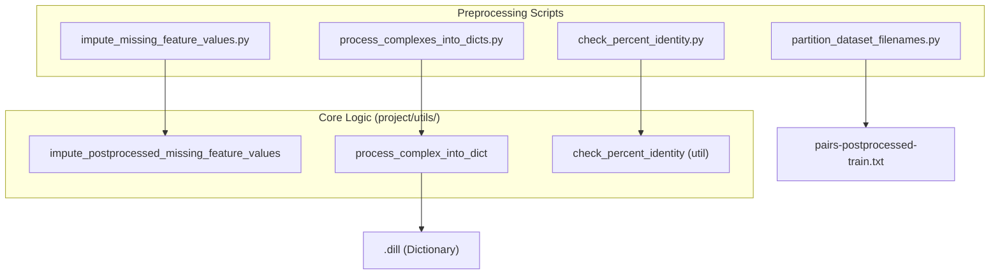
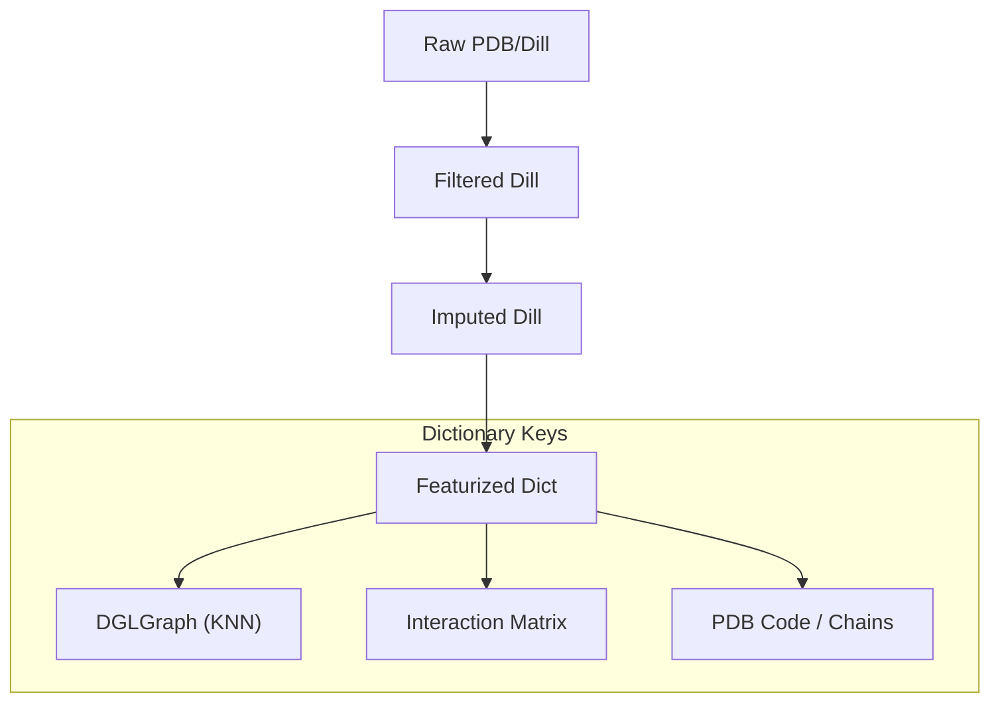

# Dataset Builder Scripts

> **Relevant source files**
> * [project/datasets/DIPS/dips_dgl_data_module.py](https://github.com/BioinfoMachineLearning/DeepInteract/blob/c78d2054/project/datasets/DIPS/dips_dgl_data_module.py)
> * [project/datasets/builder/check_percent_identity.py](https://github.com/BioinfoMachineLearning/DeepInteract/blob/c78d2054/project/datasets/builder/check_percent_identity.py)
> * [project/datasets/builder/collect_dataset_statistics.py](https://github.com/BioinfoMachineLearning/DeepInteract/blob/c78d2054/project/datasets/builder/collect_dataset_statistics.py)
> * [project/datasets/builder/impute_missing_feature_values.py](https://github.com/BioinfoMachineLearning/DeepInteract/blob/c78d2054/project/datasets/builder/impute_missing_feature_values.py)
> * [project/datasets/builder/log_dataset_statistics.py](https://github.com/BioinfoMachineLearning/DeepInteract/blob/c78d2054/project/datasets/builder/log_dataset_statistics.py)
> * [project/datasets/builder/partition_dataset_filenames.py](https://github.com/BioinfoMachineLearning/DeepInteract/blob/c78d2054/project/datasets/builder/partition_dataset_filenames.py)
> * [project/datasets/builder/process_complexes_into_dicts.py](https://github.com/BioinfoMachineLearning/DeepInteract/blob/c78d2054/project/datasets/builder/process_complexes_into_dicts.py)
> * [project/utils/dips_plus_utils.py](https://github.com/BioinfoMachineLearning/DeepInteract/blob/c78d2054/project/utils/dips_plus_utils.py)

The `project/datasets/builder/` directory contains offline preprocessing and utility scripts used to prepare protein complex data for the DeepInteract pipeline. These scripts handle the transition from raw structural files to partitioned, imputed, and featurized dictionaries compatible with DGL graph construction.

## Data Flow Overview

The dataset builder pipeline transforms raw `.dill` files (containing `atom3.pair.Pair` objects) into structured dictionaries and eventually into partitioned datasets for training.

### Pipeline Execution Flow

1. **Partitioning**: `partition_dataset_filenames.py` filters complexes by size and creates train/val/test splits.
2. **Imputation**: `impute_missing_feature_values.py` fills NaNs in external features (PSAIA, DSSP, etc.).
3. **Processing**: `process_complexes_into_dicts.py` converts structural data into graph-ready dictionary formats.
4. **Verification**: `check_percent_identity.py` ensures no sequence leakage between datasets.
5. **Statistics**: `collect_dataset_statistics.py` and `log_dataset_statistics.py` track dataset quality and composition.

### Code Entity Mapping: Dataset Preparation

The following diagram maps the high-level dataset preparation steps to the specific script entities and utility functions.

"Dataset Builder Implementation Map"

**Sources:** [project/datasets/builder/partition_dataset_filenames.py L20-L29](https://github.com/BioinfoMachineLearning/DeepInteract/blob/c78d2054/project/datasets/builder/partition_dataset_filenames.py#L20-L29)

 [project/datasets/builder/impute_missing_feature_values.py L14-L32](https://github.com/BioinfoMachineLearning/DeepInteract/blob/c78d2054/project/datasets/builder/impute_missing_feature_values.py#L14-L32)

 [project/datasets/builder/process_complexes_into_dicts.py L16-L29](https://github.com/BioinfoMachineLearning/DeepInteract/blob/c78d2054/project/datasets/builder/process_complexes_into_dicts.py#L16-L29)

 [project/datasets/builder/check_percent_identity.py L16-L22](https://github.com/BioinfoMachineLearning/DeepInteract/blob/c78d2054/project/datasets/builder/check_percent_identity.py#L16-L22)

---

## Core Scripts Implementation

### 1. partition_dataset_filenames.py

This script filters raw complexes based on atom counts and sequence length constraints to ensure they fit within memory limits during training.

* **Filtering Logic**: It calculates the product of atoms in chain A and chain B. Complexes are excluded if they exceed `RESIDUE_COUNT_LIMIT` squared [project/datasets/builder/partition_dataset_filenames.py L52-L54](https://github.com/BioinfoMachineLearning/DeepInteract/blob/c78d2054/project/datasets/builder/partition_dataset_filenames.py#L52-L54)
* **Splitting**: For the DIPS dataset, it performs a random 80/20 split of the parent directories to create `pairs-postprocessed-train.txt`, `pairs-postprocessed-val.txt`, and `pairs-postprocessed-test.txt` [project/datasets/builder/partition_dataset_filenames.py L84-L110](https://github.com/BioinfoMachineLearning/DeepInteract/blob/c78d2054/project/datasets/builder/partition_dataset_filenames.py#L84-L110)

### 2. impute_missing_feature_values.py

Missing values are common in external features like secondary structure (DSSP) or residue depth (MSMS). This script uses `submit_jobs` to parallelize the imputation process [project/datasets/builder/impute_missing_feature_values.py L29-L32](https://github.com/BioinfoMachineLearning/DeepInteract/blob/c78d2054/project/datasets/builder/impute_missing_feature_values.py#L29-L32)

* **Functionality**: It invokes `impute_postprocessed_missing_feature_values` from `dips_plus_utils.py` [project/datasets/builder/impute_missing_feature_values.py L7](https://github.com/BioinfoMachineLearning/DeepInteract/blob/c78d2054/project/datasets/builder/impute_missing_feature_values.py#L7-L7)
* **Thresholding**: It enforces the `NUM_ALLOWABLE_NANS` limit; residues exceeding this threshold are typically filtered or flagged [project/utils/dips_plus_utils.py L23-L26](https://github.com/BioinfoMachineLearning/DeepInteract/blob/c78d2054/project/utils/dips_plus_utils.py#L23-L26)

### 3. process_complexes_into_dicts.py

This is the primary featurization script. It converts the `atom3` pair objects into a format that can be instantly converted to `DGLGraph` objects.

* **Work Selection**: It compares the `requested_keys` from the partition text files against `produced_keys` in the output directory to avoid redundant processing [project/datasets/builder/process_complexes_into_dicts.py L46-L54](https://github.com/BioinfoMachineLearning/DeepInteract/blob/c78d2054/project/datasets/builder/process_complexes_into_dicts.py#L46-L54)
* **Featurization**: It calls `process_complex_into_dict`, which handles KNN graph construction and geometric feature extraction [project/datasets/builder/process_complexes_into_dicts.py L64-L65](https://github.com/BioinfoMachineLearning/DeepInteract/blob/c78d2054/project/datasets/builder/process_complexes_into_dicts.py#L64-L65)

### 4. check_percent_identity.py

Used to prevent data leakage, particularly when evaluating on CASP-CAPRI.

* **Implementation**: It iterates through the training set and compares sequences against the comparison (test) dataset using `check_percent_identity` utility [project/datasets/builder/check_percent_identity.py L51-L53](https://github.com/BioinfoMachineLearning/DeepInteract/blob/c78d2054/project/datasets/builder/check_percent_identity.py#L51-L53)
* **Threshold**: Defaults to a 30% identity threshold (`percent_identity_threshold=0.3`) [project/datasets/builder/check_percent_identity.py L20](https://github.com/BioinfoMachineLearning/DeepInteract/blob/c78d2054/project/datasets/builder/check_percent_identity.py#L20-L20)

---

## Data Transformation Flow

The following diagram illustrates how data structures evolve from raw PDB information to the final training-ready dictionary.

"Data Structure Transformation"

**Sources:** [project/datasets/builder/process_complexes_into_dicts.py L27-L29](https://github.com/BioinfoMachineLearning/DeepInteract/blob/c78d2054/project/datasets/builder/process_complexes_into_dicts.py#L27-L29)

 [project/utils/deepinteract_utils.py L8](https://github.com/BioinfoMachineLearning/DeepInteract/blob/c78d2054/project/utils/deepinteract_utils.py#L8-L8)

## Statistics and Logging

DeepInteract maintains a `dataset_statistics.csv` file to track the health of the dataset (e.g., number of complexes, average residue count).

* **collect_dataset_statistics.py**: Aggregates metrics from processed files and updates the CSV [project/datasets/builder/collect_dataset_statistics.py L33-L38](https://github.com/BioinfoMachineLearning/DeepInteract/blob/c78d2054/project/datasets/builder/collect_dataset_statistics.py#L33-L38)
* **log_dataset_statistics.py**: Reads the CSV and outputs a formatted log for human inspection using `log_dataset_statistics` [project/datasets/builder/log_dataset_statistics.py L37-L38](https://github.com/BioinfoMachineLearning/DeepInteract/blob/c78d2054/project/datasets/builder/log_dataset_statistics.py#L37-L38)

| Script | Input | Output |
| --- | --- | --- |
| `partition_dataset_filenames.py` | `.dill` files | `.txt` partition lists |
| `impute_missing_feature_values.py` | `.dill` (with NaNs) | `.dill` (imputed) |
| `process_complexes_into_dicts.py` | `.dill` (Pair objects) | `.dill` (Dictionaries) |
| `collect_dataset_statistics.py` | Processed directory | `dataset_statistics.csv` |

**Sources:** [project/datasets/builder/collect_dataset_statistics.py L13-L16](https://github.com/BioinfoMachineLearning/DeepInteract/blob/c78d2054/project/datasets/builder/collect_dataset_statistics.py#L13-L16)

 [project/datasets/builder/log_dataset_statistics.py L12-L15](https://github.com/BioinfoMachineLearning/DeepInteract/blob/c78d2054/project/datasets/builder/log_dataset_statistics.py#L12-L15)