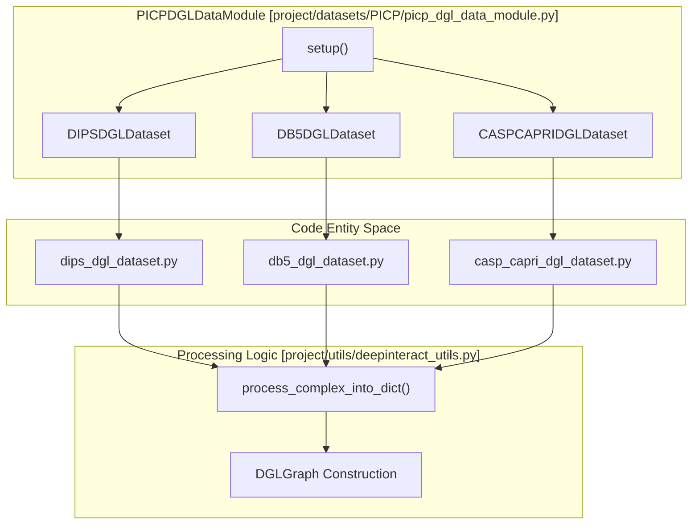
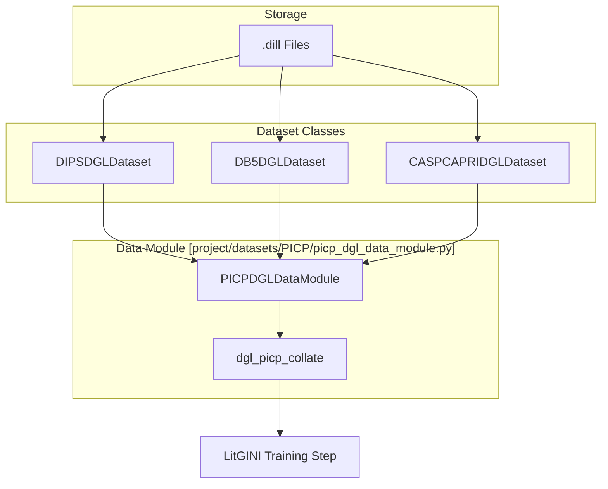

# Datasets

> **Relevant source files**
> * [project/datasets/CASP_CAPRI/casp_capri_dgl_dataset.py](https://github.com/BioinfoMachineLearning/DeepInteract/blob/c78d2054/project/datasets/CASP_CAPRI/casp_capri_dgl_dataset.py)
> * [project/datasets/DB5/db5_dgl_dataset.py](https://github.com/BioinfoMachineLearning/DeepInteract/blob/c78d2054/project/datasets/DB5/db5_dgl_dataset.py)
> * [project/datasets/DIPS/dips_dgl_dataset.py](https://github.com/BioinfoMachineLearning/DeepInteract/blob/c78d2054/project/datasets/DIPS/dips_dgl_dataset.py)
> * [project/datasets/PICP/picp_dgl_data_module.py](https://github.com/BioinfoMachineLearning/DeepInteract/blob/c78d2054/project/datasets/PICP/picp_dgl_data_module.py)

DeepInteract utilizes three primary protein complex datasets for training, fine-tuning, and benchmarking: **DIPS-Plus**, **DB5-Plus**, and **CASP-CAPRI**. These datasets are unified under a single `PICPDGLDataModule` [project/datasets/PICP/picp_dgl_data_module.py L17-L62](https://github.com/BioinfoMachineLearning/DeepInteract/blob/c78d2054/project/datasets/PICP/picp_dgl_data_module.py#L17-L62)

 which manages data loading, collation, and partitioning for PyTorch Lightning training workflows.

The system is designed to handle both bound (DIPS-Plus, CASP-CAPRI) and unbound (DB5-Plus) structures, converting raw `.dill` files into `DGLGraph` objects via a standardized processing pipeline [project/utils/deepinteract_utils.py L9-L10](https://github.com/BioinfoMachineLearning/DeepInteract/blob/c78d2054/project/utils/deepinteract_utils.py#L9-L10)

### Dataset Overview and Hierarchy

The following diagram illustrates the relationship between the unified data module and the individual dataset classes.

**Data Module to Dataset Mapping**

**Sources:** [project/datasets/PICP/picp_dgl_data_module.py L64-L102](https://github.com/BioinfoMachineLearning/DeepInteract/blob/c78d2054/project/datasets/PICP/picp_dgl_data_module.py#L64-L102)

 [project/datasets/DIPS/dips_dgl_dataset.py L19-L74](https://github.com/BioinfoMachineLearning/DeepInteract/blob/c78d2054/project/datasets/DIPS/dips_dgl_dataset.py#L19-L74)

 [project/datasets/DB5/db5_dgl_dataset.py L13-L64](https://github.com/BioinfoMachineLearning/DeepInteract/blob/c78d2054/project/datasets/DB5/db5_dgl_dataset.py#L13-L64)

 [project/datasets/CASP_CAPRI/casp_capri_dgl_dataset.py L13-L61](https://github.com/BioinfoMachineLearning/DeepInteract/blob/c78d2054/project/datasets/CASP_CAPRI/casp_capri_dgl_dataset.py#L13-L61)

---

### DIPS-Plus Dataset

The **Database of Interacting Protein Structures (DIPS-Plus)** is the primary training set for DeepInteract. It contains approximately 19,198 examples [project/datasets/DIPS/dips_dgl_dataset.py L22-L30](https://github.com/BioinfoMachineLearning/DeepInteract/blob/c78d2054/project/datasets/DIPS/dips_dgl_dataset.py#L22-L30)

 The `DIPSDGLDataset` class handles automated downloading from Zenodo, SHA-1 verification, and KNN-based graph construction [project/datasets/DIPS/dips_dgl_dataset.py L149-L160](https://github.com/BioinfoMachineLearning/DeepInteract/blob/c78d2054/project/datasets/DIPS/dips_dgl_dataset.py#L149-L160)

 It also implements a `pn_ratio` parameter to balance positive and negative interaction samples during training [project/datasets/DIPS/dips_dgl_dataset.py L82](https://github.com/BioinfoMachineLearning/DeepInteract/blob/c78d2054/project/datasets/DIPS/dips_dgl_dataset.py#L82-L82)

For details, see [DIPS-Plus Dataset](/BioinfoMachineLearning/DeepInteract/4.1-dips-plus-dataset).

### DB5-Plus Dataset

The **Protein-Protein Docking Benchmark 5.0 (DB5-Plus)** consists of 230 unbound protein complexes [project/datasets/DB5/db5_dgl_dataset.py L16-L24](https://github.com/BioinfoMachineLearning/DeepInteract/blob/c78d2054/project/datasets/DB5/db5_dgl_dataset.py#L16-L24)

 Unlike DIPS-Plus, which uses bound structures, DB5-Plus is used to evaluate the model's performance on unbound (apo) structures, which is a more realistic scenario for docking and interaction prediction. It is typically used for fine-tuning the pre-trained DIPS model [project/datasets/PICP/picp_dgl_data_module.py L66-L79](https://github.com/BioinfoMachineLearning/DeepInteract/blob/c78d2054/project/datasets/PICP/picp_dgl_data_module.py#L66-L79)

For details, see [DB5-Plus Dataset](/BioinfoMachineLearning/DeepInteract/4.2-db5-plus-dataset).

### CASP-CAPRI Dataset

The **CASP-CAPRI** dataset is a high-quality test set consisting of 19 dimers (14 homodimers and 5 heterodimers) [project/datasets/CASP_CAPRI/casp_capri_dgl_dataset.py L18-L23](https://github.com/BioinfoMachineLearning/DeepInteract/blob/c78d2054/project/datasets/CASP_CAPRI/casp_capri_dgl_dataset.py#L18-L23)

 It is used for final benchmarking and includes an `input_indep` mode to establish a baseline by zeroing out complex features [project/datasets/CASP_CAPRI/casp_capri_dgl_dataset.py L71](https://github.com/BioinfoMachineLearning/DeepInteract/blob/c78d2054/project/datasets/CASP_CAPRI/casp_capri_dgl_dataset.py#L71-L71)

For details, see [CASP-CAPRI Dataset](/BioinfoMachineLearning/DeepInteract/4.3-casp-capri-dataset).

### Dataset Builder Scripts

The `project/datasets/builder/` directory contains offline utility scripts for dataset preparation. These scripts handle the conversion of raw PDB/feature files into the `.dill` format expected by the `DGLDataset` classes, partition the data into splits, and calculate dataset-wide statistics.

For details, see [Dataset Builder Scripts](/BioinfoMachineLearning/DeepInteract/4.4-dataset-builder-scripts).

---

### Unified Data Management: PICPDGLDataModule

The `PICPDGLDataModule` serves as the central hub for data flow into the `LitGINI` training module. It abstracts the complexity of multiple datasets into standard `train_dataloader`, `val_dataloader`, and `test_dataloader` methods [project/datasets/PICP/picp_dgl_data_module.py L104-L135](https://github.com/BioinfoMachineLearning/DeepInteract/blob/c78d2054/project/datasets/PICP/picp_dgl_data_module.py#L104-L135)

**Data Flow from Storage to Model**

**Sources:** [project/datasets/PICP/picp_dgl_data_module.py L62](https://github.com/BioinfoMachineLearning/DeepInteract/blob/c78d2054/project/datasets/PICP/picp_dgl_data_module.py#L62-L62)

 [project/datasets/PICP/picp_dgl_data_module.py L114-L116](https://github.com/BioinfoMachineLearning/DeepInteract/blob/c78d2054/project/datasets/PICP/picp_dgl_data_module.py#L114-L116)

| Feature | DIPS-Plus | DB5-Plus | CASP-CAPRI |
| --- | --- | --- | --- |
| **Primary Use** | Pre-training | Fine-tuning / Unbound Test | Benchmarking |
| **Structure Type** | Bound | Unbound | Bound |
| **Total Samples** | 19,198 | 230 | 19 |
| **Implementation** | `DIPSDGLDataset` | `DB5DGLDataset` | `CASPCAPRIDGLDataset` |

**Sources:** [project/datasets/DIPS/dips_dgl_dataset.py L19-L30](https://github.com/BioinfoMachineLearning/DeepInteract/blob/c78d2054/project/datasets/DIPS/dips_dgl_dataset.py#L19-L30)

 [project/datasets/DB5/db5_dgl_dataset.py L13-L24](https://github.com/BioinfoMachineLearning/DeepInteract/blob/c78d2054/project/datasets/DB5/db5_dgl_dataset.py#L13-L24)

 [project/datasets/CASP_CAPRI/casp_capri_dgl_dataset.py L13-L23](https://github.com/BioinfoMachineLearning/DeepInteract/blob/c78d2054/project/datasets/CASP_CAPRI/casp_capri_dgl_dataset.py#L13-L23)