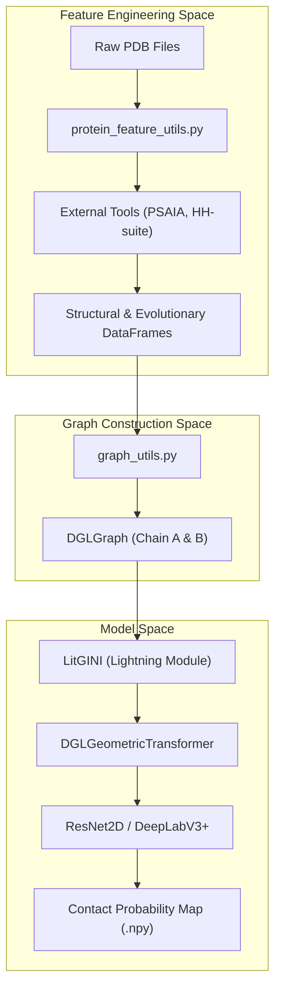
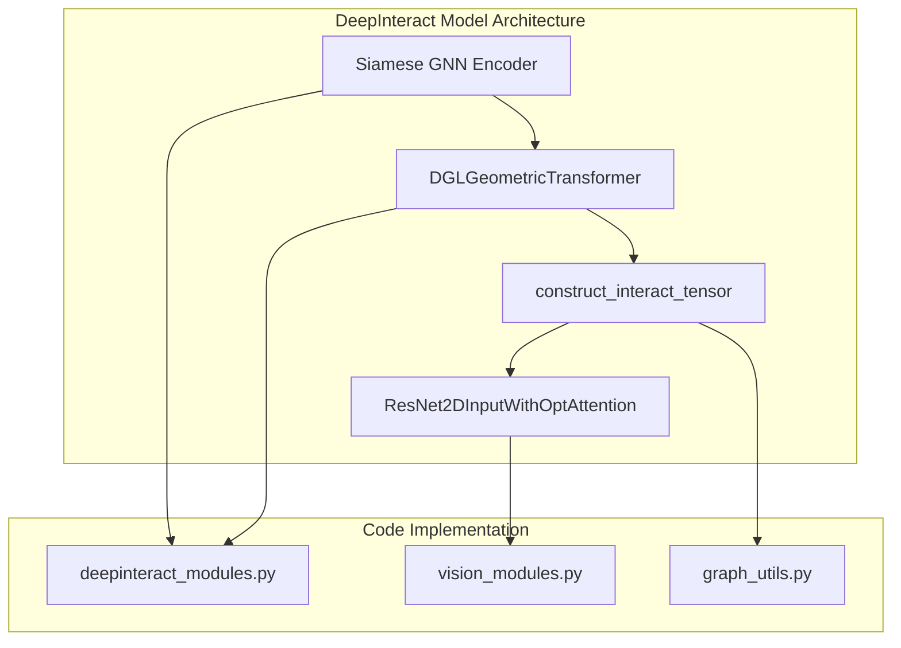

# DeepInteract Overview

> **Relevant source files**
> * [README.md](https://github.com/BioinfoMachineLearning/DeepInteract/blob/c78d2054/README.md?plain=1)
> * [img/DeepInteract_Architecture.png](https://github.com/BioinfoMachineLearning/DeepInteract/blob/c78d2054/img/DeepInteract_Architecture.png)
> * [setup.py](https://github.com/BioinfoMachineLearning/DeepInteract/blob/c78d2054/setup.py)

DeepInteract is a geometric deep learning pipeline designed for predicting protein interface contacts [README.md L17](https://github.com/BioinfoMachineLearning/DeepInteract/blob/c78d2054/README.md?plain=1#L17-L17)

 It leverages a specialized architecture that combines graph neural networks (GNNs) with geometric transformers to process 3D structural data and evolutionary information, ultimately outputting a 2D contact probability map for protein complexes.

### System Architecture

The DeepInteract pipeline is structured into three primary stages: structural feature extraction, geometric graph processing, and 2D interaction prediction.

#### High-Level Data Flow

The following diagram illustrates the transition from raw structural data to the final contact prediction, mapping system components to their respective code entities.

**DeepInteract Data Flow: PDB to Prediction**

**Sources:** [project/utils/protein_feature_utils.py L1-L10](https://github.com/BioinfoMachineLearning/DeepInteract/blob/c78d2054/project/utils/protein_feature_utils.py#L1-L10)

 [project/utils/graph_utils.py L1-L10](https://github.com/BioinfoMachineLearning/DeepInteract/blob/c78d2054/project/utils/graph_utils.py#L1-L10)

 [project/lit_model_predict.py L1-L50](https://github.com/BioinfoMachineLearning/DeepInteract/blob/c78d2054/project/lit_model_predict.py#L1-L50)

### Core Components

#### 1. Geometric Deep Learning Model

The core model, implemented in the `LitGINI` Lightning module [project/lit_model_train.py L201](https://github.com/BioinfoMachineLearning/DeepInteract/blob/c78d2054/project/lit_model_train.py#L201-L201)

 utilizes a Siamese encoder strategy. It processes two protein chains as graphs where nodes represent residues and edges represent spatial proximity. The `DGLGeometricTransformer` [project/utils/deepinteract_modules.py L192](https://github.com/BioinfoMachineLearning/DeepInteract/blob/c78d2054/project/utils/deepinteract_modules.py#L192-L192)

 (found in `deepinteract_modules.py`) applies geometric gating and neighborhood aggregation to capture the 3D environment of each residue.

#### 2. Feature Engineering Pipeline

DeepInteract transforms raw PDB files into feature-rich graphs using several external bioinformatic tools:

* **PSAIA:** Extracts protrusion indices and surface accessibility [project/utils/protein_feature_utils.py L196](https://github.com/BioinfoMachineLearning/DeepInteract/blob/c78d2054/project/utils/protein_feature_utils.py#L196-L196)
* **HH-suite:** Generates sequence profiles and HMMs [README.md L41-L45](https://github.com/BioinfoMachineLearning/DeepInteract/blob/c78d2054/README.md?plain=1#L41-L45)
* **DSSP & MSMS:** Calculate secondary structure and residue depth.

For a detailed breakdown of the feature extraction and graph construction process, see **[Feature Engineering Pipeline](/BioinfoMachineLearning/DeepInteract/3-feature-engineering-pipeline)**.

#### 3. Interaction Prediction

After individual chain processing, the system constructs an interaction tensor by interleaving node features from both chains. This tensor is passed to a 2D prediction head (typically a `ResNet2D` or `DeepLabV3+` variant) to produce the final interface map [project/utils/vision_modules.py L197](https://github.com/BioinfoMachineLearning/DeepInteract/blob/c78d2054/project/utils/vision_modules.py#L197-L197)

**Model Component Mapping**

**Sources:** [project/utils/deepinteract_modules.py L1-L192](https://github.com/BioinfoMachineLearning/DeepInteract/blob/c78d2054/project/utils/deepinteract_modules.py#L1-L192)

 [project/utils/vision_modules.py L1-L197](https://github.com/BioinfoMachineLearning/DeepInteract/blob/c78d2054/project/utils/vision_modules.py#L1-L197)

 [project/utils/graph_utils.py L1-L126](https://github.com/BioinfoMachineLearning/DeepInteract/blob/c78d2054/project/utils/graph_utils.py#L1-L126)

### Key Datasets

DeepInteract is trained and evaluated on three primary datasets [README.md L124-L160](https://github.com/BioinfoMachineLearning/DeepInteract/blob/c78d2054/README.md?plain=1#L124-L160)

:

* **DIPS-Plus:** The primary large-scale dataset for training.
* **DB5-Plus:** Used for fine-tuning and benchmarking against traditional docking targets.
* **CASP-CAPRI:** A high-quality test set consisting of 19 dimers for rigorous evaluation.

For details on dataset preparation and the `PICP` data module, see **[Datasets](/BioinfoMachineLearning/DeepInteract/4-datasets)**.

### Deployment and Usage

DeepInteract supports two primary modes of operation:

* **Standard Inference:** Running `lit_model_predict.py` directly in a configured Conda environment. For details, see **[Getting Started: Installation and Environment Setup](/BioinfoMachineLearning/DeepInteract/1.1-getting-started:-installation-and-environment-setup)**.
* **Docker Deployment:** A containerized approach using `run_docker.py` to handle all external dependencies and GPU configurations. For details, see **[Docker Deployment](/BioinfoMachineLearning/DeepInteract/1.2-docker-deployment)**.

**Sources:** [setup.py L5-L38](https://github.com/BioinfoMachineLearning/DeepInteract/blob/c78d2054/setup.py#L5-L38)

 [README.md L212-L225](https://github.com/BioinfoMachineLearning/DeepInteract/blob/c78d2054/README.md?plain=1#L212-L225)

 [project/lit_model_predict.py L199](https://github.com/BioinfoMachineLearning/DeepInteract/blob/c78d2054/project/lit_model_predict.py#L199-L199)