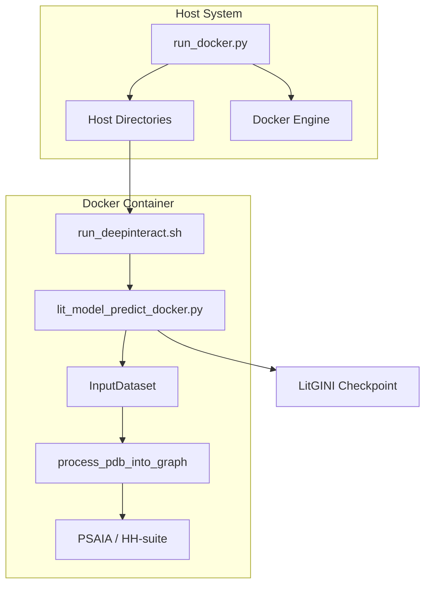
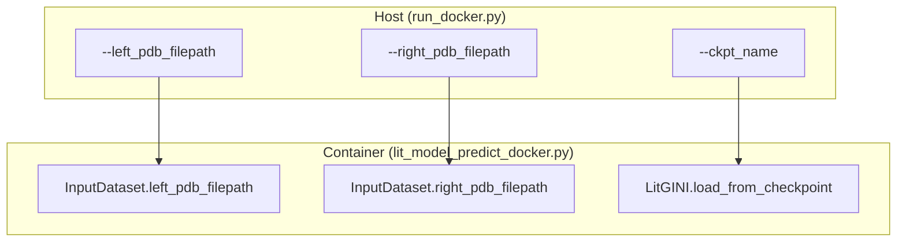

# Docker Deployment

> **Relevant source files**
> * [docker/Dockerfile](https://github.com/BioinfoMachineLearning/DeepInteract/blob/c78d2054/docker/Dockerfile)
> * [docker/requirements.txt](https://github.com/BioinfoMachineLearning/DeepInteract/blob/c78d2054/docker/requirements.txt)
> * [docker/run_docker.py](https://github.com/BioinfoMachineLearning/DeepInteract/blob/c78d2054/docker/run_docker.py)
> * [project/lit_model_predict_docker.py](https://github.com/BioinfoMachineLearning/DeepInteract/blob/c78d2054/project/lit_model_predict_docker.py)

DeepInteract provides a containerized environment to ensure reproducible execution across different hardware configurations. The Docker deployment encapsulates complex external dependencies, including **PSAIA**, **HH-suite**, and specific CUDA-optimized libraries, providing a streamlined interface for protein-protein interaction prediction.

## Implementation Overview

The Docker deployment strategy consists of three primary components:

1. **The Dockerfile**: A multi-stage build that compiles structural biology tools from source and configures a Miniconda environment with GPU support [docker/Dockerfile L1-L101](https://github.com/BioinfoMachineLearning/DeepInteract/blob/c78d2054/docker/Dockerfile#L1-L101)
2. **The Host Launch Script (`run_docker.py`)**: A Python utility that manages volume mounting, GPU device allocation, and container lifecycle using the Docker SDK [docker/run_docker.py L19-L146](https://github.com/BioinfoMachineLearning/DeepInteract/blob/c78d2054/docker/run_docker.py#L19-L146)
3. **The Container Entrypoint (`lit_model_predict_docker.py`)**: A specialized version of the inference pipeline optimized for the containerized filesystem and environment [project/lit_model_predict_docker.py L1-L30](https://github.com/BioinfoMachineLearning/DeepInteract/blob/c78d2054/project/lit_model_predict_docker.py#L1-L30)

### Docker Deployment Architecture

The following diagram illustrates the relationship between the host system, the Docker container, and the internal prediction logic.

"Docker Deployment Data Flow"

**Sources:** [docker/run_docker.py L119-L128](https://github.com/BioinfoMachineLearning/DeepInteract/blob/c78d2054/docker/run_docker.py#L119-L128)

 [docker/Dockerfile L97-L101](https://github.com/BioinfoMachineLearning/DeepInteract/blob/c78d2054/docker/Dockerfile#L97-L101)

 [project/lit_model_predict_docker.py L109-L115](https://github.com/BioinfoMachineLearning/DeepInteract/blob/c78d2054/project/lit_model_predict_docker.py#L109-L115)

## Image Configuration and Build

The image is based on `nvidia/cuda:11.2.2-cudnn8-runtime-ubuntu20.04` [docker/Dockerfile L1-L2](https://github.com/BioinfoMachineLearning/DeepInteract/blob/c78d2054/docker/Dockerfile#L1-L2)

 It automates the installation of several non-trivial dependencies:

* **PSAIA**: Compiled from source using `qmake-qt4` [docker/Dockerfile L30-L42](https://github.com/BioinfoMachineLearning/DeepInteract/blob/c78d2054/docker/Dockerfile#L30-L42)
* **HH-suite**: Compiled from source (v3.3.0) using `cmake` [docker/Dockerfile L45-L51](https://github.com/BioinfoMachineLearning/DeepInteract/blob/c78d2054/docker/Dockerfile#L45-L51)
* **Miniconda Environment**: Installs `pytorch`, `dgl-cu110`, `biopython`, and other scientific libraries [docker/Dockerfile L61-L88](https://github.com/BioinfoMachineLearning/DeepInteract/blob/c78d2054/docker/Dockerfile#L61-L88)

The entrypoint is a wrapper script `/app/run_deepinteract.sh` which executes `ldconfig` to ensure GPU visibility before launching the Python prediction script [docker/Dockerfile L97-L101](https://github.com/BioinfoMachineLearning/DeepInteract/blob/c78d2054/docker/Dockerfile#L97-L101)

**Sources:** [docker/Dockerfile L1-L101](https://github.com/BioinfoMachineLearning/DeepInteract/blob/c78d2054/docker/Dockerfile#L1-L101)

## Launching Predictions with run_docker.py

The `run_docker.py` script acts as a bridge, translating host paths into container-internal paths via bind mounts. It uses `absl.flags` to capture user configuration [docker/run_docker.py L32-L49](https://github.com/BioinfoMachineLearning/DeepInteract/blob/c78d2054/docker/run_docker.py#L32-L49)

### Key Functions and Volume Mapping

* **`_create_mount`**: This helper function generates `docker.types.Mount` objects. It maps host directories to a standard `/mnt/` prefix inside the container [docker/run_docker.py L54-L61](https://github.com/BioinfoMachineLearning/DeepInteract/blob/c78d2054/docker/run_docker.py#L54-L61)
* **Mount Points**: * `input_pdbs`: Contains the left and right PDB files [docker/run_docker.py L92-L97](https://github.com/BioinfoMachineLearning/DeepInteract/blob/c78d2054/docker/run_docker.py#L92-L97) * `Input`: Destination for generated features and prediction outputs [docker/run_docker.py L100-L102](https://github.com/BioinfoMachineLearning/DeepInteract/blob/c78d2054/docker/run_docker.py#L100-L102) * `checkpoints`: Directory containing the `.ckpt` model file [docker/run_docker.py L105-L108](https://github.com/BioinfoMachineLearning/DeepInteract/blob/c78d2054/docker/run_docker.py#L105-L108) * `hhsuite_db`: Path to the HH-suite compatible sequence database (e.g., BFD) [docker/run_docker.py L111-L113](https://github.com/BioinfoMachineLearning/DeepInteract/blob/c78d2054/docker/run_docker.py#L111-L113)

### Container Invocation

The script uses `client.containers.run` to start the container. If `FLAGS.use_gpu` is true, it sets the runtime to `nvidia` and passes `NVIDIA_VISIBLE_DEVICES` to the environment [docker/run_docker.py L119-L128](https://github.com/BioinfoMachineLearning/DeepInteract/blob/c78d2054/docker/run_docker.py#L119-L128)

**Sources:** [docker/run_docker.py L51-L128](https://github.com/BioinfoMachineLearning/DeepInteract/blob/c78d2054/docker/run_docker.py#L51-L128)

## Container Inference Logic

Once inside the container, `lit_model_predict_docker.py` handles the execution. It defines a specialized `InputDataset` class that inherits from `dgl.data.DGLDataset` [project/lit_model_predict_docker.py L38-L98](https://github.com/BioinfoMachineLearning/DeepInteract/blob/c78d2054/project/lit_model_predict_docker.py#L38-L98)

### Prediction Lifecycle

1. **Data Processing**: The `InputDataset.process()` method calls `process_pdb_into_graph`, which triggers the feature extraction pipeline (PSAIA, HH-suite, etc.) [project/lit_model_predict_docker.py L106-L115](https://github.com/BioinfoMachineLearning/DeepInteract/blob/c78d2054/project/lit_model_predict_docker.py#L106-L115)
2. **Model Loading**: The script initializes a `LitGINI` instance from the provided checkpoint [project/lit_model_predict_docker.py L14](https://github.com/BioinfoMachineLearning/DeepInteract/blob/c78d2054/project/lit_model_predict_docker.py#L14-L14)
3. **Inference**: A `pytorch_lightning.Trainer` is used in `predict` mode to generate interaction logits [project/lit_model_predict_docker.py L6-L15](https://github.com/BioinfoMachineLearning/DeepInteract/blob/c78d2054/project/lit_model_predict_docker.py#L6-L15)

### Interaction between Launch Script and Prediction Code

The following diagram maps the CLI flags from the host script to the entities in the prediction script.

"CLI to Code Entity Mapping"

**Sources:** [docker/run_docker.py L35-L38](https://github.com/BioinfoMachineLearning/DeepInteract/blob/c78d2054/docker/run_docker.py#L35-L38)

 [project/lit_model_predict_docker.py L17-L21](https://github.com/BioinfoMachineLearning/DeepInteract/blob/c78d2054/project/lit_model_predict_docker.py#L17-L21)

 [project/lit_model_predict_docker.py L83-L84](https://github.com/BioinfoMachineLearning/DeepInteract/blob/c78d2054/project/lit_model_predict_docker.py#L83-L84)

## Usage Summary

| Flag | Description | Default |
| --- | --- | --- |
| `left_pdb_filepath` | Path to the first chain PDB | Required |
| `right_pdb_filepath` | Path to the second chain PDB | Required |
| `input_dataset_dir` | Where to save results | Required |
| `ckpt_name` | Full path to the model checkpoint | Required |
| `hhsuite_db` | Path to BFD or Uniclust30 database | Required |
| `use_gpu` | Enable NVIDIA runtime | `True` |
| `num_gpus` | Number of GPUs to allocate | `0` (CPU) |

**Sources:** [docker/run_docker.py L32-L47](https://github.com/BioinfoMachineLearning/DeepInteract/blob/c78d2054/docker/run_docker.py#L32-L47)