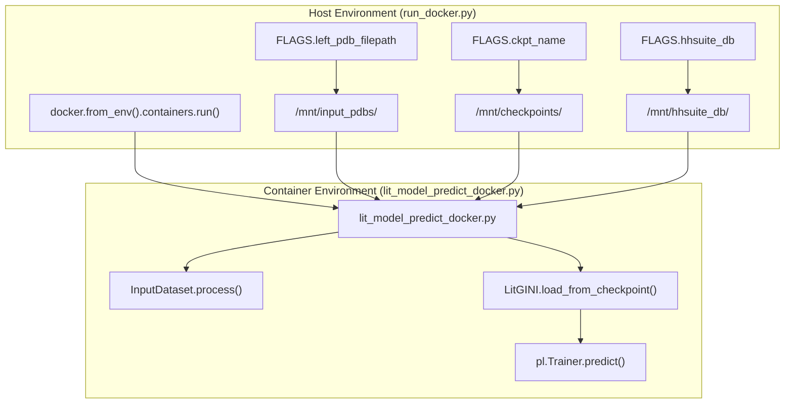
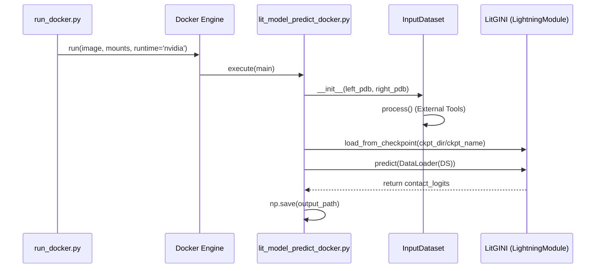

# Docker Inference (lit_model_predict_docker.py)

> **Relevant source files**
> * [docker/Dockerfile](https://github.com/BioinfoMachineLearning/DeepInteract/blob/c78d2054/docker/Dockerfile)
> * [docker/run_docker.py](https://github.com/BioinfoMachineLearning/DeepInteract/blob/c78d2054/docker/run_docker.py)
> * [project/lit_model_predict_docker.py](https://github.com/BioinfoMachineLearning/DeepInteract/blob/c78d2054/project/lit_model_predict_docker.py)

DeepInteract provides a containerized inference pipeline to ensure environment reproducibility and simplify the management of complex external dependencies like **PSAIA**, **HH-suite**, and **MSMS**. The Docker-based workflow utilizes a host-side launcher script to manage volume mounts and GPU passthrough, while the container executes a specialized prediction script.

## System Architecture: Host to Container Mapping

The Docker inference lifecycle involves two primary scripts: `run_docker.py` (running on the host) and `lit_model_predict_docker.py` (running inside the container). The host script translates local file paths into container-internal mount points before launching the Docker engine.

### Data Flow and Code Entity Association

The following diagram illustrates how host-side flags and paths are mapped to internal variables and container execution.

**Host-to-Container Bridge**

**Sources:**

* `docker/run_docker.py:54-61` (Mount creation logic)
* `docker/run_docker.py:119-128` (Container launch configuration)
* `project/lit_model_predict_docker.py:17-28` (Container-side flag definitions)
* `docker/Dockerfile:97-101` (Container entrypoint definition)

## The Dockerized Prediction Lifecycle

The containerized inference follows a specific sequence to ensure hardware acceleration is available and external tools are correctly configured.

### 1. Container Entrypoint and Initialization

The `Dockerfile` defines an entrypoint script, `/app/run_deepinteract.sh`, which performs two critical tasks before starting the Python process:

1. **ldconfig**: Refreshes shared library links to ensure NVIDIA drivers and CUDA libraries are visible to the application [docker/Dockerfile L97-L100](https://github.com/BioinfoMachineLearning/DeepInteract/blob/c78d2054/docker/Dockerfile#L97-L100) .
2. **Execution**: Launches `lit_model_predict_docker.py` with arguments passed from the host [docker/Dockerfile L99-L101](https://github.com/BioinfoMachineLearning/DeepInteract/blob/c78d2054/docker/Dockerfile#L99-L101) .

### 2. InputDataset Processing

Inside the container, the `InputDataset` class (inheriting from `dgl.data.DGLDataset`) manages the transformation of raw PDB files into graph structures. Unlike the standard inference dataset, this version defaults to paths optimized for the container's internal structure (e.g., `/mnt/checkpoints` and `/home/Programs/PSAIA_1.0_source/...`) [project/lit_model_predict_docker.py L20-L25](https://github.com/BioinfoMachineLearning/DeepInteract/blob/c78d2054/project/lit_model_predict_docker.py#L20-L25)

.

The `process()` method invokes `process_pdb_into_graph`, which orchestrates:

* Structural feature extraction (PSAIA, DSSP, MSMS).
* Evolutionary profile generation (HH-suite).
* DGLGraph construction for both protein chains [project/lit_model_predict_docker.py L106-L115](https://github.com/BioinfoMachineLearning/DeepInteract/blob/c78d2054/project/lit_model_predict_docker.py#L106-L115) .

### 3. GPU Configuration

GPU access is controlled via two layers:

* **Host Layer**: `run_docker.py` uses the `runtime='nvidia'` flag and sets the `NVIDIA_VISIBLE_DEVICES` environment variable based on `FLAGS.gpu_devices` [docker/run_docker.py L122-L128](https://github.com/BioinfoMachineLearning/DeepInteract/blob/c78d2054/docker/run_docker.py#L122-L128) .
* **Application Layer**: `lit_model_predict_docker.py` receives `--num_gpus`. If `num_gpus > 0`, it initializes the `pytorch_lightning.Trainer` with the specified GPU count [project/lit_model_predict_docker.py L28](https://github.com/BioinfoMachineLearning/DeepInteract/blob/c78d2054/project/lit_model_predict_docker.py#L28-L28) .

**Prediction Component Interaction**

**Sources:**

* `docker/run_docker.py:119-128` (Docker run call)
* `project/lit_model_predict_docker.py:106-123` (Dataset processing)
* `project/lit_model_predict_docker.py:20-21` (Checkpoint flags)

## Key Configuration Differences

The Docker inference script (`lit_model_predict_docker.py`) differs from the standard inference script primarily in its handling of paths and dependency locations.

| Feature | Docker Inference (`lit_model_predict_docker.py`) | Standard Inference (`lit_model_predict.py`) |
| --- | --- | --- |
| **CLI Framework** | `absl.flags` [project/lit_model_predict_docker.py L9](https://github.com/BioinfoMachineLearning/DeepInteract/blob/c78d2054/project/lit_model_predict_docker.py#L9-L9) | `argparse` |
| **Default PSAIA Path** | `/home/Programs/PSAIA_1.0_source/bin/linux/psa` [project/lit_model_predict_docker.py L22](https://github.com/BioinfoMachineLearning/DeepInteract/blob/c78d2054/project/lit_model_predict_docker.py#L22-L22) | User-defined or local environment path |
| **Default Ckpt Dir** | `/mnt/checkpoints` [project/lit_model_predict_docker.py L20](https://github.com/BioinfoMachineLearning/DeepInteract/blob/c78d2054/project/lit_model_predict_docker.py#L20-L20) | Local `checkpoints/` directory |
| **Volume Mounts** | Handled automatically by `run_docker.py` | Manual path management |

### Volume Mounting Strategy

`run_docker.py` uses a helper function `_create_mount` to map host directories to the container's `/mnt/` root.

* **PDBs**: Mounted to `/mnt/input_pdbs/` [docker/run_docker.py L92](https://github.com/BioinfoMachineLearning/DeepInteract/blob/c78d2054/docker/run_docker.py#L92-L92) .
* **Output/Features**: Mounted to `/mnt/Input/` [docker/run_docker.py L100](https://github.com/BioinfoMachineLearning/DeepInteract/blob/c78d2054/docker/run_docker.py#L100-L100) .
* **Checkpoints**: Mounted to `/mnt/checkpoints/` [docker/run_docker.py L105](https://github.com/BioinfoMachineLearning/DeepInteract/blob/c78d2054/docker/run_docker.py#L105-L105) .
* **HH-suite DB**: Mounted to `/mnt/hhsuite_db/` [docker/run_docker.py L111](https://github.com/BioinfoMachineLearning/DeepInteract/blob/c78d2054/docker/run_docker.py#L111-L111) .

**Sources:**

* `docker/run_docker.py:51` (`_ROOT_MOUNT_DIRECTORY` constant)
* `docker/run_docker.py:54-61` (`_create_mount` implementation)
* `project/lit_model_predict_docker.py:17-28` (Flag definitions)

## Implementation Details

### InputDataset Class

The `InputDataset` is a specialized `DGLDataset` that encapsulates the logic for a single complex prediction.

* **`__len__`**: Always returns 1, as it represents a single protein-protein interaction pair [project/lit_model_predict_docker.py L133-L135](https://github.com/BioinfoMachineLearning/DeepInteract/blob/c78d2054/project/lit_model_predict_docker.py#L133-L135) .
* **`process()`**: Uses `process_pdb_into_graph` from `deepinteract_utils.py` to generate the `graph1` (Left) and `graph2` (Right) DGL objects [project/lit_model_predict_docker.py L106-L118](https://github.com/BioinfoMachineLearning/DeepInteract/blob/c78d2054/project/lit_model_predict_docker.py#L106-L118) .
* **Feature Dimensions**: Hardcoded to match the trained model requirements: 113 node features and 27 edge features [project/lit_model_predict_docker.py L147-L155](https://github.com/BioinfoMachineLearning/DeepInteract/blob/c78d2054/project/lit_model_predict_docker.py#L147-L155) .

### Prediction Output

The script generates `.npy` files containing the contact probability maps. These are saved into the directory specified by `FLAGS.input_dataset_dir`, which is mapped back to the host via the `/mnt/Input` mount point [project/lit_model_predict_docker.py L19-L102](https://github.com/BioinfoMachineLearning/DeepInteract/blob/c78d2054/project/lit_model_predict_docker.py#L19-L102)

.

**Sources:**

* `project/lit_model_predict_docker.py:38-161` (`InputDataset` class)
* `project/utils/deepinteract_utils.py:15` (Import of processing utilities)
* `docker/run_docker.py:100-102` (Output mount logic)