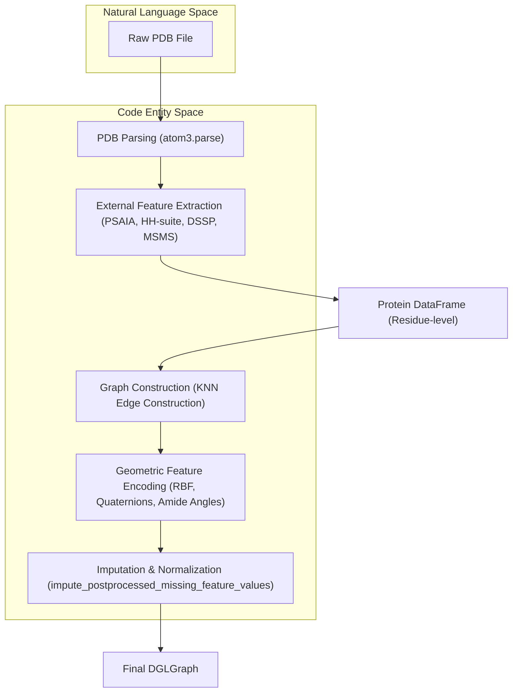

# Feature Engineering Pipeline

> **Relevant source files**
> * [project/datasets/builder/impute_missing_feature_values.py](https://github.com/BioinfoMachineLearning/DeepInteract/blob/c78d2054/project/datasets/builder/impute_missing_feature_values.py)
> * [project/utils/deepinteract_utils.py](https://github.com/BioinfoMachineLearning/DeepInteract/blob/c78d2054/project/utils/deepinteract_utils.py)
> * [project/utils/dips_plus_utils.py](https://github.com/BioinfoMachineLearning/DeepInteract/blob/c78d2054/project/utils/dips_plus_utils.py)

The DeepInteract feature engineering pipeline transforms raw PDB structures into rich, multi-modal graph representations. This process integrates structural, evolutionary, and geometric data to enable the `LitGINI-GeoTran-DilResNet` model to predict protein-protein interactions with high precision.

The pipeline is organized into three major stages: external feature extraction, graph construction with geometric encoding, and missing value imputation.

### Pipeline Overview

The transformation from a PDB file to a `DGLGraph` follows a linear progression of parsing, tool invocation, and geometric calculation.

Protein Pipeline Data Flow

**Sources:** [project/utils/deepinteract_utils.py L103-L112](https://github.com/BioinfoMachineLearning/DeepInteract/blob/c78d2054/project/utils/deepinteract_utils.py#L103-L112)

 [project/utils/graph_utils.py L34-L35](https://github.com/BioinfoMachineLearning/DeepInteract/blob/c78d2054/project/utils/graph_utils.py#L34-L35)

---

### 3.1 Structural and Evolutionary Feature Extraction

This stage enriches the protein sequence with biophysical and evolutionary context. DeepInteract wraps several bioinformatics tools to generate a comprehensive residue-level feature set.

* **Evolutionary Profiles:** Sequence profiles and HMMs are generated using the **HH-suite**.
* **Surface Topology:** **PSAIA** is used to calculate protrusion indices and surface accessibility, while **MSMS** provides residue depth measurements.
* **Secondary Structure:** **DSSP** provides secondary structure assignments and Relative Solvent Accessibility (RSA).

For implementation details on how these tools are invoked and their outputs parsed, see [Structural and Evolutionary Feature Extraction](/BioinfoMachineLearning/DeepInteract/3.1-structural-and-evolutionary-feature-extraction).

**Sources:** [project/utils/dips_plus_utils.py L14-L18](https://github.com/BioinfoMachineLearning/DeepInteract/blob/c78d2054/project/utils/dips_plus_utils.py#L14-L18)

 [project/utils/deepinteract_constants.py L23-L26](https://github.com/BioinfoMachineLearning/DeepInteract/blob/c78d2054/project/utils/deepinteract_constants.py#L23-L26)

---

### 3.2 Graph Construction and Geometric Features

Once the raw features are collected into a `PandasDataFrame`, the pipeline converts the data into a `dgl.DGLGraph`. This stage focuses on the spatial relationships between residues.

* **KNN Construction:** Edges are created between residues based on K-Nearest Neighbors in 3D space.
* **Node Encodings:** Positional encodings and dihedral angles are computed to describe the local backbone conformation.
* **Edge Geometries:** The pipeline calculates Radial Basis Function (RBF) distances, direction vectors, quaternion orientations, and amide plane angles to represent the relative orientation of residues.

For details on the geometric math and graph building logic, see [Graph Construction and Geometric Features](/BioinfoMachineLearning/DeepInteract/3.2-graph-construction-and-geometric-features).

**Sources:** [project/utils/deepinteract_utils.py L103-L112](https://github.com/BioinfoMachineLearning/DeepInteract/blob/c78d2054/project/utils/deepinteract_utils.py#L103-L112)

 [project/utils/protein_feature_utils.py L35](https://github.com/BioinfoMachineLearning/DeepInteract/blob/c78d2054/project/utils/protein_feature_utils.py#L35-L35)

---

### 3.3 Feature Imputation and Post-processing

Biological data is often incomplete due to missing atoms in PDB structures or tool failures. This stage ensures the resulting tensors are clean and normalized for the neural network.

* **Imputation Strategies:** Missing values are handled via `impute_postprocessed_missing_feature_values`, which uses median, mean, or zero-filling based on the feature type.
* **Thresholding:** Complexes with too many missing values are flagged or filtered based on `NUM_ALLOWABLE_NANS`.
* **Exposure Calculation:** The Half-Sphere Amino Acid Composition (HSAAC) is calculated here to describe the residue environment.
* **Normalization:** Features are scaled using `MinMaxScaler` to ensure numerical stability during training.

For details on the imputation logic and normalization parameters, see [Feature Imputation and Post-processing](/BioinfoMachineLearning/DeepInteract/3.3-feature-imputation-and-post-processing).

**Sources:** [project/utils/dips_plus_utils.py L23-L26](https://github.com/BioinfoMachineLearning/DeepInteract/blob/c78d2054/project/utils/dips_plus_utils.py#L23-L26)

 [project/datasets/builder/impute_missing_feature_values.py L7-L32](https://github.com/BioinfoMachineLearning/DeepInteract/blob/c78d2054/project/datasets/builder/impute_missing_feature_values.py#L7-L32)

---

### Key Components and Classes

| Component | Code Entity | Responsibility |
| --- | --- | --- |
| **Graph Builder** | `prot_df_to_dgl_graph_feats` | Converts DataFrames to DGL structures. |
| **Geometric Engine** | `GeometricProteinFeatures` | Calculates quaternions and amide angles. |
| **Imputation Engine** | `impute_postprocessed_missing_feature_values` | Handles NaNs and normalization. |
| **Spatial Utility** | `get_hsacc` | Computes half-sphere exposure vectors. |

**Sources:** [project/utils/deepinteract_utils.py L33-L35](https://github.com/BioinfoMachineLearning/DeepInteract/blob/c78d2054/project/utils/deepinteract_utils.py#L33-L35)

 [project/utils/dips_plus_utils.py L118-L161](https://github.com/BioinfoMachineLearning/DeepInteract/blob/c78d2054/project/utils/dips_plus_utils.py#L118-L161)