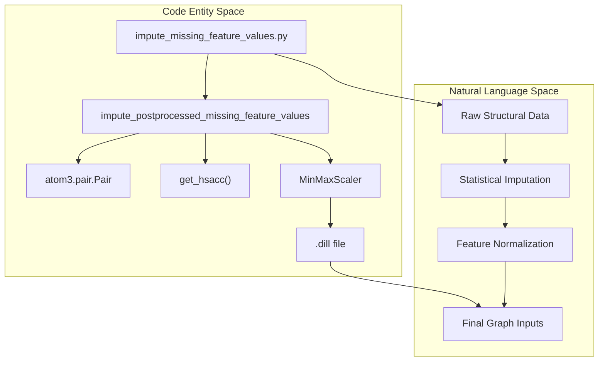
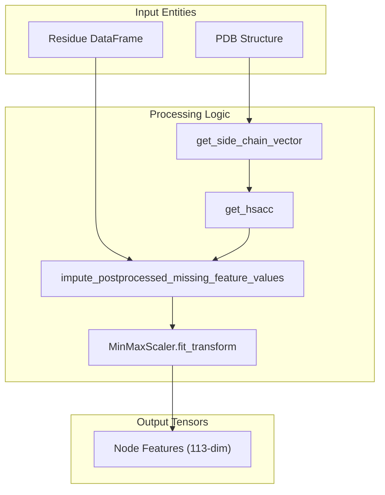

# Feature Imputation and Post-processing

> **Relevant source files**
> * [project/datasets/builder/impute_missing_feature_values.py](https://github.com/BioinfoMachineLearning/DeepInteract/blob/c78d2054/project/datasets/builder/impute_missing_feature_values.py)
> * [project/utils/deepinteract_constants.py](https://github.com/BioinfoMachineLearning/DeepInteract/blob/c78d2054/project/utils/deepinteract_constants.py)
> * [project/utils/dips_plus_utils.py](https://github.com/BioinfoMachineLearning/DeepInteract/blob/c78d2054/project/utils/dips_plus_utils.py)

This section describes the technical implementation of the feature imputation and post-processing pipeline in DeepInteract. The pipeline ensures that structural, evolutionary, and geometric features extracted from external tools (PSAIA, HH-suite, DSSP) are complete, normalized, and formatted for graph construction. It handles missing values using statistical strategies and calculates complex geometric descriptors like Half-Sphere Amino Acid Composition (HSAAC).

## Imputation Pipeline Overview

The imputation process is primarily managed by `impute_missing_feature_values.py`, which acts as a wrapper for parallelizing the `impute_postprocessed_missing_feature_values` function across a dataset [project/datasets/builder/impute_missing_feature_values.py L19-L32](https://github.com/BioinfoMachineLearning/DeepInteract/blob/c78d2054/project/datasets/builder/impute_missing_feature_values.py#L19-L32)

 This pipeline is critical because external tools often fail to produce values for specific residues due to structural breaks or non-standard amino acids.

### Data Flow and Code Entity Association

The following diagram illustrates the transition from raw structural data to imputed DataFrames within the code.

**Diagram: Imputation Data Flow**

**Sources:** [project/datasets/builder/impute_missing_feature_values.py L29-L32](https://github.com/BioinfoMachineLearning/DeepInteract/blob/c78d2054/project/datasets/builder/impute_missing_feature_values.py#L29-L32)

 [project/utils/dips_plus_utils.py L118-L161](https://github.com/BioinfoMachineLearning/DeepInteract/blob/c78d2054/project/utils/dips_plus_utils.py#L118-L161)

 [project/utils/dips_plus_utils.py L939](https://github.com/BioinfoMachineLearning/DeepInteract/blob/c78d2054/project/utils/dips_plus_utils.py#L939-L939)

## Missing Feature Detection and Strategies

DeepInteract uses a multi-tiered strategy for handling missing values based on the feature type and the amount of missing data.

### Statistical Imputation Strategies

The pipeline identifies `NaN` values in the residue DataFrames (`df0` and `df1`) and applies the following logic [project/utils/dips_plus_utils.py L939](https://github.com/BioinfoMachineLearning/DeepInteract/blob/c78d2054/project/utils/dips_plus_utils.py#L939-L939)

:

1. **Threshold Check**: For each column, the number of `NaN` values is compared against `NUM_ALLOWABLE_NANS` (default: 5) [project/utils/deepinteract_constants.py L55](https://github.com/BioinfoMachineLearning/DeepInteract/blob/c78d2054/project/utils/deepinteract_constants.py#L55-L55)
2. **Median/Mean Fill**: If the number of missing values is below the threshold, the pipeline uses the median (or mean) of the existing values for that specific protein chain.
3. **Zero Fill**: If the number of missing values exceeds the threshold, the entire column is imputed with zeros to avoid biasing the model with potentially inaccurate averages from a sparse sample [project/utils/dips_plus_utils.py L939](https://github.com/BioinfoMachineLearning/DeepInteract/blob/c78d2054/project/utils/dips_plus_utils.py#L939-L939)

### Default Values

Specific constants define the fallback values for features when tools fail completely:

| Feature | Constant | Default Value |
| --- | --- | --- |
| Secondary Structure | `DEFAULT_MISSING_SS` | `'-'` (Loop/Random coil) |
| RSA / Residue Depth | `DEFAULT_MISSING_RSA/RD` | `np.nan` (imputed later) |
| HSAAC | `DEFAULT_MISSING_HSAAC` | List of `np.nan` (length 42) |
| Sequence Profiles | `DEFAULT_MISSING_SEQUENCE_FEATS` | Array of `np.nan` (length 27) |

**Sources:** [project/utils/deepinteract_constants.py L43-L55](https://github.com/BioinfoMachineLearning/DeepInteract/blob/c78d2054/project/utils/deepinteract_constants.py#L43-L55)

 [project/utils/dips_plus_utils.py L939](https://github.com/BioinfoMachineLearning/DeepInteract/blob/c78d2054/project/utils/dips_plus_utils.py#L939-L939)

## Half-Sphere Amino Acid Composition (HSAAC)

HSAAC is a geometric feature that describes the spatial distribution of amino acids around a central residue, divided into "up" (side-chain direction) and "down" (opposite) hemispheres.

### Implementation Detail: get_hsacc

The function `get_hsacc` calculates these values using a similarity matrix and side-chain vectors [project/utils/dips_plus_utils.py L118-L161](https://github.com/BioinfoMachineLearning/DeepInteract/blob/c78d2054/project/utils/dips_plus_utils.py#L118-L161)

:

1. **Side Chain Vector**: Calculated via `get_side_chain_vector`, which finds the average unit vector from the $C\alpha$ atom to side-chain atoms [project/utils/dips_plus_utils.py L55-L81](https://github.com/BioinfoMachineLearning/DeepInteract/blob/c78d2054/project/utils/dips_plus_utils.py#L55-L81)
2. **Similarity Matrix**: Generated by `get_similarity_matrix` based on minimum atom distances between residues [project/utils/dips_plus_utils.py L84-L115](https://github.com/BioinfoMachineLearning/DeepInteract/blob/c78d2054/project/utils/dips_plus_utils.py#L84-L115)
3. **Hemisphere Assignment**: For each neighbor, the angle between the side-chain vector and the neighbor's $C\alpha$ vector is computed. If $\text{angle} < \pi/2$, it is "up"; otherwise, it is "down" [project/utils/dips_plus_utils.py L152-L158](https://github.com/BioinfoMachineLearning/DeepInteract/blob/c78d2054/project/utils/dips_plus_utils.py#L152-L158)
4. **Output**: Two tensors (`UC` and `DC`) representing the composition of 20 amino acids + 1 unknown type in both hemispheres, normalized by the total count in that hemisphere [project/utils/dips_plus_utils.py L159-L160](https://github.com/BioinfoMachineLearning/DeepInteract/blob/c78d2054/project/utils/dips_plus_utils.py#L159-L160)

**Sources:** [project/utils/dips_plus_utils.py L55-L161](https://github.com/BioinfoMachineLearning/DeepInteract/blob/c78d2054/project/utils/dips_plus_utils.py#L55-L161)

## Feature Normalization and Post-processing

After imputation, features are normalized to ensure stable training of the `LitGINI` model.

### MinMaxScaler Normalization

The pipeline utilizes `sklearn.preprocessing.MinMaxScaler` to scale continuous features between 0 and 1 [project/utils/dips_plus_utils.py L939](https://github.com/BioinfoMachineLearning/DeepInteract/blob/c78d2054/project/utils/dips_plus_utils.py#L939-L939)

 This is applied to:

* PSAIA features (Protrusion indices, surface accessibility) [project/utils/deepinteract_constants.py L36](https://github.com/BioinfoMachineLearning/DeepInteract/blob/c78d2054/project/utils/deepinteract_constants.py#L36-L36)
* Residue Depth and RSA.
* Coordinate numbers (CN).

### Amide Plane Normal Vectors

As a final geometric post-processing step, the pipeline ensures that amide normal vectors are correctly oriented. If a residue lacks a normal vector (often due to missing backbone atoms), it is assigned `DEFAULT_MISSING_NORM_VEC` [project/utils/deepinteract_constants.py L52](https://github.com/BioinfoMachineLearning/DeepInteract/blob/c78d2054/project/utils/deepinteract_constants.py#L52-L52)

 which is later handled during graph construction.

**Diagram: Feature Transformation Pipeline**

**Sources:** [project/utils/dips_plus_utils.py L939](https://github.com/BioinfoMachineLearning/DeepInteract/blob/c78d2054/project/utils/dips_plus_utils.py#L939-L939)

 [project/utils/deepinteract_constants.py L99-L116](https://github.com/BioinfoMachineLearning/DeepInteract/blob/c78d2054/project/utils/deepinteract_constants.py#L99-L116)

## Summary of Feature Indices

Post-processed features are packed into a final node feature tensor following the `FEATURE_INDICES` schema [project/utils/deepinteract_constants.py L99-L116](https://github.com/BioinfoMachineLearning/DeepInteract/blob/c78d2054/project/utils/deepinteract_constants.py#L99-L116)

:

* **Geometric Features**: Indices 1-7.
* **DIPS-Plus Features**: Indices 7-113 (includes One-hot Residue Name, SS, RSA, RD, PSAIA, HSAAC, and Sequence Profiles).

**Sources:** [project/utils/deepinteract_constants.py L99-L116](https://github.com/BioinfoMachineLearning/DeepInteract/blob/c78d2054/project/utils/deepinteract_constants.py#L99-L116)

 [project/utils/dips_plus_utils.py L939](https://github.com/BioinfoMachineLearning/DeepInteract/blob/c78d2054/project/utils/dips_plus_utils.py#L939-L939)