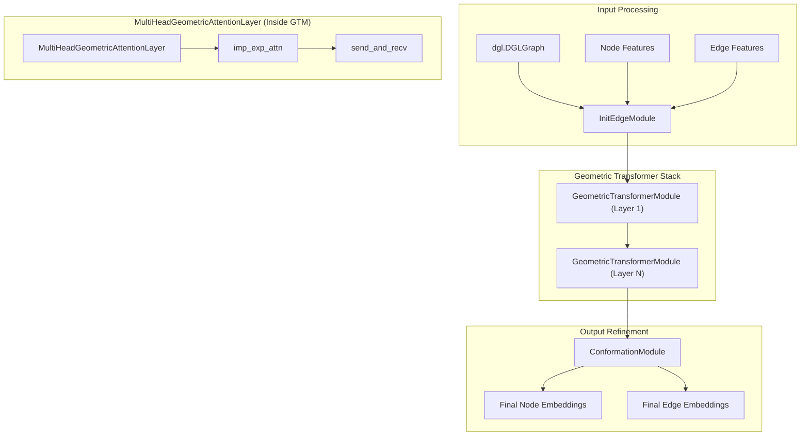
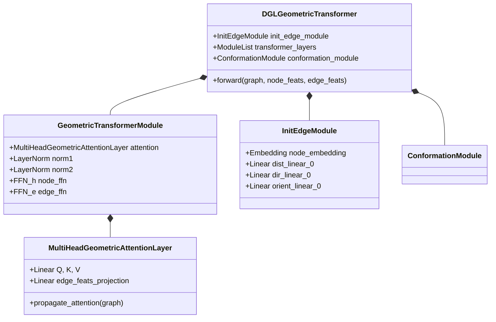

# Geometric Transformer (DGLGeometricTransformer)

> **Relevant source files**
> * [project/utils/deepinteract_modules.py](https://github.com/BioinfoMachineLearning/DeepInteract/blob/c78d2054/project/utils/deepinteract_modules.py)
> * [project/utils/graph_utils.py](https://github.com/BioinfoMachineLearning/DeepInteract/blob/c78d2054/project/utils/graph_utils.py)
> * [project/utils/protein_feature_utils.py](https://github.com/BioinfoMachineLearning/DeepInteract/blob/c78d2054/project/utils/protein_feature_utils.py)

The `DGLGeometricTransformer` is a core component of the DeepInteract architecture, responsible for learning expressive node and edge representations from protein graphs. It integrates multi-head attention with geometric constraints, allowing the model to capture both sequence-based evolutionary information and 3D structural relationships between residues.

## Architecture Overview

The transformer consists of three primary stages: edge initialization, geometric message passing through multiple transformer layers, and a final conformation update. It is designed to work with `dgl.DGLGraph` objects where nodes represent residues and edges represent spatial proximity (K-Nearest Neighbors).

### System Data Flow

The following diagram illustrates the data flow through the `DGLGeometricTransformer` and its sub-modules.

**Sources:** [project/utils/deepinteract_modules.py L128-L153](https://github.com/BioinfoMachineLearning/DeepInteract/blob/c78d2054/project/utils/deepinteract_modules.py#L128-L153)

 [project/utils/deepinteract_modules.py L488-L518](https://github.com/BioinfoMachineLearning/DeepInteract/blob/c78d2054/project/utils/deepinteract_modules.py#L488-L518)

 [project/utils/deepinteract_modules.py L651-L686](https://github.com/BioinfoMachineLearning/DeepInteract/blob/c78d2054/project/utils/deepinteract_modules.py#L651-L686)

---

## Key Components

### InitEdgeModule

The `InitEdgeModule` serves as the embedding layer for the graph. It projects raw node and edge features into a high-dimensional hidden space.

* **Node Embedding:** Uses `nn.Embedding` to project residue types and other categorical features [project/utils/deepinteract_modules.py L153](https://github.com/BioinfoMachineLearning/DeepInteract/blob/c78d2054/project/utils/deepinteract_modules.py#L153-L153)
* **Edge Projection:** Combines various geometric edge features (distances, directions, orientations, and amide plane angles) using separate linear layers [project/utils/deepinteract_modules.py L156-L160](https://github.com/BioinfoMachineLearning/DeepInteract/blob/c78d2054/project/utils/deepinteract_modules.py#L156-L160)
* **Feature Integration:** It concatenates these projections and passes them through a gated linear unit (GLU) structure to initialize the edge hidden states [project/utils/deepinteract_modules.py L186-L200](https://github.com/BioinfoMachineLearning/DeepInteract/blob/c78d2054/project/utils/deepinteract_modules.py#L186-L200)

### MultiHeadGeometricAttentionLayer

This layer extends the standard Transformer attention mechanism to graphs by incorporating edge features into the attention score calculation.

1. **Projection:** Node features are projected into Query ($Q$), Key ($K$), and Value ($V$) tensors. Edge features are projected into a geometric bias tensor `proj_e` [project/utils/deepinteract_modules.py L101-L110](https://github.com/BioinfoMachineLearning/DeepInteract/blob/c78d2054/project/utils/deepinteract_modules.py#L101-L110)
2. **Geometric Gating:** The `imp_exp_attn` function (defined in `graph_utils.py`) multiplies the implicit attention score (dot product of $Q$ and $K$) by the explicit edge features [project/utils/graph_utils.py L37-L47](https://github.com/BioinfoMachineLearning/DeepInteract/blob/c78d2054/project/utils/graph_utils.py#L37-L47)
3. **Aggregation:** The weighted values are aggregated at the target nodes using DGL's `send_and_recv` mechanism [project/utils/deepinteract_modules.py L95-L96](https://github.com/BioinfoMachineLearning/DeepInteract/blob/c78d2054/project/utils/deepinteract_modules.py#L95-L96)

### GeometricTransformerModule

This module wraps the attention layer with residual connections and Feed-Forward Networks (FFN). It supports two modes:

* **Standard Mode:** Updates both node and edge features.
* **Disable Geometric Mode:** If `disable_geometric_mode` is set to `True`, the module skips the edge feature updates and geometric gating, behaving more like a standard Graph Transformer [project/utils/deepinteract_modules.py L532-L540](https://github.com/BioinfoMachineLearning/DeepInteract/blob/c78d2054/project/utils/deepinteract_modules.py#L532-L540)

### ConformationModule

The final stage of the transformer, the `ConformationModule`, performs a final update on node and edge representations using a Gated Linear Unit (GLU) and a series of linear transformations to prepare the features for the 2D Interaction Predictor [project/utils/deepinteract_modules.py L651-L686](https://github.com/BioinfoMachineLearning/DeepInteract/blob/c78d2054/project/utils/deepinteract_modules.py#L651-L686)

---

## Code Entity Map

The following diagram maps the logical components of the Geometric Transformer to their specific implementations in the codebase.

**Sources:** [project/utils/deepinteract_modules.py L34-L38](https://github.com/BioinfoMachineLearning/DeepInteract/blob/c78d2054/project/utils/deepinteract_modules.py#L34-L38)

 [project/utils/deepinteract_modules.py L128-L142](https://github.com/BioinfoMachineLearning/DeepInteract/blob/c78d2054/project/utils/deepinteract_modules.py#L128-L142)

 [project/utils/deepinteract_modules.py L488-L512](https://github.com/BioinfoMachineLearning/DeepInteract/blob/c78d2054/project/utils/deepinteract_modules.py#L488-L512)

 [project/utils/deepinteract_modules.py L651-L665](https://github.com/BioinfoMachineLearning/DeepInteract/blob/c78d2054/project/utils/deepinteract_modules.py#L651-L665)

---

## Geometric Feature Processing

The transformer relies on rich geometric features extracted during graph construction. These are integrated into the attention mechanism via the `edge_feats` tensor.

| Feature Type | Description | Implementation Source |
| --- | --- | --- |
| **RBF Distances** | Radial Basis Function encoding of $C\alpha-C\alpha$ distances. | [project/utils/protein_feature_utils.py L82-L101](https://github.com/BioinfoMachineLearning/DeepInteract/blob/c78d2054/project/utils/protein_feature_utils.py#L82-L101) |
| **Direction Vectors** | Unit vectors between residue coordinates. | [project/utils/deepinteract_modules.py L158](https://github.com/BioinfoMachineLearning/DeepInteract/blob/c78d2054/project/utils/deepinteract_modules.py#L158-L158) |
| **Quaternions** | Orientation encodings derived from rotation matrices. | [project/utils/protein_feature_utils.py L104-L149](https://github.com/BioinfoMachineLearning/DeepInteract/blob/c78d2054/project/utils/protein_feature_utils.py#L104-L149) |
| **Amide Plane** | Angles representing the relative orientation of peptide planes. | [project/utils/deepinteract_modules.py L160](https://github.com/BioinfoMachineLearning/DeepInteract/blob/c78d2054/project/utils/deepinteract_modules.py#L160-L160) |

### Neighborhood Aggregation

The model uses `dgl.function` primitives for efficient message passing. Specifically:

* `src_dot_dst`: Computes $Q^T K$ for every edge [project/utils/graph_utils.py L21-L26](https://github.com/BioinfoMachineLearning/DeepInteract/blob/c78d2054/project/utils/graph_utils.py#L21-L26)
* `scaling`: Applies a temperature factor and clips scores for numerical stability [project/utils/graph_utils.py L29-L34](https://github.com/BioinfoMachineLearning/DeepInteract/blob/c78d2054/project/utils/graph_utils.py#L29-L34)
* `exp`: Computes the exponential of attention scores for softmax normalization [project/utils/graph_utils.py L58-L63](https://github.com/BioinfoMachineLearning/DeepInteract/blob/c78d2054/project/utils/graph_utils.py#L58-L63)

**Sources:** [project/utils/deepinteract_modules.py L76-L97](https://github.com/BioinfoMachineLearning/DeepInteract/blob/c78d2054/project/utils/deepinteract_modules.py#L76-L97)

 [project/utils/graph_utils.py L1-L65](https://github.com/BioinfoMachineLearning/DeepInteract/blob/c78d2054/project/utils/graph_utils.py#L1-L65)