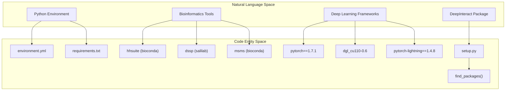
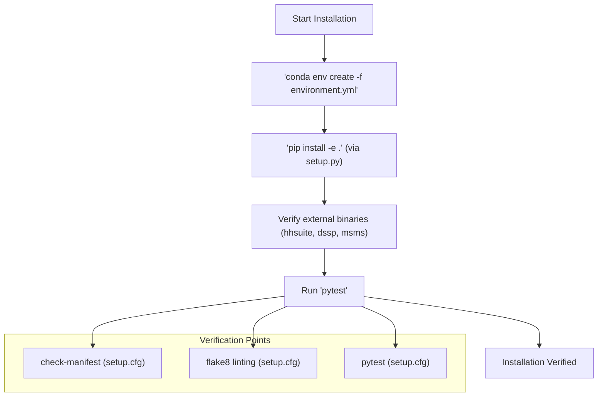

# Getting Started: Installation and Environment Setup

> **Relevant source files**
> * [environment.yml](https://github.com/BioinfoMachineLearning/DeepInteract/blob/c78d2054/environment.yml)
> * [requirements.txt](https://github.com/BioinfoMachineLearning/DeepInteract/blob/c78d2054/requirements.txt)
> * [setup.cfg](https://github.com/BioinfoMachineLearning/DeepInteract/blob/c78d2054/setup.cfg)
> * [setup.py](https://github.com/BioinfoMachineLearning/DeepInteract/blob/c78d2054/setup.py)

This page provides a comprehensive guide for setting up the DeepInteract development environment. DeepInteract is a geometric deep learning pipeline designed for predicting protein interface contacts, requiring a specific combination of Python libraries, CUDA-enabled deep learning frameworks, and external bioinformatics tools.

## Environment Architecture

DeepInteract relies on a multi-layered environment. The core logic is packaged as a Python library, while the execution environment is managed via Conda to handle complex binary dependencies like `hhsuite` and `dssp`.

### System Dependency Mapping

The following diagram illustrates how the system requirements map to specific configuration files and code entities within the repository.

**Diagram: Dependency to Code Mapping**



**Sources:** [environment.yml L1-L28](https://github.com/BioinfoMachineLearning/DeepInteract/blob/c78d2054/environment.yml#L1-L28)

, [setup.py L1-L38](https://github.com/BioinfoMachineLearning/DeepInteract/blob/c78d2054/setup.py#L1-L38)

, [requirements.txt L1-L15](https://github.com/BioinfoMachineLearning/DeepInteract/blob/c78d2054/requirements.txt#L1-L15)

---

## Step-by-Step Installation

### 1. Conda Environment Creation

The primary method for installation is using the provided `environment.yml` file. This file specifies the Python version (3.8), CUDA toolkit (11.2), and essential bioinformatics channels.

```python
# Create the environment from the yaml fileconda env create -f environment.yml # Activate the environmentconda activate DeepInteract
```

**Sources:** [environment.yml L1-L15](https://github.com/BioinfoMachineLearning/DeepInteract/blob/c78d2054/environment.yml#L1-L15)

### 2. Core Python Dependencies

DeepInteract is structured as a standard Python package using `setuptools`. The `install_requires` section in `setup.py` defines the runtime dependencies, including specialized libraries like `atom3-py3` for atomic data processing and `dill` for object serialization.

| Dependency | Version | Role |
| --- | --- | --- |
| `pytorch` | 1.7.1 | Core tensor computations and autograd |
| `dgl-cu110` | 0.6 | Deep Graph Library (CUDA 11.0 build) |
| `pytorch-lightning` | 1.4.8 | High-level training and prediction loops |
| `biopandas` | 0.2.9 | PDB file parsing into DataFrames |
| `hhsuite` | 3.3.0 | Evolutionary profile generation (HMMs) |
| `dssp` | 3.0.0 | Secondary structure assignment |
| `msms` | 2.6.1 | Solvent excluded surface calculation |

**Sources:** [setup.py L13-L28](https://github.com/BioinfoMachineLearning/DeepInteract/blob/c78d2054/setup.py#L13-L28)

, [environment.yml L12-L28](https://github.com/BioinfoMachineLearning/DeepInteract/blob/c78d2054/environment.yml#L12-L28)

### 3. External Tool Configuration (PSAIA)

While most tools are installed via Conda, some external tools like PSAIA (Protein Structure Automatic Interaction Analyzer) must be manually configured if not provided via the `msms` or `dssp` conda packages. Ensure these binaries are in your system `PATH` for the feature extraction pipeline to function correctly.

---

## Package Structure and Metadata

The DeepInteract package is defined in `setup.py` with the following metadata:

* **Name:** `DeepInteract`
* **Version:** `1.1.0`
* **License:** GNU Public License, Version 3.0
* **Entry Points:** The package uses `find_packages()` to automatically discover modules for the `LitGINI` model and feature engineering pipelines.

**Sources:** [setup.py L5-L12](https://github.com/BioinfoMachineLearning/DeepInteract/blob/c78d2054/setup.py#L5-L12)

, [setup.py L29](https://github.com/BioinfoMachineLearning/DeepInteract/blob/c78d2054/setup.py#L29-L29)

---

## Verification and Testing

After installation, the environment should be verified to ensure all components (especially the C-extensions for DGL and PyTorch) are working correctly.

### Testing Suite

The repository uses `pytest` for verification. Configuration is managed via `setup.cfg`.

```markdown
# Run the test suitepytest
```

The test configuration excludes specific directories and sets strict doctest rules to ensure the geometric deep learning modules (e.g., `DGLGeometricTransformer`) behave as expected.

**Diagram: Installation Verification Flow**



**Sources:** [setup.cfg L1-L31](https://github.com/BioinfoMachineLearning/DeepInteract/blob/c78d2054/setup.cfg#L1-L31)

, [setup.py L1-L38](https://github.com/BioinfoMachineLearning/DeepInteract/blob/c78d2054/setup.py#L1-L38)

### Code Style and Linting

DeepInteract enforces a coding standard defined in `setup.cfg`. It uses `flake8` with a maximum line length of 120 and specific ignore rules (e.g., `E731` for lambda expressions) to maintain readability in complex mathematical implementations.

**Sources:** [setup.cfg L16-L31](https://github.com/BioinfoMachineLearning/DeepInteract/blob/c78d2054/setup.cfg#L16-L31)