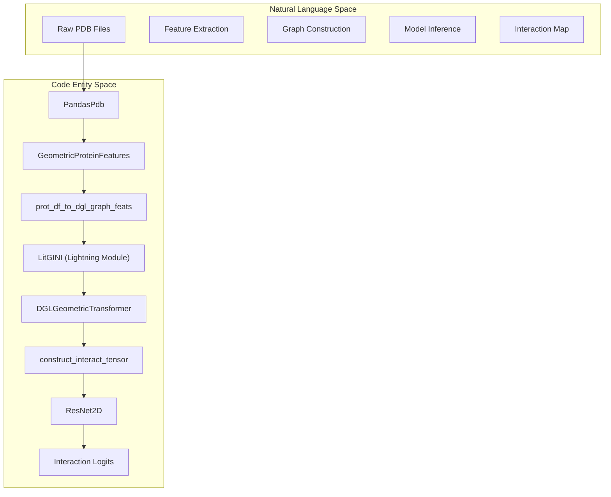
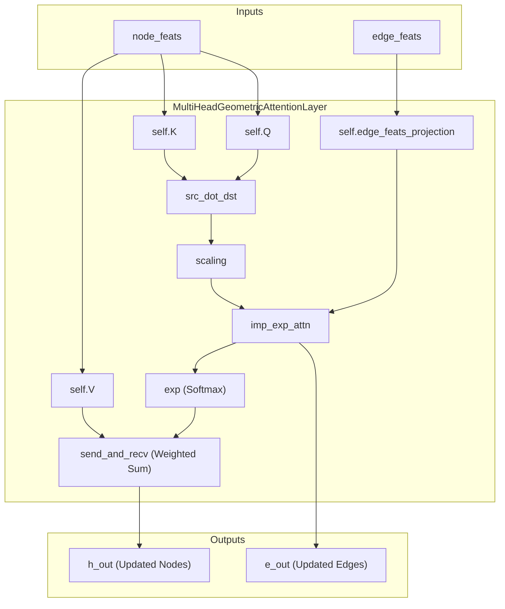

# Glossary

> **Relevant source files**
> * [README.md](https://github.com/BioinfoMachineLearning/DeepInteract/blob/c78d2054/README.md?plain=1)
> * [project/datasets/builder/impute_missing_feature_values.py](https://github.com/BioinfoMachineLearning/DeepInteract/blob/c78d2054/project/datasets/builder/impute_missing_feature_values.py)
> * [project/utils/deepinteract_constants.py](https://github.com/BioinfoMachineLearning/DeepInteract/blob/c78d2054/project/utils/deepinteract_constants.py)
> * [project/utils/deepinteract_modules.py](https://github.com/BioinfoMachineLearning/DeepInteract/blob/c78d2054/project/utils/deepinteract_modules.py)
> * [project/utils/deepinteract_utils.py](https://github.com/BioinfoMachineLearning/DeepInteract/blob/c78d2054/project/utils/deepinteract_utils.py)
> * [project/utils/dips_plus_utils.py](https://github.com/BioinfoMachineLearning/DeepInteract/blob/c78d2054/project/utils/dips_plus_utils.py)
> * [project/utils/graph_utils.py](https://github.com/BioinfoMachineLearning/DeepInteract/blob/c78d2054/project/utils/graph_utils.py)
> * [project/utils/protein_feature_utils.py](https://github.com/BioinfoMachineLearning/DeepInteract/blob/c78d2054/project/utils/protein_feature_utils.py)

This page provides definitions and technical context for domain-specific terms, abbreviations, and architectural concepts within the DeepInteract codebase.

## 1. Core Domain Concepts

| Term | Definition | Code Reference |
| --- | --- | --- |
| **PICP** | Protein Interface Contact Prediction. The primary task of the model. | `project/datasets/PICP/` |
| **Complex** | A biological structure formed by two or more interacting protein chains. | [project/utils/deepinteract_utils.py L61-L67](https://github.com/BioinfoMachineLearning/DeepInteract/blob/c78d2054/project/utils/deepinteract_utils.py#L61-L67) |
| **DIPS-Plus** | An augmented version of the Database of Interacting Protein Structures, providing structural and evolutionary features. | [project/utils/deepinteract_constants.py L10-L11](https://github.com/BioinfoMachineLearning/DeepInteract/blob/c78d2054/project/utils/deepinteract_constants.py#L10-L11) |
| **Geometric Transformer** | A specialized Transformer architecture that incorporates 3D spatial relationships (distances, orientations) into the attention mechanism. | [project/utils/deepinteract_modules.py L34-L121](https://github.com/BioinfoMachineLearning/DeepInteract/blob/c78d2054/project/utils/deepinteract_modules.py#L34-L121) |
| **Siamese Encoder** | A model architecture where two identical sub-networks (with shared weights) process two different inputs (Chain A and Chain B). | [project/utils/deepinteract_utils.py L61-L67](https://github.com/BioinfoMachineLearning/DeepInteract/blob/c78d2054/project/utils/deepinteract_utils.py#L61-L67) |

**Sources:**

* [project/utils/deepinteract_utils.py L61-L67](https://github.com/BioinfoMachineLearning/DeepInteract/blob/c78d2054/project/utils/deepinteract_utils.py#L61-L67)
* [project/utils/deepinteract_constants.py L10-L11](https://github.com/BioinfoMachineLearning/DeepInteract/blob/c78d2054/project/utils/deepinteract_constants.py#L10-L11)
* [project/utils/deepinteract_modules.py L34-L121](https://github.com/BioinfoMachineLearning/DeepInteract/blob/c78d2054/project/utils/deepinteract_modules.py#L34-L121)

---

## 2. Feature Engineering & Structural Terms

### Geometric Features

DeepInteract relies on coordinate-aware features derived from the PDB structures of protein chains.

* **RBF (Radial Basis Functions):** Used to expand pairwise Euclidean distances into a high-dimensional representation for the edges of the graph. * *Implementation:* `GeometricProteinFeatures.compute_rbfs` [project/utils/protein_feature_utils.py L82-L102](https://github.com/BioinfoMachineLearning/DeepInteract/blob/c78d2054/project/utils/protein_feature_utils.py#L82-L102)
* **Quaternions:** 4D representations of 3D rotations, used to encode the relative orientation between residue local frames. * *Implementation:* `GeometricProteinFeatures.convert_rotations_into_quaternions` [project/utils/protein_feature_utils.py L104-L149](https://github.com/BioinfoMachineLearning/DeepInteract/blob/c78d2054/project/utils/protein_feature_utils.py#L104-L149)
* **Amide Plane Angles:** Angles representing the orientation of the peptide bond plane. * *Code Symbol:* `edge_amide_angles` [project/utils/deepinteract_constants.py L115](https://github.com/BioinfoMachineLearning/DeepInteract/blob/c78d2054/project/utils/deepinteract_constants.py#L115-L115)

### DIPS-Plus Features

Non-geometric features extracted from external tools (PSAIA, DSSP, HH-suite).

* **PSAIA Features:** Includes protrusion indices and surface accessibility metrics like `avg_cx` (average protrusion) and `s_avg_cx`. * *Code Symbol:* `PSAIA_COLUMNS` [project/utils/deepinteract_constants.py L35-L36](https://github.com/BioinfoMachineLearning/DeepInteract/blob/c78d2054/project/utils/deepinteract_constants.py#L35-L36)
* **HSAAC (Half-Sphere Amino Acid Composition):** A spatial feature counting amino acids in "up" and "down" half-spheres relative to the side chain vector. * *Implementation:* `get_hsacc` [project/utils/dips_plus_utils.py L118-L161](https://github.com/BioinfoMachineLearning/DeepInteract/blob/c78d2054/project/utils/dips_plus_utils.py#L118-L161)
* **RSA (Relative Solvent Accessibility):** Derived from DSSP to indicate how exposed a residue is to the environment. * *Code Symbol:* `rsa_value` [project/utils/deepinteract_constants.py L67](https://github.com/BioinfoMachineLearning/DeepInteract/blob/c78d2054/project/utils/deepinteract_constants.py#L67-L67)

**Sources:**

* [project/utils/protein_feature_utils.py L82-L149](https://github.com/BioinfoMachineLearning/DeepInteract/blob/c78d2054/project/utils/protein_feature_utils.py#L82-L149)
* [project/utils/deepinteract_constants.py L35-L115](https://github.com/BioinfoMachineLearning/DeepInteract/blob/c78d2054/project/utils/deepinteract_constants.py#L35-L115)
* [project/utils/dips_plus_utils.py L118-L161](https://github.com/BioinfoMachineLearning/DeepInteract/blob/c78d2054/project/utils/dips_plus_utils.py#L118-L161)

---

## 3. System Architecture Mapping

The following diagram maps the high-level data flow to the specific classes and functions responsible for processing.

### Data Flow: Raw PDB to Interaction Logits

**Sources:**

* [project/utils/deepinteract_utils.py L31-L35](https://github.com/BioinfoMachineLearning/DeepInteract/blob/c78d2054/project/utils/deepinteract_utils.py#L31-L35)
* [project/utils/graph_utils.py L69-L110](https://github.com/BioinfoMachineLearning/DeepInteract/blob/c78d2054/project/utils/graph_utils.py#L69-L110)
* [project/utils/deepinteract_modules.py L186-L220](https://github.com/BioinfoMachineLearning/DeepInteract/blob/c78d2054/project/utils/deepinteract_modules.py#L186-L220)

---

## 4. Technical Constants & Limits

The codebase uses specific thresholds to manage computational complexity and data quality.

* **`RESIDUE_COUNT_LIMIT` (256):** The maximum number of residues per chain processed during training to ensure memory stability. [project/utils/deepinteract_constants.py L11](https://github.com/BioinfoMachineLearning/DeepInteract/blob/c78d2054/project/utils/deepinteract_constants.py#L11-L11)
* **`KNN` (20):** The number of nearest neighbors used to construct the edges of the protein graph. [project/utils/deepinteract_constants.py L13](https://github.com/BioinfoMachineLearning/DeepInteract/blob/c78d2054/project/utils/deepinteract_constants.py#L13-L13)
* **`NUM_ALLOWABLE_NANS` (5):** The threshold for missing values in a feature column before falling back to zero-imputation. [project/utils/deepinteract_constants.py L55](https://github.com/BioinfoMachineLearning/DeepInteract/blob/c78d2054/project/utils/deepinteract_constants.py#L55-L55)
* **`FEATURE_INDICES`:** A dictionary mapping specific indices in the feature tensors to their semantic meaning (e.g., `edge_dist_feats_start`). [project/utils/deepinteract_constants.py L99-L116](https://github.com/BioinfoMachineLearning/DeepInteract/blob/c78d2054/project/utils/deepinteract_constants.py#L99-L116)

**Sources:**

* [project/utils/deepinteract_constants.py L11-L116](https://github.com/BioinfoMachineLearning/DeepInteract/blob/c78d2054/project/utils/deepinteract_constants.py#L11-L116)

---

## 5. Model Component Interaction

This diagram illustrates how the `MultiHeadGeometricAttentionLayer` integrates various geometric inputs into the node and edge updates.

### Geometric Attention Mechanism

**Sources:**

* [project/utils/deepinteract_modules.py L34-L121](https://github.com/BioinfoMachineLearning/DeepInteract/blob/c78d2054/project/utils/deepinteract_modules.py#L34-L121)
* [project/utils/graph_utils.py L21-L63](https://github.com/BioinfoMachineLearning/DeepInteract/blob/c78d2054/project/utils/graph_utils.py#L21-L63)

---

## 6. Abbreviations Table

| Abbreviation | Full Term | Context |
| --- | --- | --- |
| **DGL** | Deep Graph Library | Used for graph representation and message passing. |
| **RCSB** | Research Collaboratory for Structural Bioinformatics | Source of PDB structures. |
| **SS** | Secondary Structure | Alpha-helices, beta-sheets, etc. [project/utils/deepinteract_constants.py L66](https://github.com/BioinfoMachineLearning/DeepInteract/blob/c78d2054/project/utils/deepinteract_constants.py#L66-L66) |
| **CN** | Coordination Number | Number of neighboring residues. [project/utils/deepinteract_constants.py L73](https://github.com/BioinfoMachineLearning/DeepInteract/blob/c78d2054/project/utils/deepinteract_constants.py#L73-L73) |
| **RD** | Residue Depth | Distance of a residue from the protein surface. [project/utils/deepinteract_constants.py L68](https://github.com/BioinfoMachineLearning/DeepInteract/blob/c78d2054/project/utils/deepinteract_constants.py#L68-L68) |
| **PN Ratio** | Positive-to-Negative Ratio | Used for balancing the Cross-Entropy loss in sparse contact maps. |

**Sources:**

* [project/utils/deepinteract_constants.py L64-L77](https://github.com/BioinfoMachineLearning/DeepInteract/blob/c78d2054/project/utils/deepinteract_constants.py#L64-L77)
* [project/utils/dips_plus_utils.py L1-L27](https://github.com/BioinfoMachineLearning/DeepInteract/blob/c78d2054/project/utils/dips_plus_utils.py#L1-L27)