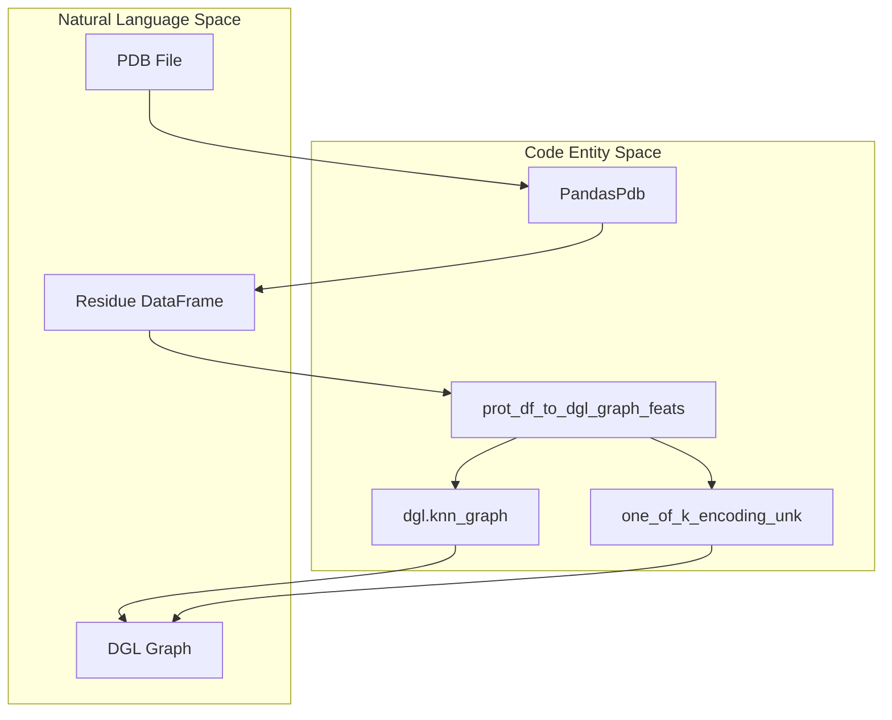
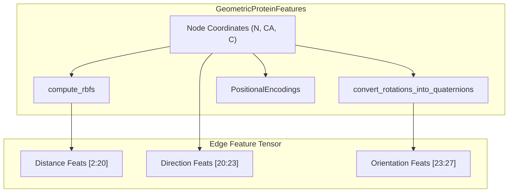

# Graph Construction and Geometric Features

> **Relevant source files**
> * [project/utils/deepinteract_constants.py](https://github.com/BioinfoMachineLearning/DeepInteract/blob/c78d2054/project/utils/deepinteract_constants.py)
> * [project/utils/deepinteract_utils.py](https://github.com/BioinfoMachineLearning/DeepInteract/blob/c78d2054/project/utils/deepinteract_utils.py)
> * [project/utils/graph_utils.py](https://github.com/BioinfoMachineLearning/DeepInteract/blob/c78d2054/project/utils/graph_utils.py)
> * [project/utils/protein_feature_utils.py](https://github.com/BioinfoMachineLearning/DeepInteract/blob/c78d2054/project/utils/protein_feature_utils.py)

DeepInteract transforms raw protein structural data into a graph-based representation suitable for Geometric Transformers. This process involves converting residue-level DataFrames into `DGLGraph` objects, constructing edges via K-Nearest Neighbors (KNN), and featurizing nodes and edges with a combination of structural, evolutionary, and geometric descriptors.

## Graph Construction Pipeline

The transformation from a `pandas.DataFrame` (containing residue coordinates and features) to a `dgl.DGLGraph` is primarily handled by the `prot_df_to_dgl_graph_feats` function [project/utils/graph_utils.py L69-L110](https://github.com/BioinfoMachineLearning/DeepInteract/blob/c78d2054/project/utils/graph_utils.py#L69-L110)

### KNN Edge Construction

Edges are constructed based on spatial proximity. For each residue (node), the $K$ nearest neighbors are identified using Euclidean distance between $C\alpha$ coordinates.

* **Default K**: The system defaults to `KNN = 20` [project/utils/deepinteract_constants.py L13](https://github.com/BioinfoMachineLearning/DeepInteract/blob/c78d2054/project/utils/deepinteract_constants.py#L13-L13)
* **Implementation**: The `dgl.knn_graph` function is used to generate the adjacency structure [project/utils/graph_utils.py L107](https://github.com/BioinfoMachineLearning/DeepInteract/blob/c78d2054/project/utils/graph_utils.py#L107-L107)
* **Distance Calculation**: Pairwise squared distances are computed and the top $K$ smallest values are retained [project/utils/graph_utils.py L108](https://github.com/BioinfoMachineLearning/DeepInteract/blob/c78d2054/project/utils/graph_utils.py#L108-L108)

### Entity Mapping: Data to Graph

The following diagram illustrates how the preprocessing utilities map biological data structures to the code entities responsible for graph generation.

**Protein Graph Assembly Flow**

Sources: [project/utils/graph_utils.py L69-L110](https://github.com/BioinfoMachineLearning/DeepInteract/blob/c78d2054/project/utils/graph_utils.py#L69-L110)

 [project/utils/deepinteract_utils.py L34](https://github.com/BioinfoMachineLearning/DeepInteract/blob/c78d2054/project/utils/deepinteract_utils.py#L34-L34)

---

## Node Featurization

Node features are a concatenation of evolutionary profiles, structural properties (DIPS-Plus), and geometric encodings.

### DIPS-Plus and Evolutionary Features

The system extracts 113 scalar features per node [project/utils/deepinteract_constants.py L105](https://github.com/BioinfoMachineLearning/DeepInteract/blob/c78d2054/project/utils/deepinteract_constants.py#L105-L105)

:

1. **Residue Identity**: One-hot encoding of the 20 standard amino acids [project/utils/deepinteract_constants.py L80-L81](https://github.com/BioinfoMachineLearning/DeepInteract/blob/c78d2054/project/utils/deepinteract_constants.py#L80-L81)
2. **Secondary Structure**: DSSP-derived states (H, B, E, G, I, T, S, -) [project/utils/deepinteract_constants.py L82](https://github.com/BioinfoMachineLearning/DeepInteract/blob/c78d2054/project/utils/deepinteract_constants.py#L82-L82)
3. **Solvent Accessibility**: Relative Solvent Accessibility (RSA) [project/utils/deepinteract_constants.py L67](https://github.com/BioinfoMachineLearning/DeepInteract/blob/c78d2054/project/utils/deepinteract_constants.py#L67-L67)
4. **Residue Depth**: MSMS-derived depth values [project/utils/deepinteract_constants.py L68](https://github.com/BioinfoMachineLearning/DeepInteract/blob/c78d2054/project/utils/deepinteract_constants.py#L68-L68)
5. **PSAIA Features**: Six protrusion indices (avg_cx, max_cx, etc.) [project/utils/deepinteract_constants.py L36](https://github.com/BioinfoMachineLearning/DeepInteract/blob/c78d2054/project/utils/deepinteract_constants.py#L36-L36)
6. **HSAAC**: 42-dimensional Half-Sphere Amino Acid Composition [project/utils/deepinteract_constants.py L43](https://github.com/BioinfoMachineLearning/DeepInteract/blob/c78d2054/project/utils/deepinteract_constants.py#L43-L43)
7. **Sequence Features**: 27-dimensional evolutionary profiles (HH-suite) [project/utils/deepinteract_constants.py L74](https://github.com/BioinfoMachineLearning/DeepInteract/blob/c78d2054/project/utils/deepinteract_constants.py#L74-L74)

### Geometric Node Features

Calculated via `GeometricProteinFeatures` [project/utils/protein_feature_utils.py L63](https://github.com/BioinfoMachineLearning/DeepInteract/blob/c78d2054/project/utils/protein_feature_utils.py#L63-L63)

 these include:

* **Dihedral Angles**: Sine and cosine of $\phi, \psi, \omega$ angles, providing local backbone conformation [project/utils/protein_feature_utils.py L227-L230](https://github.com/BioinfoMachineLearning/DeepInteract/blob/c78d2054/project/utils/protein_feature_utils.py#L227-L230)
* **Positional Encodings**: Sinusoidal encodings of the residue's sequence index to preserve linear order [project/utils/protein_feature_utils.py L30-L60](https://github.com/BioinfoMachineLearning/DeepInteract/blob/c78d2054/project/utils/protein_feature_utils.py#L30-L60)

Sources: [project/utils/deepinteract_constants.py L64-L77](https://github.com/BioinfoMachineLearning/DeepInteract/blob/c78d2054/project/utils/deepinteract_constants.py#L64-L77)

 [project/utils/protein_feature_utils.py L63-L235](https://github.com/BioinfoMachineLearning/DeepInteract/blob/c78d2054/project/utils/protein_feature_utils.py#L63-L235)

---

## Edge Featurization

Edges represent the spatial and orientational relationship between residues $i$ and $j$. The `GeometricProteinFeatures.forward` method generates a high-dimensional edge feature tensor [project/utils/protein_feature_utils.py L202-L248](https://github.com/BioinfoMachineLearning/DeepInteract/blob/c78d2054/project/utils/protein_feature_utils.py#L202-L248)

### Distance and Direction Features

* **RBF Distances**: Pairwise distances are expanded using 16 Radial Basis Functions (RBF) to provide a smooth representation of distance [project/utils/protein_feature_utils.py L82-L101](https://github.com/BioinfoMachineLearning/DeepInteract/blob/c78d2054/project/utils/protein_feature_utils.py#L82-L101)
* **Direction Vectors**: Unit vectors $\vec{u}_{ij}$ pointing from node $i$ to node $j$ in the local coordinate frame of $i$ [project/utils/protein_feature_utils.py L240](https://github.com/BioinfoMachineLearning/DeepInteract/blob/c78d2054/project/utils/protein_feature_utils.py#L240-L240)

### Orientation Features

* **Quaternions**: The rotation matrix required to align the local frame of residue $i$ with residue $j$ is converted into a 4-dimensional quaternion [project/utils/protein_feature_utils.py L104-L149](https://github.com/BioinfoMachineLearning/DeepInteract/blob/c78d2054/project/utils/protein_feature_utils.py#L104-L149)
* **Amide Plane Angles**: Angles between the amide planes of interacting residues, capturing specific backbone-backbone orientations [project/utils/deepinteract_constants.py L115](https://github.com/BioinfoMachineLearning/DeepInteract/blob/c78d2054/project/utils/deepinteract_constants.py#L115-L115)

### Feature Indexing

Edge features are packed into a single tensor. The `FEATURE_INDICES` dictionary defines the layout for retrieval during the forward pass [project/utils/deepinteract_constants.py L99-L116](https://github.com/BioinfoMachineLearning/DeepInteract/blob/c78d2054/project/utils/deepinteract_constants.py#L99-L116)

:

| Feature Category | Start Index | End Index |
| --- | --- | --- |
| Distance (RBF) | 2 | 20 |
| Direction Vectors | 20 | 23 |
| Quaternions | 23 | 27 |
| Amide Angles | 27 | - |

**Geometric Feature Extraction Logic**

Sources: [project/utils/protein_feature_utils.py L63-L248](https://github.com/BioinfoMachineLearning/DeepInteract/blob/c78d2054/project/utils/protein_feature_utils.py#L63-L248)

 [project/utils/deepinteract_constants.py L99-L116](https://github.com/BioinfoMachineLearning/DeepInteract/blob/c78d2054/project/utils/deepinteract_constants.py#L99-L116)

---

## Edge-Neighborhood Indexing

To support efficient message passing in the Geometric Transformer, the system uses `gather_nodes` and `gather_edges` to index features according to the KNN adjacency matrix [project/utils/protein_feature_utils.py L10-L27](https://github.com/BioinfoMachineLearning/DeepInteract/blob/c78d2054/project/utils/protein_feature_utils.py#L10-L27)

1. **Node Gathering**: Collects neighbor node features into a tensor of shape `[Batch, Nodes, K, Feats]` [project/utils/protein_feature_utils.py L12](https://github.com/BioinfoMachineLearning/DeepInteract/blob/c78d2054/project/utils/protein_feature_utils.py#L12-L12)
2. **Edge Gathering**: Collects edge-specific features (like distances) into the same `[Batch, Nodes, K, Feats]` neighborhood format [project/utils/protein_feature_utils.py L24](https://github.com/BioinfoMachineLearning/DeepInteract/blob/c78d2054/project/utils/protein_feature_utils.py#L24-L24)

This indexing ensures that for every residue, the model can attend to its $K$ nearest neighbors using both their intrinsic properties and their relative geometric orientation.

Sources: [project/utils/protein_feature_utils.py L10-L29](https://github.com/BioinfoMachineLearning/DeepInteract/blob/c78d2054/project/utils/protein_feature_utils.py#L10-L29)

 [project/utils/deepinteract_utils.py L70-L76](https://github.com/BioinfoMachineLearning/DeepInteract/blob/c78d2054/project/utils/deepinteract_utils.py#L70-L76)