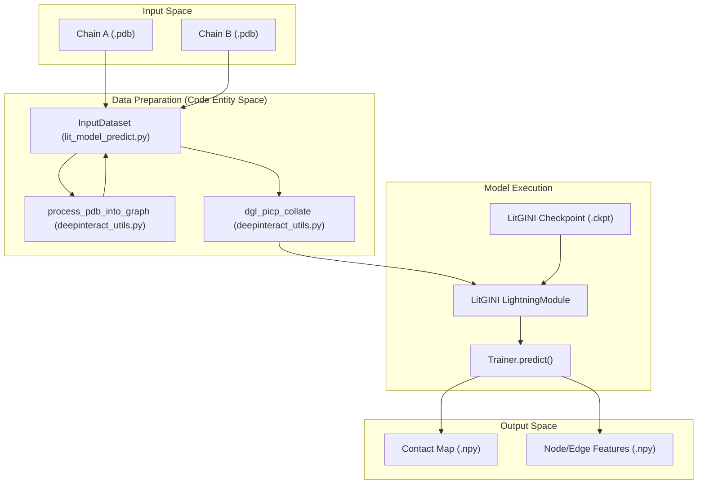
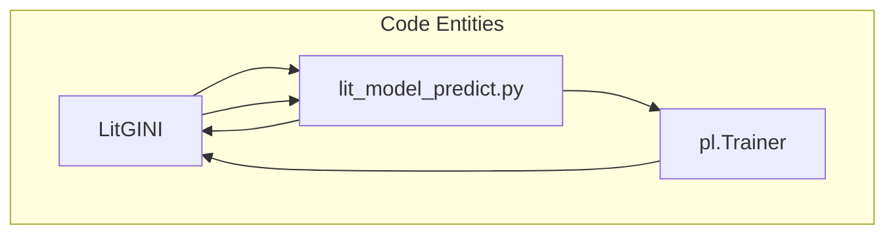

# Inference and Prediction

> **Relevant source files**
> * [project/lit_model_predict.py](https://github.com/BioinfoMachineLearning/DeepInteract/blob/c78d2054/project/lit_model_predict.py)
> * [project/lit_model_predict_docker.py](https://github.com/BioinfoMachineLearning/DeepInteract/blob/c78d2054/project/lit_model_predict_docker.py)

This section describes the workflow for generating protein-protein interaction predictions using DeepInteract. The system is designed to take raw PDB files of two protein chains and output a probabilistic contact map indicating the likelihood of interaction between residue pairs.

DeepInteract supports two primary modes of inference:

1. **Standard Inference**: Running the prediction script directly in a configured Python environment.
2. **Docker Inference**: Running predictions within a containerized environment to ensure dependency isolation (e.g., PSAIA and HH-suite).

### Prediction Pipeline Overview

The inference process follows a structured sequence: input preparation via the `InputDataset` class, model initialization from a trained checkpoint, and execution via the PyTorch Lightning `Trainer`.

The following diagram illustrates the flow from raw PDB files to the final output artifacts:

**DeepInteract Inference Flow**

**Sources:** [project/lit_model_predict.py L22-L145](https://github.com/BioinfoMachineLearning/DeepInteract/blob/c78d2054/project/lit_model_predict.py#L22-L145)

 [project/lit_model_predict.py L147-L210](https://github.com/BioinfoMachineLearning/DeepInteract/blob/c78d2054/project/lit_model_predict.py#L147-L210)

---

### The InputDataset Class

The `InputDataset` class is a specialized `DGLDataset` designed for "on-the-fly" inference. Unlike training datasets that load preprocessed files, `InputDataset` triggers the full feature engineering pipeline (PSAIA, HH-suite, DSSP) when its `process()` method is called.

| Component | Responsibility | Code Reference |
| --- | --- | --- |
| `process()` | Invokes `process_pdb_into_graph` to transform raw PDBs into DGL graphs. | [project/lit_model_predict.py L90-L107](https://github.com/BioinfoMachineLearning/DeepInteract/blob/c78d2054/project/lit_model_predict.py#L90-L107) |
| `__getitem__` | Returns a dictionary containing `graph1` (Chain A) and `graph2` (Chain B). | [project/lit_model_predict.py L113-L115](https://github.com/BioinfoMachineLearning/DeepInteract/blob/c78d2054/project/lit_model_predict.py#L113-L115) |
| Feature Counts | Defines `num_node_features` (113) and `num_edge_features` (27). | [project/lit_model_predict.py L132-L140](https://github.com/BioinfoMachineLearning/DeepInteract/blob/c78d2054/project/lit_model_predict.py#L132-L140) |

**Sources:** [project/lit_model_predict.py L22-L145](https://github.com/BioinfoMachineLearning/DeepInteract/blob/c78d2054/project/lit_model_predict.py#L22-L145)

---

### Checkpoint Loading and Execution

Inference requires a trained `LitGINI` model checkpoint. The system uses the PyTorch Lightning `Trainer` to manage the prediction lifecycle, including GPU/CPU dispatching.

**Inference Execution Logic**

* **Checkpoint Loading**: The model is restored using `LitGINI.load_from_checkpoint(args.ckpt_path, ...)` [project/lit_model_predict.py L194-L205](https://github.com/BioinfoMachineLearning/DeepInteract/blob/c78d2054/project/lit_model_predict.py#L194-L205)
* **Post-processing**: The raw logits produced by the model are passed through a Softmax layer to generate probabilities between 0 and 1 [project/lit_model_predict.py L217-L219](https://github.com/BioinfoMachineLearning/DeepInteract/blob/c78d2054/project/lit_model_predict.py#L217-L219)
* **Artifacts**: The pipeline saves the contact probability map as a `.npy` file, along with node and edge feature tensors for downstream analysis [project/lit_model_predict.py L222-L228](https://github.com/BioinfoMachineLearning/DeepInteract/blob/c78d2054/project/lit_model_predict.py#L222-L228)

**Sources:** [project/lit_model_predict.py L169-L230](https://github.com/BioinfoMachineLearning/DeepInteract/blob/c78d2054/project/lit_model_predict.py#L169-L230)

---

### Standard vs. Docker Inference

While both modes share the same core `InputDataset` and `LitGINI` logic, they differ in how they handle environment dependencies and CLI arguments.

#### Standard Inference

Used when the host machine already has all external bioinformatics tools (PSAIA, HH-suite) installed and configured in the PATH.
For details, see [Standard Inference (lit_model_predict.py)](/BioinfoMachineLearning/DeepInteract/5.1-standard-inference-(lit_model_predict.py)).

#### Docker Inference

The preferred method for deployment. It uses `absl-py` flags and assumes a specific directory structure within the container (e.g., `/mnt/checkpoints`). It abstracts away the complexity of tool installation.
For details, see [Docker Inference (lit_model_predict_docker.py)](/BioinfoMachineLearning/DeepInteract/5.2-docker-inference-(lit_model_predict_docker.py)).

**Sources:** [project/lit_model_predict.py L147-L160](https://github.com/BioinfoMachineLearning/DeepInteract/blob/c78d2054/project/lit_model_predict.py#L147-L160)

 [project/lit_model_predict_docker.py L17-L30](https://github.com/BioinfoMachineLearning/DeepInteract/blob/c78d2054/project/lit_model_predict_docker.py#L17-L30)