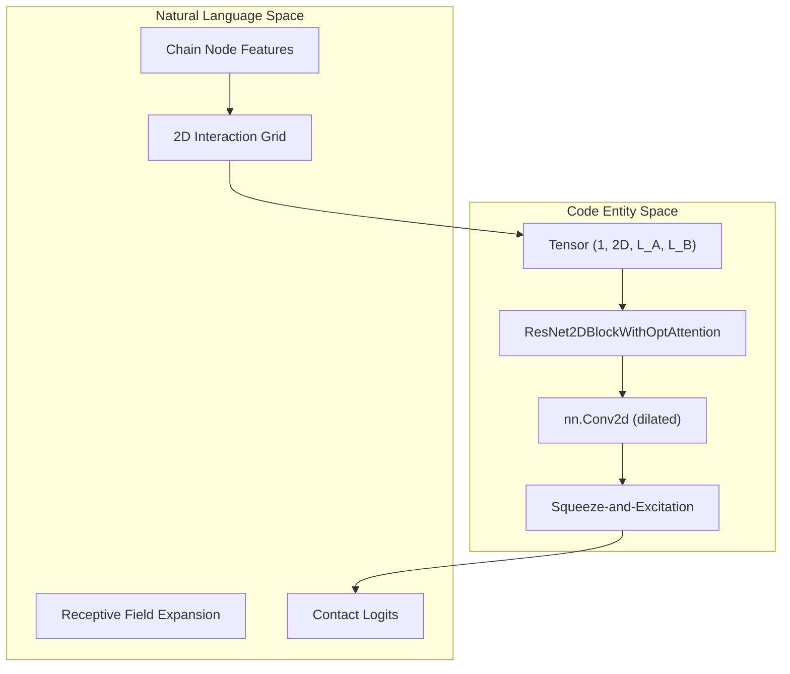

# Interaction Prediction Module (ResNet2D and DeepLabV3+)

> **Relevant source files**
> * [project/utils/deepinteract_modules.py](https://github.com/BioinfoMachineLearning/DeepInteract/blob/c78d2054/project/utils/deepinteract_modules.py)
> * [project/utils/vision_modules.py](https://github.com/BioinfoMachineLearning/DeepInteract/blob/c78d2054/project/utils/vision_modules.py)

The Interaction Prediction Module is the final stage of the DeepInteract architecture. It transforms refined 1D node embeddings from the Geometric Transformer into a 2D interaction map, predicting the probability of contact between residue pairs across two protein chains. The module supports two primary architectures: a custom **ResNet2D** with Squeeze-and-Excitation blocks and a **DeepLabV3+** semantic segmentation head.

### Interaction Tensor Construction

Before 2D prediction, node features from Chain A and Chain B are combined into a 2D grid. The function `construct_interact_tensor` [project/utils/deepinteract_utils.py L1125](https://github.com/BioinfoMachineLearning/DeepInteract/blob/c78d2054/project/utils/deepinteract_utils.py#L1125-L1125)

 interleaves the features such that for every pair of residues $(i, j)$, the tensor contains the concatenated features of residue $i$ from Chain A and residue $j$ from Chain B.

* **Input**: Node feature tensors for Chain A ($L_A \times D$) and Chain B ($L_B \times D$).
* **Output**: A 4D tensor of shape $(1, 2D, L_A, L_B)$.
* **Logic**: It uses `torch.repeat` and `torch.permute` to create a meshgrid of features [project/utils/deepinteract_utils.py L1125](https://github.com/BioinfoMachineLearning/DeepInteract/blob/c78d2054/project/utils/deepinteract_utils.py#L1125-L1125)

**Sources:** [project/utils/deepinteract_utils.py L1125](https://github.com/BioinfoMachineLearning/DeepInteract/blob/c78d2054/project/utils/deepinteract_utils.py#L1125-L1125)

---

### ResNet2D with Optional Attention

The default prediction head is `ResNet2DInputWithOptAttention` [project/utils/deepinteract_modules.py L1005-L1087](https://github.com/BioinfoMachineLearning/DeepInteract/blob/c78d2054/project/utils/deepinteract_modules.py#L1005-L1087)

 This module processes the interaction tensor using a series of dilated convolutions to capture long-range spatial dependencies in the contact map.

#### Architecture Components

1. **Initial Projection**: A $1 \times 1$ convolution reduces the concatenated feature dimension to the hidden channel size [project/utils/deepinteract_modules.py L1041](https://github.com/BioinfoMachineLearning/DeepInteract/blob/c78d2054/project/utils/deepinteract_modules.py#L1041-L1041)
2. **Dilated ResNet Blocks**: A sequence of `ResNet2DBlockWithOptAttention` layers. Each block consists of: * **Dilated Convolutions**: $3 \times 3$ convolutions with increasing dilation rates (1, 2, 4, 8, etc.) to expand the receptive field without losing resolution [project/utils/deepinteract_modules.py L943-L946](https://github.com/BioinfoMachineLearning/DeepInteract/blob/c78d2054/project/utils/deepinteract_modules.py#L943-L946) * **Squeeze-and-Excitation (SE)**: An optional `SELayer2D` that performs global average pooling followed by two linear layers to recalibrate channel-wise feature responses [project/utils/deepinteract_modules.py L902-L922](https://github.com/BioinfoMachineLearning/DeepInteract/blob/c78d2054/project/utils/deepinteract_modules.py#L902-L922)
3. **Classification Head**: A final $1 \times 1$ convolution that produces 2-channel logits (representing "no-contact" and "contact") [project/utils/deepinteract_modules.py L1062](https://github.com/BioinfoMachineLearning/DeepInteract/blob/c78d2054/project/utils/deepinteract_modules.py#L1062-L1062)

#### System Mapping: ResNet2D Pipeline

**Sources:** [project/utils/deepinteract_modules.py L902-L922](https://github.com/BioinfoMachineLearning/DeepInteract/blob/c78d2054/project/utils/deepinteract_modules.py#L902-L922)

 [project/utils/deepinteract_modules.py L943-L982](https://github.com/BioinfoMachineLearning/DeepInteract/blob/c78d2054/project/utils/deepinteract_modules.py#L943-L982)

 [project/utils/deepinteract_modules.py L1005-L1087](https://github.com/BioinfoMachineLearning/DeepInteract/blob/c78d2054/project/utils/deepinteract_modules.py#L1005-L1087)

---

### DeepLabV3Plus Alternative

DeepInteract also implements a `DeepLabV3Plus` head [project/utils/vision_modules.py L279-L341](https://github.com/BioinfoMachineLearning/DeepInteract/blob/c78d2054/project/utils/vision_modules.py#L279-L341)

 adapted from semantic segmentation tasks. This model uses an Atrous Spatial Pyramid Pooling (ASPP) module to capture multi-scale context.

* **Encoder**: Typically a `ResNetEncoder` [project/utils/vision_modules.py L120-L154](https://github.com/BioinfoMachineLearning/DeepInteract/blob/c78d2054/project/utils/vision_modules.py#L120-L154)  that extracts hierarchical features.
* **ASPP Module**: Applies multiple parallel dilated convolutions with different rates to the encoder output [project/utils/vision_modules.py L236-L276](https://github.com/BioinfoMachineLearning/DeepInteract/blob/c78d2054/project/utils/vision_modules.py#L236-L276)
* **Decoder**: Fuses low-level features from the encoder with high-level ASPP features to produce a high-resolution contact map [project/utils/vision_modules.py L307-L331](https://github.com/BioinfoMachineLearning/DeepInteract/blob/c78d2054/project/utils/vision_modules.py#L307-L331)

**Sources:** [project/utils/vision_modules.py L236-L341](https://github.com/BioinfoMachineLearning/DeepInteract/blob/c78d2054/project/utils/vision_modules.py#L236-L341)

---

### Handling Large Complexes (Subsequencing)

To prevent GPU memory overflow on large protein complexes, DeepInteract employs a tiling strategy via `construct_subsequenced_interact_tensors` [project/utils/deepinteract_utils.py L1125](https://github.com/BioinfoMachineLearning/DeepInteract/blob/c78d2054/project/utils/deepinteract_utils.py#L1125-L1125)

1. **Tiling**: The full interaction matrix ($L_A \times L_B$) is divided into smaller tiles of size `max_len x max_len` (default 512).
2. **Padding**: Each tile is zero-padded if the chain length is shorter than `max_len` [project/utils/deepinteract_utils.py L1125](https://github.com/BioinfoMachineLearning/DeepInteract/blob/c78d2054/project/utils/deepinteract_utils.py#L1125-L1125)
3. **Inference**: Each tile is passed through the 2D head independently.
4. **Reconstruction**: The function `insert_interact_tensor_logits` [project/utils/deepinteract_utils.py L1125](https://github.com/BioinfoMachineLearning/DeepInteract/blob/c78d2054/project/utils/deepinteract_utils.py#L1125-L1125)  stitches the predicted logits back into the original $L_A \times L_B$ matrix, carefully removing the padding used during subsequencing [project/utils/deepinteract_utils.py L1125](https://github.com/BioinfoMachineLearning/DeepInteract/blob/c78d2054/project/utils/deepinteract_utils.py#L1125-L1125)

#### Subsequencing Data Flow

**Sources:** [project/utils/deepinteract_utils.py L1125](https://github.com/BioinfoMachineLearning/DeepInteract/blob/c78d2054/project/utils/deepinteract_utils.py#L1125-L1125)

 [project/utils/deepinteract_constants.py L23-L25](https://github.com/BioinfoMachineLearning/DeepInteract/blob/c78d2054/project/utils/deepinteract_constants.py#L23-L25)

---

### Key Implementation Details

| Component | Class/Function | Purpose |
| --- | --- | --- |
| **2D Grid Construction** | `construct_interact_tensor` | Combines 1D chain features into 2D pair features. |
| **Dilated Block** | `ResNet2DBlockWithOptAttention` | Core residual unit with dilated convolution and SE gating. |
| **Channel Attention** | `SELayer2D` | Computes global context to weight feature channels. |
| **Segmentation Head** | `DeepLabV3Plus` | Alternative multi-scale prediction head. |
| **Memory Management** | `construct_subsequenced_interact_tensors` | Tiling logic for large protein sequences. |

**Sources:** [project/utils/deepinteract_modules.py L902-L1087](https://github.com/BioinfoMachineLearning/DeepInteract/blob/c78d2054/project/utils/deepinteract_modules.py#L902-L1087)

 [project/utils/deepinteract_utils.py L1125](https://github.com/BioinfoMachineLearning/DeepInteract/blob/c78d2054/project/utils/deepinteract_utils.py#L1125-L1125)

 [project/utils/vision_modules.py L279-L341](https://github.com/BioinfoMachineLearning/DeepInteract/blob/c78d2054/project/utils/vision_modules.py#L279-L341)