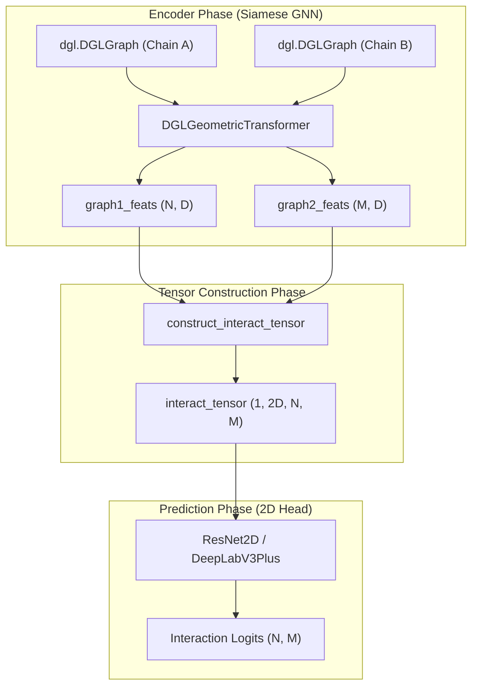
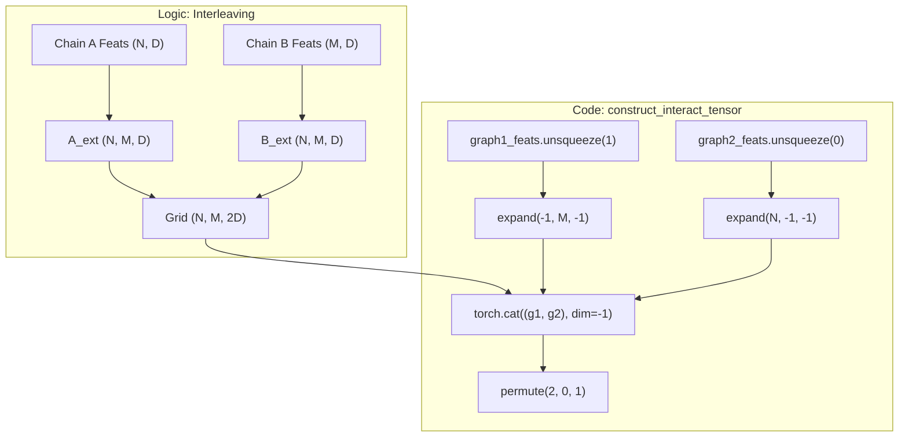

# Interaction Tensor Construction

> **Relevant source files**
> * [project/utils/deepinteract_modules.py](https://github.com/BioinfoMachineLearning/DeepInteract/blob/c78d2054/project/utils/deepinteract_modules.py)
> * [project/utils/deepinteract_utils.py](https://github.com/BioinfoMachineLearning/DeepInteract/blob/c78d2054/project/utils/deepinteract_utils.py)

The interaction tensor construction is a pivotal step in the DeepInteract architecture that bridges 1D graph-based node representations and 2D vision-based interaction prediction. This process transforms independent residue features from two protein chains into a spatial grid representation that explicitly models all potential pairwise residue interactions.

## Overview of construct_interact_tensor

The core function `construct_interact_tensor` [project/utils/deepinteract_utils.py L151-L177](https://github.com/BioinfoMachineLearning/DeepInteract/blob/c78d2054/project/utils/deepinteract_utils.py#L151-L177)

 is responsible for generating a 2D grid from two sets of node features. This grid serves as the input to the `ResNet2D` or `DeepLabV3Plus` prediction heads [project/utils/deepinteract_modules.py L24](https://github.com/BioinfoMachineLearning/DeepInteract/blob/c78d2054/project/utils/deepinteract_modules.py#L24-L24)

### Interleaving Logic

The construction follows an interleaving pattern where features from Chain A and Chain B are broadcasted across two dimensions:

1. **Chain A Expansion**: Features for Chain A (length $N$) are repeated along the columns.
2. **Chain B Expansion**: Features for Chain B (length $M$) are repeated along the rows.
3. **Concatenation**: The two expanded tensors are concatenated along the feature dimension, resulting in a tensor where each cell $(i, j)$ contains the combined feature vectors of residue $i$ from Chain A and residue $j$ from Chain B [project/utils/deepinteract_utils.py L160-L165](https://github.com/BioinfoMachineLearning/DeepInteract/blob/c78d2054/project/utils/deepinteract_utils.py#L160-L165)

### Tensor Shape Conventions

The resulting interaction tensor follows the shape:
`[Batch, Channels, Height, Width]`

* **Batch**: Typically 1 during inference or a small number during training.
* **Channels**: $2 \times \text{node_feature_dimension}$.
* **Height (H)**: Number of residues in Chain A ($N$).
* **Width (W)**: Number of residues in Chain B ($M$).

| Entity | Code Identifier | Description |
| --- | --- | --- |
| **Chain A Features** | `graph1_feats` | Node embeddings from the Siamese GNN for the first protein. |
| **Chain B Features** | `graph2_feats` | Node embeddings from the Siamese GNN for the second protein. |
| **Interaction Tensor** | `interact_tensor` | The interleaved grid representation. |
| **Padding** | `pad=True` | Logic to ensure tensors meet `max_len` requirements. |

**Sources:**

* [project/utils/deepinteract_utils.py L151-L177](https://github.com/BioinfoMachineLearning/DeepInteract/blob/c78d2054/project/utils/deepinteract_utils.py#L151-L177)
* [project/utils/deepinteract_modules.py L20-L22](https://github.com/BioinfoMachineLearning/DeepInteract/blob/c78d2054/project/utils/deepinteract_modules.py#L20-L22)

---

## Data Flow: From Graphs to Interaction Grid

The following diagram illustrates how the `LitGINI` module orchestrates the movement of data from the DGL graph encoders into the interaction tensor.

### System Data Flow Diagram

**Sources:**

* [project/utils/deepinteract_utils.py L151-L177](https://github.com/BioinfoMachineLearning/DeepInteract/blob/c78d2054/project/utils/deepinteract_utils.py#L151-L177)
* [project/utils/deepinteract_modules.py L900-L950](https://github.com/BioinfoMachineLearning/DeepInteract/blob/c78d2054/project/utils/deepinteract_modules.py#L900-L950)  (General LitGINI flow)

---

## Implementation Details

### Padding and Max Length

The function supports a `pad` argument and a `max_len` parameter (defaulting to 256) [project/utils/deepinteract_utils.py L151](https://github.com/BioinfoMachineLearning/DeepInteract/blob/c78d2054/project/utils/deepinteract_utils.py#L151-L151)

 This is critical for batching during training, ensuring that all interaction tensors in a batch have uniform dimensions. If `pad=True`, the tensor is zero-padded to `[max_len, max_len]` using `torch.nn.functional.pad` [project/utils/deepinteract_utils.py L171-L174](https://github.com/BioinfoMachineLearning/DeepInteract/blob/c78d2054/project/utils/deepinteract_utils.py#L171-L174)

### Subsequencing Support

For large protein complexes that exceed GPU memory limits, the system utilizes `construct_subsequenced_interact_tensors` [project/utils/deepinteract_utils.py L115-L148](https://github.com/BioinfoMachineLearning/DeepInteract/blob/c78d2054/project/utils/deepinteract_utils.py#L115-L148)

1. It divides `graph1_feats` and `graph2_feats` into chunks of size `max_len` [project/utils/deepinteract_utils.py L124-L136](https://github.com/BioinfoMachineLearning/DeepInteract/blob/c78d2054/project/utils/deepinteract_utils.py#L124-L136)
2. It creates a Cartesian product of these chunks using `itertools.product` [project/utils/deepinteract_utils.py L138](https://github.com/BioinfoMachineLearning/DeepInteract/blob/c78d2054/project/utils/deepinteract_utils.py#L138-L138)
3. Each pair of chunks is passed to `construct_interact_tensor` to create a "tile" of the global interaction map [project/utils/deepinteract_utils.py L141-L144](https://github.com/BioinfoMachineLearning/DeepInteract/blob/c78d2054/project/utils/deepinteract_utils.py#L141-L144)

### Code-to-Logic Mapping

**Sources:**

* [project/utils/deepinteract_utils.py L160-L167](https://github.com/BioinfoMachineLearning/DeepInteract/blob/c78d2054/project/utils/deepinteract_utils.py#L160-L167)

---

## Integration with the Prediction Head

Once constructed, the interaction tensor is passed to the `ResNet2DInputWithOptAttention` or `DeepLabV3Plus` module.

1. **Input Permutation**: The tensor is permuted to `(Batch, Channels, N, M)` to comply with standard PyTorch 2D convolution expectations [project/utils/deepinteract_utils.py L167](https://github.com/BioinfoMachineLearning/DeepInteract/blob/c78d2054/project/utils/deepinteract_utils.py#L167-L167)
2. **Dilated Convolutions**: The prediction head applies dilated convolutions to capture long-range spatial dependencies across the residue grid.
3. **Logit Extraction**: The final layer outputs a single-channel logit map of shape `(N, M)`, representing the raw scores for residue-residue contacts.

If subsequencing was used, these partial logit maps are stitched back together using `insert_interact_tensor_logits` [project/utils/deepinteract_utils.py L179-L197](https://github.com/BioinfoMachineLearning/DeepInteract/blob/c78d2054/project/utils/deepinteract_utils.py#L179-L197)

 which places each tile into its correct coordinate in the full-sized complex matrix.

**Sources:**

* [project/utils/deepinteract_utils.py L179-L197](https://github.com/BioinfoMachineLearning/DeepInteract/blob/c78d2054/project/utils/deepinteract_utils.py#L179-L197)
* [project/utils/deepinteract_modules.py L24](https://github.com/BioinfoMachineLearning/DeepInteract/blob/c78d2054/project/utils/deepinteract_modules.py#L24-L24)