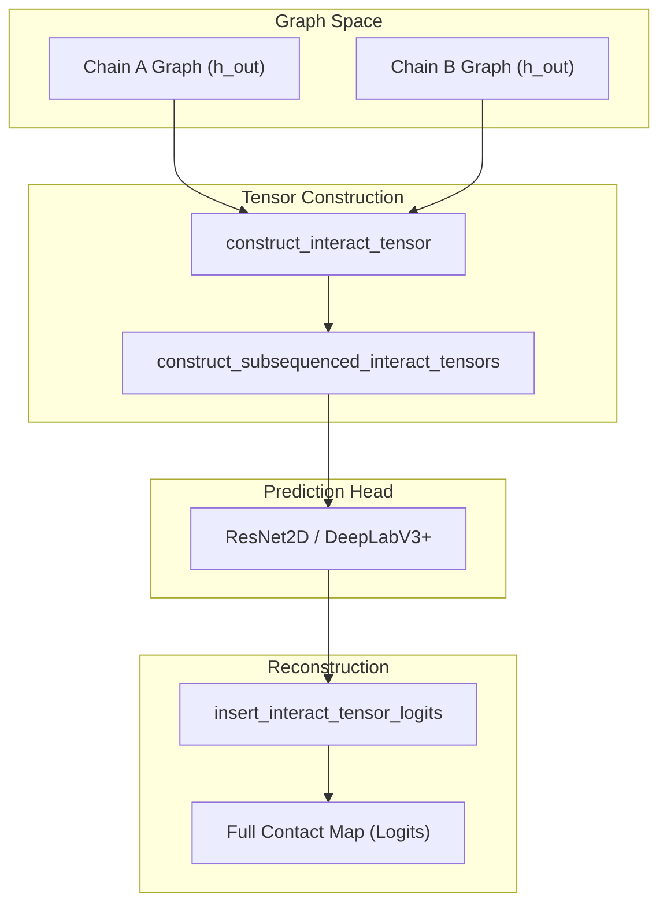
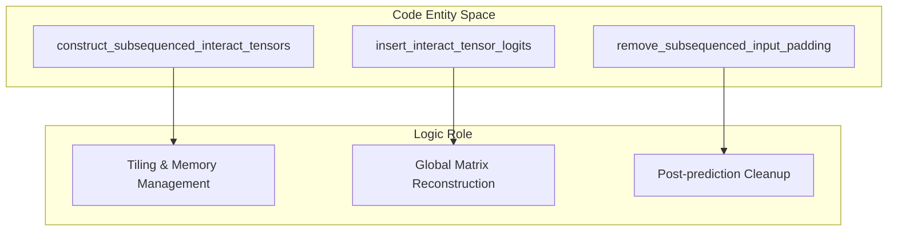

# Interaction Tensor and Subsequencing

> **Relevant source files**
> * [project/utils/deepinteract_modules.py](https://github.com/BioinfoMachineLearning/DeepInteract/blob/c78d2054/project/utils/deepinteract_modules.py)
> * [project/utils/deepinteract_utils.py](https://github.com/BioinfoMachineLearning/DeepInteract/blob/c78d2054/project/utils/deepinteract_utils.py)

DeepInteract predicts protein-protein interactions by transforming 3D structural information into a 2D grid representation known as the **Interaction Tensor**. This page provides a high-level overview of how node features from separate protein chains are combined, how memory constraints for large complexes are managed via **Subsequencing**, and how final predictions are reconstructed.

For low-level implementation details, see the child pages:

* [Interaction Tensor Construction](/BioinfoMachineLearning/DeepInteract/6.1-interaction-tensor-construction)
* [Subsequencing for Large Complexes](/BioinfoMachineLearning/DeepInteract/6.2-subsequencing-for-large-complexes)

## Overview of the Interaction Pipeline

The transition from 3D graphs to 2D contact maps involves three primary stages. First, the GNN and Geometric Transformer extract refined node representations for Chain A and Chain B. Second, these representations are combined into a pairwise tensor. Finally, because the memory requirements for this tensor scale quadratically ($O(N \times M)$), large complexes are tiled into smaller subsequences for processing.

### System Workflow Diagram

The following diagram illustrates the flow from graph features to the final reconstructed contact map, highlighting the key functions involved in the transformation.

**Interaction Transformation Workflow**

**Sources:** [project/utils/deepinteract_utils.py L115-L148](https://github.com/BioinfoMachineLearning/DeepInteract/blob/c78d2054/project/utils/deepinteract_utils.py#L115-L148)

 [project/utils/deepinteract_utils.py L151-L178](https://github.com/BioinfoMachineLearning/DeepInteract/blob/c78d2054/project/utils/deepinteract_utils.py#L151-L178)

 [project/utils/deepinteract_utils.py L181-L205](https://github.com/BioinfoMachineLearning/DeepInteract/blob/c78d2054/project/utils/deepinteract_utils.py#L181-L205)

---

## Interaction Tensor Construction

The interaction tensor is a 2D grid that represents the pairwise relationship between all residues in Chain A and Chain B. The function `construct_interact_tensor` [project/utils/deepinteract_utils.py L151-L178](https://github.com/BioinfoMachineLearning/DeepInteract/blob/c78d2054/project/utils/deepinteract_utils.py#L151-L178)

 takes the node feature tensors from two graphs and performs a broadcasting operation to create a grid of shape $(L_1, L_2, 2 \times D)$, where $L$ represents sequence lengths and $D$ represents the hidden feature dimension.

Key characteristics include:

* **Feature Interleaving**: For every pair of residues $(i, j)$, the tensor stores the concatenated features of residue $i$ from Chain A and residue $j$ from Chain B.
* **Padding**: Tensors are optionally padded to a `max_len` (default 256) to ensure consistent input dimensions for the convolutional neural networks [project/utils/deepinteract_utils.py L151-L152](https://github.com/BioinfoMachineLearning/DeepInteract/blob/c78d2054/project/utils/deepinteract_utils.py#L151-L152)

For details, see [Interaction Tensor Construction](/BioinfoMachineLearning/DeepInteract/6.1-interaction-tensor-construction).

**Sources:** [project/utils/deepinteract_utils.py L151-L178](https://github.com/BioinfoMachineLearning/DeepInteract/blob/c78d2054/project/utils/deepinteract_utils.py#L151-L178)

---

## Subsequencing for Large Complexes

Protein complexes can vary significantly in size. To prevent GPU memory overflow, DeepInteract utilizes a tiling strategy implemented in `construct_subsequenced_interact_tensors` [project/utils/deepinteract_utils.py L115-L148](https://github.com/BioinfoMachineLearning/DeepInteract/blob/c78d2054/project/utils/deepinteract_utils.py#L115-L148)

### Tiling Logic

If a complex exceeds the `max_len` threshold, the system:

1. **Divides** the nodes of Chain A and Chain B into chunks of size `max_len`.
2. **Generates** a list of all pairwise combinations (Cartesian product) of these chunks [project/utils/deepinteract_utils.py L138-L139](https://github.com/BioinfoMachineLearning/DeepInteract/blob/c78d2054/project/utils/deepinteract_utils.py#L138-L139)
3. **Processes** each tile independently through the 2D prediction head.

### Logit Reconstruction

Once the tiles are processed, the function `insert_interact_tensor_logits` [project/utils/deepinteract_utils.py L181-L205](https://github.com/BioinfoMachineLearning/DeepInteract/blob/c78d2054/project/utils/deepinteract_utils.py#L181-L205)

 is responsible for stitching the resulting logits back into a single matrix representing the full interface. It uses an internal `iteration_state` to track which tile corresponds to which coordinates in the global contact map [project/utils/deepinteract_utils.py L182-L183](https://github.com/BioinfoMachineLearning/DeepInteract/blob/c78d2054/project/utils/deepinteract_utils.py#L182-L183)

**Entity Mapping: Subsequencing Logic**

**Sources:** [project/utils/deepinteract_utils.py L115-L148](https://github.com/BioinfoMachineLearning/DeepInteract/blob/c78d2054/project/utils/deepinteract_utils.py#L115-L148)

 [project/utils/deepinteract_utils.py L181-L205](https://github.com/BioinfoMachineLearning/DeepInteract/blob/c78d2054/project/utils/deepinteract_utils.py#L181-L205)

 [project/utils/deepinteract_utils.py L228-L245](https://github.com/BioinfoMachineLearning/DeepInteract/blob/c78d2054/project/utils/deepinteract_utils.py#L228-L245)

For details, see [Subsequencing for Large Complexes](/BioinfoMachineLearning/DeepInteract/6.2-subsequencing-for-large-complexes).

---

## Summary of Key Functions

| Function | Purpose | Location |
| --- | --- | --- |
| `construct_interact_tensor` | Combines node features from two chains into a 2D grid. | [project/utils/deepinteract_utils.py L151](https://github.com/BioinfoMachineLearning/DeepInteract/blob/c78d2054/project/utils/deepinteract_utils.py#L151-L151) |
| `construct_subsequenced_interact_tensors` | Tiles large tensors into `max_len` chunks for memory efficiency. | [project/utils/deepinteract_utils.py L115](https://github.com/BioinfoMachineLearning/DeepInteract/blob/c78d2054/project/utils/deepinteract_utils.py#L115-L115) |
| `insert_interact_tensor_logits` | Reconstructs the full interaction matrix from predicted tiles. | [project/utils/deepinteract_utils.py L181](https://github.com/BioinfoMachineLearning/DeepInteract/blob/c78d2054/project/utils/deepinteract_utils.py#L181-L181) |
| `remove_subsequenced_input_padding` | Truncates padded tensors back to original residue counts. | [project/utils/deepinteract_utils.py L228](https://github.com/BioinfoMachineLearning/DeepInteract/blob/c78d2054/project/utils/deepinteract_utils.py#L228-L228) |

**Sources:** [project/utils/deepinteract_utils.py L115-L245](https://github.com/BioinfoMachineLearning/DeepInteract/blob/c78d2054/project/utils/deepinteract_utils.py#L115-L245)