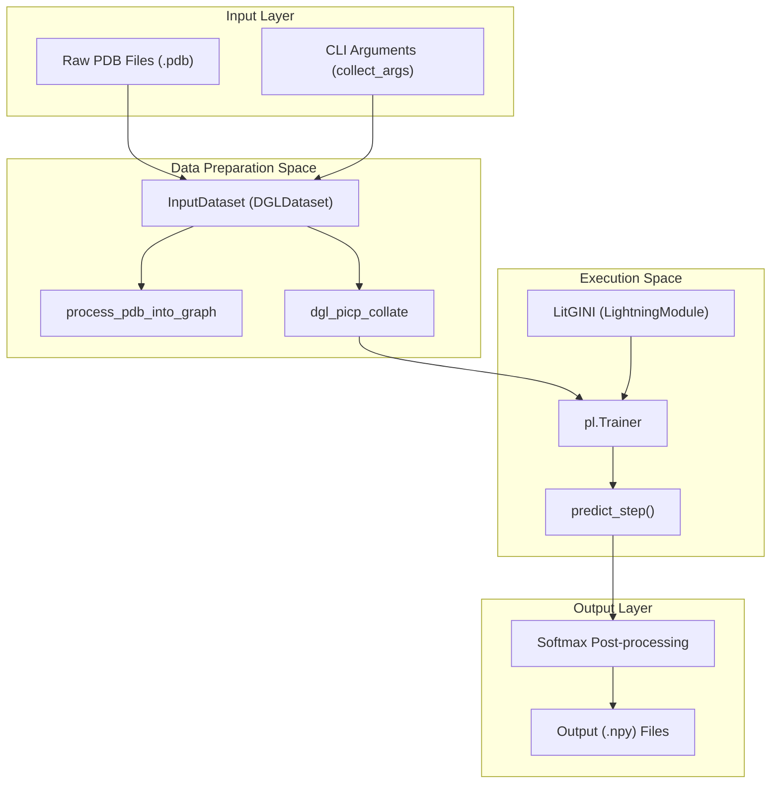

# Standard Inference (lit_model_predict.py)

> **Relevant source files**
> * [project/lit_model_predict.py](https://github.com/BioinfoMachineLearning/DeepInteract/blob/c78d2054/project/lit_model_predict.py)
> * [project/utils/deepinteract_utils.py](https://github.com/BioinfoMachineLearning/DeepInteract/blob/c78d2054/project/utils/deepinteract_utils.py)

The `lit_model_predict.py` script serves as the primary entry point for performing inference on new protein complexes using a trained DeepInteract model. It orchestrates the transformation of raw PDB files into graph representations, handles model loading from PyTorch Lightning checkpoints, and executes the prediction pipeline to generate contact probability maps.

## Inference Lifecycle and Data Flow

The inference process follows a linear progression from raw structural data to high-dimensional feature tensors, and finally to a 2D interaction probability matrix.

### System Architecture Diagram

The following diagram bridges the high-level inference steps with the specific classes and functions implemented in the codebase.



**Sources:** [project/lit_model_predict.py L22-L53](https://github.com/BioinfoMachineLearning/DeepInteract/blob/c78d2054/project/lit_model_predict.py#L22-L53)

 [project/lit_model_predict.py L147-L160](https://github.com/BioinfoMachineLearning/DeepInteract/blob/c78d2054/project/lit_model_predict.py#L147-L160)

 [project/lit_model_predict.py L183-L185](https://github.com/BioinfoMachineLearning/DeepInteract/blob/c78d2054/project/lit_model_predict.py#L183-L185)

## InputDataset and Processing Pipeline

The `InputDataset` class, inheriting from `dgl.data.DGLDataset`, manages the conversion of PDB files into a format compatible with the model. Unlike training datasets that load preprocessed `.dill` files, `InputDataset` triggers a real-time feature extraction pipeline.

### Key Methods

* **`__init__`**: Configures paths for external tools like PSAIA and HH-suite, and sets graph parameters such as `knn` (default: 20) and `geo_nbrhd_size` (default: 2) [project/lit_model_predict.py L55-L85](https://github.com/BioinfoMachineLearning/DeepInteract/blob/c78d2054/project/lit_model_predict.py#L55-L85)
* **`process()`**: This method invokes `process_pdb_into_graph`, which executes the full feature engineering suite (structural, evolutionary, and geometric) to return two `DGLGraph` objects representing the left and right chains [project/lit_model_predict.py L90-L107](https://github.com/BioinfoMachineLearning/DeepInteract/blob/c78d2054/project/lit_model_predict.py#L90-L107)
* **`dgl_picp_collate`**: A specialized collation function that batches the graph dictionaries, ensuring that `graph1` and `graph2` are handled as separate batched graphs to maintain the Siamese architecture's requirements [project/utils/deepinteract_utils.py L61-L67](https://github.com/BioinfoMachineLearning/DeepInteract/blob/c78d2054/project/utils/deepinteract_utils.py#L61-L67)

**Sources:** [project/lit_model_predict.py L22-L145](https://github.com/BioinfoMachineLearning/DeepInteract/blob/c78d2054/project/lit_model_predict.py#L22-L145)

 [project/utils/deepinteract_utils.py L61-L67](https://github.com/BioinfoMachineLearning/DeepInteract/blob/c78d2054/project/utils/deepinteract_utils.py#L61-L67)

## Model Loading and Execution

DeepInteract uses `pytorch_lightning.Trainer` to handle the inference loop, which ensures consistency with the training environment (e.g., GPU allocation, precision settings).

### Execution Flow Diagram

This diagram details the interaction between the `LitGINI` module and the `Trainer` during the prediction phase.

```mermaid
sequenceDiagram
  participant lit_model_predict.py
  participant LitGINI (LightningModule)
  participant pl.Trainer
  participant ResNet2D/DeepLabV3+

  lit_model_predict.py->>LitGINI (LightningModule): load_from_checkpoint(ckpt_path)
  lit_model_predict.py->>pl.Trainer: trainer.predict(model, dataloader)
  pl.Trainer->>LitGINI (LightningModule): predict_step(batch)
  LitGINI (LightningModule)->>LitGINI (LightningModule): forward(graph1, graph2)
  note over LitGINI (LightningModule): Siamese GNN Encoders
  LitGINI (LightningModule)->>ResNet2D/DeepLabV3+: Interaction Tensor Construction
  ResNet2D/DeepLabV3+-->>LitGINI (LightningModule): Logits (raw scores)
  LitGINI (LightningModule)-->>pl.Trainer: Return Logits
  pl.Trainer-->>lit_model_predict.py: Return List of Tensors
```

**Sources:** [project/lit_model_predict.py L168-L185](https://github.com/BioinfoMachineLearning/DeepInteract/blob/c78d2054/project/lit_model_predict.py#L168-L185)

 [project/utils/deepinteract_modules.py L536-L547](https://github.com/BioinfoMachineLearning/DeepInteract/blob/c78d2054/project/utils/deepinteract_modules.py#L536-L547)

### Checkpoint Loading

The model is instantiated using `LitGINI.load_from_checkpoint(args.checkpoint)` [project/lit_model_predict.py L183](https://github.com/BioinfoMachineLearning/DeepInteract/blob/c78d2054/project/lit_model_predict.py#L183-L183)

 This restores the full model state, including the `DGLGeometricTransformer` encoders and the `ResNet2D` (or `DeepLabV3Plus`) interaction head.

## Post-processing and Output Artifacts

The raw outputs from the model are logits. `lit_model_predict.py` applies a softmax operation to these logits to generate contact probabilities.

### Output Logic

1. **Logit to Probability**: The script applies `torch.nn.functional.softmax(logits, dim=1)` to convert the raw scores into a probability distribution over the two classes (non-contact vs. contact) [project/lit_model_predict.py L189-L190](https://github.com/BioinfoMachineLearning/DeepInteract/blob/c78d2054/project/lit_model_predict.py#L189-L190)
2. **Probability Map**: The contact probability (index 1 of the softmax output) is extracted. If the complex was subsequenced (tiled) due to size, these tiles are reconstructed into a full matrix [project/lit_model_predict.py L192-L195](https://github.com/BioinfoMachineLearning/DeepInteract/blob/c78d2054/project/lit_model_predict.py#L192-L195)
3. **File Generation**: The results are saved as NumPy (`.npy`) files in the specified output directory: * `<complex_name>_contact_prob_map.npy`: The 2D interaction matrix. * `<complex_name>_node_feats.npy`: The processed node feature arrays. * `<complex_name>_edge_feats.npy`: The processed edge feature arrays.

**Sources:** [project/lit_model_predict.py L187-L207](https://github.com/BioinfoMachineLearning/DeepInteract/blob/c78d2054/project/lit_model_predict.py#L187-L207)

## Command Line Interface (CLI)

The script supports various flags to control the inference behavior:

| Flag | Description | Default |
| --- | --- | --- |
| `--left_pdb_filepath` | Path to the receptor/left chain PDB. | `test_data/4heq_l_u.pdb` |
| `--right_pdb_filepath` | Path to the ligand/right chain PDB. | `test_data/4heq_r_u.pdb` |
| `--checkpoint` | Path to the `.ckpt` model file. | Required |
| `--psaia_dir` | Path to the PSAIA binary for structural features. | System dependent |
| `--hhsuite_db` | Path to the HH-suite database for MSA/HMM features. | System dependent |
| `--output_dir` | Directory to save prediction results. | `predictions` |

**Sources:** [project/lit_model_predict.py L56-L75](https://github.com/BioinfoMachineLearning/DeepInteract/blob/c78d2054/project/lit_model_predict.py#L56-L75)

 [project/utils/deepinteract_utils.py L155-L250](https://github.com/BioinfoMachineLearning/DeepInteract/blob/c78d2054/project/utils/deepinteract_utils.py#L155-L250)