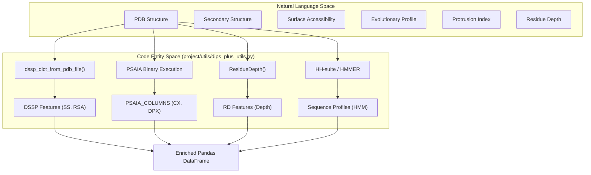
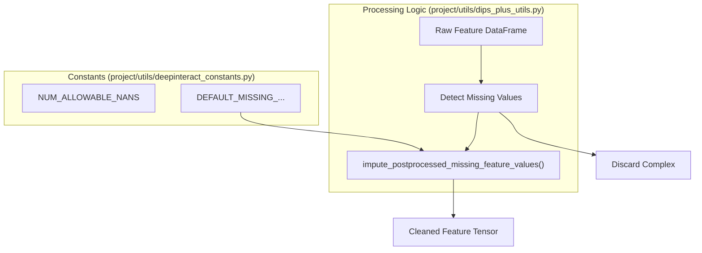

# Structural and Evolutionary Feature Extraction

> **Relevant source files**
> * [project/datasets/builder/impute_missing_feature_values.py](https://github.com/BioinfoMachineLearning/DeepInteract/blob/c78d2054/project/datasets/builder/impute_missing_feature_values.py)
> * [project/datasets/builder/psaia_chothia.radii](https://github.com/BioinfoMachineLearning/DeepInteract/blob/c78d2054/project/datasets/builder/psaia_chothia.radii)
> * [project/datasets/builder/psaia_config_file_input.txt](https://github.com/BioinfoMachineLearning/DeepInteract/blob/c78d2054/project/datasets/builder/psaia_config_file_input.txt)
> * [project/datasets/builder/psaia_config_file_input_docker.txt](https://github.com/BioinfoMachineLearning/DeepInteract/blob/c78d2054/project/datasets/builder/psaia_config_file_input_docker.txt)
> * [project/datasets/builder/psaia_hydrophobicity.hpb](https://github.com/BioinfoMachineLearning/DeepInteract/blob/c78d2054/project/datasets/builder/psaia_hydrophobicity.hpb)
> * [project/datasets/builder/psaia_natural_asa.asa](https://github.com/BioinfoMachineLearning/DeepInteract/blob/c78d2054/project/datasets/builder/psaia_natural_asa.asa)
> * [project/utils/deepinteract_utils.py](https://github.com/BioinfoMachineLearning/DeepInteract/blob/c78d2054/project/utils/deepinteract_utils.py)
> * [project/utils/dips_plus_utils.py](https://github.com/BioinfoMachineLearning/DeepInteract/blob/c78d2054/project/utils/dips_plus_utils.py)

The Feature Engineering Pipeline in DeepInteract transforms raw PDB files into enriched DataFrames by integrating structural and evolutionary information from several external bioinformatics tools. This stage is critical for providing the `LitGINI` model with high-resolution biological context beyond simple 3D coordinates.

## Feature Extraction Workflow

The extraction process is orchestrated primarily within `project/utils/dips_plus_utils.py`, which contains logic for invoking external binaries, parsing their text-based outputs, and merging the results into a unified residue-level representation.

### Data Flow Overview

The following diagram illustrates the flow from a raw PDB structure to the enriched feature set:

**System to Code Mapping: Feature Pipeline**

**Sources:** [project/utils/dips_plus_utils.py L14-L26](https://github.com/BioinfoMachineLearning/DeepInteract/blob/c78d2054/project/utils/dips_plus_utils.py#L14-L26)

 [project/utils/dips_plus_utils.py L168-L180](https://github.com/BioinfoMachineLearning/DeepInteract/blob/c78d2054/project/utils/dips_plus_utils.py#L168-L180)

---

## External Tool Integration

DeepInteract relies on four primary external toolsets to generate its feature vectors.

### 1. PSAIA (Protein Structure and Interaction Analyzer)

PSAIA is used to calculate protrusion indices and surface accessibility metrics.

* **Key Metrics:** Protrusion Index (CX) and Depth Index (DPX) [project/datasets/builder/psaia_config_file_input.txt L10-L12](https://github.com/BioinfoMachineLearning/DeepInteract/blob/c78d2054/project/datasets/builder/psaia_config_file_input.txt#L10-L12)
* **Implementation:** The pipeline generates a configuration file (e.g., `psaia_config_file_input.txt`) specifying parameters like `z_slice` and `r_solvent` [project/datasets/builder/psaia_config_file_input.txt L4-L5](https://github.com/BioinfoMachineLearning/DeepInteract/blob/c78d2054/project/datasets/builder/psaia_config_file_input.txt#L4-L5)
* **Output Parsing:** The results are mapped to the columns defined in `PSAIA_COLUMNS` [project/utils/dips_plus_utils.py L23-L26](https://github.com/BioinfoMachineLearning/DeepInteract/blob/c78d2054/project/utils/dips_plus_utils.py#L23-L26)

### 2. DSSP (Define Secondary Structure of Proteins)

DSSP provides secondary structure assignments and Relative Solvent Accessibility (RSA).

* **Implementation:** Invoked via Biopython's `dssp_dict_from_pdb_file` [project/utils/dips_plus_utils.py L14](https://github.com/BioinfoMachineLearning/DeepInteract/blob/c78d2054/project/utils/dips_plus_utils.py#L14-L14)
* **Features:** Encodes 8-state secondary structure and numeric RSA values. Missing values are handled using `DEFAULT_MISSING_SS` and `DEFAULT_MISSING_RSA` [project/utils/dips_plus_utils.py L25](https://github.com/BioinfoMachineLearning/DeepInteract/blob/c78d2054/project/utils/dips_plus_utils.py#L25-L25)

### 3. HH-suite / HMMER

Evolutionary information is captured through sequence profiles and Hidden Markov Models (HMMs).

* **Function:** `find_fasta_sequences_for_pdb_file` extracts sequences from FASTA files associated with the PDB entry [project/utils/dips_plus_utils.py L168-L175](https://github.com/BioinfoMachineLearning/DeepInteract/blob/c78d2054/project/utils/dips_plus_utils.py#L168-L175)
* **Data:** These profiles allow the model to understand residue conservation, which is often indicative of functional interface sites.

### 4. MSMS (Residue Depth)

The depth of a residue from the protein surface is calculated using the MSMS (Maximum Speed Molecular Surface) program.

* **Implementation:** Accessed via Biopython’s `ResidueDepth` class [project/utils/dips_plus_utils.py L16](https://github.com/BioinfoMachineLearning/DeepInteract/blob/c78d2054/project/utils/dips_plus_utils.py#L16-L16)
* **Defaulting:** If calculation fails, it defaults to `DEFAULT_MISSING_RD` [project/utils/dips_plus_utils.py L25](https://github.com/BioinfoMachineLearning/DeepInteract/blob/c78d2054/project/utils/dips_plus_utils.py#L25-L25)

---

## Geometric and Exposure Features

In addition to external tools, DeepInteract computes several internal geometric features directly from the atom coordinates.

### Half-Sphere Amino Acid Composition (HSAAC)

HSAAC captures the local environment of a residue by splitting its neighborhood into "Up" and "Down" half-spheres based on the side-chain orientation.

* **Function:** `get_hsacc(residues, similarity_matrix, raw_pdb_filename)` [project/utils/dips_plus_utils.py L118-L161](https://github.com/BioinfoMachineLearning/DeepInteract/blob/c78d2054/project/utils/dips_plus_utils.py#L118-L161)
* **Side Chain Vector:** Calculated using `get_side_chain_vector(residue)`, which finds the average unit vector from the C-alpha to side-chain atoms [project/utils/dips_plus_utils.py L55-L81](https://github.com/BioinfoMachineLearning/DeepInteract/blob/c78d2054/project/utils/dips_plus_utils.py#L55-L81)
* **Logic:** For each residue, it identifies neighbors within a similarity threshold and determines if they reside in the "Up" (side-chain direction) or "Down" hemisphere [project/utils/dips_plus_utils.py L152-L158](https://github.com/BioinfoMachineLearning/DeepInteract/blob/c78d2054/project/utils/dips_plus_utils.py#L152-L158)

### Similarity Matrix

The local residue density is calculated via a distance-based similarity matrix.

* **Function:** `get_similarity_matrix(coords, sg=2.0, thr=1e-3)` [project/utils/dips_plus_utils.py L84-L115](https://github.com/BioinfoMachineLearning/DeepInteract/blob/c78d2054/project/utils/dips_plus_utils.py#L84-L115)
* **Metric:** Similarity $s = \exp(-d^2 / (2\sigma^2))$, where $d$ is the minimum distance between any atoms of two residues [project/utils/dips_plus_utils.py L92-L105](https://github.com/BioinfoMachineLearning/DeepInteract/blob/c78d2054/project/utils/dips_plus_utils.py#L92-L105)

---

## Imputation and Post-processing

Because external tools may fail for certain residues (e.g., disordered regions or non-standard amino acids), the pipeline includes a robust imputation layer.

**Feature Processing and Imputation Flow**

**Sources:** [project/utils/dips_plus_utils.py L23-L27](https://github.com/BioinfoMachineLearning/DeepInteract/blob/c78d2054/project/utils/dips_plus_utils.py#L23-L27)

 [project/datasets/builder/impute_missing_feature_values.py L19-L32](https://github.com/BioinfoMachineLearning/DeepInteract/blob/c78d2054/project/datasets/builder/impute_missing_feature_values.py#L19-L32)

### Imputation Strategy

* **Thresholding:** Complexes exceeding `NUM_ALLOWABLE_NANS` are typically flagged or discarded during dataset building [project/utils/dips_plus_utils.py L23](https://github.com/BioinfoMachineLearning/DeepInteract/blob/c78d2054/project/utils/dips_plus_utils.py#L23-L23)
* **Global Imputation:** The script `project/datasets/builder/impute_missing_feature_values.py` iterates through processed `.dill` files and applies `impute_postprocessed_missing_feature_values` to fill gaps using predefined defaults for each feature type (e.g., `DEFAULT_MISSING_CN`, `DEFAULT_MISSING_HSAAC`) [project/datasets/builder/impute_missing_feature_values.py L29-L32](https://github.com/BioinfoMachineLearning/DeepInteract/blob/c78d2054/project/datasets/builder/impute_missing_feature_values.py#L29-L32)  [project/utils/dips_plus_utils.py L24-L25](https://github.com/BioinfoMachineLearning/DeepInteract/blob/c78d2054/project/utils/dips_plus_utils.py#L24-L25)

**Sources:**

* `project/utils/dips_plus_utils.py`
* `project/utils/deepinteract_constants.py`
* `project/datasets/builder/impute_missing_feature_values.py`
* `project/datasets/builder/psaia_config_file_input.txt`