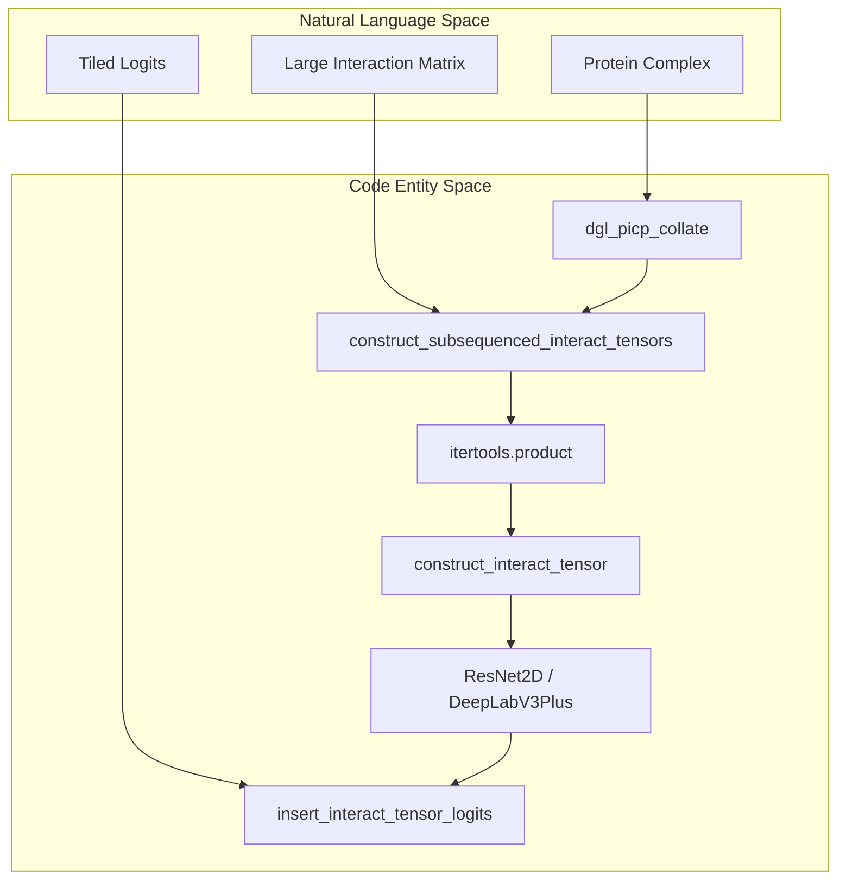
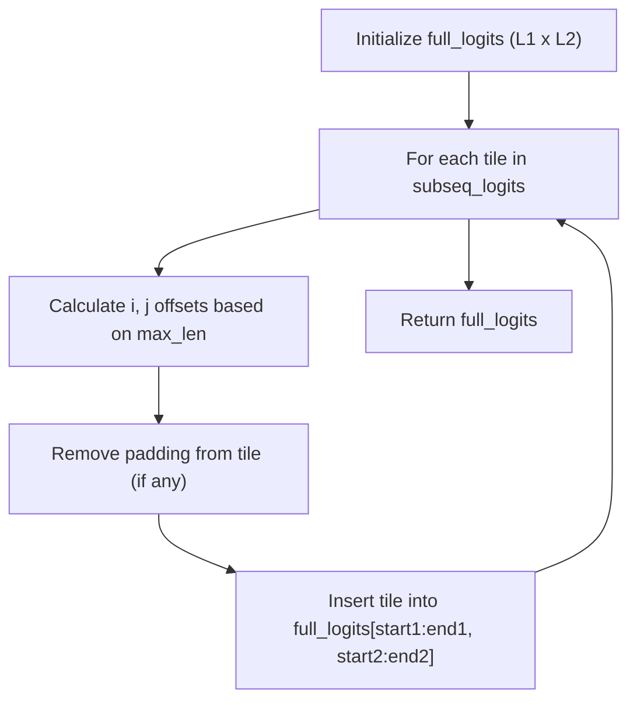

# Subsequencing for Large Complexes

> **Relevant source files**
> * [project/utils/deepinteract_constants.py](https://github.com/BioinfoMachineLearning/DeepInteract/blob/c78d2054/project/utils/deepinteract_constants.py)
> * [project/utils/deepinteract_modules.py](https://github.com/BioinfoMachineLearning/DeepInteract/blob/c78d2054/project/utils/deepinteract_modules.py)
> * [project/utils/deepinteract_utils.py](https://github.com/BioinfoMachineLearning/DeepInteract/blob/c78d2054/project/utils/deepinteract_utils.py)

This page details the mechanisms within DeepInteract for handling large protein complexes that exceed GPU memory limits. The system utilizes a tiling strategy to decompose large interaction matrices into manageable subsequences, processes them through the 2D prediction head, and reconstructs the full contact map from these tiles.

## Overview of Subsequencing Logic

When a protein complex has a large number of residues in its constituent chains, the resulting interaction tensor (Chain A length × Chain B length) can become prohibitively large for 2D convolutional layers. DeepInteract addresses this by tiling the interaction space into smaller blocks defined by a `max_len` parameter [project/utils/deepinteract_utils.py L116-L117](https://github.com/BioinfoMachineLearning/DeepInteract/blob/c78d2054/project/utils/deepinteract_utils.py#L116-L117)

The process involves three main stages:

1. **Decomposition**: Splitting node feature representations into subsequences.
2. **Tiled Prediction**: Constructing interaction tensors for every combination of subsequences (Cartesian product).
3. **Reconstruction**: Reassembling the resulting logit tiles into the original global matrix shape.

### Data Flow for Subsequenced Inference

The following diagram illustrates the transition from high-level complex representation to tiled code entities.

**Subsequencing Data Flow**

Sources: [project/utils/deepinteract_utils.py L61-L67](https://github.com/BioinfoMachineLearning/DeepInteract/blob/c78d2054/project/utils/deepinteract_utils.py#L61-L67)

 [project/utils/deepinteract_utils.py L115-L148](https://github.com/BioinfoMachineLearning/DeepInteract/blob/c78d2054/project/utils/deepinteract_utils.py#L115-L148)

 [project/utils/deepinteract_utils.py L165-L188](https://github.com/BioinfoMachineLearning/DeepInteract/blob/c78d2054/project/utils/deepinteract_utils.py#L165-L188)

## Tiling Implementation

The function `construct_subsequenced_interact_tensors` manages the division of node features [project/utils/deepinteract_utils.py L115-L149](https://github.com/BioinfoMachineLearning/DeepInteract/blob/c78d2054/project/utils/deepinteract_utils.py#L115-L149)

### Iteration State Tracking

For a complex with Chain 1 (length $L_1$) and Chain 2 (length $L_2$), the number of tiles is calculated as:

* $N_{batches1} = 1 + ((L_1 - 1) // max_len)$ [project/utils/deepinteract_utils.py L124](https://github.com/BioinfoMachineLearning/DeepInteract/blob/c78d2054/project/utils/deepinteract_utils.py#L124-L124)
* $N_{batches2} = 1 + ((L_2 - 1) // max_len)$ [project/utils/deepinteract_utils.py L132](https://github.com/BioinfoMachineLearning/DeepInteract/blob/c78d2054/project/utils/deepinteract_utils.py#L132-L132)

The system then uses `itertools.product` to generate all $N_{batches1} \times N_{batches2}$ combinations of these subsequence batches [project/utils/deepinteract_utils.py L138](https://github.com/BioinfoMachineLearning/DeepInteract/blob/c78d2054/project/utils/deepinteract_utils.py#L138-L138)

 Each combination is passed to `construct_interact_tensor` to create a grid representation of shape `(max_len, max_len, feature_dim)` [project/utils/deepinteract_utils.py L141-L144](https://github.com/BioinfoMachineLearning/DeepInteract/blob/c78d2054/project/utils/deepinteract_utils.py#L141-L144)

### Zero-Padding

If a subsequence is smaller than `max_len` (common for the final tile in a row or column), it is zero-padded to maintain consistent tensor shapes for the neural network [project/utils/deepinteract_utils.py L151-L163](https://github.com/BioinfoMachineLearning/DeepInteract/blob/c78d2054/project/utils/deepinteract_utils.py#L151-L163)

Sources: [project/utils/deepinteract_utils.py L115-L163](https://github.com/BioinfoMachineLearning/DeepInteract/blob/c78d2054/project/utils/deepinteract_utils.py#L115-L163)

## Matrix Reconstruction

After the model produces logits for each tile, the full interaction matrix must be reconstructed. This is handled by `insert_interact_tensor_logits` [project/utils/deepinteract_utils.py L165-L188](https://github.com/BioinfoMachineLearning/DeepInteract/blob/c78d2054/project/utils/deepinteract_utils.py#L165-L188)

### Logic for insert_interact_tensor_logits

1. **Initialization**: A global logit tensor is initialized with zeros, matching the full dimensions of the complex $(L_1, L_2)$ [project/utils/deepinteract_utils.py L170-L172](https://github.com/BioinfoMachineLearning/DeepInteract/blob/c78d2054/project/utils/deepinteract_utils.py#L170-L172)
2. **Iterative Insertion**: The function iterates through the tiles in the same order they were created.
3. **Coordinate Mapping**: It calculates the `start_index` and `end_index` for both chains to determine where the current tile fits into the global matrix [project/utils/deepinteract_utils.py L179-L182](https://github.com/BioinfoMachineLearning/DeepInteract/blob/c78d2054/project/utils/deepinteract_utils.py#L179-L182)
4. **Padding Removal**: Any padding added during construction is sliced off before insertion to ensure only valid residue-residue logits are stored [project/utils/deepinteract_utils.py L184-L185](https://github.com/BioinfoMachineLearning/DeepInteract/blob/c78d2054/project/utils/deepinteract_utils.py#L184-L185)

**Tile Reconstruction Logic**

Sources: [project/utils/deepinteract_utils.py L165-L188](https://github.com/BioinfoMachineLearning/DeepInteract/blob/c78d2054/project/utils/deepinteract_utils.py#L165-L188)

## Integration in LitGINI

The subsequencing logic is integrated into the `LitGINI` Lightning module, specifically within the `shared_step` and `predict_step` [project/utils/deepinteract_modules.py L444-L467](https://github.com/BioinfoMachineLearning/DeepInteract/blob/c78d2054/project/utils/deepinteract_modules.py#L444-L467)

| Step | Component | Role |
| --- | --- | --- |
| **Input Handling** | `dgl_picp_collate` | Batches graphs for the Siamese encoders. |
| **Encoding** | `LitGINI.forward` | Generates node embeddings for both chains. |
| **Decision** | `len(h1) > max_len` | Triggers subsequencing if either chain exceeds `max_len`. |
| **Tiling** | `construct_subsequenced_interact_tensors` | Creates the list of interaction tiles. |
| **Inference** | `ResNet2D` / `DeepLabV3Plus` | Processes each tile independently. |
| **Merging** | `insert_interact_tensor_logits` | Rebuilds the final contact map. |

### Handling Residue Limits

The system uses `RESIDUE_COUNT_LIMIT` (default 256) as the standard `max_len` [project/utils/deepinteract_constants.py L11](https://github.com/BioinfoMachineLearning/DeepInteract/blob/c78d2054/project/utils/deepinteract_constants.py#L11-L11)

 If a complex exceeds this, the `predict_step` automatically switches to the subsequencing workflow to prevent `OutOfMemory` (OOM) errors [project/utils/deepinteract_modules.py L456-L463](https://github.com/BioinfoMachineLearning/DeepInteract/blob/c78d2054/project/utils/deepinteract_modules.py#L456-L463)

Sources: [project/utils/deepinteract_modules.py L444-L467](https://github.com/BioinfoMachineLearning/DeepInteract/blob/c78d2054/project/utils/deepinteract_modules.py#L444-L467)

 [project/utils/deepinteract_constants.py L9-L13](https://github.com/BioinfoMachineLearning/DeepInteract/blob/c78d2054/project/utils/deepinteract_constants.py#L9-L13)