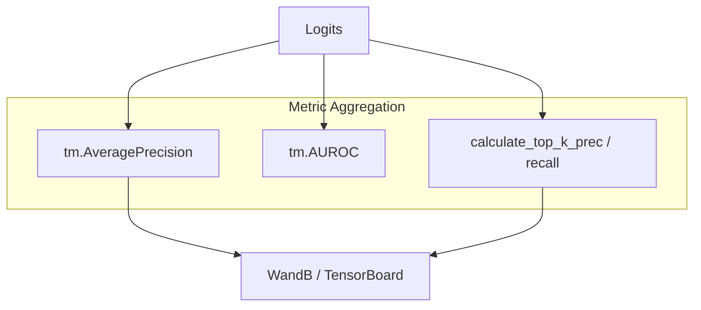

# Training and Optimization (LitGINI Lightning Module)

> **Relevant source files**
> * [project/lit_model_train.py](https://github.com/BioinfoMachineLearning/DeepInteract/blob/c78d2054/project/lit_model_train.py)
> * [project/utils/deepinteract_constants.py](https://github.com/BioinfoMachineLearning/DeepInteract/blob/c78d2054/project/utils/deepinteract_constants.py)
> * [project/utils/deepinteract_modules.py](https://github.com/BioinfoMachineLearning/DeepInteract/blob/c78d2054/project/utils/deepinteract_modules.py)

The training and optimization of DeepInteract are managed by the `LitGINI` class, a `pytorch_lightning.LightningModule` that encapsulates the model architecture, loss functions, optimization logic, and evaluation metrics. The training process leverages a Siamese GNN encoder followed by a 2D interaction predictor, optimized using class-balanced cross-entropy to handle the sparsity of protein-protein interface contacts.

## LitGINI Training Lifecycle

The `LitGINI` module coordinates the flow of data through the geometric transformers and the interaction head, managing the transformation of graph-based protein representations into contact probability maps.

### Shared Step and Data Flow

The core logic for both training and validation resides in `shared_step`, which processes a batch of protein complexes. Each complex consists of two chains represented as DGL graphs.

1. **Graph Encoding**: Each protein chain graph is passed through the `DGLGeometricTransformer` to generate node and edge embeddings [project/utils/deepinteract_modules.py L1145-L1152](https://github.com/BioinfoMachineLearning/DeepInteract/blob/c78d2054/project/utils/deepinteract_modules.py#L1145-L1152)
2. **Interaction Tensor Construction**: Node features from both chains are combined into a 2D grid representation using `construct_interact_tensor` [project/utils/deepinteract_modules.py L1162-L1165](https://github.com/BioinfoMachineLearning/DeepInteract/blob/c78d2054/project/utils/deepinteract_modules.py#L1162-L1165)
3. **Subsequencing**: For large complexes exceeding memory limits, the interaction tensor is tiled into smaller patches using `construct_subsequenced_interact_tensors` [project/utils/deepinteract_modules.py L1172-L1176](https://github.com/BioinfoMachineLearning/DeepInteract/blob/c78d2054/project/utils/deepinteract_modules.py#L1172-L1176)
4. **2D Prediction**: The 2D interaction head (ResNet or DeepLabV3+) processes the tensor to produce contact logits [project/utils/deepinteract_modules.py L1178-L1185](https://github.com/BioinfoMachineLearning/DeepInteract/blob/c78d2054/project/utils/deepinteract_modules.py#L1178-L1185)

### Loss Function and Balancing

DeepInteract uses Binary Cross Entropy (BCE) loss. Because interface contacts are rare compared to non-contacts, the module applies a Positive-to-Negative (PN) ratio balancing strategy.

* **Weighting**: The `pos_weight` for the loss is derived from the `pn_ratio` hyperparameter to penalize false negatives more heavily [project/utils/deepinteract_modules.py L1059-L1062](https://github.com/BioinfoMachineLearning/DeepInteract/blob/c78d2054/project/utils/deepinteract_modules.py#L1059-L1062)
* **Masking**: Padding residues introduced during batching or subsequencing are masked out using a `padding_mask` to ensure they do not contribute to the loss calculation [project/utils/deepinteract_modules.py L1210-L1215](https://github.com/BioinfoMachineLearning/DeepInteract/blob/c78d2054/project/utils/deepinteract_modules.py#L1210-L1215)

### Code Entity Space: LitGINI Training Flow

The following diagram maps the logical training steps to the specific class methods and utility functions within the codebase.

**Sources:** [project/utils/deepinteract_modules.py L1120-L1225](https://github.com/BioinfoMachineLearning/DeepInteract/blob/c78d2054/project/utils/deepinteract_modules.py#L1120-L1225)

 [project/utils/deepinteract_utils.py L20-L22](https://github.com/BioinfoMachineLearning/DeepInteract/blob/c78d2054/project/utils/deepinteract_utils.py#L20-L22)

---

## Optimization Strategy

The optimization routine is defined in `configure_optimizers` and utilizes advanced scheduling to ensure convergence on the complex loss landscape of protein structures.

### Optimizer and Scheduler

* **AdamW**: The model uses the AdamW optimizer, which decouples weight decay from the gradient update, providing better regularization for deep transformers [project/utils/deepinteract_modules.py L1330-L1332](https://github.com/BioinfoMachineLearning/DeepInteract/blob/c78d2054/project/utils/deepinteract_modules.py#L1330-L1332)
* **CosineAnnealingWarmRestarts**: To avoid local minima, the learning rate is modulated using a cosine annealing schedule with periodic "restarts" to the initial learning rate [project/utils/deepinteract_modules.py L1333-L1336](https://github.com/BioinfoMachineLearning/DeepInteract/blob/c78d2054/project/utils/deepinteract_modules.py#L1333-L1336)

### Learning Rate Finder

The training script `lit_model_train.py` supports an automated learning rate search using the PyTorch Lightning Tuner, which saves the optimal LR suggestion to `optimal_lr.pdf` [project/lit_model_train.py L119-L126](https://github.com/BioinfoMachineLearning/DeepInteract/blob/c78d2054/project/lit_model_train.py#L119-L126)

| Component | Implementation | Source |
| --- | --- | --- |
| **Optimizer** | `torch.optim.AdamW` | [project/utils/deepinteract_modules.py L1330](https://github.com/BioinfoMachineLearning/DeepInteract/blob/c78d2054/project/utils/deepinteract_modules.py#L1330-L1330) |
| **Scheduler** | `CosineAnnealingWarmRestarts` | [project/utils/deepinteract_modules.py L1333](https://github.com/BioinfoMachineLearning/DeepInteract/blob/c78d2054/project/utils/deepinteract_modules.py#L1333-L1333) |
| **LR Finder** | `trainer.tuner.lr_find` | [project/lit_model_train.py L120](https://github.com/BioinfoMachineLearning/DeepInteract/blob/c78d2054/project/lit_model_train.py#L120-L120) |
| **Weight Decay** | Configurable hyperparameter | [project/utils/deepinteract_modules.py L1066](https://github.com/BioinfoMachineLearning/DeepInteract/blob/c78d2054/project/utils/deepinteract_modules.py#L1066-L1066) |

**Sources:** [project/utils/deepinteract_modules.py L1328-L1339](https://github.com/BioinfoMachineLearning/DeepInteract/blob/c78d2054/project/utils/deepinteract_modules.py#L1328-L1339)

 [project/lit_model_train.py L117-L126](https://github.com/BioinfoMachineLearning/DeepInteract/blob/c78d2054/project/lit_model_train.py#L117-L126)

---

## Metric Tracking and Evaluation

DeepInteract tracks a suite of metrics to evaluate both the pixel-level accuracy of the contact map and the biological relevance of the top predictions.

### Core Metrics

* **AUPRC**: Area Under the Precision-Recall Curve is the primary metric, as it is robust to the class imbalance inherent in protein interfaces [project/utils/deepinteract_modules.py L1080](https://github.com/BioinfoMachineLearning/DeepInteract/blob/c78d2054/project/utils/deepinteract_modules.py#L1080-L1080)
* **Top-K Precision/Recall**: Calculated for $K \in {L/10, L/5, L/2, L}$ where $L$ is the sequence length. These metrics reflect the model's ability to identify the most confident physical contacts [project/utils/deepinteract_modules.py L1248-L1255](https://github.com/BioinfoMachineLearning/DeepInteract/blob/c78d2054/project/utils/deepinteract_modules.py#L1248-L1255)

### Metric Logging Logic

The module uses `torchmetrics` for standard metrics and custom utility functions for Top-K analysis.

**Sources:** [project/utils/deepinteract_modules.py L1078-L1088](https://github.com/BioinfoMachineLearning/DeepInteract/blob/c78d2054/project/utils/deepinteract_modules.py#L1078-L1088)

 [project/utils/deepinteract_modules.py L1240-L1265](https://github.com/BioinfoMachineLearning/DeepInteract/blob/c78d2054/project/utils/deepinteract_modules.py#L1240-L1265)

 [project/utils/deepinteract_utils.py L22](https://github.com/BioinfoMachineLearning/DeepInteract/blob/c78d2054/project/utils/deepinteract_utils.py#L22-L22)

---

## Training Configuration and Hyperparameters

The `LitGINI` module is initialized with a wide range of hyperparameters that control the geometric processing and the interaction head.

### Key Hyperparameters

* **pn_ratio**: Controls the class weighting in the loss function [project/utils/deepinteract_modules.py L1059](https://github.com/BioinfoMachineLearning/DeepInteract/blob/c78d2054/project/utils/deepinteract_modules.py#L1059-L1059)
* **disable_geometric_mode**: A boolean flag that, if true, removes geometric gating from the transformer, reducing it to a standard graph transformer [project/utils/deepinteract_modules.py L1064](https://github.com/BioinfoMachineLearning/DeepInteract/blob/c78d2054/project/utils/deepinteract_modules.py#L1064-L1064)
* **interact_module_type**: Switches between `resnet` and `deeplabv3plus` architectures for the 2D prediction head [project/utils/deepinteract_modules.py L1055](https://github.com/BioinfoMachineLearning/DeepInteract/blob/c78d2054/project/utils/deepinteract_modules.py#L1055-L1055)
* **knn**: The number of nearest neighbors used for graph construction, influencing the receptive field of the GNN layers [project/utils/deepinteract_modules.py L1053](https://github.com/BioinfoMachineLearning/DeepInteract/blob/c78d2054/project/utils/deepinteract_modules.py#L1053-L1053)

**Sources:** [project/utils/deepinteract_modules.py L1026-L1075](https://github.com/BioinfoMachineLearning/DeepInteract/blob/c78d2054/project/utils/deepinteract_modules.py#L1026-L1075)

 [project/lit_model_train.py L58-L90](https://github.com/BioinfoMachineLearning/DeepInteract/blob/c78d2054/project/lit_model_train.py#L58-L90)