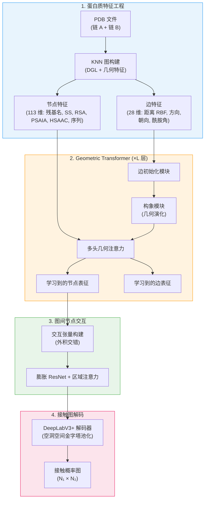

---
slug:1-overview
blog_type:normal
---


**DeepInteract** 是一个用于预测**蛋白质界面接触**的几何深度学习流水线——即在复合物中两个蛋白质之间形成物理相互作用的残基对。该研究发表于 **ICLR 2022**，它引入了一种 **Geometric Transformer** 架构，将图 Transformer 网络推广以融合丰富的 3D 几何特征，并搭配了一个 **Inter-Graph Node Interaction (GINI)** 模块来建模跨链关系，然后通过 **DeepLabV3+** 视觉解码器将其解码为每对残基的接触概率。

来源: [README.md](/README.md#L1-L30), [setup.py](/setup.py#L1-L12)

## DeepInteract 解决了什么问题？

当两个蛋白质结合形成复合物时，每个蛋白质表面实际上只有一小部分残基发生物理接触。识别这些**界面接触**对于药物设计、蛋白质工程和理解疾病机制至关重要——然而实验测定方法仍然昂贵且缓慢。DeepInteract 将此问题表述为**残基对的二分类问题**：给定两条独立蛋白质链的 3D 结构，预测跨链的哪些残基-残基对会相互接触（通常定义为 Cβ 原子间距在 8Å 以内）。这本质上是一个**几何**问题——氨基酸的空间排布、朝向以及骨架构象均携带决定性信号。

来源: [README.md](/README.md#L15-L18)

## 架构一览

完整的 DeepInteract 流水线通过四个顺序阶段处理蛋白质复合物，每个阶段都实现一种独特的表征转换：



来源: [deepinteract_modules.py](/project/utils/deepinteract_modules.py#L34-L121), [deepinteract_modules.py](/project/utils/deepinteract_modules.py#L500-L650), [vision_modules.py](/project/utils/vision_modules.py#L1-L165)

## 核心架构组件

流水线的每个阶段由一个独立的模块实现，概述如下：

| 阶段 | 模块 | 核心作用 | 位置 |
|-------|--------|----------|----------|
| **特征工程** | `GeometricProteinFeatures` | 从 3D 坐标计算 RBF 距离、方向、朝向、四元数旋转、氢键和接触 | `protein_feature_utils.py` |
| **特征工程** | `prot_df_to_dgl_graph_feats` | 将蛋白质 DataFrames 转换为具有独热编码节点特征的 DGL KNN 图 | `graph_utils.py` |
| **Geometric Transformer** | `MultiHeadGeometricAttentionLayer` | 使用边特征修正的注意力分数扩展 DGL 图上的标准多头注意力 | `deepinteract_modules.py` |
| **Geometric Transformer** | `ConformationModule` | 通过残差门控消息传递迭代演化几何边特征（距离、方向、朝向、酰胺） | `deepinteract_modules.py` |
| **Geometric Transformer** | `InitEdgeModule` | 通过结合节点嵌入与几何及序列边特征来初始化边表征 | `deepinteract_modules.py` |
| **图间交互** | `LitGINI` | 完整的 Lightning 模块：为每条链编排 Geometric Transformer，构建交互张量，并解码接触图 | `deepinteract_modules.py` |
| **接触解码** | `DeepLabV3Plus` | 源自语义分割的适配：使用空洞空间金字塔池化将 2D 交互张量解码为接触概率图 | `vision_modules.py` |
| **接触解码** | `ResNet2DInputWithOptAttention` | 带有可选多头区域注意力的膨胀 ResNet，作用于交互张量 | `deepinteract_modules.py` |

来源: [deepinteract_modules.py](/project/utils/deepinteract_modules.py#L34-L265), [protein_feature_utils.py](/project/utils/protein_feature_utils.py#L63-L150), [vision_modules.py](/project/utils/vision_modules.py#L120-L165)

## 几何特征谱系

DeepInteract 的一个标志性特征是其**聚焦几何**的设计。与将边特征视为不透明向量的标准图 Transformer 不同，DeepInteract 将边表征分解为四个几何通道，每个通道都有专用的嵌入路径：

| 特征通道 | 维度 | 描述 | 张量索引范围 |
|----------------|-----------|-------------|-------------------|
| **距离 (RBF)** | 18 | 应用于成对平方距离的径向基函数 | `2:20` |
| **方向** | 3 | 沿边的单位向量（源 → 目标） | `20:23` |
| **朝向** | 4 | 从源到目标局部坐标系的四元数旋转 | `23:27` |
| **酰胺平面角** | 1 | 相连残基的酰胺法向量之间的夹角 | `27` |

这些几何特征同时流经 **ConformationModule**（对其进行迭代演化）和 **MultiHeadGeometricAttentionLayer**（利用其调节注意力分数），从而在 3D 结构与学习到的表征之间建立起紧密耦合。

<CgxTip>设置 `disable_geometric_mode=True` 会将 Geometric Transformer 转换为 "A Generalization of Transformer Networks to Graphs" 中的原始图 Transformer——这有助于进行消融实验，以剥离几何特征演化的贡献。</CgxTip>

来源: [deepinteract_constants.py](/project/utils/deepinteract_constants.py#L99-L116), [deepinteract_modules.py](/project/utils/deepinteract_modules.py#L267-L334)

## 项目结构

```
DeepInteract
├── docker/                          # 容器化推理
│   ├── Dockerfile
│   ├── requirements.txt
│   └── run_docker.py
├── img/                             # 架构图
│   ├── DeepInteract_Architecture.png
│   └── Geometric_Transformer.png
├── project/
│   ├── datasets/                    # 数据加载与处理
│   │   ├── builder/                 # PDB 解析与特征生成
│   │   ├── CASP_CAPRI/             # CASP-CAPRI 基准数据集
│   │   ├── DB5/                    # 对接基准 5
│   │   ├── DIPS/                   # DIPS-Plus 大规模数据集
│   │   └── PICP/                   # 统一的 PICP 数据模块
│   ├── test_data/                   # 用于测试的示例 PDB 文件
│   ├── utils/                       # 核心模型与实用工具模块
│   │   ├── deepinteract_modules.py # LitGINI, Geometric Transformer, ResNet, Attention
│   │   ├── deepinteract_utils.py   # 交互张量, 训练工具, 参数解析
│   │   ├── deepinteract_constants.py # 特征索引, 限制, 氨基酸映射
│   │   ├── vision_modules.py       # DeepLabV3+ 编码器/解码器
│   │   ├── graph_utils.py          # DGL 图构建, 注意力原语
│   │   ├── protein_feature_utils.py # 几何蛋白质特征提取
│   │   └── dips_plus_utils.py      # DIPS-Plus 后处理与插补
│   ├── lit_model_train.py          # PyTorch Lightning 训练入口点
│   ├── lit_model_test.py           # 测试入口点
│   ├── lit_model_predict.py        # 预测入口点
│   └── lit_model_predict_docker.py # Docker 兼容的预测
├── environment.yml                  # Conda 环境配置
├── requirements.txt                 # Pip 依赖
└── setup.py                         # 包安装 (v1.1.0)
```

来源: [README.md](/README.md#L111-L210), [setup.py](/setup.py#L1-L38)

## 支持的数据集

DeepInteract 在三个规模递增的基准数据集上进行了评估：

| 数据集 | 规模 | 描述 | 数据模块 |
|---------|-------|-------------|-------------|
| **DIPS-Plus** | ~17,000 个复合物 | 具有丰富结构特征的大规模蛋白质界面数据集 | `PICPDGLDataModule` |
| **DB5** | 55 个复合物 | 对接基准 5——标准的小规模对接基准 | `PICPDGLDataModule` |
| **CASP-CAPRI** | 随轮次变化 | 社区范围的预测挑战靶标 | `PICPDGLDataModule` |

所有数据集都统一在单一的 `PICPDGLDataModule`（Protein Interface Contact Prediction，蛋白质界面接触预测）之下，它负责编排训练/验证/测试集划分、DGL 图批处理和特征生成。模型通常**在 DIPS-Plus 上训练**，并选择**在 DB5 上微调**以进行基准评估。

来源: [lit_model_train.py](/project/lit_model_train.py#L20-L40), [README.md](/README.md#L247-L253)

## 技术栈

| 类别 | 技术 | 用途 |
|----------|-----------|---------|
| **深度学习** | PyTorch, PyTorch Lightning | 模型定义，训练循环编排 |
| **图计算** | DGL (Deep Graph Library) | KNN 图构建，消息传递，图上的注意力 |
| **视觉解码器** | DeepLabV3+ (via timm) | 语义分割风格的接触图解码 |
| **序列搜索** | HH-suite3 + BFD/Uniclust30 | 为进化序列特征生成 MSA |
| **特征生成** | PSAIA, Atom3D, Biopython | 结构特征计算 (RSA, HSE, CN 等) |
| **实验追踪** | Weights & Biases, TensorBoard | 记录指标、检查点和可视化 |
| **部署** | Docker + NVIDIA Container Toolkit | GPU 加速的容器化推理 |

来源: [setup.py](/setup.py#L13-L28), [environment.yml](/environment.yml#L1-L50), [docker/Dockerfile](/docker/Dockerfile#L1-L50)

## 发表与引用

本工作发表于 **ICLR 2022**：

> **Geometric Transformers for Protein Interface Contact Prediction**  
> Alex Morehead, Chen Chen, Jianlin Cheng  
> *International Conference on Learning Representations (ICLR), 2022*

```bibtex
@inproceedings{morehead2022geometric,
  title={Geometric Transformers for Protein Interface Contact Prediction},
  author={Alex Morehead and Chen Chen and Jianlin Cheng},
  booktitle={International Conference on Learning Representations},
  year={2022},
  url={https://openreview.net/forum?id=CS4463zx6Hi}
}
```

来源: [README.md](/README.md#L23-L30)

## 后续阅读

现在你已经对 DeepInteract 的目标和架构有了高层次的了解，请按照以下阅读路径逐步构建更深入的知识：

1. **[快速开始](2-quick-start)** — 通过传统的 Conda 安装在你的机器上运行 DeepInteract
2. **[Docker 设置](3-docker-setup)** — 使用提供的 Docker 镜像完全跳过手动设置
3. **[架构概览](4-architecture-overview)** — 深入了解端到端的数据流和模块交互细节
4. **[多头几何注意力](5-multi-head-geometric-attention)** — 了解几何边特征如何修正注意力分数
5. **[GINI 模型设计](8-gini-model-design)** — 探索图间交互张量如何捕获跨链关系