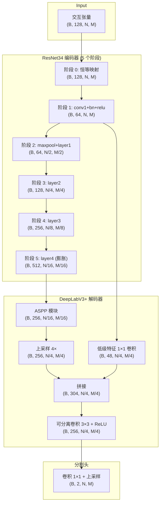

---
slug:10-deeplabv3-contact-decoder
blog_type:normal
---

DeepLabV3+ 接触解码器将最先进的语义分割架构重新应用于蛋白质-蛋白质接触预测。它并非将像素分类到语义类别中，而是将 2D **交互张量** 中的残基-残基相互作用对分类为接触或非接触类别。这种从空间到结构的类比正是使 DeepLabV3+ 在密集接触图解码中格外有效的架构洞察：交互张量中的每个空间位置都编码了一个成对残基关系，而空洞卷积层级则捕获了多尺度的相互作用模式——从局部的邻近接触到长程的结构域间界面。

来源：[vision_modules.py](project/utils/vision_modules.py#L525-L610), [deepinteract_modules.py](project/utils/deepinteract_modules.py#L24-L24)

## 架构原理：从分割到接触预测

最初的 DeepLabV3+ 专为语义图像分割而设计（Chen et al., 2018, arXiv:1802.02611v3），其中编码器提取多尺度空间特征，解码器恢复细粒度的边界细节。DeepInteract 通过精确的结构对应关系，将这一范式映射到接触预测问题上：

| 分割概念 | 接触预测类比 |
|---|---|
| 输入图像 (H × W × 3) | 交互张量 (N × M × C) |
| 像素类别 (道路, 建筑, …) | 接触类别 (接触, 非接触) |
| 物体边界 | 接触图界面 |
| 多尺度空间上下文 | 多尺度残基相互作用模式 |
| 编码器特征层级 | 多分辨率成对特征图 |

交互张量由 [交互张量构建](9-interaction-tensor-construction) 模块构建，提供了一个 2D 特征图，其中轴 0 索引蛋白质 A 的残基，轴 1 索引蛋白质 B 的残基。每个通道编码一个独立的成对几何特征或学习特征。随后，DeepLabV3+ 解码器对该图执行密集的逐位置分类，为每个残基对生成接触概率。

来源：[vision_modules.py](project/utils/vision_modules.py#L525-L558), [deepinteract_modules.py](project/utils/deepinteract_modules.py#L1478-L1489)

## 端到端数据流

完整的正向传播链包含三个阶段：**编码** → **解码** → **分割头**。下图展示了典型配置（ResNet34 编码器，输出步长 16，128 个输入通道）下各阶段的张量形状：

`SegmentationModel.forward` 方法编排了这一流程：它首先通过 `self.encoder(x)` 提取多尺度特征，然后将所有特征图传递给 `self.decoder(*features)`，最后应用 `self.segmentation_head(decoder_output)` 生成每个类别的接触 logits。一个关键细节是**边界切片**逻辑——由于变长交互张量可能产生略大于原始空间维度的上采样输出，正向传播会切除多余的行和列，以保持精确的输出对齐。

来源：[vision_modules.py](project/utils/vision_modules.py#L193-L217), [vision_modules.py](project/utils/vision_modules.py#L560-L610)

## ASPP：空洞空间金字塔池化

**ASPP** 模块是 DeepLabV3+ 的标志性组件。它对最深层编码器特征应用五个并行特征提取分支，每个分支在不同尺度上捕获空间上下文：

| 分支 | 操作 | 感受野 | 目的 |
|---|---|---|---|
| 1 | 1×1 卷积 + ReLU | 1 | 逐点通道混合 |
| 2 | 3×3 卷积 (rate=12) + ReLU | 25 | 中程上下文 |
| 3 | 3×3 卷积 (rate=24) + ReLU | 49 | 长程上下文 |
| 4 | 3×3 卷积 (rate=36) + ReLU | 73 | 超长程上下文 |
| 5 | 自适应平均池化 → 1×1 卷积 → 双线性上采样 | 全局 | 图像/张量级全局上下文 |

前四个分支使用**可分离卷积**（深度可分离 + 逐点可分离），将每个标准卷积分解为一个仅空间滤波器和一个仅通道滤波器——在保持表征能力的同时，大幅减少了参数量。第五个分支应用全局平均池化以捕获张量级统计信息，然后通过双线性上采样恢复至输入空间分辨率。所有五个分支的输出沿通道维度进行拼接，并通过一个带有 ReLU 和 0.5 dropout 的 1×1 卷积进行投影，生成最终的 ASPP 输出。

<CgxTip>对于接触预测，默认的空洞率 (12, 24, 36) 尤为适用：它们分别捕获沿每条蛋白质链大约 12、24 和 36 个残基间隔的相互作用模式，对应于局部二级结构接触、中程环接触和长程结构域间接触。</CgxTip>

来源：[vision_modules.py](project/utils/vision_modules.py#L290-L367), [vision_modules.py](project/utils/vision_modules.py#L370-L398)

## 解码器：多尺度特征融合

`DeepLabV3PlusDecoder` 实现了编码器-解码器融合策略，这也正是 DeepLabV3+ 相比原版 DeepLabV3 的 "+" 增益所在。融合操作按顺序分为三步：

**步骤 1 — ASPP 处理**：最深层编码器特征（`features[-1]`，分辨率为 1/16 或 1/8）经过 ASPP 模块及随后的带 ReLU 的可分离 3×3 卷积，在低分辨率下生成丰富的多尺度表征。

**步骤 2 — 双线性上采样**：ASPP 输出通过双线性插值上采样 4 倍（输出步长为 16 时）或 2 倍（输出步长为 8 时），使其与低级编码器特征图的分辨率对齐。

**步骤 3 — 低级特征拼接与精炼**：浅层编码器特征（`features[-4]`，分辨率为 1/4）通过 1×1 卷积投影至 **48 个通道**——这是原论文的一项设计选择，激进地压缩低级细节以防止其掩盖经过精炼的 ASPP 特征。上采样后的 ASPP 特征（256 通道）与压缩后的低级特征（48 通道）进行拼接（共 304 通道），随后通过一个带 ReLU 的可分离 3×3 卷积进行精炼，生成最终的 256 通道解码器输出。

解码器正向方法中的边界切片保护机制确保了当双线性上采样生成的特征图略大于低级特征图（由奇数空间维度引起）时，在拼接前切除多余的行和列。

来源：[vision_modules.py](project/utils/vision_modules.py#L235-L287)

## 编码器架构与空洞卷积策略

编码器是一个 **ResNet34** 骨干网络，通过 `EncoderMixin` 和 `ResNetEncoder` 类适配了任意输入通道。该编码器生成一系列空间分辨率逐步降低的特征图层级，组织为六个阶段：

| 阶段 | 模块 | 输出形状 (对于 N×M 输入) | 通道数 |
|---|---|---|---|
| 0 | 恒等映射 | (B, 128, N, M) | 128 |
| 1 | conv1 + bn + relu | (B, 64, N, M) | 64 |
| 2 | maxpool + layer1 | (B, 64, N/2, M/2) | 64 |
| 3 | layer2 | (B, 128, N/4, M/4) | 128 |
| 4 | layer3 | (B, 256, N/8, M/8) | 256 |
| 5 | layer4 | (B, 512, N/16, M/16) | 512 |

两种机制使该编码器适用于密集接触预测：

**通道修补** — `patch_first_conv` 函数将标准的 3 通道输入卷积替换为接受 `in_channels=128`（交互张量通道数）的卷积。当通道数大于 3 时，它执行周期性权重复制，并按 `default_in_channels / new_in_channels` 进行缩放，从而保留了预训练权重分布的统计特性。

**膨胀策略** — 当 `output_stride=16` 时，`make_dilated` 方法在阶段 5 中用膨胀代替步长（rate=2）。当 `output_stride=8` 时，阶段 4 和 5 均被膨胀（膨胀率分别为 2 和 4）。此策略在不增加池化操作数量的情况下保留了特征图的全空间分辨率，确保每个空间位置上的细粒度接触模式都能保留在编码器输出中。

来源：[vision_modules.py](project/utils/vision_modules.py#L59-L118), [vision_modules.py](project/utils/vision_modules.py#L120-L153), [vision_modules.py](project/utils/vision_modules.py#L487-L522)

## 分割与分类头

**SegmentationHead** 应用最终的 1×1 卷积，将 256 通道解码器输出投影至 `classes=2` 个通道（接触与非接触的 logits），随后进行可选的双线性上采样和激活。对于 DeepInteract，上采样因子设为 4，以将输出恢复至原始交互张量分辨率，并且不应用激活函数——原始 logits 在训练期间直接供二元交叉熵损失函数使用。

**ClassificationHead**（辅助输出）是可选的，它通过自适应平均池化、展平、dropout 和线性层提供全局的蛋白质对分类。当 `aux_params=None`（默认值）时，该头被禁用，模型仅返回接触图。

来源：[vision_modules.py](project/utils/vision_modules.py#L433-L452), [vision_modules.py](project/utils/vision_modules.py#L596-L609)

## 配置参考

`DeepLabV3Plus` 类暴露了以下可配置参数，其默认值已针对接触预测任务进行了调优：

| 参数 | 默认值 | 描述 |
|---|---|---|
| `encoder_name` | `"resnet34"` | 骨干编码器架构 |
| `encoder_depth` | `5` | 编码器阶段数 (范围 [3, 5]) |
| `encoder_weights` | `None` | 预训练权重集 (None = 随机初始化) |
| `encoder_output_stride` | `16` | 输出步长；控制膨胀策略 (8 或 16) |
| `decoder_channels` | `256` | ASPP 和解码器中的卷积滤波器数量 |
| `decoder_atrous_rates` | `(12, 24, 36)` | ASPP 空洞卷积的膨胀率 |
| `in_channels` | `128` | 输入通道数 (交互张量特征深度) |
| `classes` | `2` | 输出类别 (接触 / 非接触) |
| `activation` | `None` | 最终激活函数 (None = 原始 logits) |
| `upsampling` | `4` | 匹配输入分辨率的最终上采样因子 |
| `aux_params` | `None` | 辅助分类头参数 |

来源：[vision_modules.py](project/utils/vision_modules.py#L560-L573)

## 权重初始化协议

解码器与头遵循不同的初始化策略，分别通过 `initialize_decoder` 和 `initialize_head` 实现：

**解码器初始化**对 `Conv2d` 层使用 **Kaiming 均匀分布**（fan-in 模式，ReLU 非线性），对 `Linear` 层使用 **Xavier 均匀分布**，偏置初始化为零。该方案通过维持层间激活方差，专为 ReLU 激活的卷积网络进行了优化。

**头初始化**对 `Conv2d` 和 `Linear` 层均使用带零偏置的 **Xavier 均匀分布**——这是一种更保守的方案，适用于最终投影层，因为初始化时稳定的梯度流对早期训练收敛至关重要。

`SegmentationModel.initialize` 方法在模型构建期间被调用时，会按顺序执行这些初始化。

来源：[vision_modules.py](project/utils/vision_modules.py#L171-L198), [vision_modules.py](project/utils/vision_modules.py#L193-L198)

## 在 GINI 流水线中的集成

在 [GINI 模型设计](8-gini-model-design) 中，`DeepLabV3Plus` 被实例化为两种可用交互模块类型之一（由 `LitGINI` 中的 `interact_module_type` 参数控制，默认为 `'dil_resnet'`）。当选中时，由 [交互张量构建](9-interaction-tensor-construction) 生成的交互张量将直接作为 `DeepLabV3Plus.forward()` 方法的输入，该方法返回全分辨率的 2 通道接触图。模型的 `predict()` 方法封装了正向传播，并切换至自动评估模式及 `torch.no_grad()` 上下文以进行推理。

另一种交互模块 (`'resnet'`) 使用 `ResNet2DInputWithOptAttention` 类——这是一个带有可选多头区域注意力的自定义 ResNet——它遵循不同的架构理念（带有挤压-激励门控的同质残差块），但发挥着相同的接触解码作用。

<CgxTip>DeepLabV3+ 解码器的多尺度 ASPP 分支使其对具有异质接触密度的交互张量尤为有效：密集的局部接触簇（常见于 beta-折叠界面）由低膨胀率分支捕获，而稀疏的长程接触（结构域间界面的特征）则由高膨胀率分支和全局池化分支捕获。</CgxTip>

来源：[deepinteract_modules.py](project/utils/deepinteract_modules.py#L24-L24), [deepinteract_modules.py](project/utils/deepinteract_modules.py#L1478-L1489), [vision_modules.py](project/utils/vision_modules.py#L219-L232)

## 可分离卷积实现

`SeparableConv2d` 模块在 ASPP 和解码器中被广泛使用，以降低计算成本。它将标准卷积分解为两个顺序操作：

1. **深度可分离卷积** — 独立应用于每个输入通道（`groups=in_channels`）的空间卷积，捕获每个通道的空间模式而不进行跨通道混合。
2. **逐点可分离卷积** — 执行深度可分离输出通道线性组合的 1×1 卷积。

这种分解将参数量从 O(C_in × C_out × K²) 降至 O(C_in × K² + C_in × C_out)，为 ASPP（膨胀率 12, 24, 36）和解码器精炼块中使用的 3×3 卷积带来了显著的参数节省。

来源：[vision_modules.py](project/utils/vision_modules.py#L370-L398)

## Timm 通用编码器支持

除了内置的 ResNet34 编码器外，`get_encoder` 工厂函数还通过 `"tu-"` 前缀约定（例如 `"tu-efficientnet_b4"`）支持来自 **timm** 库的任何编码器。`TimmUniversalEncoder` 封装器将 timm 模型配置为仅提取特征，并支持指定的输入通道、深度和输出步长，返回解码器所期望的相同多阶段特征列表接口。这种可扩展性允许在保留完整 DeepLabV3+ 解码器流水线的同时，对现代高效架构进行实验。

来源：[vision_modules.py](project/utils/vision_modules.py#L455-L522)

## 后续步骤

- 了解交互张量在到达此解码器之前是如何构建的：[交互张量构建](9-interaction-tensor-construction)
- 探索编排编码器-解码器流水线的完整 GINI 模型：[GINI 模型设计](8-gini-model-design)
- 查看 Lightning 训练循环如何优化此解码器：[Lightning 训练流水线](17-lightning-training-pipeline)