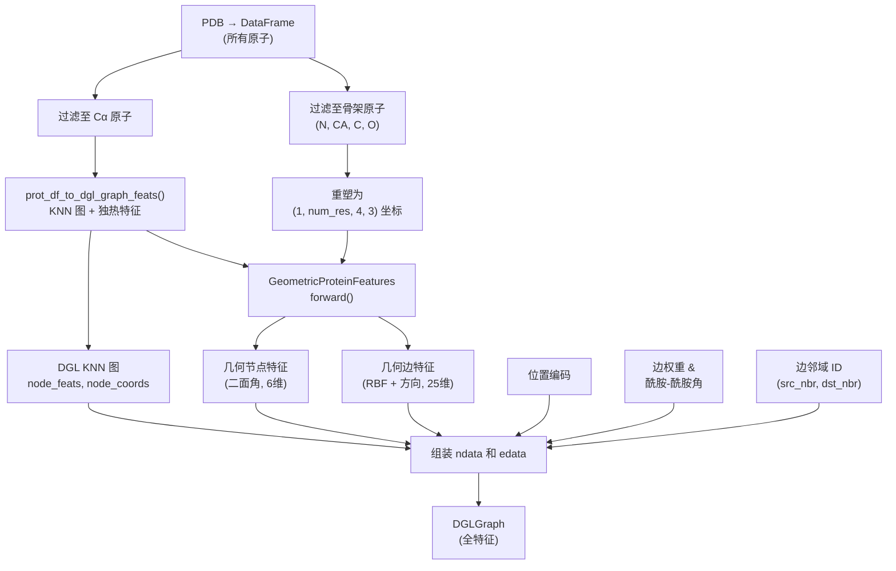

---
slug:11-graph-construction-from-pdb
blog_type:normal
---

DeepInteract 将原始 PDB 蛋白质结构文件转换为特征丰富的 **DGL (Deep Graph Library) 图**，其中每个节点代表一个残基，边通过 k 近邻算法编码空间邻域关系。本页将解释完整的处理流水线——从原子记录的 DataFrame 到在每一个节点和边上承载位置、几何、结构和拓扑信号的全注释图。

## 从 DataFrame 到 KNN 图骨架

图构建的入口是 [`prot_df_to_dgl_graph_feats()`](/project/utils/graph_utils.py#L69-L110)，它接收一个仅过滤保留 Cα 原子的 `pandas.DataFrame` 形式的蛋白质结构。该函数按顺序执行三项职责：**独热节点特征编码**、**坐标提取** 和 **k 近邻边定义**。

节点特征通过迭代声明的特征列（`FEAT_COLS`）及其对应的允许值集合（`ALLOWABLE_FEATS`）来组装。每个特征列经由 [`one_of_k_encoding_unk()`](/project/utils/graph_utils.py#L113-L127) 进行编码，该函数根据三种编码机制进行分派：

| 特征类型 | 条件 | 编码策略 | 示例 |
|---|---|---|---|
| **类别型** | 非空扁平列表 | 追加未知类别的独热编码 | `resname` (20种氨基酸), `ss_value` (8种 DSSP 编码) |
| **标量型** | 空列表 `[]` | 原样传递原始值 | `rsa_value`, `rd_value`, PSAIA 列, `cn_value` |
| **向量型** | 双重嵌套空列表 `[[]]` | 传递向量，并带有缺失值默认值 | `hsaac` (42维), `sequence_feats` (27维), `amide_norm_vec` (3维) |

边通过 DGL 内置的 `dgl.knn_graph()` 建立，该函数在 3D 笛卡尔空间中将每个残基与其 `knn` 个最近邻连接（默认 `knn=20`）。同时通过 `dgl.nn.pytorch.pairwise_squared_distance` 提取成对平方距离，然后进行 top-k 选择以仅保留 KNN 距离。该函数返回一个 4 元组：`(knn_graph, pairwise_dists, node_coords, node_feats)`。

来源: [graph_utils.py](/project/utils/graph_utils.py#L69-L127), [deepinteract_constants.py](/project/utils/deepinteract_constants.py#L64-L96)

## 完整图组装流水线

编排函数 [`convert_df_to_dgl_graph()`](/project/utils/deepinteract_utils.py#L379-L548) 将 KNN 图骨架包装以几何特征、位置编码和边邻域元数据。下图展示了完整的数据流：

### 阶段 1：KNN 图与骨架坐标

该函数首先将输入 DataFrame 分离为两个视图：仅包含 Cα 原子的 `struct_df`（用于图拓扑和节点特征），以及包含所有四个骨架原子 N、CA、C、O 的 `all_atom_struct_df`（用于推导几何特征）。KNN 图通过 `prot_df_to_dgl_graph_feats()` 从 `struct_df` 构建。自环视情况被移除，而孤立节点将触发异常，因为它们表明存在退化结构。

来源: [deepinteract_utils.py](/project/utils/deepinteract_utils.py#L423-L447)

### 阶段 2：几何特征推导

骨架原子坐标被重塑为形状为 `(1, num_residues, 4, 3)` 的张量——每个残基四个原子，每个原子具有 x/y/z 坐标。当缺失骨架原子时，[`substitute_missing_atoms()`](/project/utils/deepinteract_utils.py#L304-L376) 会用可用原子的随机偏移副本替换它们。NaN 坐标被掩码为零，并在具有全有限坐标的残基上计算有效性掩码。

[`GeometricProteinFeatures`](/project/utils/protein_feature_utils.py#L63-L377) 模块（以 `features_type='full'` 和 `num_rbf=18` 实例化）随后推导出：

- **节点特征** — 骨架二面角 (φ, ψ, ω) 通过 `(cos, sin)` 提升为圆周表示，每个残基产生 6 个维度
- **边特征** — 基于成对距离的 18 个径向基函数与 7 维方向特征（3 维局部方向 + 4 维四元数）拼接，每条边产生 25 个维度

几何边特征从 `(1, num_res, knn, 25)` 重塑为 `(num_edges, 25)` 以匹配 DGL 的边主序存储，然后拆分为 `edge_dist_feats` (18维)、`edge_dir_feats` (3维) 和 `edge_orient_feats` (4维)。

来源: [deepinteract_utils.py](/project/utils/deepinteract_utils.py#L449-L483), [protein_feature_utils.py](/project/utils/protein_feature_utils.py#L322-L377)

### 阶段 3：节点数据组装

节点特征按顺序拼接至 `graph.ndata['f']`：

| 特征组件 | 维度 | 索引范围 | 描述 |
|---|---|---|---|
| 位置编码 | 1 | `[0:1]` | 经最大最小归一化的节点 ID |
| 几何特征 | 6 | `[1:7]` | 二面角圆周嵌入 |
| DIPS-Plus 特征 | 106 | `[7:113]` | 独热/标量/向量结构特征 |

此外，`graph.ndata['x']` 存储了原始 Cα 笛卡尔坐标 `(num_residues, 3)`，用于下游的距离计算。

来源: [deepinteract_utils.py](/project/utils/deepinteract_utils.py#L485-L493), [deepinteract_constants.py](/project/utils/deepinteract_constants.py#L99-L116)

### 阶段 4：边数据组装

边特征按顺序拼接至 `graph.edata['f']`：

| 特征组件 | 维度 | 索引范围 | 描述 |
|---|---|---|---|
| 位置编码 | 1 | `[0:1]` | `sin(src_id - dst_id)` |
| 边权重 | 1 | `[1:2]` | 经最大最小归一化的欧氏距离平方 |
| 距离 (RBF) | 18 | `[2:20]` | 基于成对距离的径向基函数 |
| 方向 | 3 | `[20:23]` | 局部坐标系相对方向向量 |
| 方位 | 4 | `[23:27]` | 四元数旋转表示 |
| 酰胺-酰胺角 | 1 | `[27:28]` | 酰胺平面法线间的夹角 |

**酰胺-酰胺角** 通过提取每条边的源残基和目标残基的预计算 `amide_norm_vec`（肽平面的 3D 法向量），然后计算它们点积的反余弦来获得。该角度捕获了肽平面之间的相对倾斜——纯距离和方位特征无法编码的信息。

来源: [deepinteract_utils.py](/project/utils/deepinteract_utils.py#L495-L523)

### 阶段 5：边邻域构建

除了逐边特征外，图还存储了 **边邻域元数据**，供 Geometric Transformer 的边初始化模块使用。对于每条边 *e*，系统分别检索 *e* 的源节点和目标节点的所有入射边，将它们重塑为 `(num_edges, knn, 2)` 批次，随机打乱每个批次，然后截断至 `geo_nbrhd_size` 个条目（默认为 2）。生成的边 ID 存储为：

- `graph.edata['src_nbr_e_ids']` — 形状 `(num_edges, geo_nbrhd_size)`：与每条边的源节点相邻的边的 ID
- `graph.edata['dst_nbr_e_ids']` — 形状 `(num_edges, geo_nbrhd_size)`：与每条边的目标节点相邻的边的 ID

这种邻域结构使得[边初始化模块](7-edge-initialization-module)在计算初始边表示时，能够聚合来自局部连接边的信息。

来源: [deepinteract_utils.py](/project/utils/deepinteract_utils.py#L525-L547)

## 特征编码分派逻辑

[`one_of_k_encoding_unk()`](/project/utils/graph_utils.py#L113-L127) 函数实现了一个三路分派，将 `ALLOWABLE_FEATS` 模式映射到具体的张量编码。正是这种分派机制，使得同一次 `prot_df_to_dgl_graph_feats()` 调用能够处理异构特征类型——类别型残基名称、标量型溶剂可及性值以及向量型半球暴露统计——而无需单独的代码路径。

<CgxTip>当添加新的节点特征列时，你必须更新 `deepinteract_constants.py` 中的三个同步结构：将列名追加到 `FEAT_COLS`，将其允许值列表追加到 `ALLOWABLE_FEATS`（标量使用 `[]`，向量使用 `[[]]`），并使用新的索引范围更新 `FEATURE_INDICES`。`FEAT_COLS` 与 `ALLOWABLE_FEATS` 长度的不匹配将在图构建时引发异常。</CgxTip>

来源: [graph_utils.py](/project/utils/graph_utils.py#L113-L127), [deepinteract_constants.py](/project/utils/deepinteract_constants.py#L64-L116)

## 缺失原子处理

由于低分辨率或无序性，来自 PDB 文件的蛋白质结构经常缺失骨架原子。[`substitute_missing_atoms()`](/project/utils/deepinteract_utils.py#L304-L376) 函数检测少于四个骨架原子的残基，并通过复制可用原子（绝不复制 Cα 本身）的坐标并加上每个笛卡尔分量在 `[-1, 1]` Å 范围内的随机均匀偏移来合成替换。这确保了 `(1, num_res, 4, 3)` 坐标张量始终可以无误差地重塑，同时下游的有效性掩码会使退化残基的几何特征归零，而不是传播 NaN 值。

来源: [deepinteract_utils.py](/project/utils/deepinteract_utils.py#L304-L376)

## 数据集流水线中的图构建

`process_complexes_into_dicts.py` 构建器脚本在数据集规模上编排完整的 PDB 到图的转换。它读取原始的 `.dill` 对文件（每个包含两个蛋白质 DataFrame 及其相互作用标签），然后为每个复合物调用 [`process_complex_into_dict()`](/project/utils/deepinteract_utils.py)（从 `deepinteract_utils` 导入）。关键的配置参数为：

| 参数 | 默认值 | 作用 |
|---|---|---|
| `knn` | 20 | 每个节点的最近邻数量 |
| `geo_nbrhd_size` | 2 | Geometric Transformer 的边邻域大小 |
| `self_loops` | True | 是否在 KNN 图中保留自环 |

构建器通过 `submit_jobs()` 支持并行执行，跨可用 CPU 处理多个复合物，并跳过其输出 `.dill` 文件已存在的任何复合物——从而实现增量数据集构建。

来源: [process_complexes_into_dicts.py](/project/datasets/builder/process_complexes_into_dicts.py#L1-L73)

## 特征索引参考

[`deepinteract_constants.py`](/project/utils/deepinteract_constants.py#L99-L116) 中的 `FEATURE_INDICES` 字典提供了从语义特征名称到张量切片位置的集中映射。模型的前向传播和特征提取工具（例如 `get_geo_feats_from_edges()`）均引用此字典而非硬编码索引，确保特征重排或插入能够正确传播至整个代码库。

<CgxTip>总节点特征维度为 113（1 个位置 + 6 个几何 + 106 个 DIPS-Plus），总边特征维度为 28（1 个位置 + 1 个权重 + 18 个 RBF + 3 个方向 + 4 个方位 + 1 个酰胺角）。这些维度必须与 `FEATURE_INDICES` 和 `GeometricProteinFeatures` 配置（`num_rbf=18`、`features_type='full'`）保持一致。</CgxTip>

来源: [deepinteract_constants.py](/project/utils/deepinteract_constants.py#L99-L116)

## 接下来是什么

理解了图构建流水线后，以下页面将详细说明填充节点和边张量的特定特征类别：

- [几何蛋白质特征](12-geometric-protein-features) — 深入探讨 `GeometricProteinFeatures` 中的二面角、RBF、四元数和氢键计算
- [特征常量与索引](13-feature-constants-and-indices) — `FEAT_COLS`、`ALLOWABLE_FEATS` 和 `FEATURE_INDICES` 的完整目录及逐特征文档