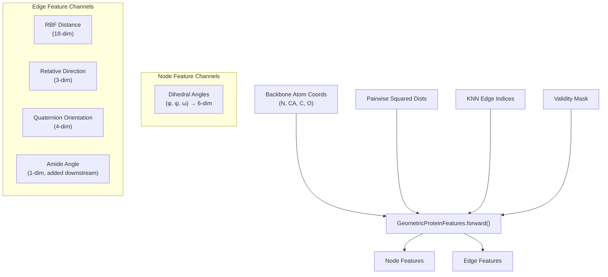
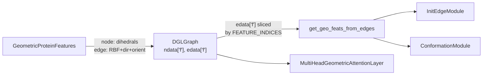

---
slug:12-geometric-protein-features
blog_type:normal
---

DeepInteract 将蛋白质的空间结构编码为一组丰富的**几何节点与边特征**，这些特征直接由骨架原子坐标推导而来。`GeometricProteinFeatures` 模块将原始 3D 坐标 (N, CA, C, O) 转换为具有数学基础的表示——二面角、径向基函数、相对方向和氢键统计量——这些表示构成了 Geometric Transformer 消费的结构词汇表。本页将解释每个特征通道、生成它们的数学运算，以及它们是如何拼接到蛋白质图中的。

## 特征生成流水线

`GeometricProteinFeatures` 类通过一次 `forward` 调用即可编排所有几何特征的推导。其输入为骨架原子坐标、成对平方距离、K近邻边索引以及有效性掩码。其输出为**节点特征张量**（每个残基）和**边特征张量**（每个残基对），二者均由多个几何通道组合而成。

`forward` 方法会分派至由 `features_type` 控制的四种特征模式之一。在生产环境中，DeepInteract 始终使用 `features_type='full'`，该模式将**二面角**分配给节点，并将 **RBF + 方向**特征分配给边。

来源：[protein_feature_utils.py](/project/utils/protein_feature_utils.py#L322-L377), [deepinteract_utils.py](/project/utils/deepinteract_utils.py#L466-L470)

## 节点特征：骨架二面角

`get_dihedrals` 方法根据 N、CA 和 C 原子坐标计算三个标准骨架二面角——**phi (φ)**、**psi (ψ)** 和 **omega (ω)**。该方法将每个残基的前三个骨架原子重组为一个扁平的坐标序列，然后沿骨架链计算连续的单位向量。相邻单位向量的叉积产生**骨架法向量** (n₂, n₁)，这些法向量之间的有符号角度即为各个二面角：

- **cos D** = (n₂ · n₁)，截断至 [−1+ε, 1−ε] 以保证数值稳定性
- **D** = sign((u₂ · n₁)) · arccos(cos D)

所得角度经过填充（移除 φ₀, ψₙ, ωₙ）、重组为逐残基的 (φ, ψ, ω) 三元组，并通过 `[cos(D), sin(D)]` **提升至圆周**以避免在 ±π 处的不连续性。这为每个残基生成了一个 **6 维**的节点特征向量。

来源：[protein_feature_utils.py](/project/utils/protein_feature_utils.py#L276-L320)

## 边特征：径向基函数

`compute_rbfs` 静态方法通过高斯径向基函数将成对平方距离编码为平滑的固定维度表示。给定成对距离 **D**，该方法在范围 [D_min, D_max] = [0, 20] Å 内放置 **D_count** 个等间距中心 μ，带宽 σ = (D_max − D_min) / D_count：

**RBF(D)** = exp( −((D − μ) / σ)² )

在默认 `num_rbf=18` 的情况下，这会产生一个 **18 维**的边特征，在多个尺度上捕获每个残基对之间的距离。高斯基确保了平滑的梯度，并使距离表示适用于下游的线性投影学习。

来源：[protein_feature_utils.py](/project/utils/protein_feature_utils.py#L82-L101)

## 边特征：相对方向

`get_coarse_orientation_feats` 方法是几何上最复杂的组件。它通过在每个残基处构建局部参考系并比较相邻参考系，计算两组特征——**骨架角度-方向特征 (AD_features)** 和 **相对方向特征 (O_features)**。

### 局部参考系构建

从连续的骨架单位向量 u₂, u₁, u₀ 中，该方法推导出：

1. **骨架法向量**：n₂ = normalize(u₂ × u₁), n₁ = normalize(u₁ × u₀)
2. **键角**：A = arccos(−u₁ · u₀)
3. **法向量间的二面角**：D = sign(u₂ · n₁) · arccos(n₂ · n₁)
4. **AD_features** = [cos(A), sin(A)·cos(D), sin(A)·sin(D)] — 一个 3 维的逐节点特征，编码局部骨架几何信息
5. **局部坐标系基**：o₁ = normalize(u₂ − u₁)，然后 O = [o₁, n₂, o₁ × n₂] — 一个 3×3 旋转矩阵，将全局坐标系映射到每个残基的局部坐标系

### 相对方向 (3 维)

对于每条边 (i, j)，位移向量 **dX = X_j − X_i** 被旋转至节点 i 的局部坐标系中：**dU = O_i · dX**，随后进行归一化。这产生了一个 3 维单位向量，表示**从节点 i 的局部坐标系指向邻居 j 的方向**——一种 SE(3) 等变表示。

### 四元数方向 (4 维)

关联 i 和 j 局部参考系的旋转为：**R = O_iᵀ · O_j**。该 3×3 旋转矩阵通过 `convert_rotations_into_quaternions` 转换为单位四元数 **Q**，产生一个紧凑的 4 维表示。转换过程使用了基于迹的方法：实部 w = √(relu(1 + trace(R))) / 2，虚部 通过非对角线元素推导并配合适当的符号解析，最后进行 L2 归一化。

### 组合方向特征

**O_features** = concat(dU, Q) — 一个 **7 维**的边特征（3 维方向 + 4 维四元数）。当 `features_type='full'` 时，完整的边特征为 concat(RBF, O_features) = **25 维**（18 维 RBF + 3 维方向 + 4 维四元数）。

来源：[protein_feature_utils.py](/project/utils/protein_feature_utils.py#L201-L273), [protein_feature_utils.py](/project/utils/protein_feature_utils.py#L104-L149)

## 特征类型模式

`features_type` 参数控制生成哪些特征通道。下表总结了所有四种模式：

| `features_type` | 节点特征 | 边特征 | 用例 |
|---|---|---|---|
| `full` (默认) | 二面角 (6 维) | RBF (18) + 方向 (3) + 四元数 (4) = 25 维 | 生产训练与推理 |
| `coarse` | AD_features (3 维) | RBF (18) + 方向 (3) + 四元数 (4) = 25 维 | 简化骨架编码 |
| `hbonds` | 掩码常量 (3 维) | 接触图 + 氢键 (20 维) | 氢键驱动的注意力 |
| `dist` | 二面角 (6 维) | RBF (18 维) | 仅距离基线 |

`hbonds` 模式额外通过 `get_hbonds` 使用 DSSP 真空静电学模型计算**氢键统计量**，并通过 `get_contacts` 使用 8 Å 截断值计算**接触图**。两者均使用 dropout 进行正则化。

来源：[protein_feature_utils.py](/project/utils/protein_feature_utils.py#L343-L370), [protein_feature_utils.py](/project/utils/protein_feature_utils.py#L152-L199)

## 氢键与接触图

当 `features_type='hbonds'` 时，会计算两个额外的物理相互作用特征：

**氢键** (`get_hbonds`) 使用 DSSP 真空静电学模型。沿 (N − C_prev) 和 (N − CA) 的角平分线放置一个虚拟氢原子 H。静电能 U 计算如下：

**U** = 0.084 × 332 × (1/d(O,N) + 1/d(C,H) − 1/d(O,H) − 1/d(C,N))

当 U < −0.5 kcal/mol 时存在氢键。二值 HB 矩阵沿 KNN 边聚集并进行掩码处理。

**接触图** (`get_contacts`) 应用距离截断：当成对距离 D < 8 Å 时存在接触。二值接触矩阵同样被掩码至 KNN 邻域。

来源：[protein_feature_utils.py](/project/utils/protein_feature_utils.py#L158-L199), [protein_feature_utils.py](/project/utils/protein_feature_utils.py#L152-L157)

## 集成至蛋白质图

`deepinteract_utils.py` 中的 `convert_df_to_dgl_graph` 函数是原始 PDB 数据与几何特征流水线之间的桥梁。它执行以下序列操作：

1. 提取骨架原子 (N, CA, C, O) 并通过 `prot_df_to_dgl_graph_feats` 构建 KNN 图
2. 将全原子坐标重组为 `[1, num_residues, 4, 3]`（批次 × 残基 × 原子 × xyz）
3. 掩码 NaN 坐标并计算有效性掩码
4. 实例化 `GeometricProteinFeatures(num_rbf=18, features_type='full')` 并调用 `forward`
5. 将生成的边特征解析为距离 (18)、方向 (3) 和方向 (4) 子张量
6. 计算残基对之间的**酰胺法向量夹角**作为额外的 1 维边特征
7. 将所有通道拼接到 `graph.ndata['f']` 和 `graph.edata['f']` 中，并在前面添加位置编码

<CgxTip>当 `features_type='full'` 时，最终的边特征张量布局与 `FEATURE_INDICES` 字典完全匹配：索引 2–20 为 RBF 距离，20–23 为方向，23–27 为四元数方向，索引 27 为酰胺角。这种对齐对于 `get_geo_feats_from_edges` 在 ConformationModule 和 InitEdgeModule 中正确切片特征至关重要。</CgxTip>

来源：[deepinteract_utils.py](/project/utils/deepinteract_utils.py#L379-L548), [deepinteract_constants.py](/project/utils/deepinteract_constants.py#L99-L116)

## 酰胺法向量夹角

除了 `GeometricProteinFeatures` 生成的特征外，图构建流水线还附加了一个几何边特征：相邻残基的**酰胺平面法向量之间的夹角**。对于每条边 (i, j)，残基 i 和 j 处肽平面的法向量进行点积，其归一化点积的反余弦即为平面间夹角。此 1 维特征经过最小-最大归一化且对 NaN 安全（在未定义处置零），生成索引 27 处的最终边特征。

来源：[deepinteract_utils.py](/project/utils/deepinteract_utils.py#L506-L523)

## 特征索引映射

`deepinteract_constants.py` 中的 `FEATURE_INDICES` 字典定义了所有下游模块消费的规范张量布局。此映射确保 ConformationModule 和 InitEdgeModule 能够独立访问每个几何通道：

| 特征通道 | 张量键 | 起始索引 | 结束索引 | 维度 |
|---|---|---|---|---|
| 节点位置编码 | `ndata['f']` | 0 | 1 | 1 |
| 节点几何特征 (二面角) | `ndata['f']` | 1 | 7 | 6 |
| 节点 DIPS+ 特征 (独热编码, RSA 等) | `ndata['f']` | 7 | 113 | 106 |
| 边位置编码 | `edata['f']` | 0 | 1 | 1 |
| 边权重 (归一化距离) | `edata['f']` | 1 | 2 | 1 |
| 边 RBF 距离特征 | `edata['f']` | 2 | 20 | 18 |
| 边方向特征 | `edata['f']` | 20 | 23 | 3 |
| 边方向特征 (四元数) | `edata['f']` | 23 | 27 | 4 |
| 边酰胺角 | `edata['f']` | 27 | 28 | 1 |

<CgxTip>`get_geo_feats_from_edges` 实用函数根据 `FEATURE_INDICES` 对边特征进行切片，返回独立的 `(dist_feats, dir_feats, orient_feats, amide_feats)` 张量。这种解耦允许 ConformationModule 在重新组合之前，对每个几何通道应用独立的线性投影和门控。</CgxTip>

来源：[deepinteract_constants.py](/project/utils/deepinteract_constants.py#L99-L116), [deepinteract_utils.py](/project/utils/deepinteract_utils.py#L70-L76)

## 实用操作：收集节点与边

两个底层实用函数支持几何特征计算：

- **`gather_nodes(nodes, neighbor_idx)`** — 在邻居索引处收集节点特征。给定特征 `[B, N, C]` 和索引 `[B, N, K]`，返回邻居特征 `[B, N, K, C]`。用于获取 KNN 邻居的坐标和局部参考系。

- **`gather_edges(edges, neighbor_idx)`** — 在邻居索引处收集边特征。给定特征 `[B, N, N, C]` 和索引 `[B, N, K]`，返回邻居边特征 `[B, N, K, C]`。用于将成对特征（氢键、接触图）掩码至 KNN 邻域。

两者均适配 PyTorch 的 `torch.gather` 以实现带有适当形状重组的批量多索引选择。

来源：[protein_feature_utils.py](/project/utils/protein_feature_utils.py#L10-L27)

## 位置编码

`PositionalEncodings` 模块使用原始 Transformer 频率方案，为边连接的残基对提供正弦位置编码。给定边索引 `E_idx`，它计算相对位置偏移 `d = E_idx − i` 并应用标准角频率：

**frequency_k** = exp(−k · log(10000) / num_embeddings)

**E** = concat(cos(d · freq), sin(d · freq))

这会产生一个 `num_embeddings` 维的编码（默认为 20），捕获沿蛋白质链的序列距离，以序列位置信息补充几何特征。

来源：[protein_feature_utils.py](/project/utils/protein_feature_utils.py#L30-L60)

## 下游消费

此处生成的几何特征由三个下游模块消费：

1. **[InitEdgeModule](7-edge-initialization-module)** — 通过独立的线性层投影每个几何通道（距离、方向、方向、酰胺），然后对组合表示进行门控，以初始化 Geometric Transformer 的边消息。

2. **[ConformationModule](6-conformation-module)** — 独立嵌入每个几何通道，应用残差块，并重构更新后的几何特征，这些特征表示蛋白质结构的*构象演化*（geometry-evolved）状态。

3. **`get_geo_feats_from_edges`** — 切片实用程序，从完整边特征张量中提取 `(dist, dir, orient, amide)` 子张量，使上述模块能够在单个几何通道上操作。

来源：[deepinteract_modules.py](/project/utils/deepinteract_modules.py#L128-L264), [deepinteract_modules.py](/project/utils/deepinteract_modules.py#L267-L334), [deepinteract_utils.py](/project/utils/deepinteract_utils.py#L70-L76)

---

**下一步**：要了解这些几何特征是如何被索引和配置的，请参阅 [Feature Constants and Indices](13-feature-constants-and-indices)。要查看在特征提取之前如何从 PDB 文件组装蛋白质图，请参阅 [Graph Construction from PDB](11-graph-construction-from-pdb)。要探索在 Geometric Transformer 内部如何消费几何特征，请参阅 [Multi-Head Geometric Attention](5-multi-head-geometric-attention) 和 [Conformation Module](6-conformation-module)。