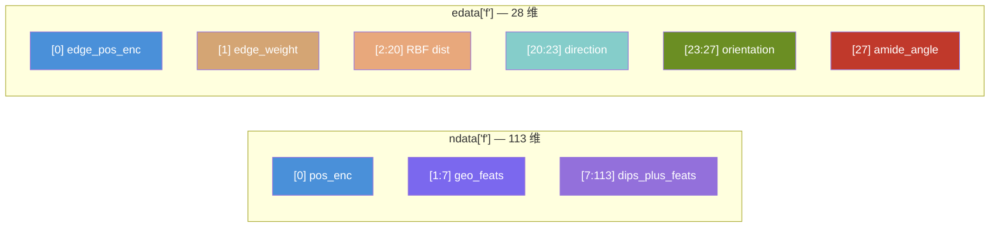

---
slug:13-feature-constants-and-indices
blog_type:normal
---


DeepInteract 的特征流水线由 `deepinteract_constants.py` 中的两个集中注册表管控：**结构常量**用于限制计算复杂度并定义默认填充值，**特征索引映射**用于规定每个节点和边特征通道的精确张量切片位置。这两个注册表共同构成了数据预处理、图构建和模型推理之间的契约——索引与实际拼接张量布局之间的任何偏移，都会悄无声息地破坏几何注意力。本页将剖析这两个注册表，追踪它们在图构建和模型层中的消费路径，并阐明使系统保持连贯的维度算术。

## 结构常量与限制

`deepinteract_constants.py` 的顶部定义了限制输入图大小和控制 KNN 稀疏性的硬性上限。这些并非针对每次实验调整的超参数，而是决定整个流水线中张量分配形状的**架构不变量**。

| 常量 | 值 | 用途 |
|---|---|---|
| `ATOM_COUNT_LIMIT` | 2048 | 原子级编码（DIPS-Plus）中每个复合物的最大原子数 |
| `RESIDUE_COUNT_LIMIT` | 256 | 每条链的最大残基数；根据经验调整以保证训练稳定 |
| `NODE_COUNT_LIMIT` | 2304 | Geometric Transformer 节点数的上限（≈ 9 批大小 × 256 残基） |
| `KNN` | 20 | 图消息传递边的默认最近邻数量 |
| `HSAAC_DIM` | 42 | 半球氨基酸组成维度：2 + (2 × 20) |
| `NUM_ALLOWABLE_NANS` | 5 | 触发零填充前每列允许的 NaN 阈值 |

`NODE_COUNT_LIMIT = 2304` 由 `9 × 256` 计算得出，可在单个批次中容纳多达 9 个残基层图，且不会在 Geometric Transformer 的 O(N²K) 注意力复杂度下超出 GPU 内存。`HSAAC_DIM = 42` 则涵盖了在两个半球中计数的 20 种标准氨基酸，外加未知残基符号 `'-'` 的两个条目。

来源: [deepinteract_constants.py](project/utils/deepinteract_constants.py#L9-L55)

## 氨基酸与序列编码常量

残基标识通过一个有序的 21 字符字母表（20 种标准氨基酸 + 缺口符号）以及三字母码和单字母码之间的双向映射来管理。

```python
AMINO_ACIDS = 'ACDEFGHIKLMNPQRSTVWY-'
AMINO_ACID_IDX = dict(zip(AMINO_ACIDS, range(len(AMINO_ACIDS))))  # 例如 'A'→0, 'C'→1, ..., '-'→20
```

`D3TO1` 字典提供了从 PDB 三字母残基码（例如 `'CYS'`）到单字母码（例如 `'C'`）的 20 项映射，在构建残基层 DataFrame 进行 PDB 解析时被使用。`AMINO_ACIDS` 中的缺口符号 `'-'` 至关重要：它作为独热编码的**未知分箱**——任何不在允许集合中的残基类型都会被映射到此最终位置，遵循 `one_of_k_encoding_unk` 约定。

来源: [deepinteract_constants.py](project/utils/deepinteract_constants.py#L39-L61)

## 特征列模式与允许值

`FEAT_COLS` 列表声明了从每个残基的 DataFrame 行中提取的特征列的有序序列，而 `ALLOWABLE_FEATS` 指定了每列的编码策略。两者的长度必须完全匹配——不匹配将在 `prot_df_to_dgl_graph_feats` 中引发异常。

| 索引范围 | 列 | 编码策略 | 维度 |
|---|---|---|---|
| [7:27] | `resname` | 20 种标准残基上的独热编码 | 20 |
| [27:35] | `ss_value` | 8 种 DSSP 编码 (H,B,E,G,I,T,S,-) 上的独热编码 | 8 |
| [35:36] | `rsa_value` | 标量（相对溶剂可及性） | 1 |
| [36:37] | `rd_value` | 标量（残基深度） | 1 |
| [37:43] | PSAIA 6 列 | 各为标量（凸包统计量） | 6 |
| [43:85] | `hsaac` | 向量（半球氨基酸组成） | 42 |
| [85:86] | `cn_value` | 标量（接触数） | 1 |
| [86:113] | `sequence_feats` | 向量（预计算的序列特征） | 27 |
| — | `amide_norm_vec` | 单独存储的向量（不在节点特征中） | 3 |

**DIPS-Plus 特征总维度**为 106（索引 7–113），在其前面拼接 7 维几何节点特征（索引 1–7）和 1 维位置编码（索引 0），即可得到完整的节点特征张量宽度 **113**。

`ALLOWABLE_FEATS` 中的编码策略遵循三种模式：
- **填充的扁平列表**（例如 20 个残基名称）：独热编码，将未知值映射至最后一个元素。
- **空的扁平列表** `[]`（例如 `rsa_value`）：标量原样传递，不作修改。
- **双重嵌套的空列表** `[[]]`（例如 `hsaac`, `sequence_feats`）：完整向量原样传递；空向量将触发 `DEFAULT_MISSING_HSAAC` 填充。

来源: [deepinteract_constants.py](project/utils/deepinteract_constants.py#L64-L96), [graph_utils.py](project/utils/graph_utils.py#L69-L127)

## 缺失特征默认值

当 PDB 解析或外部工具计算（PSAIA、DSSP）对某个残基失败时，系统将回退到层级式的默认填充值：

| 常量 | 值 | 用途 |
|---|---|---|
| `DEFAULT_MISSING_FEAT_VALUE` | `np.nan` | 所有缺失标量/向量的基础填充值 |
| `DEFAULT_MISSING_SS` | `'-'` | 未知二级结构（在独热编码中映射到缺口分箱） |
| `DEFAULT_MISSING_RSA` | `np.nan` | 缺失的相对溶剂可及性 |
| `DEFAULT_MISSING_RD` | `np.nan` | 缺失的残基深度 |
| `DEFAULT_MISSING_PROTRUSION_INDEX` | `[np.nan] × 6` | 缺失的 PSAIA 突出指数向量 |
| `DEFAULT_MISSING_HSAAC` | `[np.nan] × 42` | 缺失的半球氨基酸组成 |
| `DEFAULT_MISSING_CN` | `np.nan` | 缺失的接触数 |
| `DEFAULT_MISSING_SEQUENCE_FEATS` | `np.array([np.nan] × 27)` | 缺失的预计算序列特征 |
| `DEFAULT_MISSING_NORM_VEC` | `[np.nan] × 3` | 缺失的酰胺平面法向量 |

`NUM_ALLOWABLE_NANS = 5` 常量控制着后处理插补步骤：如果某一列在整个数据集中包含 5 个或更少的 NaN 值，这些 NaN 将被插补为零；否则，该列将被标记以引起注意。此阈值在保留信息与防止稀疏 NaN 向下游注意力层传播的风险之间取得了平衡。

来源: [deepinteract_constants.py](project/utils/deepinteract_constants.py#L42-L55)

## 特征索引注册表：张量切片契约

`FEATURE_INDICES` 字典是对拼接的节点和边特征张量进行切片的**唯一事实来源**。它被 `InitEdgeModule`、`ConformationModule` 和 `get_geo_feats_from_edges` 消费，以提取几何子张量而无需使用魔法数字。

```python
FEATURE_INDICES = {
    # 节点特征索引
    'node_pos_enc': 0,                  # 位置编码 (1维)
    'node_geo_feats_start': 1,          # 几何二面角特征起始
    'node_geo_feats_end': 7,            # 几何二面角特征结束 (6维: φ,ψ,ω 的 cos/sin)
    'node_dips_plus_feats_start': 7,    # DIPS-Plus 残基特征起始
    'node_dips_plus_feats_end': 113,    # DIPS-Plus 残基特征结束 (106维)
    # 边特征索引
    'edge_pos_enc': 0,                  # 正弦边位置编码 (1维)
    'edge_weights': 1,                  # 归一化欧氏距离权重 (1维)
    'edge_dist_feats_start': 2,         # RBF 距离特征起始
    'edge_dist_feats_end': 20,          # RBF 距离特征结束 (18维, 对应 18 个 RBF)
    'edge_dir_feats_start': 20,         # 相对方向特征起始
    'edge_dir_feats_end': 23,           # 相对方向特征结束 (3维)
    'edge_orient_feats_start': 23,      # 四元数方向特征起始
    'edge_orient_feats_end': 27,        # 四元数方向特征结束 (4维)
    'edge_amide_angles': 27             # 酰胺平面法向量夹角 (1维)
}
```

下图展示了特征张量的组装和索引方式：



来源: [deepinteract_constants.py](project/utils/deepinteract_constants.py#L98-L116)

## 模型层中的索引消费

`FEATURE_INDICES` 字典被直接导入并用于 `InitEdgeModule`（以及扩展的 `ConformationModule`）中，以将原始边特征张量 `edata['f']` 分解为其几何子分量。辅助函数 `get_geo_feats_from_edges` 执行切片操作：

```python
def get_geo_feats_from_edges(orig_edge_feats, feature_indices):
    dist_feats   = orig_edge_feats[:, feature_indices['edge_dist_feats_start']:feature_indices['edge_dist_feats_end']]    # [2:20]
    dir_feats    = orig_edge_feats[:, feature_indices['edge_dir_feats_start']:feature_indices['edge_dir_feats_end']]        # [20:23]
    o_feats      = orig_edge_feats[:, feature_indices['edge_orient_feats_start']:feature_indices['edge_orient_feats_end']]  # [23:27]
    amide_feats  = orig_edge_feats[:, feature_indices['edge_amide_angles']]                                                  # [27]
    return dist_feats, dir_feats, o_feats, amide_feats
```

在 `InitEdgeModule.init_edge_module_message_func` 内部，边位置编码和权重通过标量索引单独提取（`edge_pos_enc = edges.data['f'][:, 0]`，`edge_weights = edges.data['f'][:, 1]`），然后其余几何特征通过 `get_geo_feats_from_edges` 进行切片。每个子张量都通过各自的线性层（`dist_linear`、`dir_linear`、`orient_linear`、`amide_linear`）进行投影，激活后由组合的边 logit 门控，最后求和——这是一种**分解-门控-组合**模式，既保留了几何可解释性，又允许模型独立调节每个特征通道。

来源: [deepinteract_utils.py](project/utils/deepinteract_utils.py#L70-L76), [deepinteract_modules.py](project/utils/deepinteract_modules.py#L19-L22), [deepinteract_modules.py](project/utils/deepinteract_modules.py#L128-L250)

## 维度验证：节点特征组装

节点特征张量在 `convert_df_to_dgl_graph` 中通过三个连续拼接步骤组装，这些步骤必须与 `FEATURE_INDICES` 完全对齐：

| 步骤 | 操作 | 形状贡献 | 累计索引范围 |
|---|---|---|---|
| 1 | 位置编码：`min_max_normalize_tensor(graph.nodes())` | `[N, 1]` | [0:1] |
| 2 | 几何特征：`geo_node_feats`（通过 `get_dihedrals` 获取二面角） | `[N, 6]` | [1:7] |
| 3 | DIPS-Plus 特征：`node_feats`（来自 `prot_df_to_dgl_graph_feats`） | `[N, 106]` | [7:113] |

**步骤 2** 产生 6 维二面角特征，因为 `get_dihedrals` 通过 `torch.cat((torch.cos(D), torch.sin(D)), 2)` 将三个主链角度 (φ, ψ, ω) 提升为圆周表示，从而为每个残基生成 3 × 2 = 6 个值。**步骤 3** 根据 `FEAT_COLS`/`ALLOWABLE_FEATS` 编码累积 106 个 DIPS-Plus 特征：20 (resname) + 8 (SS) + 1 (RSA) + 1 (RD) + 6 (PSAIA) + 42 (HSAAC) + 1 (CN) + 27 (sequence_feats) = 106。`amide_norm_vec` 被刻意从节点特征中排除，而是单独存储，用于边级酰胺角计算。

来源: [deepinteract_utils.py](project/utils/deepinteract_utils.py#L485-L493), [protein_feature_utils.py](project/utils/protein_feature_utils.py#L276-L320)

## 维度验证：边特征组装

边特征张量通过六个拼接步骤组装：

| 步骤 | 操作 | 形状贡献 | 累计维度 | 索引范围 |
|---|---|---|---|---|
| 1 | 正弦位置编码：`sin(src - dst)` | `[E, 1]` | 1 | [0:1] |
| 2 | 边权重：归一化欧氏距离 | `[E, 1]` | 2 | [1:2] |
| 3 | RBF 距离：使用 `num_rbf=18` 的 `compute_rbfs` | `[E, 18]` | 20 | [2:20] |
| 4 | 相对方向：`dU`（局部坐标系中的单位向量） | `[E, 3]` | 23 | [20:23] |
| 5 | 方向：来自旋转矩阵的四元数 `Q` | `[E, 4]` | 27 | [23:27] |
| 6 | 酰胺角：法向量点积的反余弦 | `[E, 1]` | 28 | [27:28] |

**边特征总维度：28。** 步骤 3–5 源自 `GeometricProteinFeatures.forward` 且 `features_type='full'`，它将 RBF 特征与方向特征 `(dU, Q)` 拼接为 `geo_edge_feats`。酰胺角（步骤 6）在 `GeometricProteinFeatures` 外部计算，通过直接访问残基 DataFrame 中的 `amide_norm_vec` 列，并为每条边计算 `arccos(dot(n₁, n₂) / (‖n₁‖·‖n₂‖))`，其中 NaN 值通过 `np.nan_to_num` 置零。

<CgxTip>`FEATURE_INDICES` 契约是脆弱的：如果节点或边拼接序列中的任何步骤被重新排序或调整大小，则必须同步更新相应的索引条目。当前没有运行时断言来验证维度对齐——悄无声息的不匹配将产生损坏的注意力分数，而不会抛出任何错误。</CgxTip>

来源: [deepinteract_utils.py](project/utils/deepinteract_utils.py#L495-L523), [protein_feature_utils.py](project/utils/protein_feature_utils.py#L322-L377)

## PSAIA 特征列

六个 PSAIA（蛋白质结构与交互分析器）列代表基于凸包的溶剂可及性统计量，这些统计量在外部计算并在后处理期间合并到残基 DataFrame 中：

| 列 | 描述 |
|---|---|
| `avg_cx` | 残基中所有原子的平均凸包值 |
| `s_avg_cx` | 凸包值的标准差 |
| `s_ch_avg_cx` | 链平均凸包值 |
| `s_ch_s_avg_cx` | 链平均凸包值的标准差 |
| `max_cx` | 残基中的最大凸包值 |
| `min_cx` | 残基中的最小凸包值 |

它们被视为标量特征（`ALLOWABLE_FEATS` 条目为空），不经独热编码直接传递。缺失的 PSAIA 值回退至 `DEFAULT_MISSING_FEAT_VALUE` (NaN)，随后由插补流水线处理。

来源: [deepinteract_constants.py](project/utils/deepinteract_constants.py#L36-L36)

## 默认数据集统计记录器

`DEFAULT_DATASET_STATISTICS` 字典初始化一个后处理记录器，用于跟踪整个数据集的特征完整性。其键枚举了每个可能包含缺失值的特征通道，并按链（`df0` / `df1`）进行划分：

```
num_of_valid_df0_ss_values, num_of_valid_df1_ss_values,
num_of_valid_df0_rsa_values, num_of_valid_df1_rsa_values,
num_of_valid_df0_rd_values, num_of_valid_df1_rd_values,
num_of_valid_df0_protrusion_indices, num_of_valid_df1_protrusion_indices,
num_of_valid_df0_hsaacs, num_of_valid_df1_hsaacs,
num_of_valid_df0_cn_values, num_of_valid_df1_cn_values,
num_of_valid_df0_sequence_feats, num_of_valid_df1_sequence_feats,
num_of_valid_df0_amide_normal_vecs, num_of_valid_df1_amide_normal_vecs
```

此字典在数据集后处理期间递增（参见构建器目录中的 `collect_dataset_statistics.py` 和 `log_dataset_statistics.py`），并为决定对给定特征列是进行插补还是排除提供诊断依据。

来源: [deepinteract_constants.py](project/utils/deepinteract_constants.py#L19-L29)

## 下一步

既然特征常量和索引注册表现已映射完毕，自然的进展是追踪这些常量如何流入调用 `convert_df_to_dgl_graph` 和 `prot_df_to_dgl_graph_feats` 的**数据集构建流水线**。有关端到端数据流水线，请参见 [DIPS 和 DB5 数据集](14-dips-and-db5-datasets)，或者回顾 [几何蛋白质特征](12-geometric-protein-features)，了解填充索引 1–7（节点）和 2–27（边）的几何特征通道的数学推导。