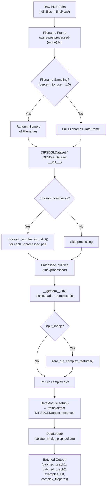

---
slug:14-dips-and-db5-datasets
blog_type:normal
---


DeepInteract 附带了两个精选的蛋白质-蛋白质相互作用数据集——**DIPS-Plus**（大规模结合物训练语料库）和 **DB5-Plus**（用于评估的标准 Docking Benchmark 5）——每个数据集均实现为配对的 DGL 数据集和 PyTorch Lightning `DataModule`。两者共同构成了主要的训练-验证-测试流水线：DIPS-Plus 提供海量的训练信号，而 DB5-Plus 则为泛化测试提供严格的不结合基准。

## 数据集概述与划分统计

两个数据集均继承自 DGL 的 `DGLDataset` 基类，并共享相同的输出约定——一个包含两个 DGLGraph、一个标签张量以及元数据的字典——但它们在生物学设定和规模上存在根本差异。

| 属性 | DIPS-Plus (`DIPSDGLDataset`) | DB5-Plus (`DB5DGLDataset`) |
|---|---|---|
| **复合物类型** | 结合物结构 | 不结合结构 |
| **训练样本** | 15,618 | 140 |
| **验证样本** | 3,548 | 35 |
| **测试样本** | 32 | 55 |
| **总样本数** | 19,198 | 230 |
| **每个复合物的链数** | 2 | 2 |
| **默认 `mode`** | `'train'` | `'test'` |
| **节点特征** | 113 | 113 |
| **边特征** | 27 | 27 |
| **Zenodo URL** | `…/final_processed_dips.tar.gz.partaa` | `…/final_processed_db5.tar.gz` |
| **DGLDataset 名称** | `'DIPS-Plus'` | `'DB5-Plus'` |

DIPS-Plus 的规模比 DB5-Plus **大近 83 倍**，这反映了其作为主训练语料库的定位。DB5-Plus 默认 `mode='test'`，因为它的主要用途是在不结合对接结构上评估已训练的模型，而非从头开始训练。

来源：[dips_dgl_dataset.py](project/datasets/DIPS/dips_dgl_dataset.py#L19-L74)，[db5_dgl_dataset.py](project/datasets/DB5/db5_dgl_dataset.py#L13-L64)

## 架构流水线

下图展示了从原始 PDB 对到图构建，再到模型消费的批量输出的端到端数据流：



来源：[dips_dgl_dataset.py](project/datasets/DIPS/dips_dgl_dataset.py#L76-L147)，[db5_dgl_dataset.py](project/datasets/DB5/db5_dgl_dataset.py#L66-L126)，[deepinteract_utils.py](project/utils/deepinteract_utils.py#L61-L67)

## 数据集类内部机制

### 文件名解析与采样

两个数据集首先解析文件名清单——一个列出给定划分（例如 `pairs-postprocessed-train.txt`）所有复合物的纯文本文件。工具函数 `construct_filenames_frame_txt_filenames` 根据 `mode`、`percent_to_use` 和 `root` 目录拼接路径。当 `percent_to_use` 严格介于 0 和 1 之间时，数据集会从文件名帧中随机采样该比例的文件名，将采样子集写入新的 `.txt` 文件，并将其用于所有后续操作。这允许在不修改原始划分文件的情况下，对数据集子集进行快速原型设计。

来源：[deepinteract_utils.py](project/utils/deepinteract_utils.py#L87-L100)，[dips_dgl_dataset.py](project/datasets/DIPS/dips_dgl_dataset.py#L105-L134)，[db5_dgl_dataset.py](project/datasets/DB5/db5_dgl_dataset.py#L90-L119)

### `process()` 方法——按需复合物处理

当 `process_complexes=True` 时，`process()` 方法会遍历清单中的每个文件名，并通过 `process_complex_into_dict` 将每个原始 `.dill` 对转换为处理后的 `.dill` 字典。处理过程是**幂等**的：如果处理后的文件已存在于 `processed_filepath`，则会跳过。这种设计意味着首次运行会产生一次性的预处理开销，此后的运行将直接加载缓存的字典。

`process_complex_into_dict` 函数编排了完整的转换流程：(1) 通过 `pd.read_pickle` 加载原始 `Pair` 对象；(2) 从每条链的 DataFrame 中分离出 CA 原子；(3) 可选地针对原始 FASTA 验证残基序列；(4) 通过 `convert_df_to_dgl_graph` 将全原子 DataFrame 转换为 DGLGraph；(5) 通过 `build_examples_tensor` 组装链间标签张量；(6) 序列化包含 `graph1`、`graph2`、`examples` 和 `complex` 键的最终字典。

来源：[dips_dgl_dataset.py](project/datasets/DIPS/dips_dgl_dataset.py#L170-L183)，[db5_dgl_dataset.py](project/datasets/DB5/db5_dgl_dataset.py#L148-L161)，[deepinteract_utils.py](project/utils/deepinteract_utils.py#L912-L954)

### `__getitem__()` 方法——复合物检索

对任一数据集进行索引操作时，会对相应的已处理 `.dill` 文件执行反序列化，并返回具有以下结构的字典：

| 键 | 类型 | 描述 |
|---|---|---|
| `graph1` | `dgl.DGLGraph` | 链 1 的图（M 个节点），具有 `ndata['f']`（113 维）、`ndata['x']`（3D 坐标）、`edata['f']`（27 维）、`edata['src_nbr_e_ids']`、`edata['dst_nbr_e_ids']` |
| `graph2` | `dgl.DGLGraph` | 链 2 的图（N 个节点），特征模式与 `graph1` 相同 |
| `examples` | `torch.Tensor` | 形状为 `(M×N, 3)`——每行为 `(chain_0_res_id, chain_1_res_id, interaction_label)` |
| `complex` | `str` | 复合物代码及原始 PDB 文件名 |
| `filepath` | `str` | 已处理 `.dill` 文件的路径（在检索时添加） |

如果 `input_indep=True`，则通过 `zero_out_complex_features` 将两个图的节点和边特征张量清零，从而实现 Karpathy 的输入无关健全性检查基线。

<CgxTip>`train_viz` 参数（仅限 DIPS-Plus）将单个复合物复制 5,532 次，以支持在需要每个 rank 至少一个验证样本的大型多 GPU 设置上进行可视化。这由 `DIPSDGLDataset.__init__` 内部的 `n = 5532` 常量控制。</CgxTip>

来源：[dips_dgl_dataset.py](project/datasets/DIPS/dips_dgl_dataset.py#L196-L249)，[db5_dgl_dataset.py](project/datasets/DB5/db5_dgl_dataset.py#L174-L223)，[deepinteract_utils.py](project/utils/deepinteract_utils.py#L956-L962)

## DataModule 集成

每个数据集都有一个配套的 `LightningDataModule`，它将三个数据划分（`train`、`val`、`test`）连接到 PyTorch 的 `DataLoader` 实例中。这些 DataModule 是轻量级的编排层——它们在 `setup()` 中分别实例化相应的 `DGLDataset` 三次（每个划分一次），并暴露标准的 `train_dataloader()`、`val_dataloader()` 和 `test_dataloader()` 钩子。

### DIPS-Plus DataModule 参数

| 参数 | 类型 | 描述 |
|---|---|---|
| `data_dir` | `str` | 原始/处理后文件的根目录 |
| `batch_size` | `int` | 每批样本数 |
| `num_dataloader_workers` | `int` | 用于并行加载的 CPU 线程数 |
| `knn` | `int` | 每个节点的 K 近邻边数（默认 20） |
| `self_loops` | `bool` | 节点是否自连 |
| `pn_ratio` | `float` | 训练时的正负标签比例 |
| `percent_to_use` | `float` | 每个划分的加载比例 |
| `process_complexes` | `bool` | 按需处理未处理的配对 |
| `input_indep` | `bool` | 为基线清零特征 |

### DB5-Plus DataModule 参数

| 参数 | 类型 | 描述 |
|---|---|---|
| `data_dir` | `str` | 原始/处理后文件的根目录 |
| `batch_size` | `int` | 每批样本数 |
| `num_dataloader_workers` | `int` | 用于并行加载的 CPU 线程数 |
| `knn` | `int` | 每个节点的 K 近邻边数（默认 20） |
| `self_loops` | `bool` | 节点是否自连 |
| `percent_to_use` | `float` | 每个划分的加载比例 |
| `process_complexes` | `bool` | 按需处理未处理的配对 |
| `input_indep` | `bool` | 为基线清零特征 |

请注意，**DIPS-Plus 暴露了 `pn_ratio`**（用于在训练期间控制正负类别的平衡），而 **DB5-Plus 则没有**——该基准评估在其原生类别分布下进行。

<CgxTip>所有三个 DataLoader 都使用 `dgl_picp_collate` 整理函数，该函数通过 `dgl.batch()` 分别批处理两个图，并收集每个复合物的样本列表和文件路径。这保留了 GINI 交互模块所需的图间结构。</CgxTip>

来源：[dips_dgl_data_module.py](project/datasets/DIPS/dips_dgl_data_module.py#L15-L61)，[db5_dgl_data_module.py](project/datasets/DB5/db5_dgl_data_module.py#L10-L61)

## 整理策略

共享的 `dgl_picp_collate` 函数接收一个复合物字典列表，并生成一个 4 元组：

```
(batched_graph1, batched_graph2, examples_list, complex_filepaths)
```

- **`batched_graph1`** / **`batched_graph2`**：由 `dgl.batch()` 创建的 DGL 异构批次图，该函数会拼接节点/边张量并调整内部索引映射。
- **`examples_list`**：每个复合物标签张量的 Python 列表——**未**拼接成单个张量——因为每个复合物具有不同的 `(M × N)` 标签矩阵大小。
- **`complex_filepaths`**：标识批次中每个复合物的字符串 Python 列表，用于下游的日志记录和指标归属。

来源：[deepinteract_utils.py](project/utils/deepinteract_utils.py#L61-L67)

## 下载与缓存

两个数据集都实现了用于远程数据检索的 `DGLDataset` 约定。`download()` 方法从 Zenodo 获取 `.tar.gz` 归档文件，验证其 SHA-1 哈希值，并将其解压到原始目录中。`has_cache()` 方法检查文件名清单中列出的每个复合物是否都有对应的已处理 `.dill` 文件；如果缺少任何文件，则会抛出 `FileNotFoundError` 并附带提示性消息。

| 数据集 | 归档文件 | SHA-1 已验证 |
|---|---|---|
| DIPS-Plus | `final_processed_dips.tar.gz.partaa` | 是 |
| DB5-Plus | `final_processed_db5.tar.gz` | 是 |

来源：[dips_dgl_dataset.py](project/datasets/DIPS/dips_dgl_dataset.py#L149-L194)，[db5_dgl_dataset.py](project/datasets/DB5/db5_dgl_dataset.py#L127-L172)

## 特征维度约定

两个数据集强制执行相同的特征维度，从而确保无论哪个数据集提供批次，模型架构都能保持兼容：

| 特征类别 | 存储 | 维度 | 索引范围 |
|---|---|---|---|
| 节点位置编码 | `ndata['f'][:, 0]` | 1 | 0–1 |
| 几何节点特征 | `ndata['f'][:, 1:7]` | 6 | 1–7 |
| DIPS-Plus/DB5-Plus 节点特征 | `ndata['f'][:, 7:113]` | 106 | 7–113 |
| **总节点特征** | `ndata['f']` | **113** | 0–113 |
| 边位置编码 | `edata['f'][:, 0]` | 1 | 0–1 |
| 边权重 | `edata['f'][:, 1]` | 1 | 1–2 |
| 边距离 (RBF) | `edata['f'][:, 2:20]` | 18 | 2–20 |
| 边方向 | `edata['f'][:, 20:23]` | 3 | 20–23 |
| 边取向 | `edata['f'][:, 23:27]` | 4 | 23–27 |
| 边酰胺角 | `edata['f'][:, 27]` | 1 | 27 |
| **总边特征** | `edata['f']` | **27+1=28** | 0–28 |

此外，每个图还存储了 `ndata['x']`（3D 笛卡尔坐标）、`edata['src_nbr_e_ids']` 和 `edata['dst_nbr_e_ids']`，用于几何 Transformer 的边邻域。

来源：[dips_dgl_dataset.py](project/datasets/DIPS/dips_dgl_dataset.py#L262-L269)，[db5_dgl_dataset.py](project/datasets/DB5/db5_dgl_dataset.py#L239-L247)，[deepinteract_utils.py](project/utils/deepinteract_utils.py#L401-L421)

## 核心差异总结

| 方面 | DIPS-Plus | DB5-Plus |
|---|---|---|
| 生物学状态 | 结合（共结晶） | 不结合（独立单体） |
| 主要角色 | 训练与验证 | 基准评估 |
| `pn_ratio` 参数 | 可用（默认 0.1） | 不可用 |
| `train_viz` 参数 | 可用（可视化模式） | 不可用 |
| 默认 `mode` | `'train'` | `'test'` |
| 规模 | 19,198 个复合物 | 230 个二聚体 |
| 下载归档 | 多部分（`.partaa`） | 单个 `.tar.gz` |
| 日志风格 | `logging.info()` | `print()` |

来源：[dips_dgl_dataset.py](project/datasets/DIPS/dips_dgl_dataset.py#L19-L280)，[db5_dgl_dataset.py](project/datasets/DB5/db5_dgl_dataset.py#L13-L258)

---

**下一步**：通过 [Graph Construction from PDB](11-graph-construction-from-pdb) 了解如何从原始 PDB 数据构建图结构，在 [Geometric Protein Features](12-geometric-protein-features) 中探索几何特征计算，或查看这些数据集如何在 [Lightning Training Pipeline](17-lightning-training-pipeline) 中接入训练循环。