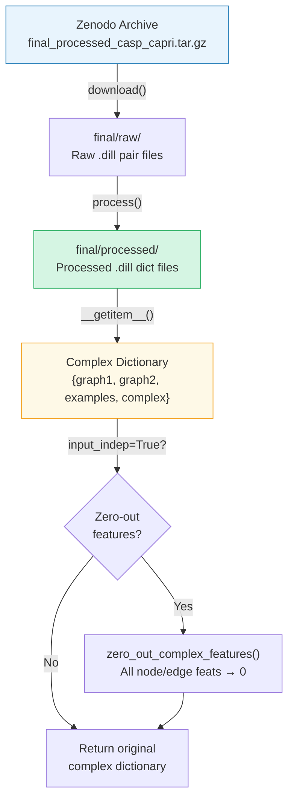
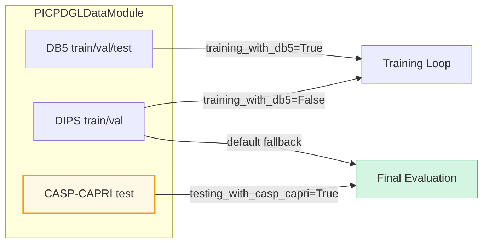

---
slug:15-casp-capri-benchmark
blog_type:normal
---


**CASP-CAPRI 基准测试**是 DeepInteract 专用的分布外测试集，用于评估模型在未见结构目标上的蛋白质-蛋白质界面接触预测性能。该基准数据来源于第 13 和 14 轮预测相互作用关键评估（CAPRI）社区实验（嵌入在 CASP 结构预测周期中），包含 **19 个结合态蛋白质二聚体**（14 个同源二聚体和 5 个异源二聚体），作为严格的泛化探针，与从 DIPS 或 DB5 中提取的训练和验证复合物完全不同。由于 CASP-CAPRI 目标是竞赛期间 PDB 中不存在的新结构，它们提供了对现实世界预测性能的无偏估计，使其成为 DeepInteract 中最终模型评估的黄金标准。

来源: [casp_capri_dgl_dataset.py](project/datasets/CASP_CAPRI/casp_capri_dgl_dataset.py#L13-L61), [picp_dgl_data_module.py](project/datasets/PICP/picp_dgl_data_module.py#L48-L50)

## 数据集统计与结构

CASP-CAPRI 数据集是一个**仅限测试**的集合——没有训练或验证划分。这种设计选择是刻意的：该基准仅用于衡量在结构不相关复合物（DIPS 或 DB5）上训练的模型向新目标的迁移能力。该数据集展示以下不变属性：

| 属性 | 值 |
|---|---|
| **测试同源二聚体** | 14 |
| **测试异源二聚体** | 5 |
| **二聚体总数** | 19 |
| **每个复合物的链数** | 2 |
| **类别（相互作用 / 非相互作用）** | 2 |
| **每个残基的节点特征** | 113 |
| **每个残基对的边特征** | 27 |
| **可用模式** | 仅 `test` |

每个复合物存储为一个**序列化字典**（`.dill` 格式），包含两个 DGLGraph 结构、一个链间标签张量和元数据。`__getitem__` 方法返回包含以下键的字典：

| 键 | 类型 | 描述 |
|---|---|---|
| `complex['graph1']` | `dgl.DGLGraph` | 链 1 的图，包含节点/边特征（M 个节点） |
| `complex['graph2']` | `dgl.DGLGraph` | 链 2 的图，包含节点/边特征（N 个节点） |
| `complex['examples']` | `torch.Tensor` | 链间残基对的标签张量，形状为 `(M × N) × 3` |
| `complex['complex']` | `str` | 复合物代码及原始 PDB 文件名 |
| `complex['filepath']` | `str` | 处理后复合物的文件路径 |

来源: [casp_capri_dgl_dataset.py](project/datasets/CASP_CAPRI/casp_capri_dgl_dataset.py#L16-L61), [casp_capri_dgl_dataset.py](project/datasets/CASP_CAPRI/casp_capri_dgl_dataset.py#L171-L200), [casp_capri_dgl_dataset.py](project/datasets/CASP_CAPRI/casp_capri_dgl_dataset.py#L226-L244)

## 数据管线架构

CASP-CAPRI 管线遵循 DGLDataset 契约，包含三个生命周期阶段——**下载**、**处理**和**缓存验证**——由 `CASPCAPRIDGLDataset` 类统筹协调。从原始 PDB 数据到模型就绪字典的整体流程如下所示：



### 下载阶段

当 `raw_dir` 为空时，`download()` 从 **Zenodo**（`https://zenodo.org/record/6299835/files/final_processed_casp_capri.tar.gz`）检索预打包的 TAR 存档，通过 SHA-1 哈希校验验证其完整性，并将其解压到 `raw_dir` 的父目录中。这确保了可复现性——每位研究人员都能获得位级一致的原始数据。

来源: [casp_capri_dgl_dataset.py](project/datasets/CASP_CAPRI/casp_capri_dgl_dataset.py#L124-L143), [casp_capri_dgl_dataset.py](project/datasets/CASP_CAPRI/casp_capri_dgl_dataset.py#L251-L254)

### 处理阶段

`process()` 方法遍历文件名列表中列出的每个复合物，并对每个未处理的原始 `.dill` 文件调用 `process_complex_into_dict()`。此核心转换函数执行以下操作：

1. **加载结合态复合物** —— 反序列化原始 `Pair` 对象，该对象包含两条链的原子级 DataFrame 及其正相互作用索引（`pos_idx`）。
2. **过滤至 Cα 原子** —— 从每条链的 DataFrame 中分离出 α 碳原子，以定义图节点（每个残基一个节点）。
3. **可选序列验证** —— 当 `check_sequence=True` 时，逐字符验证每个 DataFrame 的残基序列是否与原始 FASTA 序列匹配（CASP-CAPRI 通过 `check_sequence=False` 禁用此功能）。
4. **转换为 DGLGraph** —— 调用 `convert_df_to_dgl_graph()`，构建 k 近邻图，并编码 **113 维节点特征**（位置编码 + 6 个几何特征 + 106 个 DIPS+ 特征）和 **27 维边特征**（位置编码 + 权重 + 18 个 RBF 距离 + 3 个方向 + 4 个取向 + 1 个酰胺角）。
5. **构建标签张量** —— 通过 `build_examples_tensor()` 构建形状为 `(M × N) × 3` 的 `examples` 张量，编码链间残基-残基接触（1 = 相互作用，0 = 非相互作用）。
6. **序列化** —— 将生成的字典序列化保存到 `processed/` 目录。

来源: [deepinteract_utils.py](project/utils/deepinteract_utils.py#L912-L953), [casp_capri_dgl_dataset.py](project/datasets/CASP_CAPRI/casp_capri_dgl_dataset.py#L145-L158), [deepinteract_utils.py](project/utils/deepinteract_utils.py#L379-L548)

### 缓存验证

`has_cache()` 方法验证文件名列表中引用的每个复合物是否都有对应的已处理 `.dill` 文件。若缺少任何文件，将抛出附带描述信息的 `FileNotFoundError`——这可防止在此关键基准测试评估期间发生静默失败。

来源: [casp_capri_dgl_dataset.py](project/datasets/CASP_CAPRI/casp_capri_dgl_dataset.py#L160-L169)

## 配置参数

`CASPCAPRIDGLDataset` 构造函数接受以下参数，每个参数控制数据加载或图构建的不同方面：

| 参数 | 类型 | 默认值 | 用途 |
|---|---|---|---|
| `mode` | `str` | `'test'` | 数据集划分——CASP-CAPRI 仅支持 `'test'` |
| `raw_dir` | `str` | `'final/raw'` | 包含原始 `.dill` 对文件的目录 |
| `knn` | `int` | `20` | 图边的 K 近邻连接数 |
| `geo_nbrhd_size` | `int` | `2` | 几何特征更新的边邻域大小 |
| `self_loops` | `bool` | `True` | 是否在每个节点包含自环边 |
| `percent_to_use` | `float` | `1.00` | 要加载的数据集比例 (0.0 < x ≤ 1.0) |
| `process_complexes` | `bool` | `True` | 加载时是否处理未处理的复合物 |
| `input_indep` | `bool` | `False` | 将所有特征置零，用于输入独立基线 |
| `force_reload` | `bool` | `False` | 无论缓存如何，强制重新加载数据集 |
| `verbose` | `bool` | `False` | 打印进度信息 |

`percent_to_use` 参数启用**分层二次采样**：当设置为严格介于 0 和 1 之间的值时，数据集从基础文件名文件中随机采样该比例的复合物，并将采样子集写入专用的 `.txt` 文件（例如，`pairs-postprocessed-test-50%-sampled.txt`），该文件在后续加载时复用，以确保子集选择的确定性。

<CgxTip>在 CASP-CAPRI 上评估时，务必在 DataLoader 中设置 `batch_size=1`。这些复合物可能很大（每条链有数百个残基），由于 M×N 相互作用张量的构建，将它们批量组合可能会超出 GPU 内存。</CgxTip>

来源: [casp_capri_dgl_dataset.py](project/datasets/CASP_CAPRI/casp_capri_dgl_dataset.py#L63-L121)

## Lightning DataModule 集成

`CASPCAPRIDGLDataModule` 将数据集封装到 PyTorch Lightning 的 `LightningDataModule` 中，提供标准化的 `DataLoader` 访问器。然而，其设计揭示了一个重要细微差别：由于 CASP-CAPRI 是**仅限测试的基准测试**，所有三个数据加载器方法（`train_dataloader`、`val_dataloader`、`test_dataloader`）都返回基于**同一测试划分**的 DataLoader。此模块主要用于独立的 CASP-CAPRI 评估运行；对于完整的训练与评估管线，则改用 [PICP Data Module](16-picp-data-module)。

```python
# 独立的 CASP-CAPRI 评估
data_module = CASPCAPRIDGLDataModule(
    data_dir='final/raw',
    batch_size=1,
    num_dataloader_workers=4,
    knn=20,
    self_loops=True,
    percent_to_use=1.00,
    process_complexes=True,
    input_indep=False
)
data_module.setup()
```

合并函数 `dgl_picp_collate` 将多个复合物字典批量组合成一个单一元组 `(batched_graph1, batched_graph2, examples_list, complex_filepaths)`，使用 `dgl.batch()` 合并各个 DGLGraph，同时保留各图的边界。

来源: [casp_capri_dgl_data_module.py](project/datasets/CASP_CAPRI/casp_capri_dgl_data_module.py#L15-L54), [deepinteract_utils.py](project/utils/deepinteract_utils.py#L61-L67)

## 与 PICP 管线的集成

在生产评估工作流中，CASP-CAPRI 通过 `PICPDGLDataModule` 访问，该模块将 DIPS、DB5 和 CASP-CAPRI 聚合到统一接口中。CASP-CAPRI 数据集仅在 `testing_with_casp_capri=True` 时有条件地实例化，并且**仅用作测试数据集**——绝不用于训练或验证。当启用 `testing_with_casp_capri` 时，`PICPDGLDataModule.test_dataloader()` 路由至 `casp_capri_test`，并强制 `batch_size=1` 以保障内存安全。



此架构确保了用于参数优化的数据（DIPS/DB5）与用于无偏性能估计的数据（CASP-CAPRI）之间的严格分离，这是基准评估在方法论上正确的做法。

来源: [picp_dgl_data_module.py](project/datasets/PICP/picp_dgl_data_module.py#L64-L149), [lit_model_test.py](project/lit_model_test.py#L30-L46)

## 输入独立基线

`input_indep` 标志实现了 Karpathy 的输入独立基线策略：启用时，`zero_out_complex_features()` 将所有节点和边特征张量替换为形状相同的零值张量，同时保留图拓扑和坐标。这允许你衡量模型性能中有多少归因于学习到的特征，而非结构归纳偏置（架构先验、位置编码等）。使用 `input_indep=True` 运行 CASP-CAPRI 评估可提供强有力的诊断：如果模型仍能达到非平凡的准确率，则表明架构本身编码了强大的结构先验。

来源: [deepinteract_utils.py](project/utils/deepinteract_utils.py#L956-L962), [casp_capri_dgl_dataset.py](project/datasets/CASP_CAPRI/casp_capri_dgl_dataset.py#L197-L198)

## 数据构建器工具

`project/datasets/builder/` 目录提供了从头准备 CASP-CAPRI 数据的 CLI 工具。该基准的关键脚本是 `process_complexes_into_dicts.py`，它接受 `--source_type casp_capri` 将原始对处理为数据集类期望的字典格式。管线阶段如下：

| 构建器脚本 | 功能 | CASP-CAPRI 相关性 |
|---|---|---|
| `process_complexes_into_dicts.py` | 将原始 `.dill` 对转换为已处理的字典 `.dill` 文件 | **主要** —— 使用 `source_type='casp_capri'` |
| `partition_dataset_filenames.py` | 写入训练/验证/测试文件名 `.txt` 文件 | 生成 `pairs-postprocessed-test.txt` |
| `collect_dataset_statistics.py` | 聚合残基/特征统计信息 | 后处理质量控制 |
| `impute_missing_feature_values.py` | 用零/插值填充 NaN 特征值 | 处理缺失的 PSAIA/HSAAC 数据 |

<CgxTip>为 CASP-CAPRI 运行 `process_complexes_into_dicts.py` 时，请设置 `--check_sequence False`（数据集类在其 `process()` 方法中已传入 `check_sequence=False`）。CASP-CAPRI 结构可能包含会导致序列验证失败的非标准残基。</CgxTip>

来源: [process_complexes_into_dicts.py](project/datasets/builder/process_complexes_into_dicts.py#L16-L65), [partition_dataset_filenames.py](project/datasets/builder/partition_dataset_filenames.py#L27-L110)

## 下一步

在将 CASP-CAPRI 基准测试理解为评估端点后，顺理成章的进展是探索它如何融入更广泛的数据生态系统以及消费它的推理工作流：

- **[PICP Data Module](16-picp-data-module)** —— 了解 CASP-CAPRI 如何在统一评估管线中与 DIPS 和 DB5 协同调度。
- **[DIPS and DB5 Datasets](14-dips-and-db5-datasets)** —— 了解生成将在 CASP-CAPRI 上评估的模型的训练数据。
- **[Prediction Workflow](18-prediction-workflow)** —— 学习如何使用训练好的检查点在 CASP-CAPRI 目标上运行推理。
- **[Feature Constants and Indices](13-feature-constants-and-indices)** —— 查阅 113 维节点和 27 维边特征张量的完整特征索引映射。