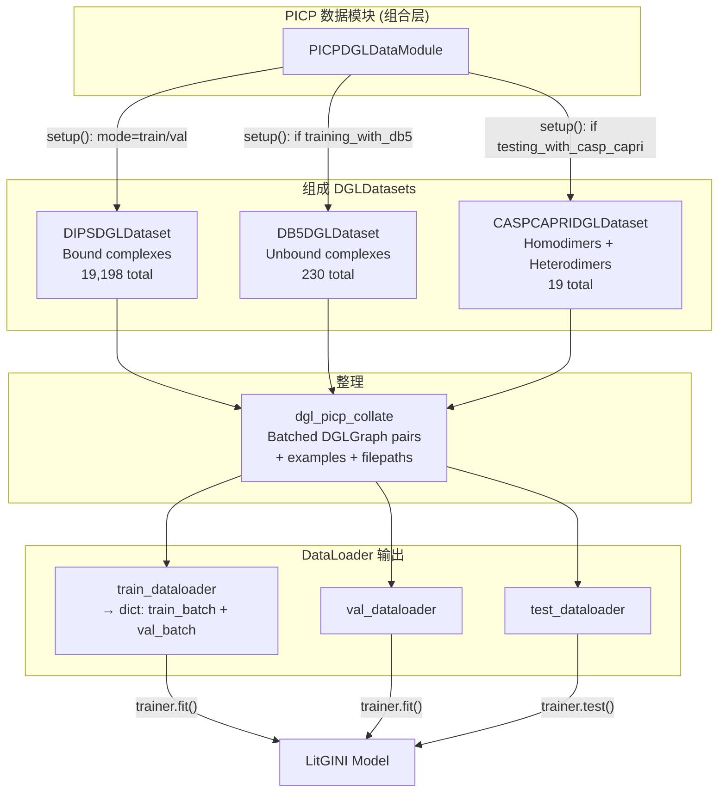
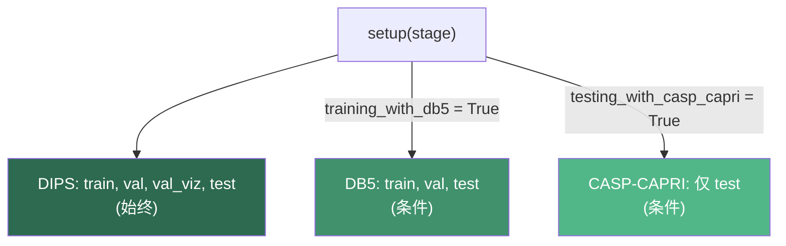

---
slug:16-picp-data-module
blog_type:normal
---


**PICP（蛋白质界面接触预测）数据模块**是 DeepInteract 的统一数据编排层——作为一个 `LightningDataModule`，它将三个结构异构的蛋白质-蛋白质相互作用数据集（DIPS-Plus、DB5-Plus 和 CASP-CAPRI-Plus）聚合到单一的、模式感知的训练/验证/测试流程中。PICP 没有将每个数据集视为孤立的孤岛，而是通过布尔开关（`training_with_db5`、`testing_with_casp_capri`）将它们组合起来，在每个生命周期阶段选择正确的数据来源，从而实现了在 DIPS 上的大规模训练、DB5 上的基准验证以及 CASP-CAPRI 上的零样本泛化测试之间的无缝切换——所有这些均可通过一个 `DataModule` 接口完成。

## 架构角色

PICP 数据模块位于 DeepInteract 的三个单数据集 `DGLDataset` 实现与 `LitGINI` 训练循环之间的**组合边界**。它是训练入口点直接使用的唯一 `LightningDataModule`，入口点会实例化该模块、调用 `setup()`，并将其传递给 `trainer.fit()`。这种设计将所有数据集路由逻辑集中在一个类中，使训练器无需感知每个批次由哪个底层数据集提供。



该模块的 `setup()` 方法会根据条件实例化每个数据集分区，然后其 dataloader 方法会基于激活的布尔标志在这些分区中进行选择。这意味着同一个 `PICPDGLDataModule` 对象可以服务于完整的 DIPS 训练运行、DB5 微调运行或 CASP-CAPRI 评估运行，而无需修改代码。

来源: [picp_dgl_data_module.py](project/datasets/PICP/picp_dgl_data_module.py#L1-L150), [lit_model_train.py](project/lit_model_train.py#L28-L48)

## 构造函数与配置参数

`PICPDGLDataModule.__init__` 接受 **15 个参数**，这些参数被组织为四个逻辑组：数据路径、图构建、数据集采样和流程控制。

| 参数 | 类型 | 用途 |
|---|---|---|
| `casp_capri_data_dir` | `str` | CASP-CAPRI 原始/处理后数据的根目录 |
| `db5_data_dir` | `str` | DB5 原始/处理后数据的根目录 |
| `dips_data_dir` | `str` | DIPS 原始/处理后数据的根目录 |
| `batch_size` | `int` | DIPS 训练/验证 DataLoaders 的批次大小 |
| `num_dataloader_workers` | `int` | 并行 DataLoader 工作进程数 |
| `knn` | `int` | 图构建中每个节点的 K 近邻边数 |
| `self_loops` | `bool` | 是否为每个节点添加自环边 |
| `pn_ratio` | `float` | 正负类样本采样比率（仅限 DIPS） |
| `casp_capri_percent_to_use` | `float` | 要加载的 CASP-CAPRI 划分比例 |
| `testing_with_casp_capri` | `bool` | 启用 CASP-CAPRI 作为测试集 |
| `db5_percent_to_use` | `float` | 要加载的 DB5 划分比例 |
| `training_with_db5` | `bool` | 在 DB5-Plus 而非 DIPS-Plus 上进行训练 |
| `dips_percent_to_use` | `float` | 要加载的 DIPS 划分比例 |
| `process_complexes` | `bool` | 在加载时处理未处理的复合物 |
| `input_indep` | `bool` | 将特征置零以用于输入无关基线 |

三个 `*_percent_to_use` 参数支持**数据集按比例加载**——这对于快速原型设计或内存受限环境至关重要。当设置为严格介于 0.0 和 1.0 之间的值时，每个组成数据集会触发文件名采样，随机选择指定比例的文件并将选择结果缓存到磁盘。

来源: [picp_dgl_data_module.py](project/datasets/PICP/picp_dgl_data_module.py#L24-L45)

## `setup()` 中的数据集组合

`setup()` 方法是**条件初始化的核心**——它仅实例化当前激活配置所需的数据集分区，从而避免不必要的 I/O 和内存分配。

### DIPS-Plus（始终实例化）

DIPS-Plus 是**主要训练语料库**，无论标志如何设置，它都会被实例化。它会创建四个分区：

| 属性 | 模式 | 用途 |
|---|---|---|
| `dips_train` | `'train'` | 主训练数据（15,618 个复合物） |
| `dips_val` | `'val'` | 用于轮次级指标的验证（3,548 个复合物） |
| `dips_val_viz` | `'val'` 且 `train_viz=True` | 训练期间的可视化子集 |
| `dips_test` | `'test'` | 保留的测试集（32 个复合物） |

`dips_val_viz` 分区是一个特殊变体：它以 `train_viz=True` 加载验证划分，这会将文件名帧限制为单个复合物重复 5,532 次——这种设计支持跨最多 5,532 个 GPU 的分布式可视化，其中每个秩检查相同的验证样本。

### DB5-Plus（条件实例化：`training_with_db5`）

当 `training_with_db5=True` 时，所有三个 DB5 划分都会被实例化。DB5-Plus 提供了 **230 个未结合蛋白质复合物**，划分为 140 训练 / 35 验证 / 55 测试。该数据集既可用作替代训练源，也可用作基准验证集。当激活 DB5 进行训练时，dataloader 中的批次大小会被**强制设为 1**，这反映了这些未结合复合物大小可变的特性。

### CASP-CAPRI-Plus（条件实例化：`testing_with_casp_capri`）

当 `testing_with_casp_capri=True` 时，仅实例化 CASP-CAPRI 的测试划分——来自第 13 和 14 届 CASP-CAPRI 挑战的 **19 个二聚体**（14 个同源二聚体 + 5 个异源二聚体）。该数据集专用于**零样本泛化基准测试**；它没有训练或验证分区。



来源: [picp_dgl_data_module.py](project/datasets/PICP/picp_dgl_data_module.py#L47-L82), [dips_dgl_dataset.py](project/datasets/DIPS/dips_dgl_dataset.py#L43-L115)

## Dataloader 路由逻辑

每个 dataloader 方法都实现了**标志驱动的数据集选择**，根据激活的训练机制选择正确的底层分区和批次大小。此路由是 PICP 模块的核心行为契约。

### `train_dataloader()` —— 返回字典

与返回单个 `DataLoader` 的标准 LightningDataModules 不同，`train_dataloader()` 返回一个包含两个键的**字典**：`'train_batch'` 和 `'val_batch'`。这使 `LitGINI` 训练步能够在训练的同时执行每批次验证可视化，这种模式要求将两个 dataloader 共同交付给训练循环。

| 标志 | 训练数据集 | 训练批次大小 | 验证可视化数据集 |
|---|---|---|---|
| `training_with_db5=True` | `db5_train` | **1**（强制） | `dips_val_viz` |
| `training_with_db5=False` | `dips_train` | `self.batch_size` | `dips_val_viz` |

验证可视化 dataloader 始终使用 `dips_val_viz`，并设置 `batch_size=1`、`shuffle=False` 和 `num_workers=1`——这是一种为单样本检查而非吞吐量优化的最小配置。两个 dataloader 都设置了 `drop_last=True`，以确保各步骤间的损失计算保持一致。

### `val_dataloader()` —— 标准轮次级验证

| 标志 | 验证数据集 | 验证批次大小 |
|---|---|---|
| `training_with_db5=True` | `db5_val` | **1**（强制） |
| `training_with_db5=False` | `dips_val` | `self.batch_size` |

### `test_dataloader()` —— 三向路由

测试 dataloader 实现了最复杂的路由，具有一个**三向条件判断**：

| 优先级 | 标志 | 测试数据集 | 测试批次大小 |
|---|---|---|---|
| 1 | `training_with_db5=True` | `db5_test` | **1** |
| 2 | `testing_with_casp_capri=True` | `casp_capri_test` | **1** |
| 3 | 默认 (DIPS) | `dips_test` | **1** |

请注意，**所有测试 dataloader 均强制 `batch_size=1`**，且未设置 `drop_last`（默认为 `False`），从而确保无论数据集大小是否可整除，每个测试样本都会被评估。所有 dataloader 均设置了 `pin_memory=True` 标志，以优化 GPU 传输。

来源: [picp_dgl_data_module.py](project/datasets/PICP/picp_dgl_data_module.py#L84-L150)

## 整理：`dgl_picp_collate`

PICP 模块将所有批次整理工作委托给 `dgl_picp_collate`，这是一个自定义函数，可将按复合物划分的字典列表转换为批处理的 DGL 结构。此整理契约在所有三个组成数据集间共享——每个 `__getitem__` 都返回一个包含键 `graph1`、`graph2`、`examples` 和 `filepath` 的字典。

```python
def dgl_picp_collate(complex_dicts: List[dict]):
    batched_graph1 = dgl.batch([d['graph1'] for d in complex_dicts])
    batched_graph2 = dgl.batch([d['graph2'] for d in complex_dicts])
    examples_list  = [d['examples'] for d in complex_dicts]
    complex_filepaths = [d['filepath'] for d in complex_dicts]
    return batched_graph1, batched_graph2, examples_list, complex_filepaths
```

整理操作产生一个 4 元组：

| 返回位置 | 类型 | 描述 |
|---|---|---|
| `batched_graph1` | `dgl.DGLGraph` | 受体链的批处理图（批次中总计 M 个节点） |
| `batched_graph2` | `dgl.DGLGraph` | 配体链的批处理图（批次中总计 N 个节点） |
| `examples_list` | `List[Tensor]` | 每个复合物的接触标签，形状各为 `(M_i × N_i) × 3` |
| `complex_filepaths` | `List[str]` | 每个复合物的文件标识符，用于可追溯性 |

这两个图使用 `dgl.batch()` 独立批处理，该函数沿批次维度合并节点/边张量，同时保持读出边界。`examples_list` 和 `complex_filepaths` 仍保留为 Python 列表，因为它们的元素在各复合物间具有**可变大小**——这种结构性约束阻止了简单的张量堆叠。

<CgxTip>`graph1` 和 `graph2` 的独立批处理在架构上具有重要意义：它保留了 GINI 图间交互模块所需的**双图表示**，该模块在构建交互张量之前会分别消费这两个图。切勿将它们合并为单个非连通图，因为图间拓扑必须与图内边保持区别。</CgxTip>

来源: [deepinteract_utils.py](project/utils/deepinteract_utils.py#L52-L58)

## 组成数据集契约

所有三个组成数据集——`DIPSDGLDataset`、`DB5DGLDataset` 和 `CASPCAPRIDGLDataset`——都通过其 `__getitem__` 方法实现了**相同的输出契约**，返回具有以下结构的字典：

| 键 | 类型 | 形状 | 描述 |
|---|---|---|---|
| `graph1` | `dgl.DGLGraph` | M 个节点 | 受体链，包含 `ndata['f']`（113 维）、`ndata['x']`（3D 坐标）、`edata['f']`（27 维） |
| `graph2` | `dgl.DGLGraph` | N 个节点 | 配体链，特征模式同上 |
| `examples` | `torch.Tensor` | `(M×N, 3)` | 链间残基对标签：`[res_i, res_j, contact_label]` |
| `complex` | `str` | — | 复合物标识代码与 PDB 文件名 |
| `filepath` | `str` | — | 处理后 `.dill` 文件的路径 |

这种统一的契约使得 PICP 组合成为可能——整理函数和下游模型无需针对特定数据集进行分支。每个数据集还暴露了 `num_node_features`（113）、`num_edge_features`（27）、`num_classes`（2）和 `num_chains`（2）作为类属性，训练脚本从 `picp_data_module.dips_test` 中读取这些属性，以配置模型的输入维度。

### 数据集统计摘要

| 数据集 | 训练集 | 验证集 | 测试集 | 总计 | 复合物类型 |
|---|---|---|---|---|---|
| DIPS-Plus | 15,618 | 3,548 | 32 | 19,198 | Bound |
| DB5-Plus | 140 | 35 | 55 | 230 | Unbound |
| CASP-CAPRI-Plus | — | — | 19 | 19 | Bound (同源二聚体 + 异源二聚体) |

来源: [dips_dgl_dataset.py](project/datasets/DIPS/dips_dgl_dataset.py#L200-L280), [db5_dgl_dataset.py](project/datasets/DB5/db5_dgl_dataset.py#L200-L258), [casp_capri_dgl_dataset.py](project/datasets/CASP_CAPRI/casp_capri_dgl_dataset.py#L200-L255)

## 输入无关基线

当 `input_indep` 参数设置为 `True` 时，会在每个加载的复合物上调用 `zero_out_complex_features()`，将所有节点和边特征置零，同时保留图拓扑。这实现了 **Karpathy 的输入无关健全性检查**：如果模型在特征置零后仍能取得相当的性能，则说明学习到的表示并未有意义地利用输入数据。该标志在 `setup()` 中统一传播到所有三个组成数据集，确保在整个流程中实现一致的消融。

来源: [picp_dgl_data_module.py](project/datasets/PICP/picp_dgl_data_module.py#L43-L44), [dips_dgl_dataset.py](project/datasets/DIPS/dips_dgl_dataset.py#L230-L232)

## 训练流程集成

PICP 数据模块仅在训练入口点被实例化和使用。集成遵循以下精确序列：

1. **构造** —— 使用映射到构造函数参数的所有 CLI 参数创建 `PICPDGLDataModule`
2. **设置** —— 显式调用 `picp_data_module.setup()`（不延迟至 Trainer），初始化所有组成数据集
3. **模型配置** —— 读取数据集属性（`dips_test.num_node_features`、`dips_test.num_edge_features`、`dips_test.num_classes`）以配置 `LitGINI` 的输入维度
4. **训练** —— `trainer.fit(model=model, datamodule=picp_data_module)` 将所有 dataloader 访问委托给该模块

<CgxTip>由于 `setup()` 在模型构造之前被显式调用，因此数据集属性必定可用于维度计算。如果你将设置延迟至 Trainer（通过 `trainer.fit(datamodule=...)` 而不预先调用 `setup()`），在 Trainer 初始化之前访问 `picp_data_module.dips_test.num_node_features` 将在仍为 `None` 的数据集属性上引发 `AttributeError`。</CgxTip>

来源: [lit_model_train.py](project/lit_model_train.py#L28-L48), [lit_model_train.py](project/lit_model_train.py#L55-L72)

## 设计模式与权衡

PICP 数据模块体现了多项刻意的设计决策，理解这些决策对于扩展或调试至关重要：

| 模式 | 实现 | 原理 |
|---|---|---|
| **组合优于继承** | 聚合 3 个 `DGLDataset` 对象，而非子类化其中任何一个 | 数据集具有异构的划分/模式；继承将强制使用最小公分母接口 |
| **标志驱动路由** | 布尔开关按生命周期阶段选择数据集 | 单一配置对象即可控制完整的训练/验证/测试机制，无需在训练器中进行代码分支 |
| **字典训练 dataloader** | `train_dataloader()` 返回 `dict` 而非 `DataLoader` | 实现训练和可视化批次向 `LitGINI.training_step()` 的共同交付 |
| **强制 batch_size=1** | DB5 和 CASP-CAPRI 始终使用 batch_size=1 | 复合物大小可变阻碍了有意义的批处理；单样本处理避免了填充开销 |
| **共享整理契约** | 所有数据集使用 `dgl_picp_collate` | 统一的 `__getitem__` 输出模式支持跨所有数据源使用单一整理函数 |
| **内存缓存** | `has_cache()` 在训练前验证所有 `.dill` 文件是否存在 | 预处理成本高昂；缓存验证可防止轮次中期的 `FileNotFoundError` |

来源: [picp_dgl_data_module.py](project/datasets/PICP/picp_dgl_data_module.py#L1-L150)

## 后续步骤

- 若要详细了解 DIPS-Plus 和 DB5-Plus 数据集，请参阅 [DIPS and DB5 Datasets](14-dips-and-db5-datasets)
- 有关 CASP-CAPRI 基准评估协议，请参阅 [CASP-CAPRI Benchmark](15-casp-capri-benchmark)
- 若要查看批处理图对如何流入 GINI 模型，请参阅 [Lightning Training Pipeline](17-lightning-training-pipeline)
- 有关整理的下游消费者（交互张量构建），请参阅 [Interaction Tensor Construction](9-interaction-tensor-construction)