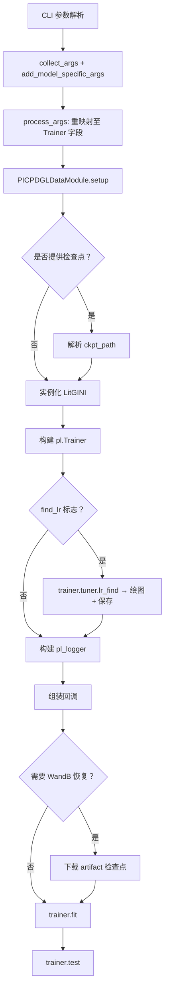

---
slug:17-lightning-training-pipeline
blog_type:normal
---

DeepInteract 的训练流水线基于 **PyTorch Lightning** 构建，提供了一种声明式、回调驱动的编排机制，将数据准备、模型构建、优化配置和训练执行拆分为独立且可配置的阶段。入口文件 `lit_model_train.py` 将 `PICPDGLDataModule`、`LitGINI` LightningModule 以及功能完备的 `pl.Trainer` 串联起来——内置支持学习率查找、检查点保存、早停机制、WandB/TensorBoard 日志记录，以及通过 DDP 实现的分布式多 GPU 训练。

来源：[lit_model_train.py](project/lit_model_train.py#L1-L224)

## 流水线架构

训练流水线遵循严格的顺序初始化顺序，其中每个阶段依赖于前一阶段的输出。这并非随意设定——**数据模块必须首先建立**，以暴露模型构造器所需的 `num_node_features`、`num_edge_features` 和 `num_classes`；并且**必须在模型实例化之前解析检查点路径**，以便 `load_from_checkpoint` 能够按需恢复权重。下图展示了完整的初始化与执行流程：

来源：[lit_model_train.py](project/lit_model_train.py#L20-L179)

## 阶段 1：参数收集与处理

流水线采用**两轮参数解析**策略启动。第一轮通过 `collect_args()` 收集所有基础参数，构建一个包含数据集路径、训练超参数及 Lightning 特定标志的 `ArgumentParser`。第二轮通过 `LitGINI.add_model_specific_args(parser)` 注入模型专属参数，包括 GNN 层类型、交互模块类型、几何模式开关及所有架构维度参数。两轮解析完成后，原始的 CLI 命名空间将被**重映射**为 `pl.Trainer.from_argparse_args` 所期望的字段名：

| CLI 参数 | Trainer 字段 | 用途 |
|---|---|---|
| `num_epochs` | `max_epochs` | 训练轮数上限 |
| `max_hours` / `max_minutes` | `max_time` | 实际时钟训练时间限制 (字典) |
| `multi_gpu_backend` | `accelerator` | GPU 后端 (如 `ddp`, `dp`) |
| `num_gpus` | `gpus` | GPU 设备数量 |
| `num_compute_nodes` | `num_nodes` | 多节点分布 |
| `gpu_precision` | `precision` | 数值精度 (16 或 32) |
| `accum_grad_batches` | `accumulate_grad_batches` | 梯度累积步数 |
| `grad_clip_val` / `grad_clip_algo` | `gradient_clip_val` / `gradient_clip_algo` | 梯度裁剪配置 |
| `stc_weight_avg` | `stochastic_weight_avg` | 随机权重平均开关 |
| `profiler_method` | `profiler` | 性能分析后端 |

两个关键的后处理步骤标志着此阶段的完成：为确保可复现性，**强制执行确定性训练** (`args.deterministic = True`)；同时附带设置了 `find_unused_parameters=False` 的 **DDPPlugin**，以防止 Geometric Transformer 的边初始化模块创建未在每次前向传播中触及的参数而引发死锁错误。

来源：[lit_model_train.py](project/lit_model_train.py#L182-L223), [deepinteract_utils.py](project/utils/deepinteract_utils.py#L8-L10)

## 阶段 2：数据模块初始化

`PICPDGLDataModule` 由所有数据集目录、采样百分比及图构建参数构建而成。其 `setup()` 调用会触发 DIPS、DB5 及 CASP-CAPRI 数据集的训练/验证/测试集划分准备，随后测试集划分的 `num_node_features`、`num_edge_features` 及 `num_classes` 属性将作为模型输入维度的**契约**。从训练脚本传递的关键数据模块参数包括：

| 参数 | 作用 |
|---|---|
| `casp_capri_data_dir`, `db5_data_dir`, `dips_data_dir` | 三个基准数据集的路径 |
| `casp_capri_percent_to_use`, `db5_percent_to_use`, `dips_percent_to_use` | 数据集部分采样比例 (0.0–1.0) |
| `training_with_db5`, `testing_with_casp_capri` | 切换跨数据集的训练/测试机制 |
| `knn` | 用于图边构建的 K 近邻参数 |
| `self_loops` | DGL 图中是否包含自环 |
| `pn_ratio` | 类别平衡的正负标签比例 |
| `process_complexes`, `input_indep` | 控制复合体处理及独立链输入模式 |

来源：[lit_model_train.py](project/lit_model_train.py#L24-L40)

## 阶段 3：模型实例化与检查点解析

`LitGINI` 模型基于**双源配置**构建：结构维度来源于数据模块 (`num_node_input_feats`、`num_edge_input_feats`、`num_classes`)，而架构超参数则来源于解析后的 CLI 命名空间。该模型的 `__init__` 接收超过 25 个参数，涵盖 GNN 配置、交互模块配置、几何模式、优化设置及日志标志。

**检查点解析**遵循一条优先级链。首先，从 `args.ckpt_dir` 和 `args.ckpt_name` 组装出本地 `ckpt_path`。若检查点存在且未请求微调，模型将通过 `LitGINI.load_from_checkpoint()` 重新实例化——这会恢复所有架构权重，同时允许覆盖 `lr`、`batch_size`、`weight_decay` 及 `dropout_rate`。当请求微调时，检查点路径转而存入模型的 `ckpt_path` 属性，以便在 `trainer.fit()` 期间延迟加载，同时激活学习率监控回调以追踪调度器行为。

若未显式提供，**实验名称**将根据关键架构维度自动生成，遵循 `LitGINI-b{batch}-gl{gnn_layers}-n{gnn_hidden}-e{gnn_hidden}-il{interact_layers}-i{interact_hidden}` 模式，确保 WandB/TensorBoard 运行记录易于区分。

来源：[lit_model_train.py](project/lit_model_train.py#L44-L109)

## 阶段 4：训练器、日志器与回调组装

### 训练器构建

`pl.Trainer` 通过 `from_argparse_args(args)` 构建，该方法吸收了阶段 1 中设置的所有 Lightning 专属字段。随后，训练器将通过日志器和回调进行后置配置。

### 日志器选择

`construct_pl_logger(args)` 工厂方法检查 `args.logger_name` 并返回 `TensorBoardLogger` 或 `WandbLogger`。选择 WandB 时，日志器还会启用**基于 artifact 的检查点恢复**：若提供了检查点名称但本地不存在该文件，训练器将使用 `{entity}/{project}/model-{run_id}:best` 引用格式从 WandB artifact 注册表下载，然后从下载的 `model.ckpt` 加载模型。

### 回调配置

组装三个回调，其监控指标与模式由 `args.metric_to_track` 派生：

| 回调 | 配置 | 条件 |
|---|---|---|
| **EarlyStopping** | 监控 `metric_to_track`，模式自动检测（交叉熵为 `min`，其余为 `max`），耐心值及 `min_delta` 来源于参数 | 始终激活 |
| **ModelCheckpoint** | 监控相同指标，保存最新及 Top-3 检查点，文件名模板：`LitGINI-{epoch:02d}-{metric:.3f}` | 始终激活 |
| **LearningRateMonitor** | 逐步记录 LR 及动量追踪 | 仅微调模式 |

检查点文件名模板内嵌保留 3 位小数精度的被监控指标，生成如 `LitGINI-epoch=14-val_f1=0.837.ckpt` 的文件。注意代码注释警告，在多 GPU 调用 `trainer.test()` 时，此模板文件名可能导致**竞态条件**。

来源：[lit_model_train.py](project/lit_model_train.py#L114-L168)

## 阶段 5：学习率查找器

当 `args.find_lr` 为 `True` 时，流水线会在训练循环开始前调用 `trainer.tuner.lr_find()`。这将利用数据模块运行一次简短的指数 LR 扫描，绘制损失与 LR 曲线（保存为 `optimal_lr.pdf`），并用建议值**覆盖** `model.hparams.lr`。此功能对 GINI 模型尤为实用，因其学习率敏感性随架构深度及几何模式的不同而存在显著差异。

<CgxTip>每种架构配置运行一次 LR 查找器即可——建议的 LR 取决于 `num_gnn_layers`、`num_interact_layers` 及 `disable_geometric_mode`，因此更改其中任何一项后重新运行是必不可少的。</CgxTip>

来源：[lit_model_train.py](project/lit_model_train.py#L119-L125)

## 阶段 6：训练与测试

流水线以两次顺序调用收尾：

1. **`trainer.fit(model=model, datamodule=picp_data_module)`** —— 在所有已配置的回调、日志记录及分布式后端下执行完整训练循环。微调时，`ckpt_path` 通过模型构造器传递，以利用 Lightning 内置的检查点恢复机制。

2. **`trainer.test()`** —— 使用训练期间保存的最佳检查点（由 `ModelCheckpoint` 的监控指标决定）在测试集上评估模型。此处无需显式传入 datamodule 参数，因为 Lightning 保留了来自 `fit()` 的引用。

来源：[lit_model_train.py](project/lit_model_train.py#L173-L179)

## 训练配置速查

下表汇总了最具影响力的训练超参数、其 CLI 名称及架构作用：

| 超参数 | CLI 标志 | 架构作用 |
|---|---|---|
| GNN 层类型 | `--gnn_layer_type` | 选择 Geometric Transformer 或基线 GNN |
| GNN 深度 | `--num_gnn_layers` | 每个蛋白质图的 Geometric Transformer 层数 |
| GNN 宽度 | `--num_gnn_hidden_channels` | GNN 节点/边表示的隐藏维度 |
| 注意力头数 | `--num_gnn_attention_heads` | 多头几何注意力中的并行头数 |
| 交互层数 | `--num_interact_layers` | GINI 图间交互模块的深度 |
| 交互宽度 | `--num_interact_hidden_channels` | 交互层内的隐藏维度 |
| 交互注意力 | `--use_interact_attention`, `--num_interact_attention_heads` | 切换并配置交互模块中的注意力 |
| 几何模式 | `--disable_geometric_mode` | 禁用 Conformation Module (退化为 Graph Transformer) |
| 学习率 | `--lr` | AdamW 基础学习率 (若 LR 查找器激活则被覆盖) |
| 权重衰减 | `--weight_decay` | AdamW L2 正则化强度 |
| Dropout | `--dropout_rate` | Geometric Transformer MLP 中的 Dropout 概率 |
| 正类阈值 | `pos_prob_threshold=0.5` | 二分类接触预测的决策边界 |
| 类别加权 | `--weight_classes` | 调整损失以应对正负类不平衡 |

来源：[lit_model_train.py](project/lit_model_train.py#L58-L90)

## 后续内容

现在你已了解训练流水线如何编排数据、模型与优化，自然的进阶方向是探索训练后的模型如何应用于新的蛋白质复合物：

- **[预测工作流](18-prediction-workflow)** —— 如何在未知的蛋白质对上执行推理，包括基于 Docker 的预测
- **[检查点与微调](19-checkpoint-and-fine-tuning)** —— 跨数据集的检查点保存、加载与微调的完整生命周期