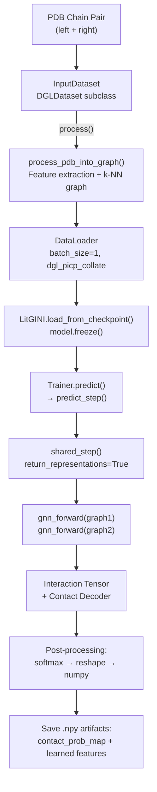

---
slug:18-prediction-workflow
blog_type:normal
---


预测工作流将一对蛋白质 PDB 链文件转换为**残基级接触概率图**和一组学习到的图表示。DeepInteract 提供了两个入口点——本地执行脚本和针对 Docker 优化的变体——两者协调着相同的五阶段流水线：**输入解析 → 图构建 → 检查点加载 → 前向推理 → 结果序列化**。理解此工作流对于在新型蛋白质复合物上部署训练好的模型并解释其界面预测至关重要。

## 流水线架构

预测流水线遵循由 PyTorch Lightning 的 `Trainer.predict()` 循环协调的严格顺序执行模型。每个阶段都是确定性的（无乱序，单工作线程 DataLoader），并以 1 的批量大小运行，以确保接触图的维度能够清晰地映射回原始的残基数量。



来源: [lit_model_predict.py](project/lit_model_predict.py#L147-L262), [lit_model_predict_docker.py](project/lit_model_predict_docker.py#L163-L310)

## 阶段 1：输入数据准备

`InputDataset` 类扩展了 DGL 的 `DGLDataset`，以将一对 PDB 文件转换为准备用于预测的字典。它精确处理**一个复合物**（`__len__` 始终返回 `1`），包含两个蛋白质链图和元数据键。

核心转换发生在 `process()` 方法中，该方法委托给 `process_pdb_into_graph()`。此函数在将结果打包成具有以下结构的字典之前，处理完整的特征工程流水线——PSAIA 结构注释、HH-suite 序列保守性、几何特征计算和 k-NN 图组装：

| 字典键 | 类型 | 描述 |
|---|---|---|
| `graph1` | `dgl.DGLGraph` | 左链的残基级图（节点 = 残基，边 = k-NN） |
| `graph2` | `dgl.DGLGraph` | 右链的残基级图 |
| `examples` | `torch.Tensor` | 空张量（在预测期间未使用——没有真实标签） |
| `complex` | `str` | 左 PDB 文件路径（仅元数据，在 `predict_step` 中未使用） |
| `filepath` | `str` | 左 PDB 文件路径（仅元数据，在 `predict_step` 中未使用） |

该数据集公开了固定的特征维度属性——**113 个节点特征**和**27 个边特征**——模型构造器消耗这些属性以正确调整其输入层的大小。

```python
input_dataset = InputDataset(
    left_pdb_filepath=args.left_pdb_filepath,
    right_pdb_filepath=args.right_pdb_filepath,
    input_dataset_dir=args.input_dataset_dir,
    psaia_dir=args.psaia_dir,
    hhsuite_db=args.hhsuite_db,
    knn=20,
    geo_nbrhd_size=2,
    self_loops=True
)
input_dataloader = DataLoader(input_dataset, batch_size=1, shuffle=False,
                              num_workers=0, collate_fn=dgl_picp_collate)
```

注意 `dgl_picp_collate` 整理函数：它通过 `dgl.batch()` 分别批处理两个链图，并收集样本列表和文件路径，产生 Lightning 传递给 `predict_step` 的四元组 `(batched_graph1, batched_graph2, examples_list, complex_filepaths)`。

来源: [lit_model_predict.py](project/lit_model_predict.py#L22-L160), [deepinteract_utils.py](project/utils/deepinteract_utils.py#L61-L67)

## 阶段 2：模型构建与检查点加载

模型被实例化为一个 `LitGINI` (Lightning GINI) 模块，其架构超参数源自命令行参数。两个关键标志在预测时被硬编码：**`fine_tune=False`** 和 **`ckpt_path=None`**——这些确保在从检查点加载权重之前构建一个全新的模型外壳。

构建之后，加载检查点并冻结模型：

```python
ckpt_path = os.path.join(args.ckpt_dir, args.ckpt_name)
assert ckpt_provided and os.path.exists(ckpt_path), 'A valid checkpoint filepath must be provided'
model = model.load_from_checkpoint(ckpt_path,
                                   use_wandb_logger=False,
                                   batch_size=args.batch_size,
                                   lr=args.lr,
                                   weight_decay=args.weight_decay,
                                   dropout_rate=args.dropout_rate)
model.freeze()
```

`model.freeze()` 调用禁用所有参数的梯度计算，这既是内存优化（不分配梯度张量），也是正确性保障（推理期间不会意外更新参数）。`load_from_checkpoint` 方法从序列化的 `.ckpt` 文件中重建完整的 `LitGINI` 状态——GNN 模块权重、交互模块权重和所有超参数。

<CgxTip>检查点加载会覆盖四个在训练期间保存的超参数（`use_wandb_logger`、`batch_size`、`lr`、`weight_decay`、`dropout_rate`）。这允许在不重新训练的情况下调整推理的日志记录和批量设置。确保检查点的架构超参数（层数、隐藏通道数等）与参数默认值匹配，否则模型将无法正确反序列化。</CgxTip>

来源: [lit_model_predict.py](project/lit_model_predict.py#L165-L221)

## 阶段 3：通过 predict_step 进行前向推理

Lightning 的 `Trainer.predict()` 调用为每个批次调用 `LitGINI.predict_step()`。此方法从批次中提取两个图结构，并以 `return_representations=True` 委托给 `shared_step()`：

```python
def predict_step(self, batch, batch_idx, dataloader_idx=None):
    graph1, graph2 = batch[0], batch[1]
    logits_list, g1_nf, g1_ef, g2_nf, g2_ef = self.shared_step(graph1, graph2, return_representations=True)
    return logits_list, g1_nf, g1_ef, g2_nf, g2_ef
```

`shared_step()` 方法执行完整的孪生前向传递：

1. **GNN 前向** (`gnn_forward`)：每个链图独立通过 Geometric Transformer (或 GCN) 堆栈，通过几何注意力更新节点和边特征
2. **交互张量构建**：两个链的节点表示使用 `construct_interact_tensor()` 交错成 3D 张量，对于大型复合物则使用 `construct_subsequenced_interact_tensors()`
3. **接触解码**：交互张量通过 DeepLabV3+ (或膨胀 ResNet) 解码器，产生形状为 `(batch_size, num_channels, len_graph1, len_graph2)` 的每对残基的逻辑值

当 `return_representations=True` 时，该方法额外返回两个链图中**学习到的节点特征**（`g1_nf`、`g2_nf`）和**学习到的边特征**（`g1_ef`、`g2_ef`），从而能够对模型学到的关于每个蛋白质结构的知识进行下游分析。

来源: [deepinteract_modules.py](project/utils/deepinteract_modules.py#L2178-L2184), [deepinteract_modules.py](project/utils/deepinteract_modules.py#L1687-L1699)

## 阶段 4：接触概率图后处理

来自 `predict_step` 的原始逻辑值经过确定性的后处理序列以生成最终的接触概率图：

| 步骤 | 操作 | 输入形状 | 输出形状 |
|---|---|---|---|
| 1 | `logits.squeeze()` | `(1, 2, M, N)` | `(2, M, N)` |
| 2 | `torch.flatten(start_dim=1)` | `(2, M, N)` | `(2, M×N)` |
| 3 | `.transpose(1, 0)` | `(2, M×N)` | `(M×N, 2)` |
| 4 | `torch.softmax(dim=1)[:, 1]` | `(M×N, 2)` | `(M×N,)` |
| 5 | `.reshape(M, N)` | `(M×N,)` | `(M, N)` |

softmax 将双通道逻辑值（非接触 vs. 接触）转换为概率，索引 `[:, 1]` 提取每个残基对的**正类（接触）概率**。生成的 `(M, N)` 矩阵是一个密集的接触概率图，其中条目 `(i, j)` 表示模型对链 1 中残基 `i` 接触链 2 中残基 `j` 的置信度。

```python
predict_payload = trainer.predict(model=model, dataloaders=input_dataloader)[0]
logits = predict_payload[0][0].squeeze()
g1_nf, g1_ef, g2_nf, g2_ef = predict_payload[1:]

graph_1_len, graph_2_len = logits.shape[1:]
flattened_logits = torch.flatten(logits, start_dim=1).transpose(1, 0)
contact_prob_map = torch.softmax(flattened_logits, dim=1)[:, 1]
contact_prob_map = torch.reshape(contact_prob_map, (graph_1_len, graph_2_len)).cpu().numpy()
```

来源: [lit_model_predict.py](project/lit_model_predict.py#L232-L240)

## 阶段 5：输出序列化

所有预测产物都作为 NumPy `.npy` 文件保存在与输入 PDB 文件相同的目录中。PDB 代码使用 `atom3` 库的 `get_complex_pdb_codes()` 函数提取，以构造一致的文件名：

| 输出文件 | 内容 | 形状 |
|---|---|---|
| `{pdb_code}_contact_prob_map.npy` | 接触概率图 | `(M, N)` — 链 1 中的残基 × 链 2 中的残基 |
| `{pdb_code}_graph1_node_feats.npy` | 链 1 学习到的节点特征 | `(M, hidden_channels)` |
| `{pdb_code}_graph1_edge_feats.npy` | 链 1 学习到的边特征 | `(E₁, feat_dim)` |
| `{pdb_code}_graph2_node_feats.npy` | 链 2 学习到的节点特征 | `(N, hidden_channels)` |
| `{pdb_code}_graph2_edge_feats.npy` | 链 2 学习到的边特征 | `(E₂, feat_dim)` |

学习到的特征数组支持**表示级分析**：节点特征可以被聚类以识别结构相似的残基，而边特征捕获模型发现对界面预测最具信息量的几何关系。

来源: [lit_model_predict.py](project/lit_model_predict.py#L245-L261)

## 本地 vs. Docker 执行

DeepInteract 提供了两个预测脚本，它们在参数解析和默认路径上有所不同，但共享相同的推理逻辑：

| 方面 | `lit_model_predict.py` | `lit_model_predict_docker.py` |
|---|---|---|
| **参数框架** | 通过 `collect_args()` 使用 `argparse` | `absl.flags` + `argparse` 混合 |
| **必需标志** | 通过 argparse 默认值隐式指定 | 显式 `flags.mark_flags_as_required()` |
| **检查点路径** | `args.ckpt_dir` + `args.ckpt_name` | `FLAGS.ckpt_dir` + `FLAGS.ckpt_name` |
| **默认 ckpt_dir** | 来自 argparse | `/mnt/checkpoints` |
| **默认 psaia_dir** | `~/Programs/PSAIA_1.0_source/bin/linux/psa` | `/home/Programs/PSAIA_1.0_source/bin/linux/psa` |
| **默认 psaia_config** | `datasets/builder/psaia_config_file_input.txt` | `/app/DeepInteract/project/datasets/builder/psaia_config_file_input_docker.txt` |
| **GPU 控制** | `args.num_gpus`（来自 argparse） | `FLAGS.num_gpus`（来自 absl 标志） |
| **输出路径前缀** | `os.path.join(*args.left_pdb_filepath.split(os.sep)[:-1])` | `os.sep + os.path.join(...)`（绝对路径） |
| **入口点** | argparse 后的 `main(args)` | absl 后的 `app.run(main)` |

<CgxTip>Docker 变体对输出文件使用**绝对路径前缀**（以 `os.sep` 为前缀），确保产物写入容器文件系统根相对路径。本地变体使用**相对路径前缀**，将输出写在输入 PDB 文件旁边。在 Docker 中挂载卷时，确保输出目录可写并映射到主机路径以便检索产物。</CgxTip>

来源: [lit_model_predict.py](project/lit_model_predict.py#L264-L298), [lit_model_predict_docker.py](project/lit_model_predict_docker.py#L313-L330)

## 用于推理的 Trainer 配置

两个脚本都使用为预测优化的特定设置来配置 PyTorch Lightning `Trainer`：

| 参数 | 值 | 理由 |
|---|---|---|
| `accelerator` | `'dp'` | 数据并行（非 DDP）——避免预测模式下的多进程错误 |
| `num_nodes` | `1` | 强制单节点推理 |
| `gpus` | 用户指定 | `0` = CPU, `1+` = GPU(s) |
| `batch_size` | `1` | 确保后处理期间清晰的逻辑值到残基映射 |
| `shuffle` | `False` | 确定性排序以实现可复现的输出 |
| `num_workers` | `0` | 主线程数据加载避免序列化问题 |

`Trainer` 通过 `pl.Trainer.from_argparse_args(args)` 构建，它从解析的命令行吸收所有 Lightning 特定的参数（精度、梯度裁剪、分析器等）。虽然其中一些（梯度裁剪、累积）仅用于训练，但它们被一致设置以保持与训练脚本的参数奇偶一致性。

来源: [lit_model_predict.py](project/lit_model_predict.py#L280-L292), [lit_model_predict_docker.py](project/lit_model_predict_docker.py#L179-L194)

## 后续步骤

- 在 [检查点与微调](19-checkpoint-and-fine-tuning) 中了解检查点如何管理以及微调如何配置
- 回顾产生此处消耗的检查点的训练循环：[Lightning 训练流水线](17-lightning-training-pipeline)
- 理解馈入 `InputDataset` 的图构建：[从 PDB 构建图](11-graph-construction-from-pdb)