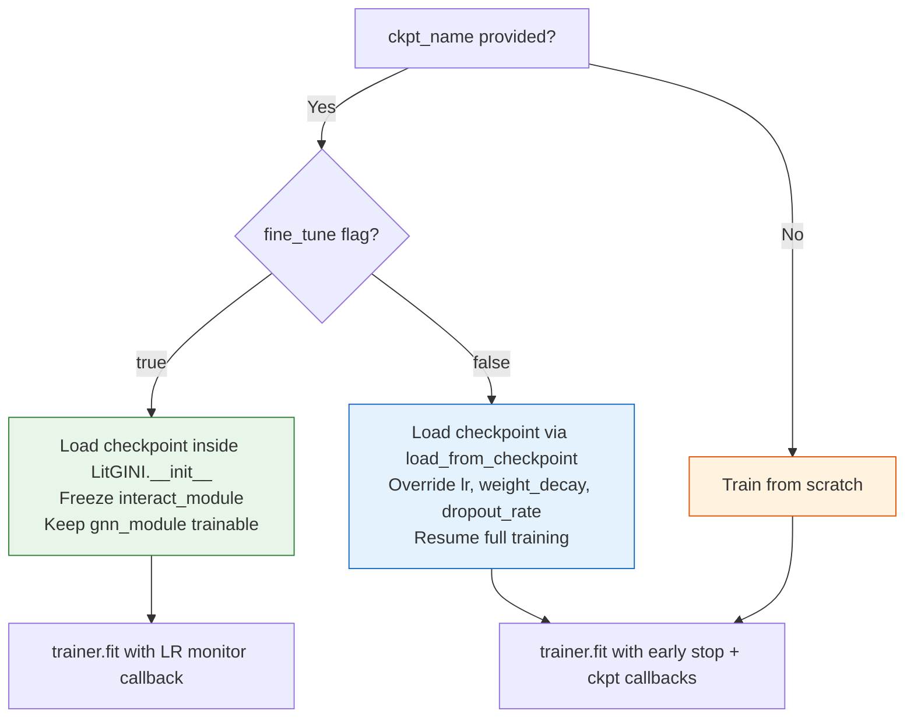
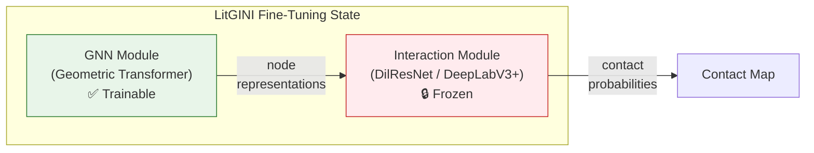

---
slug:19-checkpoint-and-fine-tuning
blog_type:normal
---


DeepInteract 实现了三种模式的检查点生命周期——**恢复训练**、**在新数据集上微调**和**仅推理加载**——每种模式都有独特的参数冻结策略和优化器配置。系统利用 PyTorch Lightning 的 `ModelCheckpoint` 回调进行持久化状态管理，并可选地集成 Weights & Biases (WandB) 基于制品的检查点恢复，以实现分布式实验跟踪。

来源: [lit_model_train.py](project/lit_model_train.py#L1-L224), [deepinteract_modules.py](project/utils/deepinteract_modules.py#L1478-L1583)

## 检查点架构

检查点子系统由两个控制标志——`ckpt_name` 和 `fine_tune`——控制，它们的组合决定了激活哪条加载路径。解析逻辑首先构建检查点路径，验证其在本地文件系统上的存在性，然后有条件地分派到 `LitGINI.__init__` 中的三种加载策略之一。



检查点路径由 `args.ckpt_dir` 和 `args.ckpt_name` 组装而成，并在任何加载尝试之前执行存在性验证：`ckpt_path = os.path.join(args.ckpt_dir, args.ckpt_name)`，随后执行 `ckpt_path_exists = os.path.exists(ckpt_path)`。复合守卫 `ckpt_provided = args.ckpt_name != '' and ckpt_path_exists` 控制着恢复训练路径，而微调则将加载委托给模型构造函数本身。

来源: [lit_model_train.py](project/lit_model_train.py#L44-L109), [deepinteract_modules.py](project/utils/deepinteract_modules.py#L1546-L1559)

## ModelCheckpoint 回调配置

在训练期间，Lightning 的 `ModelCheckpoint` 回调被配置为持久化按监控指标排名的前 3 个模型，以及最近（最后一个）的检查点。检查点文件名模板编码了周期和追踪指标值，以确保可追溯性。

| 参数 | 值 | 用途 |
|-----------|-------|---------|
| `monitor` | `args.metric_to_track` | 驱动检查点选择的指标（例如 `val_ce`） |
| `mode` | `'min'` if `'ce'` in metric, else `'max'` | 改进方向 |
| `save_last` | `True` | 始终持久化最近周期的检查点 |
| `save_top_k` | `3` | 按指标保留三个最佳检查点 |
| `filename` | `LitGINI-{epoch:02d}-{metric:.3f}` | 包含周期和指标的结构化文件名 |

`EarlyStopping` 回调共享相同的 `monitor` 和 `mode`，并具有用户可配置的 `min_delta` 和 `patience`。当微调激活时，`LearningRateMonitor` 回调将被附加到回调列表中——从而实现对学习率和动量轨迹的逐步记录，这对于诊断微调收敛行为至关重要。

来源: [lit_model_train.py](project/lit_model_train.py#L136-L154)

## 恢复训练模式

当 `fine_tune=False` 且提供了有效的检查点（`ckpt_provided=True`）时，系统在 `LitGINI` 构造函数**外部**调用 Lightning 的 `load_from_checkpoint` 类方法。这会恢复完整的模型状态——所有权重、优化器状态和调度器状态——同时选择性地覆盖训练超参数：

```python
model = model.load_from_checkpoint(ckpt_path,
                                   use_wandb_logger=use_wandb_logger,
                                   batch_size=args.batch_size,
                                   lr=args.lr,
                                   weight_decay=args.weight_decay,
                                   dropout_rate=args.dropout_rate)
```

此设计允许在恢复先前中断的训练运行时，使用与原始运行**不同的学习率、权重衰减或 dropout**——当目标仅仅是在同一数据集上以调整后的超参数继续训练时，这是替代完整微调的一种轻量级方案。如果未提供检查点（`ckpt_provided=False`），则新构建的模型将从随机初始化开始训练。

来源: [lit_model_train.py](project/lit_model_train.py#L103-L109)

## 微调模式

微调是架构上截然不同的加载路径，当 `fine_tune=True` 时激活。与在外部调用 `load_from_checkpoint` 不同，`LitGINI` 构造函数本身会加载预训练模型并应用**选择性冻结策略**：

```python
if self.fine_tune:
    lit_gini = LitGINI.load_from_checkpoint(self.ckpt_path,
                                            use_wandb_logger=use_wandb_logger,
                                            batch_size=self.batch_size,
                                            lr=self.lr,
                                            weight_decay=self.weight_decay,
                                            dropout_rate=self.dropout_rate)
    self.gnn_module, self.interact_module = lit_gini.gnn_module, lit_gini.interact_module
    # Freeze the interaction module during fine-tuning
    for param in self.interact_module.parameters():
        param.requires_grad = False
else:
    self.build_gnn_module(), self.build_interaction_module()
```

冻结策略是出于架构动机：**交互模块**（Dilated ResNet 或 DeepLabV3+）在构建的交互张量上操作，以预测每个残基的接触概率，而 **GNN 模块**（Geometric Transformer）则学习蛋白质结构表示。冻结交互模块保留了其学习到的接触预测模式，同时允许 GNN 模块使其几何特征提取适应新数据集的结构分布。



这种非对称冻结意味着优化器仅接收来自 `gnn_module` 和 `node_in_embedding` 的参数，使得微调在计算上更便宜，并且不易发生对预训练交互解码器权重的灾难性遗忘。`LearningRateMonitor` 回调仅在微调期间激活，以追踪此机制中通常使用的较小学习率。

<CgxTip>在微调时，GNN 模块的 `reset_parameters()` **不会**被调用——来自 `lit_gini.gnn_module` 的预训练权重将被直接转移。然而，`node_in_embedding` **会**通过在 `__init__` 末尾调用的 `reset_parameters()` 被重新初始化，这意味着即使在微调期间，输入投影层也会从 Glorot 正交初始化开始。如果你想保留预训练嵌入，请重写 `reset_parameters` 或设置 `num_node_input_feats == num_gnn_hidden_channels` 以使用 `nn.Identity`。</CgxTip>

来源: [deepinteract_modules.py](project/utils/deepinteract_modules.py#L1546-L1559), [deepinteract_modules.py](project/utils/deepinteract_modules.py#L1585-L1589), [lit_model_train.py](project/lit_model_train.py#L152-L154)

## 推理检查点加载

测试流水线（`lit_model_test.py`）和预测流水线（`lit_model_predict.py`）在模型构建期间均将 `fine_tune=False` 和 `ckpt_path=None` 硬编码，然后在实例化后从外部加载检查点。这确保了没有部分微调状态泄漏到推理中。

### 测试流水线

测试流水线**断言**必须提供检查点文件名（`assert ckpt_provided, 'A checkpoint filename must be provided'`），并支持与训练相同的 WandB 制品回退。`load_from_checkpoint` 调用将 `batch_size` 覆盖为 1（针对大型 DB5-Plus 复合物强制执行），同时覆盖 `lr`、`weight_decay` 和 `dropout_rate`：

```python
model = model.load_from_checkpoint(ckpt_path,
                                   use_wandb_logger=use_wandb_logger,
                                   batch_size=test_batch_size,
                                   lr=args.lr,
                                   weight_decay=args.weight_decay,
                                   dropout_rate=args.dropout_rate)
```

### 预测流水线

预测流水线更进一步，在加载检查点后调用 `model.freeze()`，这会将**所有**参数的 `requires_grad` 设置为 `False`——完全禁用梯度计算以实现最大推理吞吐量。检查点断言更严格，要求同时提供且在文件系统中存在：`assert ckpt_provided and os.path.exists(ckpt_path), 'A valid checkpoint filepath must be provided'`。

来源: [lit_model_test.py](project/lit_model_test.py#L88-L138), [lit_model_predict.py](project/lit_model_predict.py#L200-L221)

## WandB 制品恢复

当 WandB 记录器处于活动状态，且提供了检查点名称但文件在本地不存在时，系统会自动从 WandB 服务器下载检查点制品：

```python
if use_wandb_logger and args.ckpt_name != '' and not os.path.exists(ckpt_path):
    checkpoint_reference = f'{args.entity}/{args.project_name}/model-{args.run_id}:best'
    artifact = trainer.logger.experiment.use_artifact(checkpoint_reference, type='model')
    artifact_dir = artifact.download()
    model = model.load_from_checkpoint(Path(artifact_dir) / 'model.ckpt', ...)
```

制品引用遵循 WandB 约定 `{entity}/{project}/model-{run_id}:best`，目标是 WandB 内部指标追踪确定的最佳检查点。此回退机制支持跨分布式训练环境无缝共享检查点，无需手动文件传输。训练和测试流水线均以相同的制品引用格式实现了此恢复逻辑。

来源: [lit_model_train.py](project/lit_model_train.py#L159-L168), [lit_model_test.py](project/lit_model_test.py#L120-L130)

## 模式比较总结

| 方面 | 恢复训练 | 微调 | 推理 (测试/预测) |
|--------|----------------|-------------|--------------------------|
| **触发条件** | `ckpt_name` 已设置, `fine_tune=False` | `fine_tune=True` | `ckpt_name` 已设置 (断言) |
| **加载位置** | 外部 `load_from_checkpoint` | `LitGINI.__init__` 内部 | 外部 `load_from_checkpoint` |
| **GNN 模块** | 来自 ckpt 的所有权重 | 来自 ckpt, **可训练** | 来自 ckpt 的所有权重 |
| **交互模块** | 来自 ckpt 的所有权重 | 来自 ckpt, **冻结** | 来自 ckpt 的所有权重 |
| **完全冻结** | 否 | 否 | 是 (`model.freeze()`) |
| **LR 监控** | 否 | 是 | 否 |
| **WandB 恢复** | 是 | 不适用 (需要本地 ckpt) | 是 |
| **可覆盖超参数** | `lr`, `weight_decay`, `dropout_rate` | `lr`, `weight_decay`, `dropout_rate` | `lr`, `weight_decay`, `dropout_rate` |

<CgxTip>`fine_tune` 标志不仅改变了**什么**被冻结，还改变了检查点加载发生在**哪里**。恢复加载发生在模型构建之后（`lit_model_train.py` 第 104 行），替换整个模型。微调加载发生在构造函数内部（`deepinteract_modules.py` 第 1548 行），仅将 `gnn_module` 和 `interact_module` 精确移植到新构建的外壳中。这种区别对 Lightning 的 `save_hyperparameters()` 调用很重要——恢复模式保留检查点中的原始超参数，而微调模式记录当前 `LitGINI` 实例的**新**超参数。</CgxTip>

来源: [lit_model_train.py](project/lit_model_train.py#L44-L174), [deepinteract_modules.py](project/utils/deepinteract_modules.py#L1535-L1583), [lit_model_test.py](project/lit_model_test.py#L88-L138), [lit_model_predict.py](project/lit_model_predict.py#L200-L221)

## 后续步骤

- 有关生成这些检查点的完整训练循环，请参见 [Lightning 训练流水线](17-lightning-training-pipeline)
- 有关已加载检查点的推理用法，请参见 [预测工作流](18-prediction-workflow)
- 有关正在被检查点化的模型架构，请参见 [GINI 模型设计](8-gini-model-design)