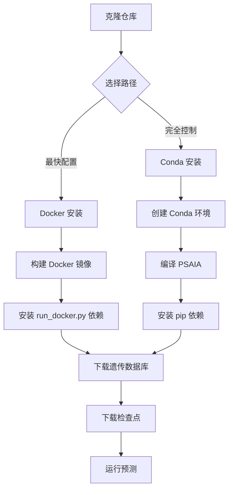
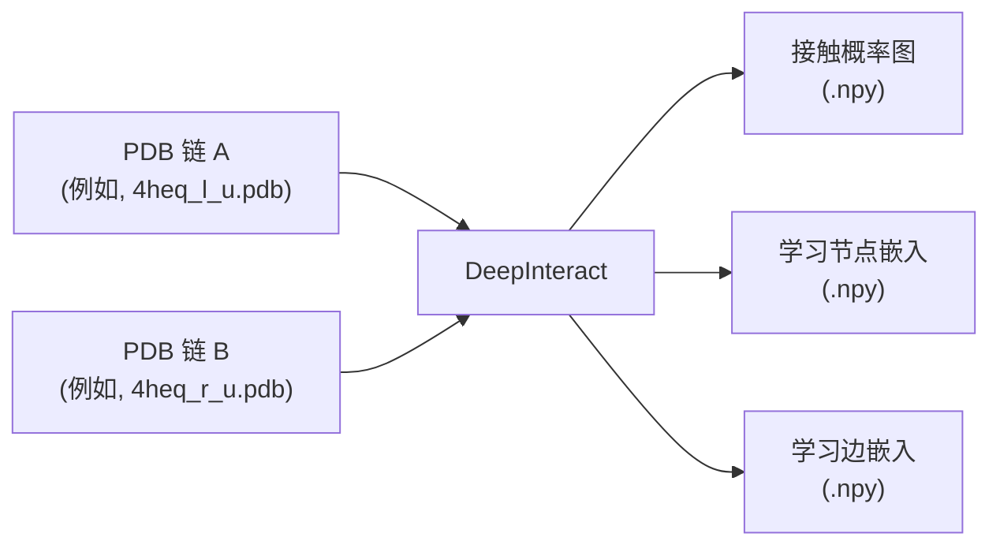

---
slug:2-quick-start
blog_type:normal
---


几分钟内让 DeepInteract 运行起来——从克隆仓库到生成你的第一个蛋白质界面接触概率图。本指南将带你了解两种受支持的安装方式（Docker 和 Conda）、一次性遗传数据库配置，以及你的首次预测。

## 选择你的安装路径

DeepInteract 提供两种安装策略，各自适用于不同的工作流。**Docker 路径**消除了依赖编译的开销，推荐首次使用的用户采用。**Conda 路径**提供了对环境更精细的控制，更适合开发或微调工作流。

| 方面 | Docker 安装 | Conda 安装 |
|---|---|---|
| **难度** | 低 — 一个构建命令 | 中 — 需要编译 PSAIA |
| **磁盘空间** | ~13 GB (镜像) + ~17–86 GB (数据库) | ~17–86 GB (数据库) + PSAIA 源码 |
| **GPU 支持** | 通过 NVIDIA Container Toolkit | 原生 CUDA toolkit |
| **最适用场景** | 快速预测、CI/CD 流水线 | 训练、微调、开发 |
| **详细指南** | [Docker 配置](3-docker-setup) | 见下方第 3 步 |



## 第 1 步 — 克隆仓库

```bash
git clone https://github.com/BioinfoMachineLearning/DeepInteract
cd DeepInteract/
DI_DIR=$(pwd)
```

这会将 `DI_DIR` 设置为一个便捷变量，在后续所有命令中都会引用它。

来源：[README.md](/README.md#L239-L245)

## 第 2 步 — 下载预训练检查点

DeepInteract 在 Zenodo 上提供了两个训练好的模型检查点。请将它们都下载到 checkpoints 目录中：

```bash
mkdir -p project/checkpoints
wget -P project/checkpoints https://zenodo.org/record/6671582/files/LitGINI-GeoTran-DilResNet.ckpt
wget -P project/checkpoints https://zenodo.org/record/6671582/files/LitGINI-GeoTran-DilResNet-DB5-Fine-Tuned.ckpt
```

| 检查点 | 描述 |
|---|---|
| `LitGINI-GeoTran-DilResNet.ckpt` | 在 DIPS-Plus 上训练的主模型 |
| `LitGINI-GeoTran-DilResNet-DB5-Fine-Tuned.ckpt` | 用于对接基准评估的 DB5-Plus 微调变体 |

来源：[README.md](/README.md#L462-L470)

## 第 3 步 — 配置环境

### 选项 A：Docker（推荐首次使用的用户）

确保已安装 [Docker](https://www.docker.com/) 和 [NVIDIA Container Toolkit](https://docs.nvidia.com/datacenter/cloud-native/container-toolkit/install-guide.html)，然后验证 GPU 可见性：

```bash
docker run --rm --gpus all nvidia/cuda:11.2.2-cudnn8-runtime-ubuntu20.04 nvidia-smi
```

构建镜像（需要约 13 GB）并安装轻量级 Docker 启动器依赖：

```bash
docker build -f docker/Dockerfile -t deepinteract .
pip3 install -r docker/requirements.txt
mkdir -p project/datasets/Input
```

Docker 镜像内置了 PSAIA、HH-suite3、CUDA 11.2、PyTorch 1.7.1 以及所有 Python 依赖——无需手动编译。有关完整的 Docker 操作流程，请参见 [Docker 配置](3-docker-setup)。

来源：[README.md](/README.md#L212-L275), [docker/Dockerfile](/docker/Dockerfile#L1-L101), [docker/requirements.txt](/docker/requirements.txt#L1-L3)

### 选项 B：Conda（推荐用于开发）

根据提供的规范文件创建并激活 Conda 环境：

```bash
conda env create --name DeepInteract -f environment.yml
conda activate DeepInteract
pip3 install -r requirements.txt
```

<CgxTip>PSAIA 编译是 Conda 路径中最容易出错的步骤。它需要 GCC 10 和 QT4——这两者在 Ubuntu 20.04 上都需要自定义 PPA。如果编译失败，Docker 路径通过内置预编译的 PSAIA 二进制文件可以完全避免此问题。</CgxTip>

该 Conda 环境提供了 **Python 3.8**、**PyTorch 1.7.1**、**CUDA 11.2**、**DGL 0.6** 和 **PyTorch Lightning 1.4.8**。你还必须从源码编译 PSAIA（需要 GCC 10 和 QT4）——完整的 PSAIA 构建说明请参考 [README](https://github.com/BioinfoMachineLearning/DeepInteract)，并记得在 `project/datasets/builder/psaia_config_file_input.txt` 中替换为你本地的仓库路径。

来源：[README.md](/README.md#L305-L398), [environment.yml](/environment.yml#L1-L29), [requirements.txt](/requirements.txt#L1-L15), [setup.py](/setup.py#L1-L38)

## 第 4 步 — 下载遗传数据库

DeepInteract 需要一个兼容 HH-suite3 的序列数据库来计算进化特征。请根据你的可用磁盘空间选择一个：

| 数据库 | 磁盘空间（解压后） | 推荐适用对象 |
|---|---|---|
| **Small BFD** | ~17 GB | 首次使用的用户、存储空间有限 |
| **Uniclust30** | ~86 GB | 质量与大小的平衡之选 |
| **BFD** | ~1.7 TB | 追求最高特征质量 |

**Small BFD** 下载最快，且对大多数预测工作流已足够使用：

```bash
DOWNLOAD_DIR="~/Data/Databases"
ROOT_DIR="${DOWNLOAD_DIR}/small_bfd"
mkdir -p ~/Data "$DOWNLOAD_DIR" "$ROOT_DIR"
SOURCE_URL="https://storage.googleapis.com/alphafold-databases/reduced_dbs/bfd-first_non_consensus_sequences.fasta.gz"
aria2c "${SOURCE_URL}" --dir="${ROOT_DIR}"
pushd "${ROOT_DIR}" && gunzip "${ROOT_DIR}/bfd-first_non_consensus_sequences.fasta.gz" && popd
```

解压后，预测时所用的 `--hhsuite_db` 参数应指向：

```
~/Data/Databases/small_bfd/bfd-first_non_consensus_sequences.fasta
```

<CgxTip>`aria2c` 下载工具已包含在 Conda 环境（`aria2==1.34.0`）和 Docker 镜像中。如果在 Conda 路径下未使用完整环境，请单独安装：`sudo apt install aria2`。</CgxTip>

来源：[README.md](/README.md#L37-L109)

## 第 5 步 — 运行你的首次预测

### 通过 Docker

```bash
python3 docker/run_docker.py \
  --left_pdb_filepath "$DI_DIR"/project/test_data/4heq_l_u.pdb \
  --right_pdb_filepath "$DI_DIR"/project/test_data/4heq_r_u.pdb \
  --input_dataset_dir "$DI_DIR"/project/datasets/Input \
  --ckpt_name "$DI_DIR"/project/checkpoints/LitGINI-GeoTran-DilResNet.ckpt \
  --hhsuite_db ~/Data/Databases/small_bfd/bfd-first_non_consensus_sequences.fasta \
  --num_gpus 0
```

将 `--num_gpus 0` 替换为 `--num_gpus 1` 即可启用 GPU 加速推理。

来源：[README.md](/README.md#L276-L304), [docker/run_docker.py](/docker/run_docker.py#L32-L48)

### 通过 Conda

```bash
cd project
python3 lit_model_predict.py \
  --left_pdb_filepath "$DI_DIR"/project/test_data/4heq_l_u.pdb \
  --right_pdb_filepath "$DI_DIR"/project/test_data/4heq_r_u.pdb \
  --ckpt_dir "$DI_DIR"/project/checkpoints \
  --ckpt_name LitGINI-GeoTran-DilResNet.ckpt \
  --hhsuite_db ~/Data/Databases/small_bfd/bfd-first_non_consensus_sequences.fasta
cd ..
```

要查看所有可用的命令行参数，请运行 `python3 lit_model_predict.py --help`。

来源：[README.md](/README.md#L477-L486), [project/lit_model_predict.py](/project/lit_model_predict.py#L264-L298)

## 理解输出

完成后，DeepInteract 会将 NumPy 数组文件写入输入数据目录（对于本示例，即 `test_data/`）。对于 4HEQ 测试复合物，你将找到：

| 输出文件 | 内容 | 形状 |
|---|---|---|
| `4heq_contact_prob_map.npy` | 预测的界面接触概率图 | (chain₁_residues × chain₂_residues) |
| `4heq_graph1_node_feats.npy` | 链 1 的学习节点表征 | (chain₁_residues × hidden_dim) |
| `4heq_graph1_edge_feats.npy` | 链 1 的学习边表征 | (chain₁_edges × hidden_dim) |
| `4heq_graph2_node_feats.npy` | 链 2 的学习节点表征 | (chain₂_residues × hidden_dim) |
| `4heq_graph2_edge_feats.npy` | 链 2 的学习边表征 | (chain₂_edges × hidden_dim) |

在 Python 中加载接触概率图：

```python
import numpy as np
contact_prob_map = np.load('4heq_contact_prob_map.npy')
print(f"Map shape: {contact_prob_map.shape}")
print(f"Max probability: {contact_prob_map.max():.4f}")
```

接触概率图对跨两条链的每个残基对进行了编码，表示模型认为该残基对形成**界面接触**的置信度。越接近 **1.0** 的值表示高置信度的接触预测。

来源：[project/lit_model_predict.py](/project/lit_model_predict.py#L236-L261)

## 快速开始流程总结



预测流水线内部依次执行：(1) 将每条 PDB 链解析为包含 **113 个节点特征**和 **27 个边特征**的 DGL 图，(2) 通过 **LitGINI** 模型运行 Geometric Transformer 编码器，(3) 跨链表征构建交互张量，(4) 通过 **DeepLabV3+** 风格的接触解码器解码接触概率。这些阶段的每一个都在[架构概览](4-architecture-overview)中进行了深入说明。

来源：[project/lit_model_predict.py](/project/lit_model_predict.py#L147-L200)

## 接下来去哪里

现在你已经能够预测接触图了，可以探索以下主题以加深你的理解：

- **[Docker 配置](3-docker-setup)** — 完整的 Docker 配置详情、GPU 调优和卷挂载
- **[架构概览](4-architecture-overview)** — 了解 Geometric Transformer、GINI 模块和接触解码器如何组成完整的流水线
- **[预测工作流](18-prediction-workflow)** — 高级推理选项、自定义 PDB 输入和输出解释
- **[Lightning 训练流水线](17-lightning-training-pipeline)** — 在你自己的蛋白质复合物数据上训练或微调 DeepInteract
- **[从 PDB 构建图](11-graph-construction-from-pdb)** — 了解原始 PDB 文件如何转化为几何图输入