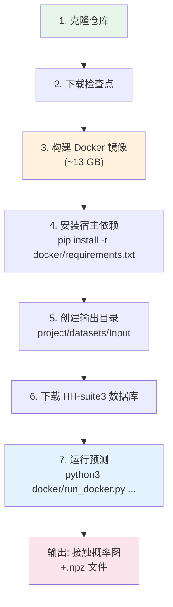
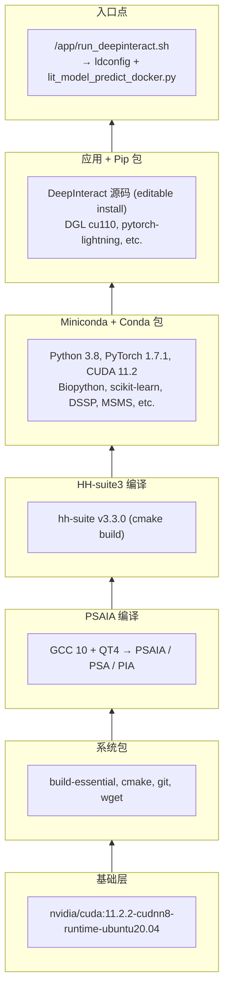
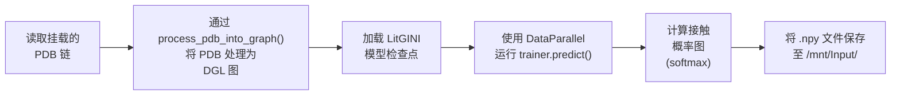

---
slug:3-docker-setup
blog_type:normal
---


DeepInteract 的 Docker 配置提供了一个**完全自包含的预测环境** — 将 CUDA 运行时、PSAIA、HH-suite3、PyTorch、DGL 以及所有 Python 依赖项打包到单个可复现的镜像中。这消除了传统安装所需的复杂手动编译步骤，是在新蛋白质复合物上运行推理的**推荐途径**。

## 前提条件

在构建 DeepInteract 镜像之前，你的宿主系统必须满足三个要求。每一项都不可妥协：镜像依赖于 NVIDIA 的 CUDA 运行时基础，而启动脚本 (`run_docker.py`) 依赖 Docker Python SDK 来编排容器的创建和卷挂载。

| 要求 | 用途 | 验证命令 |
|---|---|---|
| **Docker 引擎** | 构建并运行容器 | `docker --version` |
| **NVIDIA Container Toolkit** | 在容器内暴露宿主 GPU | `docker run --rm --gpus all nvidia/cuda:11.2.2-cudnn8-runtime-ubuntu20.04 nvidia-smi` |
| **宿主 Python ≥ 3.8** | 执行 `run_docker.py` 启动脚本 | `python3 --version` |

如果 GPU 验证命令列出了你的可用 GPU，则说明工具包已正确安装。如果失败，请查阅 [NVIDIA Container Toolkit 安装指南](https://docs.nvidia.com/datacenter/cloud-native/container-toolkit/install-guide.html) 或 [NVIDIA Docker issue #1447](https://github.com/NVIDIA/nvidia-docker/issues/1447#issuecomment-801479573) 进行故障排除。

<CgxTip>`run_docker.py` 脚本运行**在你的宿主机上** — 它不在容器内部执行。它使用 Docker Python SDK 来创建容器、挂载卷并将日志流式传输回你的终端。这就是为什么 `docker/requirements.txt` 仅包含 `absl-py` 和 `docker` 的原因 — 这些仅是宿主侧的依赖项。</CgxTip>

来源: [README.md](/README.md#L216-L236), [docker/requirements.txt](/docker/requirements.txt#L1-L3)

## 逐步设置工作流

以下流程图展示了从克隆仓库到生成接触概率图预测的完整设置过程：



### 步骤 1 — 克隆仓库

```bash
git clone https://github.com/BioinfoMachineLearning/DeepInteract
cd DeepInteract/
DI_DIR=$(pwd)
```

在后续步骤中，`DI_DIR` 变量用于构建卷挂载的绝对路径。

来源: [README.md](/README.md#L239-L245)

### 步骤 2 — 下载模型检查点

DeepInteract 提供了两个托管在 Zenodo 上的预训练检查点。请将它们放置在指定的目录中：

```bash
mkdir -p project/checkpoints
wget -P project/checkpoints https://zenodo.org/record/6671582/files/LitGINI-GeoTran-DilResNet.ckpt
wget -P project/checkpoints https://zenodo.org/record/6671582/files/LitGINI-GeoTran-DilResNet-DB5-Fine-Tuned.ckpt
```

| 检查点 | 描述 |
|---|---|
| `LitGINI-GeoTran-DilResNet.ckpt` | 在 DIPS-Plus 上训练的基础模型 |
| `LitGINI-GeoTran-DilResNet-DB5-Fine-Tuned.ckpt` | 针对基准规模复合物的 DB5 微调变体 |

来源: [README.md](/README.md#L247-L253)

### 步骤 3 — 构建 Docker 镜像

```bash
docker build -f docker/Dockerfile -t deepinteract .
```

**此构建需要大约 13 GB 的磁盘空间**，根据网络速度可能需要 15–30 分钟。镜像标签 `deepinteract` 必须与 `run_docker.py` 中 `--docker_image_name` 标志的默认值相匹配。

来源: [README.md](/README.md#L255-L259), [docker/Dockerfile](/docker/Dockerfile#L1-L101)

### 步骤 4 — 安装宿主侧 Python 依赖

```bash
pip3 install -r docker/requirements.txt
```

这仅安装两个包 — `absl-py`（用于命令行标志解析）和 `docker`（用于容器编排的 Python SDK）。你可以选择将它们隔离在[虚拟环境](https://docs.python.org/3/tutorial/venv.html)中，以避免与系统 Python 产生冲突。

来源: [docker/requirements.txt](/docker/requirements.txt#L1-L3), [README.md](/README.md#L261-L268)

### 步骤 5 — 创建输出目录

```bash
mkdir -p project/datasets/Input
```

此目录将通过 Docker 绑定挂载接收生成的特征和最终的预测输出（接触概率图、学习到的节点/边表示）。

来源: [README.md](/README.md#L270-L274)

### 步骤 6 — 下载兼容 HH-suite3 的数据库

DeepInteract 在特征生成期间需要遗传序列数据库用于 HH-suite3 配置文件搜索。提供三个选项，按大小列出：

| 数据库 | 未解压大小 | 下载命令 |
|---|---|---|
| **BFD** (完整) | ~1.7 TB | 完整脚本见 [快速入门](2-quick-start) |
| **Small BFD** | ~17 GB | 推荐大多数用户使用 |
| **Uniclust30** | ~86 GB | 折中选项 |

**推荐 — Small BFD**（下载最快，对大多数预测足够）：

```bash
DOWNLOAD_DIR="~/Data/Databases"
ROOT_DIR="${DOWNLOAD_DIR}/small_bfd"
mkdir -p "$DOWNLOAD_DIR" "$ROOT_DIR"
SOURCE_URL="https://storage.googleapis.com/alphafold-databases/reduced_dbs/bfd-first_non_consensus_sequences.fasta.gz"
BASENAME=$(basename "${SOURCE_URL}")
aria2c "${SOURCE_URL}" --dir="${ROOT_DIR}"
pushd "${ROOT_DIR}"
gunzip "${ROOT_DIR}/${BASENAME}"
popd
# 生成的 --hhsuite_db 路径:
# ~/Data/Databases/small_bfd/bfd-first_non_consensus_sequences.fasta
```

<CgxTip>如果 Docker 镜像构建已成功完成，容器内部将提供 `aria2c`。但是，必须在运行 `run_docker.py` 之前**在宿主机上**下载数据库，因为它在运行时被绑定挂载到容器中 — 而不是打包到镜像内。这保持镜像大小可控，并允许在多次运行中共享同一个数据库。</CgxTip>

来源: [README.md](/README.md#L69-L109)

## 运行预测

一切准备就绪后，使用必需的标志执行 `run_docker.py`：

```bash
python3 docker/run_docker.py \
  --left_pdb_filepath "$DI_DIR"/project/test_data/4heq_l_u.pdb \
  --right_pdb_filepath "$DI_DIR"/project/test_data/4heq_r_u.pdb \
  --input_dataset_dir "$DI_DIR"/project/datasets/Input \
  --ckpt_name "$DI_DIR"/project/checkpoints/LitGINI-GeoTran-DilResNet.ckpt \
  --hhsuite_db ~/Data/Databases/small_bfd/bfd-first_non_consensus_sequences.fasta
```

此示例使用 DIPS-Plus 中附带的测试目标 `4HEQ`。替换为你自己的 PDB 链文件即可进行自定义预测。

来源: [README.md](/README.md#L276-L286)

## 命令行标志参考

`run_docker.py` 脚本接受以下标志，通过 absl-py 库解析：

| 标志 | 必需 | 默认值 | 描述 |
|---|---|---|---|
| `--left_pdb_filepath` | ✅ | — | 左侧（第一个）PDB 链文件的绝对路径 |
| `--right_pdb_filepath` | ✅ | — | 右侧（第二个）PDB 链文件的绝对路径 |
| `--input_dataset_dir` | ✅ | — | 存储生成特征和输出的目录 |
| `--ckpt_name` | ✅ | — | 模型检查点文件的绝对路径 |
| `--hhsuite_db` | ✅ | — | 宿主机上 HH-suite3 数据库的路径 |
| `--use_gpu` | 否 | `True` | 启用 NVIDIA 运行时以访问 GPU |
| `--gpu_devices` | 否 | `all` | 逗号分隔的 GPU 设备 ID（例如，`0,1`） |
| `--num_gpus` | 否 | `0` | 用于预测的 GPU 数量（`0` = 仅限 CPU） |
| `--docker_image_name` | 否 | `deepinteract` | 构建的 Docker 镜像的名称/标签 |
| `--psaia_dir` | 否 | `/home/Programs/PSAIA_1.0_source/bin/linux/psa` | PSA 二进制文件的路径（容器内部） |
| `--psaia_config` | 否 | `/app/DeepInteract/.../psaia_config_file_input_docker.txt` | PSAIA 配置文件（容器内部） |

### GPU 选择

默认情况下，`--num_gpus=0` 会在**仅限 CPU** 上运行预测。要启用 GPU 推理：

```bash
python3 docker/run_docker.py \
  --num_gpus 1 \
  --gpu_devices 0 \
  ... # 其他标志
```

来源: [docker/run_docker.py](/docker/run_docker.py#L32-L48), [README.md](/README.md#L288-L303)

## Docker 镜像是如何构建的

了解镜像的分层架构有助于排查构建失败的原因，并解释为什么某些依赖项出现在镜像中，却不在宿主侧的 `requirements.txt` 中。



### 关键镜像细节

| 方面 | 细节 |
|---|---|
| **基础镜像** | `nvidia/cuda:11.2.2-cudnn8-runtime-ubuntu20.04` |
| **Python 版本** | 3.8 |
| **PyTorch 版本** | 1.7.1 搭带 CUDA 11.2 工具包 |
| **DGL 版本** | `dgl_cu110-0.6` (CUDA 11.0 wheel) |
| **PSAIA 位置** | `/home/Programs/PSAIA_1.0_source/` |
| **HH-suite 位置** | `/opt/hhsuite/` (软链接至 `/usr/bin/`) |
| **应用目录** | `/app/DeepInteract/` |
| **入口点** | `/app/run_deepinteract.sh` — 运行 `ldconfig`，然后运行 `lit_model_predict_docker.py` |

入口点脚本中的 `ldconfig` 调用是针对 Debian 怪异问题的**必要变通方法**，如果没有它，GPU 可见性将无法正确建立。详情请参阅 [NVIDIA/nvidia-docker#1399](https://github.com/NVIDIA/nvidia-docker/issues/1399)。

来源: [docker/Dockerfile](/docker/Dockerfile#L1-L101)

## 卷挂载架构

`run_docker.py` 脚本创建**绑定挂载**，将宿主文件系统路径桥接到容器的 `/mnt/` 目录中。这种设计使镜像保持无状态 — 所有输入数据和输出都通过挂载流动，从不存储在容器内部。

| 宿主路径 (通过标志) | 容器挂载目标 | 读/写 | 用途 |
|---|---|---|---|
| `--left_pdb_filepath` 目录 | `/mnt/input_pdbs/` | 读-写 | 左侧 PDB 链文件 |
| `--right_pdb_filepath` 目录 | *(与左侧挂载相同)* | 读-写 | 右侧 PDB 链文件 |
| `--input_dataset_dir` | `/mnt/Input/` | 读-写 | 特征生成 + 输出存储 |
| `--ckpt_name` 目录 | `/mnt/checkpoints/` | 只读 | 模型检查点 |
| `--hhsuite_db` 目录 | `/mnt/hhsuite_db/` | 只读 | HH-suite3 数据库 |

`_create_mount` 辅助函数解析绝对路径，构建 `docker.types.Mount` 对象，并将宿主路径转换为其 `/mnt/` 对应路径，然后将它们作为命令参数传递给容器的入口点脚本。

来源: [docker/run_docker.py](/docker/run_docker.py#L51-L117)

## 容器内部：预测流水线

容器启动后，入口点脚本将使用转换后的挂载路径执行 `lit_model_predict_docker.py`。此脚本与标准的 `lit_model_predict.py` 有两个重要区别：

1. **硬编码的 Docker 路径** — `--psaia_dir` 和 `--psaia_config` 的默认值指向容器内部的位置（`/home/Programs/...` 和 `/app/DeepInteract/...`），而不是宿主机本地路径。
2. **Docker 特定的 PSAIA 配置** — 文件 `psaia_config_file_input_docker.txt` 使用 `/app/DeepInteract/` 作为其基础路径，使用 `/mnt/Input/` 作为其输出目录，以匹配容器的文件系统布局。

容器内的预测流水线遵循以下序列：



**输出文件**以 NumPy `.npy` 数组格式保存到输入数据集目录：

| 输出文件 | 形状 | 内容 |
|---|---|---|
| `{PDB}_contact_prob_map.npy` | `(L₁, L₂)` | 每对残基的接触概率 |
| `{PDB}_graph1_node_feats.npy` | `(L₁, d_node)` | 学习到的节点表示，链 1 |
| `{PDB}_graph1_edge_feats.npy` | `(E₁, d_edge)` | 学习到的边表示，链 1 |
| `{PDB}_graph2_node_feats.npy` | `(L₂, d_node)` | 学习到的节点表示，链 2 |
| `{PDB}_graph2_edge_feats.npy` | `(E₂, d_edge)` | 学习到的边表示，链 2 |

其中 `L₁`/`L₂` 是每条链的残基数，`E₁`/`E₂` 是边数，`d_node`/`d_edge` 是特征维度。

来源: [project/lit_model_predict_docker.py](/project/lit_model_predict_docker.py#L17-L298), [project/datasets/builder/psaia_config_file_input_docker.txt](/project/datasets/builder/psaia_config_file_input_docker.txt#L1-L18)

## 故障排除

| 症状 | 可能原因 | 解决方案 |
|---|---|---|
| `docker: Error response from daemon: could not select device driver` | 未安装 NVIDIA Container Toolkit | 根据 [NVIDIA 文档](https://docs.nvidia.com/datacenter/cloud-native/container-toolkit/install-guide.html)安装 |
| `nvidia-smi` 在容器内返回空 | Docker 运行时无法看到 GPU | 在宿主机上运行 `ldconfig`；检查 [issue #1399](https://github.com/NVIDIA/nvidia-docker/issues/1399) |
| `run_docker.py` 报 `ImageNotFound` 错误 | 镜像标签不匹配 | 确保已运行 `docker build -t deepinteract .`，或传递 `--docker_image_name` |
| 在 PSAIA `qmake-qt4` 处构建失败 | QT4 PPA 不可用或网络问题 | 重试构建；验证构建期间的互联网访问 |
| 在 HH-suite3 `cmake` 处构建失败 | 缺少 `build-essential` 或 `cmake` | 这些已在 Dockerfile 中安装；检查 Docker 构建缓存损坏 (`docker builder prune`) |
| 尽管设置了 `--num_gpus 1`，预测仍在 CPU 上运行 | `--use_gpu` 为 `False` 或 `--gpu_devices` 为空 | 验证 `--use_gpu True` 和 `--gpu_devices` 均已设置 |
| 输出目录上的 `PermissionError` | 绑定挂载目标不可被容器写入 | 确保宿主目录具有适当的权限 |

来源: [docker/Dockerfile](/docker/Dockerfile#L93-L100), [docker/run_docker.py](/docker/run_docker.py#L118-L128)

---

**下一步**: 既然你已经可以通过 Docker 运行预测，接下来可以在[预测工作流](18-prediction-workflow)中了解模型如何生成预测，或者在[架构概览](4-architecture-overview)中探索完整的系统设计。