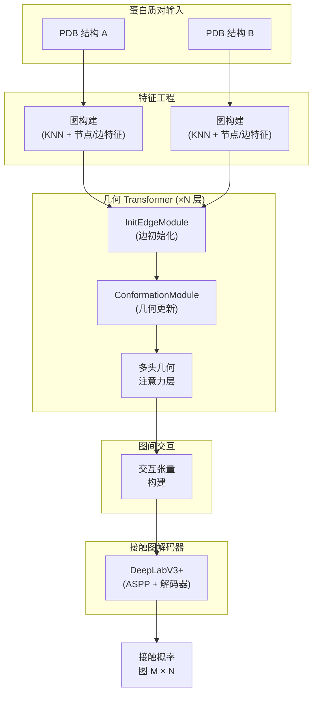

---
slug:4-architecture-overview
blog_type:normal
---


DeepInteract 实现了**用于蛋白质界面接触预测的几何 Transformer**（ICLR 2022），这是一个几何深度学习流水线，用于预测两个蛋白质表面上哪些残基对会在蛋白质-蛋白质界面形成物理接触。该架构融合了针对单个蛋白质结构的**几何感知图注意力**、**图间交互建模**以及**语义分割解码器**，从而生成逐残基的接触概率图——这一公式化表达将蛋白质对接重新诠释为针对交互张量的 2D 分割问题。


来源: [README.md](/README.md#L1-L50), [deepinteract_modules.py](/project/utils/deepinteract_modules.py#L1-L30)

## 系统级数据流

端到端流水线接收一对蛋白质结构（PDB 文件），将每个结构编码为具有丰富几何和生化特征的 k-近邻残基图，通过 Geometric Transformer 独立优化它们的表征，从两个图嵌入构建联合交互张量，并通过 DeepLabV3+ 分割头解码出二值接触图。下图展示了这一核心数据流：



来源: [deepinteract_modules.py](/project/utils/deepinteract_modules.py#L1630-L1750), [deepinteract_utils.py](/project/utils/deepinteract_utils.py#L103-L130)

## 三阶段架构

DeepInteract 的架构可清晰地解耦为三个功能迥异的阶段，每个阶段均实现为可组合的 PyTorch 模块，由 `LitGINI` Lightning 模块统一编排。这种分离反映了一个深思熟虑的设计决策：**图内表征学习**（阶段 1）与**图间推理**（阶段 2）和**空间解码**（阶段 3）解耦，从而支持在每个边界进行独立的消融实验和模块替换。

| 阶段 | 模块 | 输入 | 输出 | 目的 |
|-------|--------|-------|--------|---------|
| **1. 几何 Transformer** | `DGLGeometricTransformer` | DGLGraph（节点 + 边） | 优化后的 DGLGraph | 学习每个蛋白质的几何感知残基表征 |
| **2. 交互张量** | `construct_interact_tensor` | 图 A 和 B 的节点特征 | 4D 张量 `(B, C, M, N)` | 联合编码所有跨蛋白质残基对 |
| **3. 接触解码器** | `DeepLabV3Plus` 或 `ResNet2DInputWithOptAttention` | 交互张量 | 接触图 `(B, 2, M, N)` | 在 2D 空间中分割接触与非接触区域 |

来源: [deepinteract_modules.py](/project/utils/deepinteract_modules.py#L1610-L1700), [deepinteract_utils.py](/project/utils/deepinteract_utils.py#L103-L130), [vision_modules.py](/project/utils/vision_modules.py#L200-L280)

## 阶段 1: 几何 Transformer 堆叠

**几何 Transformer** 是本工作的核心创新——它通过显式的几何边更新路径扩展了 Dwivedi & Bresson (2020) 的图 Transformer 架构。每个蛋白质表示为一个 DGLGraph，其中节点为残基，边连接 3D 空间中的 k-近邻（默认 k=20）。该 Transformer 堆叠由一个 `InitEdgeModule` 及随后的多个 `GeometricTransformerModule` 层组成，每层在内部将一个 `ConformationModule` 与一个 `MultiHeadGeometricAttentionLayer` 组合。

### InitEdgeModule

`InitEdgeModule` 从原始几何特征（距离、方向、取向帧和酰胺平面法向量角度）引导边表征的生成——具体方式为：嵌入源节点和目标节点索引，通过带有 SiLU 激活的专用线性层投影每个几何特征通道，然后通过学习到的组合表征对投影进行门控，最后重组为初始化的边特征。该模块确保**注意力机制从第一层起即可访问几何结构**，而非仅仅依赖拓扑结构。

来源: [deepinteract_modules.py](/project/utils/deepinteract_modules.py#L92-L230)

### ConformationModule

`ConformationModule` 是该架构独有的几何演化组件。它通过 DGL 消息传递聚合相邻边特征，通过独立的投影路径嵌入原始几何特征（距离、方向、取向、酰胺），应用带有批归一化/层归一化的残差前和残差后 `ResBlock` 序列，并通过残差跳跃连接重新接入，从而迭代更新边表征。该模块显式地**通过网络传播 3D 几何约束**，确保残基间的空间关系随注意力驱动的更新逐步精细化。

### 多头几何注意力层

`MultiHeadGeometricAttentionLayer` 使用节点特征上的标准 Q/K/V 投影计算图边上的注意力分数，但关键在于，它通过逐元素相乘 (`imp_exp_attn`) 用**显式边特征**修改隐式（拓扑）注意力分数。这种混合注意力机制——即几何调制拓扑——是区分几何 Transformer 与标准图 Transformer 的决定性特征。前向传播过程为：(1) 计算 Q·K^T 点积分数，(2) 缩放与截断，(3) 乘以投影后的边特征，(4) 应用 softmax，(5) 将加权值聚合到目标节点。

来源: [deepinteract_modules.py](/project/utils/deepinteract_modules.py#L36-L90), [deepinteract_modules.py](/project/utils/deepinteract_modules.py#L310-L500), [graph_utils.py](/project/utils/graph_utils.py#L13-L50)

### GeometricTransformerModule（单层）

每个 `GeometricTransformerModule` 层应用 **Pre-LN Transformer 模式**：归一化 → 几何注意力 → 残差 → 归一化 → MLP → 残差。单层的完整前向传播过程为：

1. **ConformationModule** — 使用几何消息传递更新边特征
2. **归一化** — 对节点和边特征应用 LayerNorm 或 BatchNorm
3. **多头注意力** — 计算几何调制注意力并更新节点/边特征
4. **首次残差连接** — 将输入加至注意力输出
5. **MLP** — 带有 SiLU 激活和 dropout 的双层前馈网络
6. **第二次残差连接** — 将 MLP 前的表征加至 MLP 输出

`DGLGeometricTransformer` 堆叠 N 个此类层（可通过 `num_gnn_layers` 配置），中间层同时更新节点和边特征，最后一层仅更新节点特征以供下游使用。

来源: [deepinteract_modules.py](/project/utils/deepinteract_modules.py#L500-L700), [deepinteract_modules.py](/project/utils/deepinteract_modules.py#L1350-L1500)

## 阶段 2: 交互张量构建

在两个蛋白质图各自独立通过几何 Transformer 处理后，其节点表征通过 `construct_interact_tensor` 组合为一个**联合交互张量**。给定两图的节点特征矩阵 **X_A** ∈ ℝ^(M×C) 和 **X_B** ∈ ℝ^(N×C)，交互张量通过以下方式交织它们：

1. 将 **X_A** 和 **X_B** 分别重塑为维度 `(1, C, M)` 和 `(1, C, N)` 的 3D 张量
2. 沿 N 维度重复 **X_A**，沿 M 维度重复 **X_B**
3. 沿通道维度拼接，生成形状为 `(1, 2C, M, N)` 的张量

该 4D 交互张量将**所有 M×N 个残基对交互**编码为 2D 特征图——这与图像直接类似——从而支持在阶段 3 中使用卷积和分割架构。对于超过残基数量限制（默认 256）的蛋白质，`construct_subsequenced_interact_tensors` 通过在两个维度上滑动窗口，将交互张量划分为可管理的子序列块。

来源: [deepinteract_utils.py](/project/utils/deepinteract_utils.py#L103-L130), [deepinteract_utils.py](/project/utils/deepinteract_utils.py#L77-L102)

## 阶段 3: 接触图解码器

交互张量被解码为二值接触概率图，其方式是将问题视为**语义分割**——这是一个关键的架构洞见。DeepInteract 支持两种解码器变体：

### DeepLabV3+（主解码器）

`DeepLabV3Plus` 模块应用 ResNet34 编码器（为适应任意输入通道修补了首层卷积），随后是速率为 (12, 24, 36) 的**空洞空间金字塔池化 (ASPP)** 模块、双线性上采样、来自编码器第 2 阶段的低级特征融合，以及投影到 2 类（接触 / 非接触）的 1×1 分割头。ASPP 模块通过三个速率的并行空洞卷积加上全局平均池化来捕获多尺度上下文，拼接后进行投影——这对于同时捕获局部界面块和远程界面模式至关重要。

### 带可选区域注意力的空洞 ResNet（备选解码器）

`ResNet2DInputWithOptAttention` 模块提供了一种备选解码器，使用带有挤压激励块的自定义空洞 `ResNet`，以及可选的 `MultiHeadRegionalAttention` 机制，该机制通过 3D 扩展卷积在局部空间区域内计算注意力。此变体支持可配置的空洞循环（默认 [1, 2, 4, 8]）以实现受控的感受野扩张。

| 属性 | DeepLabV3+ | 空洞 ResNet + 注意力 |
|----------|-----------|----------------------|
| 编码器 | ResNet34 (timm) | 带有 SE 块的自定义 ResNet |
| 多尺度 | ASPP (速率 12, 24, 36) | 空洞循环 [1, 2, 4, 8] |
| 注意力 | 无（通过 ASPP 隐式实现） | 可选的区域多头注意力 |
| 低级跳跃连接 | 有（编码器第 2 阶段） | 无 |
| 归一化 | BatchNorm | InstanceNorm |

来源: [vision_modules.py](/project/utils/vision_modules.py#L200-L330), [vision_modules.py](/project/utils/vision_modules.py#L333-L400), [deepinteract_modules.py](/project/utils/deepinteract_modules.py#L1000-L1200)

## LitGINI: 编排与训练

`LitGINI`（几何聚焦的图间节点交互）`LightningModule` 是顶层编排器，负责连接所有三个阶段并管理训练、验证和测试。其 `shared_step` 方法实现了前向传播：(1) 可选地嵌入节点特征，(2) 将每个蛋白质图通过几何 Transformer，(3) 构建交互张量，(4) 解码为接触 logits，(5) 移除填充并重塑。训练使用支持类权重加权的 `CrossEntropyLoss`、带有 `CosineAnnealingWarmRestarts` 调度器的 `AdamW` 优化器，并跟踪一套全面的指标，包括 Accuracy、Precision、Recall、F1、AUROC、AUPRC，以及在具有生物学意义的阈值（L/5, L/10, L/2）下的 top-k 精确率/召回率。

<CgxTip>`disable_geometric_mode` 标志通过用简单的线性投影替换 `ConformationModule`，将几何 Transformer 转换为原始的图 Transformer——这有助于进行消融研究以隔离显式几何更新的贡献。</CgxTip>

<CgxTip>大蛋白质的交互张量会自动进行子序列批处理 (max_len=256) 以适应 GPU 内存，解码后的 logits 将通过 `remove_subsequenced_input_padding` 重新组装。</CgxTip>

来源: [deepinteract_modules.py](/project/utils/deepinteract_modules.py#L1610-L1800), [lit_model_train.py](/project/lit_model_train.py#L30-L100)

## 特征工程流水线

该架构将蛋白质结构作为 DGLGraph 摄取，DGLGraph 由 `prot_df_to_dgl_graph_feats` 构建，该函数从残基 Cα 坐标创建 k-近邻图，并通过 `FEAT_COLS` 和 `ALLOWABLE_FEATS` 中定义的特征列，经由独热编码和标量编码对节点特征进行编码。特征索引模式——编纂在 `FEATURE_INDICES` 中——将拼接的节点和边特征张量划分为命名切片：

| 特征类型 | 节点索引范围 | 边索引范围 | 描述 |
|-------------|-----------------|-----------------|-------------|
| 位置编码 | `[0]` | `[0]` | 图结构位置 |
| 几何特征 | `[1:7]` | — | 坐标衍生的节点特征 |
| DIPS-Plus 特征 | `[7:113]` | — | 生化残基属性 |
| 边权重 | — | `[1]` | 边权重 / 距离 |
| 距离特征 | — | `[2:20]` | 18 维距离编码 |
| 方向特征 | — | `[20:23]` | 3D 单位方向向量 |
| 取向特征 | — | `[23:27]` | 坐标系旋转编码 |
| 酰胺角 | — | `[27]` | 酰胺平面法向量角 |

节点特征涵盖残基标识（20 维独热编码）、二级结构（8 维）、相对溶剂可及性、残基深度、PSAIA 列（6 个特征）、半球氨基酸组成（42 维）、配位数、序列特征（27 维，来自 MSA）以及酰胺法向量。边特征编码残基对之间的完整几何关系：距离、方向、取向帧和酰胺平面角——这正是 ConformationModule 独立处理的四个几何通道。

来源: [deepinteract_constants.py](/project/utils/deepinteract_constants.py#L50-L117), [graph_utils.py](/project/utils/graph_utils.py#L65-L127)

## 项目结构

```
project/
├── utils/
│   ├── deepinteract_modules.py   ← 核心模型: MHA, Conformation, GeoTrans, LitGINI
│   ├── deepinteract_utils.py     ← 交互张量、指标、初始化、整理
│   ├── deepinteract_constants.py ← 特征索引、残基限制、允许值
│   ├── vision_modules.py         ← DeepLabV3+, ASPP, ResNet 编码器/解码器
│   ├── graph_utils.py            ← KNN 图构建、注意力原语
│   ├── protein_feature_utils.py  ← 几何蛋白质特征计算
│   └── dips_plus_utils.py        ← DIPS-Plus 数据集后处理工具
├── datasets/
│   ├── builder/                  ← 数据集构建和预处理
│   ├── DIPS/                     ← DIPS 数据集模块和原始/处理后的数据
│   ├── DB5/                      ← 对接基准测试 5 数据集
│   ├── CASP_CAPRI/               ← CASP-CAPRI 评估数据集
│   └── PICP/                     ← 蛋白质界面接触预测数据模块
├── lit_model_train.py            ← 训练入口点 (Lightning Trainer)
├── lit_model_predict.py          ← 推理入口点
├── lit_model_test.py             ← 仅测试入口点
└── test_data/                    ← 用于测试的样本数据
```

来源: [README.md](/README.md#L60-L120)

## 后续阅读

架构概述确立了宏观设计。每个子系统值得进一步深入探讨：

- **几何 Transformer 内部机制**：从[多头几何注意力](5-multi-head-geometric-attention)开始，理解几何调制注意力机制，然后阅读[构象模块](6-conformation-module)了解边更新路径，以及[边初始化模块](7-edge-initialization-module)了解几何特征如何引导 Transformer。

- **图间交互**：[GINI 模型设计](8-gini-model-design)解释了完整的 LitGINI 编排，[交互张量构建](9-interaction-tensor-construction)详述了张量交织的数学原理，[DeepLabV3+ 接触解码器](10-deeplabv3-contact-decoder)涵盖了分割解码器。

- **特征工程**：[从 PDB 构建图](11-graph-construction-from-pdb) → [几何蛋白质特征](12-geometric-protein-features) → [特征常量和索引](13-feature-constants-and-indices)。

- **实际应用**：[Lightning 训练流水线](17-lightning-training-pipeline) 和 [预测工作流](18-prediction-workflow) 用于端到端运行系统。