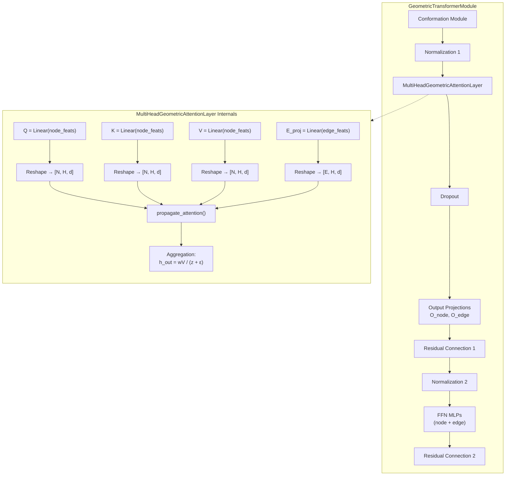
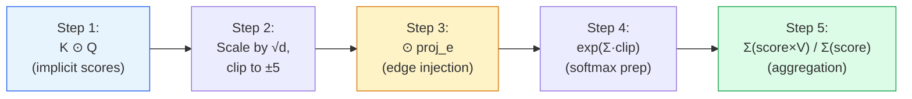

---
slug:5-multi-head-geometric-attention
blog_type:normal
---


**多头几何注意力层**是 DeepInteract 几何 Transformer 中的核心神经机制，它通过融合*隐式*节点间交互与*显式*几何边特征，来计算蛋白质图上的注意力分数。标准的 Transformer 注意力机制基于序列或词元的邻接关系运行，而本层则不同，它在 DGL 图上运行，其中的边携带了丰富的结构信息——距离、方向、取向和酰胺平面角——这些信息会直接修正注意力分布。本页将深入剖析该层的架构、五步注意力传播流水线，以及它在更宏观的几何 Transformer 技术栈中的集成方式。

## 架构上下文

`MultiHeadGeometricAttentionLayer` 位于每个 `GeometricTransformerModule` 和 `FinalGeometricTransformerModule` 的核心位置。它在构象模块演化出几何边特征，并且应用了批次/层归一化之后被调用。随后，该注意力层生成更新后的节点表示和（可选的）边表示，这些表示将经过输出投影和带有残差连接的前馈 MLP。



来源: [deepinteract_modules.py](/project/utils/deepinteract_modules.py#L500-L732), [deepinteract_modules.py](/project/utils/deepinteract_modules.py#L735-L951)

## 层规格

`MultiHeadGeometricAttentionLayer` 由五个参数构建，这些参数决定了其容量与行为：

| 参数 | 类型 | 描述 |
|-----------|------|-------------|
| `num_input_feats` | `int` | 输入节点和边特征的维度（通常为 `num_hidden_channels`） |
| `num_output_feats` | `int` | 每个头的输出维度，计算方式为 `num_hidden_channels // num_heads` |
| `num_heads` | `int` | 并行注意力头的数量（默认：4） |
| `using_bias` | `bool` | Q/K/V/E 投影是否包含偏置项（仅当输入 ≠ 输出尺寸时为 `True`） |
| `update_edge_feats` | `bool` | 是否提取并返回更新后的边特征（中间层为 `True`，最终层为 `False`） |

该层实例化了**四个线性投影**，将共享的输入维度映射到完整的多头输出空间：

- **Q**: `Linear(num_input_feats → num_output_feats × num_heads)` — 源节点的查询投影
- **K**: `Linear(num_input_feats → num_output_feats × num_heads)` — 目标节点的键投影
- **V**: `Linear(num_input_feats → num_output_feats × num_heads)` — 源节点的值投影
- **edge_feats_projection**: `Linear(num_input_feats → num_output_feats × num_heads)` — 显式边特征的投影

来源: [deepinteract_modules.py](/project/utils/deepinteract_modules.py#L34-L51)

## 参数初始化

所有可学习参数均采用缩放因子为 2.0 的 **Glorot-正交方案** 进行初始化。`glorot_orthogonal` 函数首先对权重张量应用正交初始化，然后按照以下公式进行缩放：

```
scale_adjusted = scale / ((fan_in + fan_out) × variance)
weight *= sqrt(scale_adjusted)
```

当启用偏置时，所有偏置向量均初始化为零。这种初始化策略能够在早期训练阶段促进多头注意力机制中梯度的稳定流动，考虑到该层深处于几何 Transformer 技术栈内部，这一点至关重要。

来源: [deepinteract_modules.py](/project/utils/deepinteract_modules.py#L55-L74), [deepinteract_utils.py](/project/utils/deepinteract_utils.py#L47-L52)

## 五步注意力传播流水线

`propagate_attention` 方法实现了一个经过精心排序的五步流水线，将原始的节点和边表示转换为具备几何感知的注意力分布。每一步均作为 DGL 的 `apply_edges` 或 `send_and_recv` 操作实现，从而确保在图结构上进行高效的消息传递。

### 第 1 步：隐式注意力分数计算 — `src_dot_dst`

```python
graph.apply_edges(src_dot_dst('K_h', 'Q_h', 'score'))
```

此步计算源节点的键表示与目标节点的查询表示在每个头上的逐元素乘积：`score = K_h(src) ⊙ Q_h(dst)`。结果是一个形状为 `[E, H, d]` 的逐边张量，其中 `E` 是边数，`H` 是头数，`d` 是每个头的特征维度。这是**隐式**注意力信号——它仅基于学习到的表示来捕获哪些节点对是相关的，类似于标准的点积注意力。

### 第 2 步：缩放与截断 — `scaling`

```python
graph.apply_edges(scaling('score', np.sqrt(self.num_output_feats), 5.0))
```

隐式分数被除以 `√d`（标准的缩放注意力除数），然后被截断至 `[-5.0, 5.0]` 范围内。缩放可防止在特征维度较大时发生 softmax 饱和，而截断则通过防止后续指数步骤中的溢出来确保数值稳定性。

### 第 3 步：边特征注入 — `imp_exp_attn`

```python
graph.apply_edges(imp_exp_attn('score', 'proj_e'))
```

这是几何注意力的**核心创新**：投影后的边特征 `proj_e` 与缩放后的注意力分数进行逐元素相乘：`score = score ⊙ proj_e`。这意味着编码在边中的每一个几何属性——残基间距离、单位方向向量、取向特征和酰胺平面角——都会直接调节哪些边能获得注意力权重。如果某条边的几何特征与学习到的查询-键模式无关，其注意力分数将被抑制；而几何上有意义的边则会被放大。

### 第 4 步：Softmax 准备 — `exp`

```python
graph.apply_edges(exp('score', 5.0))
```

此步计算每条边和每个头在特征维度上注意力分数之和的指数，并通过截断至 `[-5.0, 5.0]` 来保证数值稳定性：`score = exp(sum(score, dim=-1).clamp(-5, 5))`。这是未归一化的 softmax 分子。截断操作必不可少，因为第 3 步的边特征注入可能会产生幅值很大的分数，从而导致 `exp` 溢出。

### 第 5 步：加权值聚合

```python
e_ids = graph.edges()
graph.send_and_recv(e_ids, fn.u_mul_e('V_h', 'score', 'V_h'), fn.sum('V_h', 'wV'))
graph.send_and_recv(e_ids, fn.copy_e('score', 'score'), fn.sum('score', 'z'))
```

两个并行的消息传递操作在每个目标节点处聚合信息： **(a)** `wV` 累加所有入边的分数加权值向量 `Σ(score × V_h)`， **(b)** `z` 累加所有入边的原始分数 `Σ(score)`，作为 softmax 的分母。最终的归一化输出在 `forward` 方法中计算如下：

```python
h_out = wV / (z + ε)    # 其中 ε = 1e-6 以保证数值安全
```

这是作为除法执行的**显式 softmax 归一化**，而非使用内置的 softmax，因为注意力分布是通过 `apply_edges` 逐边计算的，而不是作为一个整体的矩阵运算。



来源: [deepinteract_modules.py](/project/utils/deepinteract_modules.py#L76-L96), [graph_utils.py](/project/utils/graph_utils.py#L21-L63)

## 前向传播编排

`forward` 方法在 `graph.local_scope()` 上下文中将投影和传播步骤连接在一起，以确保中间图数据（Q_h, K_h, V_h, proj_e, score, wV, z）不会在调用结束后持续存在：

1. 通过 Q、K、V **投影**节点特征，并通过 `edge_feats_projection` **投影**边特征
2. 将所有投影从 `[N, H×d]` **重塑**为 `[N, H, d]`，并作为图节点/边数据存储
3. 通过五步流水线**传播**注意力
4. 将 `wV` 除以 `z + ε` 进行**归一化**，以产生注意力加权的节点输出
5. 当 `update_edge_feats=True` 时，**可选提取**边输出（`e_out`）

`(h_out, e_out)` 的双重返回使得中间几何 Transformer 层能够同时更新节点和边表示，而最终层则通过设置 `update_edge_feats=False` 来丢弃边输出。

来源: [deepinteract_modules.py](/project/utils/deepinteract_modules.py#L98-L121)

## DGL 边级原语参考

注意力传播流水线依赖于定义在 `graph_utils.py` 中的四个可组合边级原语。每个原语返回一个在 DGL `EdgeBatch` 对象上操作的闭包：

| 原语 | 签名 | 操作 | 目的 |
|-----------|-----------|-----------|---------|
| `src_dot_dst` | `(src_field, dst_field, out_field)` | `src[src_field] ⊙ dst[dst_field]` | 隐式查询-键交互 |
| `scaling` | `(field, scale_constant, clip_constant)` | `(data[field] / scale_constant).clamp(-clip, clip)` | 带稳定性的缩放注意力 |
| `imp_exp_attn` | `(implicit_attn, explicit_edge)` | `data[implicit_attn] ⊙ data[explicit_edge]` | 几何边特征注入 |
| `exp` | `(field, clip_constant)` | `exp(sum(data[field], dim=-1).clamp(-clip, clip))` | 数值稳定的 softmax 分子 |

`out_edge_features` 原语 —— `(edge_feat)` → `{e_out: data[edge_feat]}` —— 当 `update_edge_feats=True` 时，将当前的注意力分数复制到单独的字段中，以供下游边 MLP 处理。

来源: [graph_utils.py](/project/utils/graph_utils.py#L21-L63)

## 集成：中间层与最终层

`MultiHeadGeometricAttentionLayer` 的实例化方式取决于其在 `DGLGeometricTransformer` 技术栈中的位置：

| 方面 | 中间层（`GeometricTransformerModule`） | 最终层（`FinalGeometricTransformerModule`） |
|--------|---------------------------------------------------|------------------------------------------------|
| `update_edge_feats` | `True` — 边特征被更新并返回 | `False` — 边特征被丢弃 |
| 输出投影 | 同时包含 `O_node_feats` 和 `O_edge_feats` | 仅包含 `O_node_feats` |
| FFN MLPs | 同时包含 `node_feats_MLP` 和 `edge_feats_MLP` | 仅包含 `node_feats_MLP` |
| 残差连接 | 应用于节点和边特征 | 仅应用于节点特征 |
| 二次归一化 | 应用于节点和边特征 | 仅应用于节点特征 |
| 返回值 | `(node_feats, edge_feats)` | 仅 `node_feats` |

这种不对称设计是有意为之：中间层需要不断演化的边表示来为后续层的构象模块提供输入，而最终层则将所有结构信息整合到节点表示中，供下游的 GINI 图间交互模块消费。

来源: [deepinteract_modules.py](/project/utils/deepinteract_modules.py#L615-L621), [deepinteract_modules.py](/project/utils/deepinteract_modules.py#L853-L859), [deepinteract_modules.py](/project/utils/deepinteract_modules.py#L1367-L1416)

## 几何注意力与标准图注意力的对比

多头几何注意力与标准图注意力机制（如 GAT、GraphTransformer）的关键区别在于**第 3 步：边特征注入**。下表对比了它们的计算流水线：

| 属性 | 标准图注意力 | 多头几何注意力 |
|----------|------------------------|-------------------------------|
| 分数计算 | `softmax(LeakyReLU(aᵀ[Wh_i ‖ Wh_j]))` | `K_h ⊙ Q_h`（逐元素乘积） |
| 边影响 | 无（边通过邻接关系隐式体现） | `score ⊙ proj_e`（显式几何调节） |
| 使用的几何特征 | — | 距离、方向、取向、酰胺角 |
| 归一化 | 内置 `softmax` | 通过消息传递手动计算 `wV / (z + ε)` |
| 数值稳定性 | LeakyReLU 边界 | 对分数和指数进行缩放 + 截断至 ±5.0 |
| 边更新路径 | 不支持 | 可选的 `e_out` 用于边 FFN |

<CgxTip>第 3 步中的边特征注入（`score ⊙ proj_e`）是 3D 蛋白质几何直接控制注意力流的机制。如果没有这一步，注意力机制将退化为标准的图 Transformer——这正是设置 `disable_geometric_mode=True` 时所发生的情况，它将完整的几何 Transformer 转换为原始的图 Transformer 基线。</CgxTip>

<CgxTip>`using_bias` 参数仅在 `num_input_feats ≠ num_output_feats × num_heads` 时被设置为 `True`。在默认配置中，`num_output_feats = num_hidden_channels // num_heads`，总输出维度等于输入维度，因此偏置通常被禁用。这减少了参数量，并且与在带有后续归一化的注意力层中无偏置投影效果良好这一观察相一致。</CgxTip>

来源: [deepinteract_modules.py](/project/utils/deepinteract_modules.py#L34-L121), [graph_utils.py](/project/utils/graph_utils.py#L21-L63)

## 继续探索

多头几何注意力层并非孤立运行——它依赖于由[构象模块](6-conformation-module)演化的几何边特征，以及由[边初始化模块](7-edge-initialization-module)构建的初始边表示。其输出的节点表示将被[GINI 模型设计](8-gini-model-design)消费，用于图间交互预测。如需了解更宏观的架构图景，请参阅[架构概述](4-architecture-overview)。