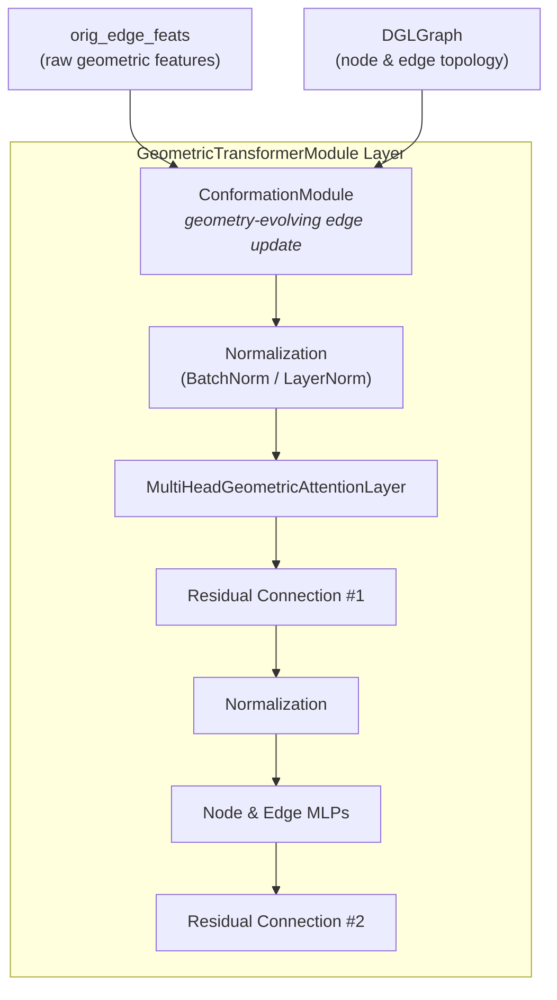
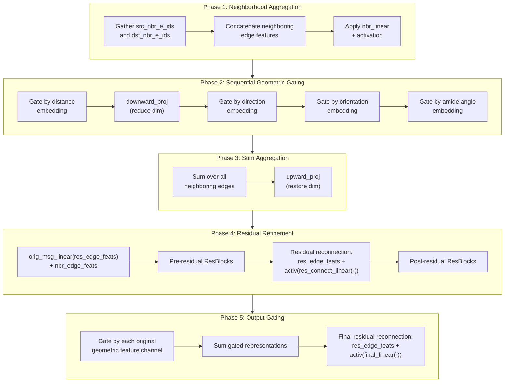

---
slug:6-conformation-module
blog_type:normal
---


**构象模块**（Conformation Module）是 DeepInteract 的几何演化边精炼引擎——这是一个定制化的消息传递子网络，它通过聚合相邻几何上下文、应用顺序几何门控，以及通过残差连接增强学习到的更新，来迭代演化边表示。正是该组件将 DeepInteract 的 Geometric Transformer 与标准 Graph Transformer 区分开来：在多头注意力机制触发之前，构象模块已经改写了每条边的特征，以反映蛋白质图的**局部构象景观**。

## 架构角色

在每个 `GeometricTransformerModule` 层中，构象模块占据着极具策略性的关键位置——它在归一化和多头几何注意力**之前**执行，这意味着所有下游的注意力分数都是基于构象感知边而非原始输入边计算得出的。这确保了注意力机制所推理的边已经编码了蛋白质的几何邻域结构，而不仅仅是成对的节点关系。



当 `disable_geometric_mode=True` 时，构象模块会退化为单一的 `nn.Linear`，从而有效地将架构还原为原始的 Graph Transformer——这是一个实用的消融控制手段。

来源: [deepinteract_modules.py](project/utils/deepinteract_modules.py#L669-L731), [deepinteract_modules.py](project/utils/deepinteract_modules.py#L584-L599)

## 几何特征分解

构象模块在从每条边通过 [`get_geo_feats_from_edges`](project/utils/deepinteract_utils.py#L70-L76) 提取出的四个独立几何特征通道上进行操作。这些通道由 `FEATURE_INDICES` 常量定义，对应于具有物理意义的蛋白质结构属性：

| 特征通道 | 索引范围 | 维度 | 物理意义 |
|---|---|---|---|
| **距离** | `[2, 20)` | 18 | 残基间距离特征 |
| **方向** | `[20, 23)` | 3 | 残基间的单位方向向量 |
| **取向** | `[23, 27)` | 4 | 相对取向（源自四元数） |
| **酰胺角** | `[27]` | 1 | 酰胺平面-酰胺平面法向量夹角 |

每个通道通过一个专用的双层瓶颈结构（`linear_0` → `linear_1`）进行嵌入，且具有不同的中间尺寸，这使得网络能够在各几何模态通过门控交互之前，为其学习到专门的表示。

来源: [deepinteract_constants.py](project/utils/deepinteract_constants.py#L99-L116), [deepinteract_utils.py](project/utils/deepinteract_utils.py#L70-L76)

## 内部架构

构象模块的 `conformation_module_message_func` 实现了一个六阶段流水线，通过邻域聚合、几何门控、残差精炼和输出门控来逐步优化边表示：



### 阶段 1 — 邻域聚合

对于每条边 $e = (u, v)$，该模块检索与源节点 $u$ 关联的所有边索引（`src_nbr_e_ids`）以及与目标节点 $v$ 关联的所有边索引（`dst_nbr_e_ids`）。这些邻接边特征被拼接起来，并通过带有 SiLU 激活函数的 `nbr_linear` 进行投影，从而生成初始的邻域表示。

### 阶段 2 — 顺序几何门控

这是该模块的标志性机制。邻域表示按照固定的顺序，被每个几何特征嵌入**顺序门控**：

1. **距离门控**: `nbr_edge_feats *= dist_linear_1(dist_linear_0(dist_feats))`
2. **降维**: `nbr_edge_feats = downward_proj(nbr_edge_feats)` — 从 `num_hidden_channels` 投影至 `shared_embed_size`
3. **方向门控**: `nbr_edge_feats *= dir_linear_1(dir_linear_0(dir_feats))`
4. **取向门控**: `nbr_edge_feats *= orient_linear_1(orient_linear_0(orient_feats))`
5. **酰胺角门控**: `nbr_edge_feats *= amide_linear_1(amide_linear_0(amide_feats))`

每个门控步骤执行逐元素乘法（`*`），允许几何特征调制来自邻接边的信息流。中间的 `downward_proj` 确保方向、取向和酰胺角门控在压缩的 `shared_embed_size` 维空间中操作，然后再进行维度恢复。

### 阶段 3 — 求和聚合与维度恢复

所有邻接边表示通过 `torch.sum` 在邻居维度上进行聚合（每条边在某种程度上是其邻居的总和），然后通过 `upward_proj` 恢复至 `num_hidden_channels` 维度。

### 阶段 4 — 残差精炼

原始边特征通过 `orig_msg_linear` 重新引入，并加至聚合后的邻域表示上。该组合信号随后通过 `num_pre_res_blocks` 个 `ResBlock` 实例，接着进行一次**残差重连**，将缓存的原始边特征相加：`edge_feats = res_edge_feats + activ(res_connect_linear(edge_feats))`。然后，再通过 `num_post_res_blocks` 个额外的 `ResBlock` 实例进一步精炼该表示。

### 阶段 5 — 输出几何门控

精炼后的边表示分别通过 `final_dist_linear`、`final_dir_linear`、`final_orient_linear` 和 `final_amide_linear`，由每个原始几何特征通道独立门控。这四个门控表示被求和后传入 `final_linear`，并进行最后一次与原始边特征的残差重连。

来源: [deepinteract_modules.py](project/utils/deepinteract_modules.py#L373-L447)

## 构造函数参数

| 参数 | 类型 | 描述 |
|---|---|---|
| `num_dist_feats` | `int` | 距离特征的维度（根据 FEATURE_INDICES 为 18） |
| `num_dir_feats` | `int` | 方向特征的维度（根据 FEATURE_INDICES 为 3） |
| `num_orient_feats` | `int` | 取向特征的维度（根据 FEATURE_INDICES 为 4） |
| `num_amide_feats` | `int` | 酰胺角特征的维度（根据 FEATURE_INDICES 为 1） |
| `dist_embed_size` | `int` | 距离瓶颈的中间嵌入大小 |
| `dir_embed_size` | `int` | 方向瓶颈的中间嵌入大小 |
| `orient_embed_size` | `int` | 取向瓶颈的中间嵌入大小 |
| `amide_embed_size` | `int` | 酰胺角瓶颈的中间嵌入大小 |
| `shared_embed_size` | `int` | `downward_proj` / `upward_proj` 的压缩维度 |
| `num_hidden_channels` | `int` | 模块内部的主隐藏通道大小 |
| `num_pre_res_blocks` | `int` | 残差重连前的 ResBlocks 数量 |
| `num_post_res_blocks` | `int` | 残差重连后的 ResBlocks 数量 |
| `activ_fn` | `Module` | 激活函数（默认: `nn.SiLU()`） |
| `norm_to_apply` | `str` | ResBlocks 中的归一化方式: `'batch'` 或 `'layer'` |
| `feature_indices` | `dict` | 特征切片索引（默认: `FEATURE_INDICES`） |

来源: [deepinteract_modules.py](project/utils/deepinteract_modules.py#L267-L334)

## ResBlock 子模块

每个 `ResBlock` 实现了一个三层的线性通路，每步均包含归一化和激活，最后接上一个跳跃连接：

```
ResBlock(x) = x + [Linear → Norm → Activ → Linear → Norm → Activ → Linear → Norm → Activ](x)
```

归一化层可通过 `norm_to_apply` 参数在 `nn.BatchNorm1d` 和 `nn.LayerNorm` 之间选择。所有线性层均使用 Glorot 正交缩放进行初始化；在参数初始化期间会跳过归一化层和激活层。

来源: [deepinteract_modules.py](project/utils/deepinteract_modules.py#L458-L497)

## 参数初始化

构象模块中的所有线性层均通过 [`glorot_orthogonal`](project/utils/deepinteract_utils.py#L47-L52) 工具使用 **Glorot 正交初始化**，该工具首先应用 `torch.nn.init.orthogonal_`，然后以 `scale=2.0` 按 `sqrt(scale / ((fan_in + fan_out) * var))` 进行缩放。带有偏置的层（`nbr_linear`、`orig_msg_linear`、`res_connect_linear`、`final_linear`）将偏置初始化为零。双层几何瓶颈（`linear_0`、`linear_1`）均无偏置。

来源: [deepinteract_modules.py](project/utils/deepinteract_modules.py#L336-L371), [deepinteract_utils.py](project/utils/deepinteract_utils.py#L47-L52)

## 前向传播签名

```python
def forward(self, graph: dgl.DGLGraph, orig_edge_feats: torch.Tensor) -> torch.Tensor
```

该模块接收完整的 `DGLGraph`（用于拓扑和通过 `graph.apply_edges` 访问邻居边索引）以及**原始几何边特征** `orig_edge_feats`（在任何注意力更新之前缓存）。它在 `graph.local_scope()` 内运行以避免改变输入图，并将 `orig_edge_feats` 存储在 `graph.edata['orig_f']` 中，以便在 DGL 消息函数中访问。更新后的边特征以形状为 `[num_edges, num_hidden_channels]` 的张量返回。

<CgxTip>`orig_edge_feats` 参数至关重要：它保留了来自初始边表示的原始几何特征（距离、方向、取向、酰胺角），确保几何门控始终引用真实的结构几何，而不是那些可能跨层丢失几何可解释性的注意力改写特征。</CgxTip>

来源: [deepinteract_modules.py](project/utils/deepinteract_modules.py#L449-L455)

## 与 Transformer 层的集成

构象模块在 `GeometricTransformerModule` 和 `FinalGeometricTransformerModule` 中均有实例化。在标准的 `GeometricTransformerModule` 中，当 `disable_geometric_mode=False` 时条件性地创建，并在 `run_gt_layer` 开始时作为 `edge_feats = self.conformation_module(graph, orig_edge_feats)` 调用。`FinalGeometricTransformerModule` 遵循相同的模式，但当 `disable_geometric_mode=True` 时，额外支持一个线性回退，即用单一的 `nn.Linear` 替代完整模块，将原始边特征直接映射至 `num_hidden_channels`。

<CgxTip>设置 `disable_geometric_mode=True` 提供了一个严格的消融基线：架构变为了源自 "A Generalization of Transformer Networks to Graphs" 的原始 Graph Transformer，从而能够对几何边演化与静态边特征进行受控比较。</CgxTip>

来源: [deepinteract_modules.py](project/utils/deepinteract_modules.py#L584-L599), [deepinteract_modules.py](project/utils/deepinteract_modules.py#L815-L837), [deepinteract_modules.py](project/utils/deepinteract_modules.py#L676-L677)

## 设计原理

构象模块体现了蛋白质结构感知图学习的两个关键原则。**首先**，几何门控确保边更新始终以残基间的实际物理关系为条件——距离控制影响的强度，方向和取向编码旋转几何，酰胺角捕获骨架二面角上下文。**其次**，双重残差架构（内部的 `res_connect_linear` 重连与外部的输出门控重连）确保该模块充当的是**精炼算子**而非替代品：原始边特征始终保留在输出中，学习到的几何校正值被叠加其上。这使得即使在几何特征有噪声或部分缺失时训练也能保持稳定，因为模型可以回退至其残差路径。

来源: [deepinteract_modules.py](project/utils/deepinteract_modules.py#L428-L443)

---

**下一步**: 了解输入至构象模块的初始边表示是如何构建的，请参阅 [边初始化模块](7-edge-initialization-module)；或探索消费其输出的注意力机制，请参阅 [多头几何注意力](5-multi-head-geometric-attention)。