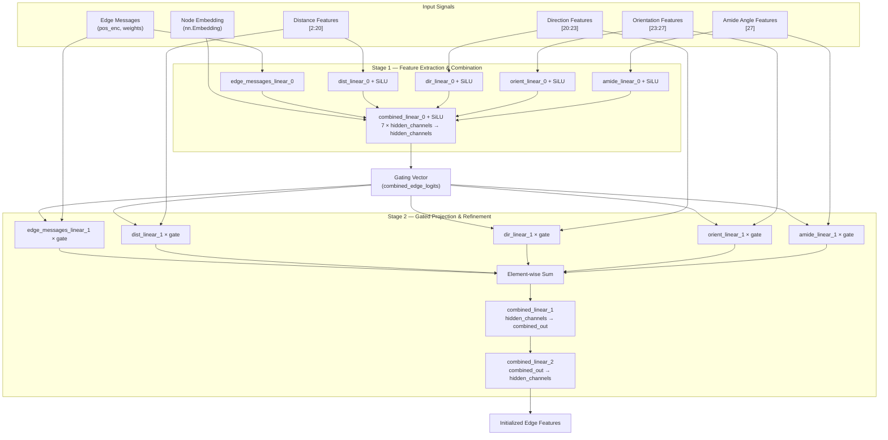

---
slug:7-edge-initialization-module
blog_type:normal
---


**边缘初始化模块**（`InitEdgeModule`）是 DeepInteract 的几何 Transformer 中的基础组件，负责将原始边缘特征（距离、方向、方向朝向及酰胺平面角度信号）与节点身份嵌入转换为一个统一的、可学习的边缘表示。它作为蛋白质图的几何特征张量与下游[构象模块](6-conformation-module)和[多头几何注意力](5-multi-head-geometric-attention)层之间的关键桥梁，确保 KNN 图中的每条边在开始其计算旅程时，都拥有既忠实于几何特性又适合基于梯度优化的表示。

来源: [deepinteract_modules.py](project/utils/deepinteract_modules.py#L128-L264), [deepinteract_constants.py](project/utils/deepinteract_constants.py#L99-L116)

## 架构上下文

`InitEdgeModule` 在几何 Transformer 的前向传播中占据着明确的位置：它在任何注意力或构象计算**之前**被调用，将包含索引几何特征的原始 `graph.edata['f']` 张量转换为已初始化的隐藏通道表示。若无此模块，构象模块和注意力层将接收到异构且维度不一致的特征信号。



该模块实现了**门控两阶段**架构：阶段 1 从所有特征通道生成联合门控信号，阶段 2 利用该门控在将特征特定的线性投影折叠为单一隐藏通道输出之前对其进行调制。

来源: [deepinteract_modules.py](project/utils/deepinteract_modules.py#L128-L264)

## 构造函数与参数清单

`InitEdgeModule` 构造函数接受以下参数，每个参数各管控边缘初始化过程的不同维度：

| 参数 | 类型 | 作用 |
|---|---|---|
| `node_count_limit` | `int` | `nn.Embedding` 的词表大小；节点索引的上限 |
| `num_edge_feats` | `int` | 原始边缘消息特征的维度（pos_enc + weights = 2） |
| `num_dist_feats` | `int` | 距离特征的维度（默认为 18，索引 2–20） |
| `num_dir_feats` | `int` | 方向特征的维度（默认为 3，索引 20–23） |
| `num_orient_feats` | `int` | 方向朝向特征的维度（默认为 4，索引 23–27） |
| `num_amide_feats` | `int` | 酰胺角度特征的维度（默认为 1，索引 27） |
| `num_hidden_channels` | `int` | 所有中间表示与输出表示的通用隐藏通道大小 |
| `activ_fn` | `nn.Module` | 线性投影后应用的激活函数（默认：`nn.SiLU`） |
| `feature_indices` | `dict` | 用于切分几何特征的 `graph.edata['f']` 索引映射 |

构造函数实例化了 **12 个线性层**和 **1 个嵌入层**，它们被组织为两个对称的投影组（阶段 0 和阶段 1）以及两个组合层。值得注意的是，**所有线性层均无偏置**（`bias=False`），这一设计选择减少了参数量，并依赖门控机制来提供表征的灵活性。

来源: [deepinteract_modules.py](project/utils/deepinteract_modules.py#L131-L174)

## 两阶段门控计算

### 阶段 1：特征提取与门控

消息函数 `init_edge_module_message_func` 首先通过 `self.node_embedding` 嵌入源节点和目标节点的身份，为每条边生成两个 `hidden_channels` 维的向量。同时，它利用 `FEATURE_INDICES` 中定义的索引范围，从原始边缘特征张量中提取五个几何特征通道：

| 特征通道 | 索引范围 | 维度 | 提取方式 |
|---|---|---|---|
| 边缘位置编码 | `[0]` | 1 | 通过 `feature_indices['edge_pos_enc']` 直接切片 |
| 边缘权重 | `[1]` | 1 | 通过 `feature_indices['edge_weights']` 直接切片 |
| 距离特征 | `[2:20]` | 18 | 通过 `edge_dist_feats_start:end` 切片 |
| 方向特征 | `[20:23]` | 3 | 通过 `edge_dir_feats_start:end` 切片 |
| 方向朝向特征 | `[23:27]` | 4 | 通过 `edge_orient_feats_start:end` 切片 |
| 酰胺角度 | `[27]` | 1 | 通过 `edge_amide_angles` 切片 |

每个几何通道依次通过其专属的阶段 0 线性层和激活函数。边缘消息通道（pos_enc 与 weights 拼接为 2 维）通过 `edge_messages_linear_0` 时不经过激活。所有七个向量——两个节点嵌入加上五个投影后的特征通道——被拼接成一个 `7 × num_hidden_channels` 维的向量，随后经带有 SiLU 激活的 `combined_linear_0` 压缩，最终生成**门控向量** `combined_edge_logits`。

来源: [deepinteract_modules.py](project/utils/deepinteract_modules.py#L198-L236), [deepinteract_constants.py](project/utils/deepinteract_constants.py#L99-L116), [deepinteract_utils.py](project/utils/deepinteract_utils.py#L70-L76)

### 阶段 2：门控投影与精炼

在第二阶段，每个特征通道独立地通过其阶段 1 线性层进行重新投影，然后与门控向量进行**逐元素相乘**。这种门控机制允许联合表示针对每条边动态地抑制或放大单个几何通道——这是一种输入依赖的特征选择形式，比简单的拼接具有更强的表达能力：

```
edge_messages_1 = edge_messages_linear_1(edge_init) * combined_edge_logits
dist_feats_1    = SiLU(dist_linear_1(dist))     * combined_edge_logits
dir_feats_1     = SiLU(dir_linear_1(dir))       * combined_edge_logits
orient_feats_1  = SiLU(orient_linear_1(orient)) * combined_edge_logits
amide_feats_1   = SiLU(amide_linear_1(amide))   * combined_edge_logits
```

这五个门控向量被**求和**（而非拼接），产生一个单一的 `num_hidden_channels` 维中间表示。此和随后通过两个连续的线性投影进行精炼：`combined_linear_1` 从 `num_hidden_channels` 扩展至 `combined_out_channels`（所有原始特征维度的总和），而 `combined_linear_2` 再将其投影回 `num_hidden_channels`。这种瓶颈-扩展-收缩模式使得模块能够在返回到规范隐藏大小之前，于高维空间中学习跨通道的交互。

<CgxTip>阶段 2 中基于乘法的门控模式在功能上等价于特征级线性调制层，其中 `combined_edge_logits` 充当逐边的缩放因子。这是全注意力特征混合的一种轻量级替代方案，它通过在聚合前于每个特征通道内独立操作来保留几何归纳偏置。</CgxTip>

来源: [deepinteract_modules.py](project/utils/deepinteract_modules.py#L238-L253)

## 前向传播与 DGL 集成

`forward` 方法直接在 `dgl.DGLGraph` 上运行，使用 DGL 的 `apply_edges` API 并行地对所有边调用消息函数：

```python
def forward(self, graph: dgl.DGLGraph):
    with graph.local_scope():
        nodes = graph.nodes()
        num_nodes = len(nodes)
        graph.ndata['i'] = nodes
        graph.ndata['i_all'] = torch.cat((nodes, nodes.repeat(num_nodes - 1))).reshape(num_nodes, num_nodes)
        graph.apply_edges(self.init_edge_module_message_func)
        edge_feats = graph.edata['f']
    return edge_feats
```

`graph.local_scope()` 上下文管理器确保中间节点数据（`i`、`i_all`）不会在前向调用结束后持续存在。`i_all` 张量以重复模式缓存所有节点索引，以支持 UDF 内的嵌入查找。`apply_edges` 调用同时在每条边上分派 `init_edge_module_message_func`，将结果写回 `graph.edata['f']`，随后将其作为初始化的边缘表示返回。

来源: [deepinteract_modules.py](project/utils/deepinteract_modules.py#L255-L264)

## 参数初始化策略

所有可学习参数均通过 `reset_parameters` 进行初始化，该方法应用了两种不同的方案：

| 参数 | 初始化 |
|---|---|
| `node_embedding.weight` | 均匀分布 √3: `U(−√3, √3)` |
| 所有 `*_linear_*.weight` | 缩放为 2.0 的 Glorot 正交初始化 |

**Glorot 正交**方案首先通过 `torch.nn.init.orthogonal_` 生成一个正交矩阵，然后按 `√(scale / ((fan_in + fan_out) × var))` 进行缩放，以确保无论层宽如何，输出的初始方差都受到控制。嵌入表的均匀初始化遵循了 `nn.Embedding` 的标准默认值，为节点身份向量提供了合理的初始分布。

<CgxTip>Glorot 正交初始化中的 `scale = 2.0` 因子实际上将期望的权重大小较标准 Glorot 翻倍，这通过产生更大的初始梯度加速了早期训练。这对于门控机制尤为重要，因为若初始 `combined_edge_logits` 值过小，将导致阶段 2 的门控投影趋于零，从而停滞学习过程。</CgxTip>

来源: [deepinteract_modules.py](project/utils/deepinteract_modules.py#L176-L196), [deepinteract_utils.py](project/utils/deepinteract_utils.py#L47-L52)

## 几何特征提取工具

该模块将几何特征的切片操作委托给 `get_geo_feats_from_edges`，这是一个纯索引函数，通过读取 `FEATURE_INDICES` 来对原始边缘特征张量进行分区：

```python
def get_geo_feats_from_edges(orig_edge_feats, feature_indices):
    dist_feats   = orig_edge_feats[:, feature_indices['edge_dist_feats_start']:feature_indices['edge_dist_feats_end']]
    dir_feats    = orig_edge_feats[:, feature_indices['edge_dir_feats_start']:feature_indices['edge_dir_feats_end']]
    o_feats      = orig_edge_feats[:, feature_indices['edge_orient_feats_start']:feature_indices['edge_orient_feats_end']]
    amide_feats  = orig_edge_feats[:, feature_indices['edge_amide_angles']]
    return dist_feats, dir_feats, o_feats, amide_feats
```

此函数在 `InitEdgeModule` 和[构象模块](6-conformation-module)之间共享，确保了几何 Transformer 各处理阶段间特征解读的一致性。`FEATURE_INDICES` 字典充当了边缘特征张量字节级布局的唯一事实来源。

来源: [deepinteract_utils.py](project/utils/deepinteract_utils.py#L70-L76), [deepinteract_constants.py](project/utils/deepinteract_constants.py#L99-L116)

## 设计原理与模式

`InitEdgeModule` 体现了若干深思熟虑的架构决策，对于希望扩展或修改几何 Transformer 的开发者而言，这些决策值得注意：

| 设计决策 | 原理 |
|---|---|
| **无偏置线性层** | 减少参数量；门控机制提供逐边的偏移能力 |
| **两阶段门控架构** | 将“关注什么”（阶段 1 门控）与“如何变换”（阶段 2 投影）解耦 |
| **基于求和的门控特征聚合** | 在不引发拼接维度爆炸的情况下维持 `hidden_channels` 维度；鼓励加性特征组合 |
| **瓶颈-扩展-收缩精炼** | `combined_linear_1` → `combined_linear_2` 创建了一个中间的过参数化空间，用于跨特征交互 |
| **通过 `nn.Embedding` 进行节点嵌入** | 为每个残基提供可学习的位置身份，以序列顺序感知补充几何特征 |
| **SiLU 激活** | 自门控线性单元提供平滑、非单调的门控及非零均值梯度，相比 ReLU 改善了优化地形 |

来源: [deepinteract_modules.py](project/utils/deepinteract_modules.py#L128-L264)

## 后续内容

在 `InitEdgeModule` 生成初始化的边缘表示后，几何 Transformer 将其输入到[构象模块](6-conformation-module)中，该模块通过邻居感知门控和残差连接迭代演化几何边缘特征。构象模块的输出随后进入[多头几何注意力](5-multi-head-geometric-attention)层，在此处显式边缘特征将对隐式注意力分数进行调制。如需了解更广泛的系统上下文，请参阅[架构概览](4-architecture-overview)。