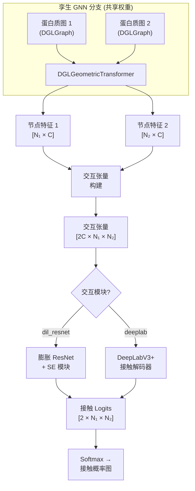
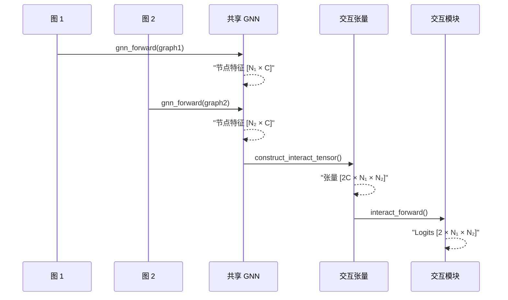

---
slug:8-gini-model-design
blog_type:normal
---


**聚焦几何的图间节点交互** 模块是 DeepInteract 的核心架构支柱——DeepInteract 是一种孪生神经网络，可将成对的蛋白质结构图转换为逐残基接触概率图。GINI 桥接了两种计算范式：一是通过 Geometric Transformer 独立从每个蛋白质中提取 3D 结构语义的**图内表征学习**，二是通过 2D 卷积解码器将跨蛋白质的配对表征融合为联合交互表面的**图间交互推理**。本页将解析 `LitGINI` 模块的设计理念、架构拓扑与数据流机制。

来源：[deepinteract_modules.py](project/utils/deepinteract_modules.py#L1478-L1583)

## 架构概述

GINI 采用了**孪生设计**，即一个共享的 GNN 模块使用相同的权重处理两个蛋白质图，确保节点表征在公共潜空间中生成。随后，两个独立的图输出被组合成一个**交互张量**——一个空间维度对应于各蛋白质残基数量的 2D 特征图——并经由**交互模块**（膨胀 ResNet 或 DeepLabV3+ 解码器）预测逐残基对的接触概率。



该架构可清晰地分解为三个阶段，每个阶段由 `LitGINI` 中独立的方法控制：

| 阶段 | 方法 | 输入 → 输出 | 目的 |
|-------|--------|----------------|---------|
| 图内编码 | `gnn_forward()` | `DGLGraph` → `List[Tensor]` | 学习逐节点结构嵌入 |
| 跨图组合 | `construct_interact_tensor()` | `(Tensor, Tensor)` → `Tensor` | 从配对嵌入构建 2D 交互表面 |
| 交互解码 | `interact_forward()` | `Tensor` → `Tensor` | 预测逐残基对接触 logits |

来源：[deepinteract_modules.py](project/utils/deepinteract_modules.py#L1478-L1583), [deepinteract_modules.py](project/utils/deepinteract_modules.py#L1660-L1685)

## 模块构建

`LitGINI.__init__` 方法负责协调所有子模块的装配及其超参数绑定。构建遵循特定的顺序：**参数记录 → GNN 模块构建 → 交互模块构建 → 损失/指标声明 → 参数初始化**。

### 超参数拓扑

GINI 的构造函数接受丰富的超参数集合，这些参数可清晰地划分为四个逻辑组：

| 组别 | 关键参数 | 默认值 | 作用 |
|-------|---------------|---------|------|
| **GNN 架构** | `gnn_layer_type`, `num_gnn_layers`, `num_gnn_hidden_channels`, `num_gnn_attention_heads`, `knn` | `'geotran'`, 2, 128, 4, 20 | 控制图内表征的深度与容量 |
| **交互架构** | `interact_module_type`, `num_interact_layers`, `num_interact_hidden_channels`, `use_interact_attention`, `num_interact_attention_heads` | `'dil_resnet'`, 14, 128, False, 4 | 控制图间解码器的深度与容量 |
| **训练机制** | `lr`, `weight_decay`, `dropout_rate`, `pn_ratio`, `weight_classes`, `num_epochs` | 1e-3, 1e-2, 0.2, 0.1, False, 50 | 调节优化动力学与类别不平衡 |
| **基础设施** | `pad`, `max_num_residues`, `fine_tune`, `ckpt_path`, `use_wandb_logger` | False, 100, False, None, True | 内存管理、检查点、日志记录 |

<CgxTip>`disable_geometric_mode` 标志可将整个 Geometric Transformer 流水线转换为标准的 Graph Transformer——剥离所有几何特征条件化（距离、方向、朝向、酰胺门控）。这对于隔离 3D 几何归纳偏置贡献的**消融研究**极具价值。</CgxTip>

来源：[deepinteract_modules.py](project/utils/deepinteract_modules.py#L1481-L1583)

### GNN 模块装配

`build_gnn_module()` 方法根据 `gnn_layer_type` 选择器来编组图内编码层。存在两种路径：

- **`'gcn'`**：堆叠 `num_gnn_layers` 个来自 DGL 的基础 `GraphConv` 层——这是一个轻量级基线，通过边权重调制执行消息传递，但不涉及几何推理。
- **`'geotran'`**（默认）：实例化一个单一的 `DGLGeometricTransformer`，其内部组合了一个 `InitEdgeModule`、`num_layers - 1` 个中间 `GeometricTransformerModule` 块以及一个 `FinalGeometricTransformerModule`。Geometric Transformer 在内部管理自身的深度，因此即使 `num_gnn_layers > 1`，`nn.ModuleList` 中也只会放置**一个** `DGLGeometricTransformer`。

可选的**节点输入嵌入**（`node_in_embedding`）会在输入特征维度与隐藏通道宽度不同时，将原始节点特征投影到 `num_gnn_hidden_channels`，从而确保与下游 Geometric Transformer 层的维度兼容性。

```python
# 简化的构建逻辑
if self.using_gcn:
    gnn_layers = [GraphConv(...) for _ in range(self.num_gnn_layers)]
else:
    gnn_layers = [DGLGeometricTransformer(
        num_hidden_channels=self.num_gnn_hidden_channels,
        num_attention_heads=self.num_gnn_attention_heads,
        num_layers=self.num_gnn_layers,
        ...
    )]
self.gnn_module = nn.ModuleList(gnn_layers)
```

来源：[deepinteract_modules.py](project/utils/deepinteract_modules.py#L1591-L1625)

### 交互模块装配

`build_interaction_module()` 方法负责选择在交互张量上运行的 2D 解码器。`get_interact_module()` 工厂支持两种架构：

| 架构 | 选择器 | 核心特征 |
|---|---|---|
| **膨胀 ResNet + SE** | `'dil_resnet'` | 通过膨胀周期 [1,2,4,8] 实现多尺度感受野；squeeze-and-excitation 通道注意力；可选的区域多头注意力块 |
| **DeepLabV3+** | `'deeplab'` | 速率为 (12,24,36) 的空洞空间金字塔池化；具有 ResNet34 骨干的编码器-解码器结构；4× 上采样解码器 |

这两个模块均接收形状为 `[2 × num_gnn_hidden_channels, N₁, N₂]` 的交互张量，并输出形状为 `[2, N₁, N₂]` 的 logits——每个类别（非接触/接触）对应一个通道。膨胀 ResNet 将其正类上的最终偏置项初始化为 −7.0，以确保初始 sigmoid 输出约为 0.001——这是针对高度不平衡的接触预测的一个数值稳定的起点。

来源：[deepinteract_modules.py](project/utils/deepinteract_modules.py#L1627-L1655)

## 前向传播：孪生流水线

完整的前向流水线由 `shared_step()` 编排，该方法接收两个蛋白质图并生成逐复合物接触 logit 张量的列表。该方法封装了三个连续阶段：

### 阶段 1 — 图内编码

```python
graph1_node_feats = self.gnn_forward(graph1)   # List[Tensor]: 批次中每个图对应一个张量
graph2_node_feats = self.gnn_forward(graph2)
```

`gnn_forward()` 方法首先应用可选的节点嵌入，然后沿 GNN 模块列表进行传播。对于 Geometric Transformer，每层返回一个更新后的 `DGLGraph`，其 `ndata['f']` 和 `edata['f']` 携带了演化的表征。编码完成后，批次图通过 `dgl.unbatch()` 解批为单独的图节点特征张量，生成一个每个元素形状为 `[Nᵢ, C]` 的列表。

### 阶段 2 — 交互张量构建

来自两个蛋白质的节点特征通过 `construct_interact_tensor()` 被组合成 2D 交互张量。当任一图超过 `max_num_residues` 时，**子序列化**策略会将交互张量划分为可处理的分块，独立处理后重新组装 logits——从而防止大型复合物出现 GPU 内存不足错误。

```python
interact_tensors = [
    construct_interact_tensor(g1_feats, g2_feats, pad=self.pad, max_len=self.max_num_residues)
    for g1_feats, g2_feats in zip(graph1_node_feats, graph2_node_feats)
]
```

### 阶段 3 — 交互解码

每个交互张量独立通过交互模块进行解码：

```python
logits_list = [self.interact_forward(tensor) for tensor in interact_tensors]
```

当启用填充时，张量在解码前会被批量处理，并在解码后通过 `remove_padding()` 剥离填充，从而提升变长复合物的吞吐量。



<CgxTip>子序列化守卫条件（`both_graphs_within_limit is False and batch_size == 1 and high_mem_model`）当前默认 `high_mem_model = False`，实际上即使对于超大型复合物也禁用了子序列化。要为膨胀 ResNet 路径激活内存安全的分块处理，请在 `shared_step()` 中设置 `high_mem_model = True`。</CgxTip>

来源：[deepinteract_modules.py](project/utils/deepinteract_modules.py#L1687-L1745), [deepinteract_modules.py](project/utils/deepinteract_modules.py#L1660-L1679)

## 微调策略

GINI 通过 `fine_tune` 和 `ckpt_path` 参数支持结构化的微调路径。当 `fine_tune=True` 时，构造函数从指定检查点加载预训练的 `LitGINI`，并**冻结交互模块**，同时保持 GNN 模块可训练：

```python
if self.fine_tune:
    lit_gini = LitGINI.load_from_checkpoint(self.ckpt_path, ...)
    self.gnn_module, self.interact_module = lit_gini.gnn_module, lit_gini.interact_module
    for param in self.interact_module.parameters():
        param.requires_grad = False
```

这种非对称冻结反映了这样的设计直觉：**交互解码器编码了可迁移的跨蛋白质推理**（即如何从交互张量中解读接触图），而 **GNN 编码器捕获了领域特定的结构先验**，当跨越具有不同特征组合或结构分辨率的数据集进行迁移时，可能需要进行适应。

来源：[deepinteract_modules.py](project/utils/deepinteract_modules.py#L1546-L1557)

## 类别不平衡处理

蛋白质界面预测具有内在的不平衡性——只有极小一部分残基对形成真实接触。GINI 通过两种互补机制来解决此问题：

1. **训练时下采样**（`downsample_examples()`）：随机打乱训练样本，然后采样足够数量的负对以达到目标 `pn_ratio`（正负比），默认为 0.1（即负样本数量是正样本的 10 倍）。

2. **类别加权**（`weight_classes=True`）：应用手动的 `CrossEntropyLoss` 权重，其中 `neg_class_weight=1.0` 且 `pos_class_weight=5.0`，在梯度计算时对稀疏正类进行加权。

来源：[deepinteract_modules.py](project/utils/deepinteract_modules.py#L1747-L1754), [deepinteract_modules.py](project/utils/deepinteract_modules.py#L1781-L1789)

## 设计原理与核心关联

GINI 模型的架构体现了一种刻意的关注点分离：**Geometric Transformer**（详见 [Multi-Head Geometric Attention](5-multi-head-geometric-attention) 与 [Conformation Module](6-conformation-module)）处理每个蛋白质内部的所有 3D 几何推理，而**交互模块**处理跨蛋白质的所有 2D 空间推理。交互张量（详见 [Interaction Tensor Construction](9-interaction-tensor-construction)）作为连接这两种计算范式的信息瓶颈，将无序的图表征转换为适用于卷积的结构化 2D 场。解码器的选择——膨胀 ResNet 对比 DeepLabV3+（见 [DeepLabV3+ Contact Decoder](10-deeplabv3-contact-decoder)）——决定了如何在交互表面上聚合多尺度上下文。

要理解输入 GNN 编码器的几何特征，请参阅 [Geometric Protein Features](12-geometric-protein-features) 与 [Graph Construction from PDB](11-graph-construction-from-pdb)。有关驱动此模块的训练基础设施，请查阅 [Lightning Training Pipeline](17-lightning-training-pipeline)。