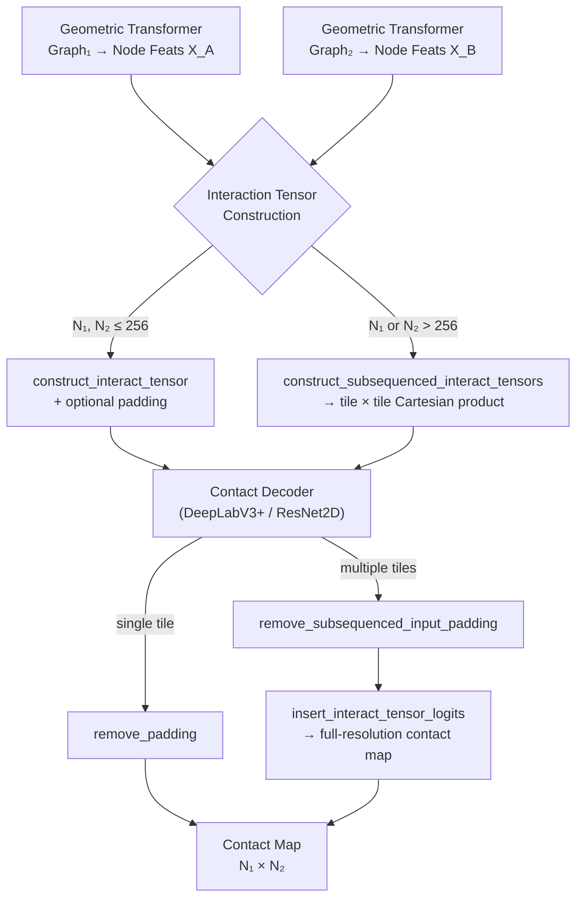

---
slug:9-interaction-tensor-construction
blog_type:normal
---


**交互张量**是核心数据结构，它将 DeepInteract 的两个独立的几何图 Transformer 与其成对接触解码器连接起来。它将每个蛋白质的节点表征（每个表征编码单条链的内部结构）转换为一个统一的 4D 张量，该张量捕获两个相互作用蛋白质之间的**所有残基-残基配对**。这一构造是**图间节点交互（GINI）**原则的数学实现：预测蛋白质-蛋白质接触需要一种显式枚举跨链配对的表征，而不仅仅是拼接的单链嵌入。

## 数学公式

给定两个蛋白质图 $\mathcal{G}_1$ 和 $\mathcal{G}_2$，其学习到的节点特征矩阵为 $\mathbf{X}_A \in \mathbb{R}^{N_1 \times D}$ 和 $\mathbf{X}_B \in \mathbb{R}^{N_2 \times D}$（其中 $N_1, N_2$ 为残基数量，$D$ 为隐藏通道维度），交互张量 $\mathcal{T}$ 的构造如下：

$$\mathcal{T} = \text{cat}\Big(\text{repeat}(\mathbf{X}_A^\top, N_2\text{ times along dim 3}),\;\text{repeat}(\mathbf{X}_B^\top, N_1\text{ times along dim 2})\Big)$$

这会生成 $\mathcal{T} \in \mathbb{R}^{1 \times 2D \times N_1 \times N_2}$，其中前 $D$ 个通道编码每个位置的受体残基，后 $D$ 个通道编码配体残基。因此，张量中的每个空间单元 $(i, j)$ 都包含拼接的特征对 $(\mathbf{x}_A^{(i)}, \mathbf{x}_B^{(j)})$——这是跨越界面的残基对的完整描述符。

来源: [deepinteract_utils.py](project/utils/deepinteract_utils.py#L151-L165)

## 核心构造：`construct_interact_tensor`

函数 `construct_interact_tensor` 实现了上述交错操作。其逻辑通过三个精确的步骤进行：

**步骤 1 — 转置与升维。** 两个输入特征矩阵都被从形状 $[N, D]$ 置换为 $[1, D, N]$，引入批次维度以保持张量代数运算的一致性：

```python
x_a, x_b = graph1_feats.permute(1, 0).unsqueeze(0), graph2_feats.permute(1, 0).unsqueeze(0)
```

**步骤 2 — 可选填充。** 当 `pad=True` 时，两个张量都沿着节点维度进行零填充以达到 `max_len`（默认 256），从而确保与下游卷积解码器兼容的固定空间分辨率：

```python
x_a = F.pad(x_a, (0, x_a_num_zeros, 0, 0, 0, 0))
x_b = F.pad(x_b, (0, x_b_num_zeros, 0, 0, 0, 0))
```

**步骤 3 — 通过重复交错与拼接进行交错。** 受体特征沿着新的第 4 维度重复 $N_2$ 次，配体特征沿着新的第 3 维度重复 $N_1$ 次。沿通道维度进行拼接，生成最终的 4D 交互张量：

```python
interact_tensor = torch.cat(
    (torch.repeat_interleave(x_a.unsqueeze(3), repeats=len_2, dim=3),
     torch.repeat_interleave(x_b.unsqueeze(2), repeats=len_1, dim=2)),
    dim=1
)
```

生成的张量形状为 $[1, 2D, N_1, N_2]$（填充时为 $[1, 2D, \text{max\_len}, \text{max\_len}]$），可直接解释为具有 $2D$ 个通道且空间分辨率为 $N_1 \times N_2$ 的 2D 图像。

来源: [deepinteract_utils.py](project/utils/deepinteract_utils.py#L151-L165)

## 大蛋白质的子序列分区

真实的蛋白质复合物经常超过默认的 `max_len=256` 残基限制。DeepInteract 没有选择截断或降采样，而是将每个蛋白质的节点特征划分为长度为 `max_len` 的连续子序列，并使用 `construct_subsequenced_interact_tensors` 为**所有成对的子序列组合**构造交互张量。

分区策略的工作原理如下：给定具有 $N_1$ 个残基的 $\mathbf{X}_A$，它会被拆分为 $\lceil N_1 / 256 \rceil$ 个子序列块。$\mathbf{X}_B$ 也进行同样处理。这些块集合的笛卡尔积决定了必须构造的所有交互张量分块。对于具有 400 个残基的受体和具有 300 个残基的配体，这将产生 $\lceil 400/256 \rceil \times \lceil 300/256 \rceil = 2 \times 2 = 4$ 个交互张量分块，每个分块的形状为 $[1, 2D, 256, 256]$。

```python
subseq_batch_combos = list(itertools.product(g1_subseq_batches, g2_subseq_batches))
interact_tensors = [
    construct_interact_tensor(g1_feats, g2_feats, pad=pad, max_len=max_len)
    for g1_feats, g2_feats in subseq_batch_combos
]
```

每个分块由接触解码器独立处理，生成的逻辑值通过 `insert_interact_tensor_logits` 重新组合成全分辨率的接触图。

来源: [deepinteract_utils.py](project/utils/deepinteract_utils.py#L115-L148)

## 填充移除与逻辑值重组

在接触解码器为每个（可能已填充、可能已子序列化的）交互张量分块生成逻辑值后，两个互补的后处理函数会将结果恢复到原始的残基对维度。

### `remove_padding`

当交互张量经过零填充以达到 `max_len` 时，此函数将逻辑值沿空间维度切片回真实的残基数：

```python
sliced_logits = logits[i, :, :g1_nf.shape[0], :g2_nf.shape[0]]
```

这是一个基于索引的直接裁剪操作，沿空间维度应用于批次中的每个样本。

来源: [deepinteract_utils.py](project/utils/deepinteract_utils.py#L168-L174)

### `remove_subsequenced_input_padding` 和 `insert_interact_tensor_logits`

这两个函数构成了子序列分区流水线的逆操作。`remove_subsequenced_input_padding` 剥离每个子序列化逻辑值分块的零填充，生成大小可变的输出切片。随后，`insert_interact_tensor_logits` 使用有状态的索引遍历算法，将这些切片拼接回单个全分辨率交互张量的正确空间位置，该算法在递增 $N_1$（行）之前优先遍历 $N_2$（列）索引——这与分区期间建立的笛卡尔积顺序相呼应。

插入逻辑跟踪溢出量、迭代计数器和遍历状态标志，以将每个分块正确放置到输出张量的指定区域：

```python
interact_tensor[:, :, start_index_1: end_index_1, start_index_2: end_index_2] = logits
```

来源: [deepinteract_utils.py](project/utils/deepinteract_utils.py#L177-L229), [deepinteract_utils.py](project/utils/deepinteract_utils.py#L232-L301)

## 数据流架构

交互张量位于 DeepInteract 信息漏斗的最窄点——将两个独立的图 Transformer 输出压缩为接触解码器可以使用的单个 4D 结构：



来源: [deepinteract_utils.py](project/utils/deepinteract_utils.py#L115-L165), [deepinteract_modules.py](project/utils/deepinteract_modules.py#L1478-L1489)

## 张量形状变换

下表追溯了交互张量流水线在标准路径和子序列化路径中的精确形状变换：

| 阶段 | 标准路径 | 子序列化路径 |
|-------|--------------|-------------------|
| 输入：Graph₁ 节点特征 | $[N_1, D]$ | $[N_1, D]$ 其中 $N_1 > 256$ |
| 输入：Graph₂ 节点特征 | $[N_2, D]$ | $[N_2, D]$ 其中 $N_2 > 256$ |
| `permute` + `unsqueeze` 之后 | $[1, D, N_1]$ | 拆分为 $\lceil N_i/256 \rceil$ 个块 |
| `repeat_interleave` 之后 (每个) | $[1, D, N_1, N_2]$ | 每个分块 $[1, D, 256, 256]$ |
| **交互张量** | $[1, 2D, N_1, N_2]$ | 每个分块 $[1, 2D, 256, 256]$ |
| `pad=True` 时 | $[1, 2D, 256, 256]$ | 已为 256 |
| 接触解码器之后 | $[1, C, 256, 256]$ | 每个分块 $[1, C, 256, 256]$ |
| 移除填充之后 | $[1, C, N_1, N_2]$ | 重组为 $[1, C, N_1, N_2]$ |

其中 $D$ = `num_hidden_channels`（默认 128），$C$ = `num_classes`（默认 2），256 = `max_len`。

来源: [deepinteract_utils.py](project/utils/deepinteract_utils.py#L151-L165)

## 设计原理与权衡

**为什么选择交错而不是外积？** `torch.repeat_interleave` + `torch.cat` 策略在每个空间位置生成一个通道拼接对 $(\mathbf{x}_A^{(i)}, \mathbf{x}_B^{(j)})$，而不是外积 $\mathbf{x}_A^{(i)} \otimes \mathbf{x}_B^{(j)}$。这一选择保留了每条链特征的标识，允许下游卷积解码器学习在对称外积中会丢失的非对称交互模式（例如，疏水-极性互补性）。它还将通道数从 $D^2$ 减半至 $2D$，将内存和计算量减少了 $D/2$ 倍。

**为什么选择子序列分块而不是自适应分辨率？** 固定的 256×256 空间维度允许接触解码器使用标准的卷积架构（ResNet、DeepLabV3+），而无需针对每种输入尺寸修改架构。笛卡尔积分块策略确保**没有信息丢失**——每个残基对恰好出现在一个分块中——同时保持 GPU 内存有界。权衡代价是每个复合物需要 $O(\lceil N_1/L \rceil \times \lceil N_2/L \rceil)$ 次解码器前向传播，其中 $L = \text{max\_len}$。

**内存缩放。** 对于各有 $N$ 个残基和 $D$ 个隐藏通道的两个蛋白质，交互张量需要 $2DN^2$ 个浮点数。当 $N=256, D=128$（float32）时，约为 67 MB——远在 GPU 限制之内。无论蛋白质总大小如何，子序列化路径都将每个分块保持在此界限内。

<CgxTip>交互张量的 4D 形状 $[1, 2D, N_1, N_2]$ 刻意设计为与 PyTorch 的 `Conv2d` 接口兼容——在传递给接触解码器之前无需重塑。使用子序列分块时，请确保使用*原始*（子序列化之前）交互张量形状作为目标来调用 `insert_interact_tensor_logits`，而不是填充后的分块形状。</CgxTip>

来源: [deepinteract_utils.py](project/utils/deepinteract_utils.py#L115-L165), [deepinteract_modules.py](project/utils/deepinteract_modules.py#L20-L22)

## 与 GINI 模型的集成

在 `LitGINI` 中，交互张量的构造在两个几何 Transformer 都生成最终节点表征后被调用。`construct_interact_tensor` 和 `construct_subsequenced_interact_tensors` 函数直接在模块级别被导入：

```python
from project.utils.deepinteract_utils import construct_interact_tensor, \
    construct_subsequenced_interact_tensors, insert_interact_tensor_logits, \
    remove_padding, remove_subsequenced_input_padding
```

交互模块类型（`interact_module_type`）参数决定哪个解码器消费该张量——`'dil_resnet'` 对应 ResNet2D 路径，或 `'deeplabv3plus'` 对应 DeepLabV3+ 路径——但张量构造本身是**解码器无关的**，充当图 Transformer 骨干网络和任何 2D 卷积接触预测器之间的通用桥梁。

来源: [deepinteract_modules.py](project/utils/deepinteract_modules.py#L20-L22), [deepinteract_modules.py](project/utils/deepinteract_modules.py#L1478-L1489)

## 导航

交互张量向下游流入接触解码器以进行最终预测。要理解完整的图间交互流水线：

- **上游**：[GINI 模型设计](8-gini-model-design) —— 完整的 LitGINI 模块如何协调图 Transformer 和交互张量构造
- **下游**：[DeepLabV3+ 接触解码器](10-deeplabv3-contact-decoder) —— 4D 张量如何转换为每残基对的接触概率图