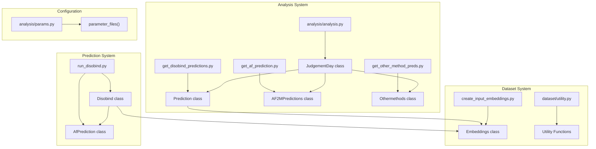
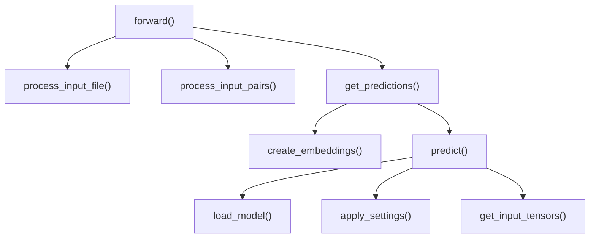

# API Reference

> **Relevant source files**
> * [analysis/get_af_prediction.py](https://github.com/isblab/disobind/blob/5fffcf84/analysis/get_af_prediction.py)
> * [analysis/get_disobind_predictions.py](https://github.com/isblab/disobind/blob/5fffcf84/analysis/get_disobind_predictions.py)
> * [analysis/params.py](https://github.com/isblab/disobind/blob/5fffcf84/analysis/params.py)
> * [example/test.fasta](https://github.com/isblab/disobind/blob/5fffcf84/example/test.fasta)
> * [run_disobind.py](https://github.com/isblab/disobind/blob/5fffcf84/run_disobind.py)

This page provides comprehensive API documentation for the key classes, functions, and modules in the Disobind codebase. The API is organized by functional area, covering prediction, analysis, dataset creation, and utility functions.

For practical usage examples, see [Examples and Tutorials](/isblab/disobind/7-examples-and-tutorials). For conceptual understanding of the system architecture, see [Overview](/isblab/disobind/1-overview). For details on model architecture, see [Model Architecture](/isblab/disobind/4-model-architecture).

---

## Core System Architecture: Code Entity Mapping

The following diagram maps the major system components to their code entities:

**Sources:** [run_disobind.py L44-L45](https://github.com/isblab/disobind/blob/5fffcf84/run_disobind.py#L44-L45)

 [analysis/analysis.py L25-L26](https://github.com/isblab/disobind/blob/5fffcf84/analysis/analysis.py#L25-L26)

 [analysis/get_disobind_predictions.py L38-L39](https://github.com/isblab/disobind/blob/5fffcf84/analysis/get_disobind_predictions.py#L38-L39)

 [analysis/get_af_prediction.py L28-L29](https://github.com/isblab/disobind/blob/5fffcf84/analysis/get_af_prediction.py#L28-L29)

 [analysis/get_other_method_preds.py L14-L15](https://github.com/isblab/disobind/blob/5fffcf84/analysis/get_other_method_preds.py#L14-L15)

 [dataset/create_input_embeddings.py L18-L19](https://github.com/isblab/disobind/blob/5fffcf84/dataset/create_input_embeddings.py#L18-L19)

 [analysis/params.py L6-L7](https://github.com/isblab/disobind/blob/5fffcf84/analysis/params.py#L6-L7)

---

## Prediction Classes

### Disobind Class

The main entry point for running Disobind predictions on protein pairs. Handles input processing, embedding generation, model loading, and prediction output.

**Location:** [run_disobind.py L44-L826](https://github.com/isblab/disobind/blob/5fffcf84/run_disobind.py#L44-L826)

**Key Attributes:**

| Attribute | Type | Description |
| --- | --- | --- |
| `input_file` | str | Path to CSV/FASTA file containing protein pairs [run_disobind.py L51](https://github.com/isblab/disobind/blob/5fffcf84/run_disobind.py#L51-L51) |
| `cores` | int | Number of CPU cores for parallel processing [run_disobind.py L55](https://github.com/isblab/disobind/blob/5fffcf84/run_disobind.py#L55-L55) |
| `predict_cmap` | bool | Whether to predict contact maps (default: False) [run_disobind.py L57](https://github.com/isblab/disobind/blob/5fffcf84/run_disobind.py#L57-L57) |
| `required_cg` | int | Coarse-graining level (0, 1, 5, or 10) [run_disobind.py L59](https://github.com/isblab/disobind/blob/5fffcf84/run_disobind.py#L59-L59) |
| `output_dir` | str | Directory for output files [run_disobind.py L61](https://github.com/isblab/disobind/blob/5fffcf84/run_disobind.py#L61-L61) |
| `device` | str | Device for inference ("cpu" or "cuda") [run_disobind.py L68](https://github.com/isblab/disobind/blob/5fffcf84/run_disobind.py#L68-L68) |
| `threshold` | float | Contact probability threshold (default: 0.5) [run_disobind.py L70](https://github.com/isblab/disobind/blob/5fffcf84/run_disobind.py#L70-L70) |
| `predictions` | dict | Dictionary storing all predictions [run_disobind.py L84](https://github.com/isblab/disobind/blob/5fffcf84/run_disobind.py#L84-L84) |

**Key Methods:**

**Main Methods:**

* **`forward()`** [run_disobind.py L111-L126](https://github.com/isblab/disobind/blob/5fffcf84/run_disobind.py#L111-L126) * Main execution pipeline orchestrating input processing and prediction. * Saves final predictions to `.npy` file [run_disobind.py L126](https://github.com/isblab/disobind/blob/5fffcf84/run_disobind.py#L126-L126)
* **`process_input_file()`** [run_disobind.py L212-L258](https://github.com/isblab/disobind/blob/5fffcf84/run_disobind.py#L212-L258) * Supports CSV (multiple jobs) and FASTA (single pair) formats. * Returns: `(entry_ids, af_dict)` where `af_dict` contains AlphaFold metadata.
* **`create_embeddings(batch)`** [run_disobind.py L375-L395](https://github.com/isblab/disobind/blob/5fffcf84/run_disobind.py#L375-L395) * Generates T5 embeddings using the `Embeddings` class. * Stores embeddings in HDF5 format [run_disobind.py L106](https://github.com/isblab/disobind/blob/5fffcf84/run_disobind.py#L106-L106)
* **`predict(required_tasks, af_dict)`** [run_disobind.py L532-L661](https://github.com/isblab/disobind/blob/5fffcf84/run_disobind.py#L532-L661) * Generates predictions for all tasks. * Combines Disobind and AlphaFold predictions if structural files are provided.

For details, see [Core Prediction Classes](/isblab/disobind/6.1-core-prediction-classes).

**Sources:** [run_disobind.py L44-L826](https://github.com/isblab/disobind/blob/5fffcf84/run_disobind.py#L44-L826)

---

### AfPrediction Class

Processes AlphaFold2/3 structure predictions and extracts confident contacts based on pLDDT and PAE metrics.

**Location:** [run_disobind.py L831-L1172](https://github.com/isblab/disobind/blob/5fffcf84/run_disobind.py#L831-L1172)

**Key Methods:**

* **`get_confident_interactions(prot1_res, prot2_res)`** [run_disobind.py L986-L1128](https://github.com/isblab/disobind/blob/5fffcf84/run_disobind.py#L986-L1128) * Extracts contacts from AF2/3 structures. * Applies filters: pLDDT ≥ 70 [run_disobind.py L74](https://github.com/isblab/disobind/blob/5fffcf84/run_disobind.py#L74-L74)  and PAE ≤ 5 [run_disobind.py L76](https://github.com/isblab/disobind/blob/5fffcf84/run_disobind.py#L76-L76)

**Sources:** [run_disobind.py L831-L1172](https://github.com/isblab/disobind/blob/5fffcf84/run_disobind.py#L831-L1172)

---

## Analysis Classes

### JudgementDay Class

Orchestrates comprehensive evaluation of Disobind, AlphaFold2/3, and other methods on out-of-distribution (OOD) test sets.

**Location:** [analysis/analysis.py L25-L742](https://github.com/isblab/disobind/blob/5fffcf84/analysis/analysis.py#L25-L742)

**Key Methods:**

* **`forward()`** [analysis/analysis.py L107-L123](https://github.com/isblab/disobind/blob/5fffcf84/analysis/analysis.py#L107-L123) * Main execution pipeline for loading predictions and calculating performance metrics.
* **`calculate_metrics(pred, target, ...)`** [analysis/analysis.py L709-L736](https://github.com/isblab/disobind/blob/5fffcf84/analysis/analysis.py#L709-L736) * Computes Recall, Precision, F1, AvgPrecision, MCC, AUROC, and Accuracy.

For details, see [Analysis Classes](/isblab/disobind/6.2-analysis-classes).

**Sources:** [analysis/analysis.py L25-L742](https://github.com/isblab/disobind/blob/5fffcf84/analysis/analysis.py#L25-L742)

---

### Prediction Class

Generates Disobind predictions on OOD/test datasets with specialized masks for disorder regions, LIPs, and amino acid types.

**Location:** [analysis/get_disobind_predictions.py L38-L1031](https://github.com/isblab/disobind/blob/5fffcf84/analysis/get_disobind_predictions.py#L38-L1031)

**Key Methods:**

* **`create_lip_masks(headers)`** [analysis/get_disobind_predictions.py L639-L684](https://github.com/isblab/disobind/blob/5fffcf84/analysis/get_disobind_predictions.py#L639-L684) * Creates binary masks for Linear Interacting Peptides (LIPs).
* **`create_aa_masks(headers)`** [analysis/get_disobind_predictions.py L741-L805](https://github.com/isblab/disobind/blob/5fffcf84/analysis/get_disobind_predictions.py#L741-L805) * Creates masks for aromatic, hydrophobic, polar, and disorder-promoting residues.

**Sources:** [analysis/get_disobind_predictions.py L38-L1031](https://github.com/isblab/disobind/blob/5fffcf84/analysis/get_disobind_predictions.py#L38-L1031)

---

### AF2MPredictions Class

Processes pre-existing AlphaFold2/3 predictions to extract contact maps at multiple coarse-graining levels (1, 5, 10).

**Location:** [analysis/get_af_prediction.py L28-L498](https://github.com/isblab/disobind/blob/5fffcf84/analysis/get_af_prediction.py#L28-L498)

**Key Methods:**

* **`get_best_model(model_path, header)`** [analysis/get_af_prediction.py L96-L132](https://github.com/isblab/disobind/blob/5fffcf84/analysis/get_af_prediction.py#L96-L132) * Selects the top-ranked model from AF2/3 outputs based on confidence scores.

**Sources:** [analysis/get_af_prediction.py L28-L498](https://github.com/isblab/disobind/blob/5fffcf84/analysis/get_af_prediction.py#L28-L498)

---

## Dataset Creation Classes

### Embeddings Class

Generates T5 protein embeddings and manages dataset splits (train/dev/test) with necessary padding.

**Location:** [dataset/create_input_embeddings.py L18-L713](https://github.com/isblab/disobind/blob/5fffcf84/dataset/create_input_embeddings.py#L18-L713)

**Key Methods:**

* **`forward()`** [dataset/create_input_embeddings.py L126-L159](https://github.com/isblab/disobind/blob/5fffcf84/dataset/create_input_embeddings.py#L126-L159) * High-level workflow for creating dataset partitions and saving to disk.
* **`apply_padding(prot1, prot2, cmap, key)`** [dataset/create_input_embeddings.py L371-L408](https://github.com/isblab/disobind/blob/5fffcf84/dataset/create_input_embeddings.py#L371-L408) * Pads embeddings and contact maps to `max_len` [dataset/create_input_embeddings.py L46](https://github.com/isblab/disobind/blob/5fffcf84/dataset/create_input_embeddings.py#L46-L46)

For details, see [Dataset Creation Classes](/isblab/disobind/6.3-dataset-creation-classes).

**Sources:** [dataset/create_input_embeddings.py L18-L713](https://github.com/isblab/disobind/blob/5fffcf84/dataset/create_input_embeddings.py#L18-L713)

---

## Utility Functions

Disobind relies on a suite of utility functions for structural analysis and sequence processing.

### Structural Utilities

* **`load_PDB(pdb, pdb_path)`** [dataset/utility.py L26-L59](https://github.com/isblab/disobind/blob/5fffcf84/dataset/utility.py#L26-L59) * Loads structure files in PDB or mmCIF format.
* **`get_contact_map(coords1, coords2, contact_threshold)`** [dataset/utility.py L108-L124](https://github.com/isblab/disobind/blob/5fffcf84/dataset/utility.py#L108-L124) * Computes binary contact maps from CA coordinates.

### Sequence & Disorder Utilities

* **`load_disorder_dbs(...)`** [dataset/utility.py L850-L866](https://github.com/isblab/disobind/blob/5fffcf84/dataset/utility.py#L850-L866) * Loads DisProt, IDEAL, and MobiDB databases for region identification.
* **`consolidate_regions(positions, min_len)`** [dataset/utility.py L810-L831](https://github.com/isblab/disobind/blob/5fffcf84/dataset/utility.py#L810-L831) * Merges fragmented residue lists into (start, end) tuples.

For details, see [Utility Functions](/isblab/disobind/6.4-utility-functions).

**Sources:** [dataset/utility.py L1-L1200](https://github.com/isblab/disobind/blob/5fffcf84/dataset/utility.py#L1-L1200)

 [run_disobind.py L36-L37](https://github.com/isblab/disobind/blob/5fffcf84/run_disobind.py#L36-L37)

---

## Parameter Configuration

### parameter_files Function

Provides model checkpoint paths and metadata for specific model versions (e.g., version 19).

**Location:** [analysis/params.py L6-L60](https://github.com/isblab/disobind/blob/5fffcf84/analysis/params.py#L6-L60)

**Mapping Example:**

* `interaction_1` maps to model `Epsilon_3_6.2` [analysis/params.py L19-L22](https://github.com/isblab/disobind/blob/5fffcf84/analysis/params.py#L19-L22)
* `interface_1` maps to model `Epsilon_3_16` [analysis/params.py L43-L46](https://github.com/isblab/disobind/blob/5fffcf84/analysis/params.py#L43-L46)

**Sources:** [analysis/params.py L1-L60](https://github.com/isblab/disobind/blob/5fffcf84/analysis/params.py#L1-L60)