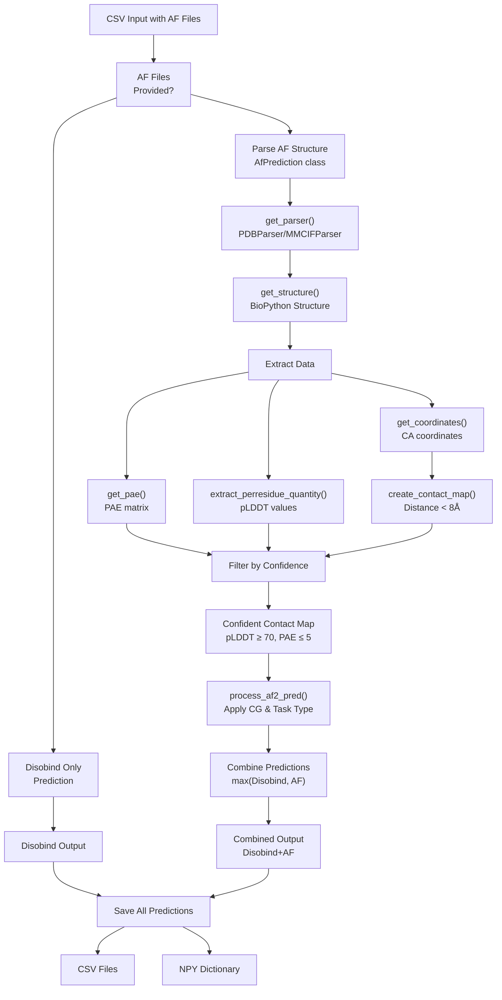
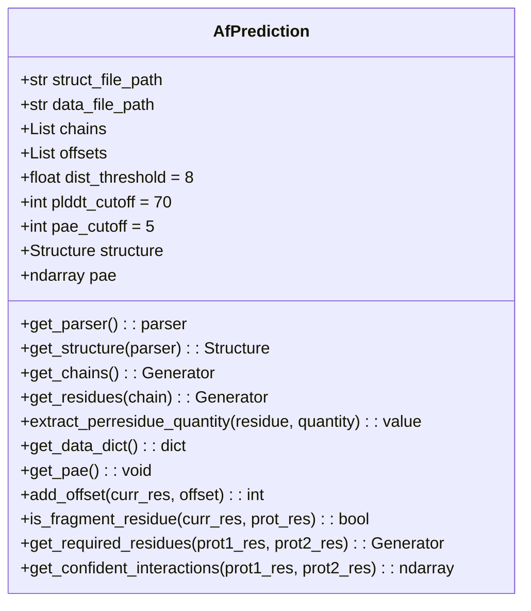
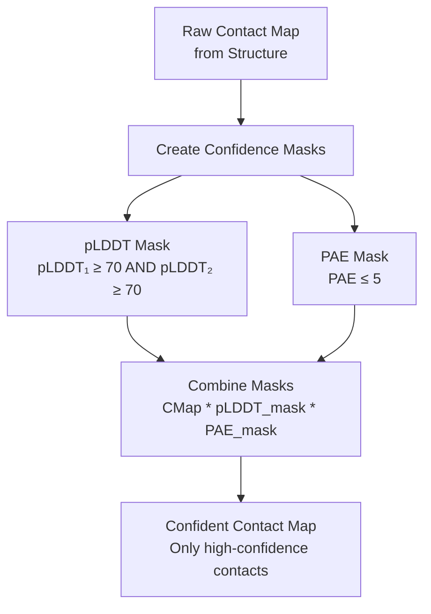
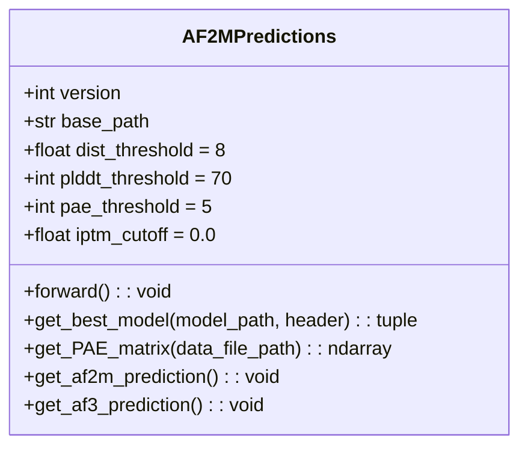

# AlphaFold Integration

> **Relevant source files**
> * [example/output.tar.gz](https://github.com/isblab/disobind/blob/5fffcf84/example/output.tar.gz)
> * [example/pae_model_4_multimer_v3_pred_4.json](https://github.com/isblab/disobind/blob/5fffcf84/example/pae_model_4_multimer_v3_pred_4.json)
> * [example/test.fasta](https://github.com/isblab/disobind/blob/5fffcf84/example/test.fasta)
> * [example/unrelaxed_model_4_multimer_v3_pred_4.pdb](https://github.com/isblab/disobind/blob/5fffcf84/example/unrelaxed_model_4_multimer_v3_pred_4.pdb)
> * [run_disobind.py](https://github.com/isblab/disobind/blob/5fffcf84/run_disobind.py)

## Purpose and Scope

This page explains how to combine Disobind predictions with AlphaFold2 (AF2) and AlphaFold3 (AF3) structural predictions to achieve enhanced accuracy. The integration leverages structural confidence metrics (pLDDT, PAE) to filter high-confidence contacts and combines them with Disobind's sequence-based predictions.

For basic prediction usage without AlphaFold integration, see [Running Predictions](https://github.com/isblab/disobind/blob/5fffcf84/Running Predictions)

 For information about processing AlphaFold predictions during analysis and evaluation, see [Processing AlphaFold Predictions](https://github.com/isblab/disobind/blob/5fffcf84/Processing AlphaFold Predictions)

---

## Overview

Disobind can be used standalone or enhanced with pre-computed AlphaFold structures. When AlphaFold predictions are available, the system:

1. Extracts contact maps from AF2/AF3 structures using distance thresholds.
2. Filters contacts using confidence metrics (pLDDT ≥ 70, PAE ≤ 5).
3. Applies coarse-graining to match Disobind resolution (1, 5, or 10 residues per bead).
4. Combines predictions using a max operation: `max(Disobind, AF)`.

This combination approach captures both sequence-based patterns (Disobind) and structural information (AlphaFold), typically improving prediction accuracy on well-folded complexes.

Sources: [run_disobind.py L1-L14](https://github.com/isblab/disobind/blob/5fffcf84/run_disobind.py#L1-L14)

 [run_disobind.py L69-L76](https://github.com/isblab/disobind/blob/5fffcf84/run_disobind.py#L69-L76)

 [run_disobind.py L620-L661](https://github.com/isblab/disobind/blob/5fffcf84/run_disobind.py#L620-L661)

---

## Integration Workflow



**Diagram: AlphaFold Integration Workflow**

This diagram shows the complete pipeline for integrating AlphaFold predictions within `run_disobind.py`. The key decision point is the presence of AF2/AF3 file paths in the input CSV [run_disobind.py L10](https://github.com/isblab/disobind/blob/5fffcf84/run_disobind.py#L10-L10)

Sources: [run_disobind.py L620-L661](https://github.com/isblab/disobind/blob/5fffcf84/run_disobind.py#L620-L661)

 [run_disobind.py L831-L1053](https://github.com/isblab/disobind/blob/5fffcf84/run_disobind.py#L831-L1053)

---

## Input Format with AlphaFold Files

To use AlphaFold integration, provide additional columns in the input CSV as defined in the `read_csv_input` logic [run_disobind.py L228-L255](https://github.com/isblab/disobind/blob/5fffcf84/run_disobind.py#L228-L255)

:

```
Uni_ID1,start_res1,end_res1,Uni_ID2,start_res2,end_res2,af2_struct_file,af2_json_file,chain1,chain2,offset1,offset2
```

### Input Columns

| Column | Description |
| --- | --- |
| `af2_struct_file` | Path to AF2/AF3 PDB or CIF structure file [run_disobind.py L10](https://github.com/isblab/disobind/blob/5fffcf84/run_disobind.py#L10-L10) |
| `af2_json_file` | Path to JSON file containing PAE matrix [run_disobind.py L10](https://github.com/isblab/disobind/blob/5fffcf84/run_disobind.py#L10-L10) |
| `chain1` | Chain ID for protein 1 in the structure [run_disobind.py L10](https://github.com/isblab/disobind/blob/5fffcf84/run_disobind.py#L10-L10) |
| `chain2` | Chain ID for protein 2 in the structure [run_disobind.py L10](https://github.com/isblab/disobind/blob/5fffcf84/run_disobind.py#L10-L10) |
| `offset1` | Residue numbering offset for protein 1 [run_disobind.py L10](https://github.com/isblab/disobind/blob/5fffcf84/run_disobind.py#L10-L10) |
| `offset2` | Residue numbering offset for protein 2 [run_disobind.py L10](https://github.com/isblab/disobind/blob/5fffcf84/run_disobind.py#L10-L10) |

### Offsets

Offsets account for differences between structure residue numbering and UniProt positions. The `add_offset` method [run_disobind.py L958-L963](https://github.com/isblab/disobind/blob/5fffcf84/run_disobind.py#L958-L963)

 handles this mapping:

* **Corrected position** = Structure position + Offset.
* This is critical when using full-length AF predictions for fragment-based Disobind tasks.

Sources: [run_disobind.py L10](https://github.com/isblab/disobind/blob/5fffcf84/run_disobind.py#L10-L10)

 [run_disobind.py L232-L253](https://github.com/isblab/disobind/blob/5fffcf84/run_disobind.py#L232-L253)

 [run_disobind.py L958-L963](https://github.com/isblab/disobind/blob/5fffcf84/run_disobind.py#L958-L963)

---

## The AfPrediction Class

The `AfPrediction` class in `run_disobind.py` handles all AlphaFold structure processing:



**Diagram: AfPrediction Class Structure**

The `AfPrediction` class [run_disobind.py L831-L1053](https://github.com/isblab/disobind/blob/5fffcf84/run_disobind.py#L831-L1053)

 is instantiated per protein pair. It encapsulates all logic for parsing structures, extracting coordinates and confidence metrics, and generating confident contact maps.

Sources: [run_disobind.py L831-L1053](https://github.com/isblab/disobind/blob/5fffcf84/run_disobind.py#L831-L1053)

### Key Methods

| Method | Purpose | Source |
| --- | --- | --- |
| `get_parser()` | Selects `PDBParser` or `MMCIFParser` based on file extension | [run_disobind.py L856-L869](https://github.com/isblab/disobind/blob/5fffcf84/run_disobind.py#L856-L869) |
| `get_structure(parser)` | Loads structure using BioPython | [run_disobind.py L871-L876](https://github.com/isblab/disobind/blob/5fffcf84/run_disobind.py#L871-L876) |
| `get_pae()` | Loads and symmetrizes PAE matrix: (PAE + PAE.T)/2 | [run_disobind.py L942-L956](https://github.com/isblab/disobind/blob/5fffcf84/run_disobind.py#L942-L956) |
| `get_required_residues()` | Filters residues belonging to specified fragments using offsets | [run_disobind.py L986-L1005](https://github.com/isblab/disobind/blob/5fffcf84/run_disobind.py#L986-L1005) |
| `get_confident_interactions()` | Main method: generates filtered contact map using pLDDT and PAE | [run_disobind.py L1007-L1053](https://github.com/isblab/disobind/blob/5fffcf84/run_disobind.py#L1007-L1053) |

Sources: [run_disobind.py L856-L1053](https://github.com/isblab/disobind/blob/5fffcf84/run_disobind.py#L856-L1053)

---

## Extracting Structure Data

### Coordinate Extraction

The system extracts Cα (CA) atom coordinates and pLDDT values (stored in the B-factor field) for each residue:

```python
# Logic from AfPrediction.extract_perresidue_quantityif quantity == "coords":    return residue["CA"].coordelif quantity == "plddt":    return residue["CA"].bfactor
```

The `get_required_residues()` generator [run_disobind.py L986-L1005](https://github.com/isblab/disobind/blob/5fffcf84/run_disobind.py#L986-L1005)

 ensures only residues within the user-defined `[start, end]` range are processed.

Sources: [run_disobind.py L909-L923](https://github.com/isblab/disobind/blob/5fffcf84/run_disobind.py#L909-L923)

 [run_disobind.py L986-L1005](https://github.com/isblab/disobind/blob/5fffcf84/run_disobind.py#L986-L1005)

### Contact Map Generation

Contact maps are generated from inter-residue distances within the `get_confident_interactions` method [run_disobind.py L1032-L1048](https://github.com/isblab/disobind/blob/5fffcf84/run_disobind.py#L1032-L1048)

:

```markdown
# Calculate pairwise Euclidean distancesdist = np.linalg.norm(coords1[:, np.newaxis] - coords2, axis=2)# Apply threshold (default 8Å)contact_map = (dist <= self.dist_threshold).astype(int)
```

Sources: [run_disobind.py L1032-L1048](https://github.com/isblab/disobind/blob/5fffcf84/run_disobind.py#L1032-L1048)

 [run_disobind.py L72](https://github.com/isblab/disobind/blob/5fffcf84/run_disobind.py#L72-L72)

---

## Confidence Filtering

### Filtering Logic

Disobind applies a strict confidence mask to AlphaFold predictions to avoid false positives from low-confidence structural regions:



**Diagram: Confidence Filtering Process**

The implementation in `get_confident_interactions` [run_disobind.py L1007-L1028](https://github.com/isblab/disobind/blob/5fffcf84/run_disobind.py#L1007-L1028)

 creates a pLDDT mask by ensuring both residues in a pair meet the threshold, and a PAE mask for the specific pair error.

Sources: [run_disobind.py L1007-L1028](https://github.com/isblab/disobind/blob/5fffcf84/run_disobind.py#L1007-L1028)

 [analysis/get_af_prediction.py L315-L361](https://github.com/isblab/disobind/blob/5fffcf84/analysis/get_af_prediction.py#L315-L361)

---

## Combining Disobind and AlphaFold Predictions

### Max Operation

The combination strategy uses an element-wise maximum in `process_af2_pred` [run_disobind.py L629-L633](https://github.com/isblab/disobind/blob/5fffcf84/run_disobind.py#L629-L633)

:

```markdown
# Combine Disobind output and AF2 predictiondiso_af2 = np.stack([output.reshape(-1), af2_pred.reshape(-1)], axis=1)diso_af2 = np.max(diso_af2, axis=1).reshape(m, n)
```

This approach overlays AF's confident contacts (binary 0/1) onto Disobind's probabilities (0-1).

Sources: [run_disobind.py L629-L633](https://github.com/isblab/disobind/blob/5fffcf84/run_disobind.py#L629-L633)

---

## Task-Specific Processing

### Interface Conversion

If the task is `interface`, the contact map is converted to binary interface vectors [run_disobind.py L682-L691](https://github.com/isblab/disobind/blob/5fffcf84/run_disobind.py#L682-L691)

:

```markdown
# Convert 2D cmap to 1D interface vectoridx = np.where(af2_pred == 1)p1 = np.zeros((af2_pred.shape[0], 1))p1[idx[0]] = 1p2 = np.zeros((af2_pred.shape[1], 1))p2[idx[1]] = 1af2_pred = np.concatenate([p1, p2], axis=0)
```

### Coarse-Graining

AlphaFold predictions are coarse-grained to match Disobind's resolution using `nn.MaxPool2d` [run_disobind.py L676-L680](https://github.com/isblab/disobind/blob/5fffcf84/run_disobind.py#L676-L680)

:

```
if self.objective[1] > 1:    m = nn.MaxPool2d(kernel_size=self.objective[1], stride=self.objective[1])    af2_pred = m(af2_pred.unsqueeze(0).unsqueeze(0))
```

Sources: [run_disobind.py L676-L691](https://github.com/isblab/disobind/blob/5fffcf84/run_disobind.py#L676-L691)

---

## Batch Processing for Evaluation

For large-scale evaluation, the `AF2MPredictions` class in `analysis/get_af_prediction.py` processes multiple structures:



**Diagram: AF2MPredictions Class for Batch Processing**

This class [analysis/get_af_prediction.py L28-L497](https://github.com/isblab/disobind/blob/5fffcf84/analysis/get_af_prediction.py#L28-L497)

 automates model selection (choosing the structure with the highest ipTM) and handles the differing data formats between AF2 (PDB + JSON) and AF3 (mmCIF + JSON).

Sources: [analysis/get_af_prediction.py L28-L497](https://github.com/isblab/disobind/blob/5fffcf84/analysis/get_af_prediction.py#L28-L497)

 [analysis/get_af_prediction.py L79-L93](https://github.com/isblab/disobind/blob/5fffcf84/analysis/get_af_prediction.py#L79-L93)