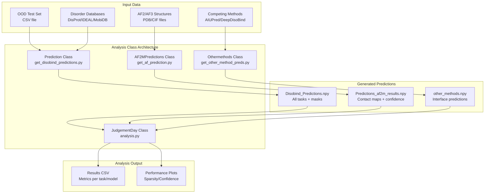
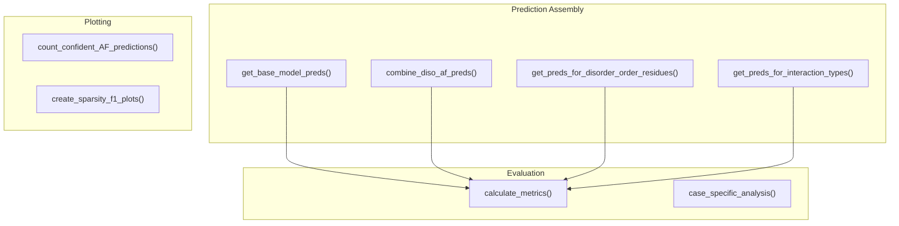
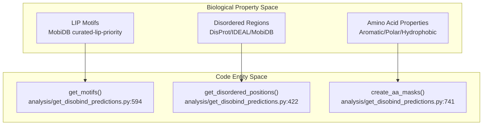
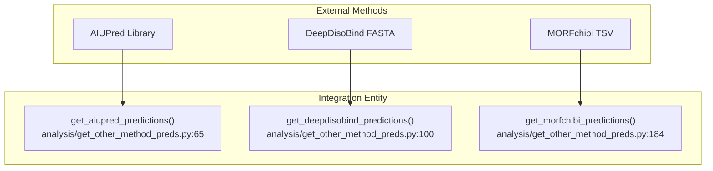

# Analysis Classes

> **Relevant source files**
> * [analysis/analysis.py](https://github.com/isblab/disobind/blob/5fffcf84/analysis/analysis.py)
> * [analysis/get_af_prediction.py](https://github.com/isblab/disobind/blob/5fffcf84/analysis/get_af_prediction.py)
> * [analysis/get_disobind_predictions.py](https://github.com/isblab/disobind/blob/5fffcf84/analysis/get_disobind_predictions.py)
> * [analysis/get_other_method_preds.py](https://github.com/isblab/disobind/blob/5fffcf84/analysis/get_other_method_preds.py)
> * [analysis/params.py](https://github.com/isblab/disobind/blob/5fffcf84/analysis/params.py)

This page provides API reference documentation for the core analysis classes in Disobind: `JudgementDay`, `Prediction`, `AF2MPredictions`, and `Othermethods`. These classes implement the evaluation pipeline for comparing Disobind predictions with AlphaFold2/3 and competing methods across multiple analysis dimensions.

For practical examples of using these classes, see [Examples

NaN-NaN](https://github.com/isblab/disobind/blob/5fffcf84/Examples#LNaN-LNaN)

 For the higher-level analysis workflow, see [JudgementDay Analysis Pipeline](https://github.com/isblab/disobind/blob/5fffcf84/JudgementDay Analysis Pipeline)

---

## Overview of Analysis Classes

The analysis system consists of four main classes that work together to evaluate prediction performance:

**Diagram: Analysis Class Architecture and Data Flow**



**Class Responsibilities:**

| Class | Primary Role | Input | Output |
| --- | --- | --- | --- |
| `Prediction` | Generate Disobind predictions with specialized masks | CSV entries, embeddings | `Disobind_Predictions.npy` |
| `AF2MPredictions` | Extract contact maps from AlphaFold structures | PDB/CIF files, PAE JSON | `Predictions_af2m_results.npy` |
| `Othermethods` | Process competing method predictions | Method outputs | `other_methods.npy` |
| `JudgementDay` | Evaluate all methods across multiple dimensions | All predictions + targets | Results CSV, plots |

Sources: [analysis/analysis.py L25-L97](https://github.com/isblab/disobind/blob/5fffcf84/analysis/analysis.py#L25-L97)

 [analysis/get_disobind_predictions.py L38-L132](https://github.com/isblab/disobind/blob/5fffcf84/analysis/get_disobind_predictions.py#L38-L132)

 [analysis/get_af_prediction.py L28-L76](https://github.com/isblab/disobind/blob/5fffcf84/analysis/get_af_prediction.py#L28-L76)

 [analysis/get_other_method_preds.py L14-L36](https://github.com/isblab/disobind/blob/5fffcf84/analysis/get_other_method_preds.py#L14-L36)

---

## JudgementDay Class

The `JudgementDay` class orchestrates comprehensive evaluation of Disobind, AlphaFold, and competing methods on the OOD test set. It calculates metrics across multiple analysis categories and generates comparison plots.

### Class Definition

```python
class JudgementDay():	"""	Pipeline all analysis to be performed.	"""
```

**Location:** [analysis/analysis.py L25-L740](https://github.com/isblab/disobind/blob/5fffcf84/analysis/analysis.py#L25-L740)

### Key Attributes

| Attribute | Type | Description |
| --- | --- | --- |
| `data_version` | int | Dataset version (default: 19) [analysis/analysis.py L31](https://github.com/isblab/disobind/blob/5fffcf84/analysis/analysis.py#L31-L31) |
| `model_version` | int | Model version (default: 19) [analysis/analysis.py L32](https://github.com/isblab/disobind/blob/5fffcf84/analysis/analysis.py#L32-L32) |
| `mode` | str | Dataset type: "ood" or "misc" [analysis/analysis.py L42](https://github.com/isblab/disobind/blob/5fffcf84/analysis/analysis.py#L42-L42) |
| `max_len` | int | Max protein length (100 for OOD, 200 for misc) [analysis/analysis.py L44](https://github.com/isblab/disobind/blob/5fffcf84/analysis/analysis.py#L44-L44) |
| `contact_threshold` | float | Cutoff for binary contact prediction (0.5) [analysis/analysis.py L38](https://github.com/isblab/disobind/blob/5fffcf84/analysis/analysis.py#L38-L38) |
| `iptm_cutoff` | float | ipTM threshold for confident AF predictions (0.0) [analysis/analysis.py L40](https://github.com/isblab/disobind/blob/5fffcf84/analysis/analysis.py#L40-L40) |
| `device` | str | Compute device: "cuda" or "cpu" [analysis/analysis.py L46](https://github.com/isblab/disobind/blob/5fffcf84/analysis/analysis.py#L46-L46) |
| `disobind_preds` | dict | Loaded Disobind predictions [analysis/analysis.py L115](https://github.com/isblab/disobind/blob/5fffcf84/analysis/analysis.py#L115-L115) |
| `af2m_preds` | dict | Loaded AlphaFold2 predictions [analysis/analysis.py L113](https://github.com/isblab/disobind/blob/5fffcf84/analysis/analysis.py#L113-L113) |
| `af3_preds` | dict | Loaded AlphaFold3 predictions [analysis/analysis.py L114](https://github.com/isblab/disobind/blob/5fffcf84/analysis/analysis.py#L114-L114) |
| `target_cmap` | h5py.File | Ground truth contact maps [analysis/analysis.py L116](https://github.com/isblab/disobind/blob/5fffcf84/analysis/analysis.py#L116-L116) |

Sources: [analysis/analysis.py L29-L120](https://github.com/isblab/disobind/blob/5fffcf84/analysis/analysis.py#L29-L120)

### Core Methods

#### forward()

Main execution method that runs the complete analysis pipeline. It creates the output directory, sets seeds, loads all prediction data, and triggers performance evaluation [analysis/analysis.py L107-L123](https://github.com/isblab/disobind/blob/5fffcf84/analysis/analysis.py#L107-L123)

#### create_ood_set_tensors()

Generator function that yields task-specific prediction tensors for evaluation. It iterates through tasks and entries, assembling a dictionary (`ood_dict`) containing predictions from Disobind, AlphaFold, Random baselines, and specialized biological masks [analysis/analysis.py L192-L316](https://github.com/isblab/disobind/blob/5fffcf84/analysis/analysis.py#L192-L316)

#### eval_performance()

Calculates performance metrics across all tasks, models, and evaluation categories. It calls `calculate_metrics` for various subsets (IDR-IDR, LIPs, etc.) and saves results to CSV [analysis/analysis.py L438-L509](https://github.com/isblab/disobind/blob/5fffcf84/analysis/analysis.py#L438-L509)

**Diagram: JudgementDay Evaluation Flow**



Sources: [analysis/analysis.py L319-L737](https://github.com/isblab/disobind/blob/5fffcf84/analysis/analysis.py#L319-L737)

---

## Prediction Class

The `Prediction` class generates Disobind predictions on the OOD test set with specialized binary masks for disorder regions, amino acid types, and LIPs.

### Class Definition

```python
class Prediction():	def __init__( self ):		"""Constructor"""
```

**Location:** [analysis/get_disobind_predictions.py L38-L968](https://github.com/isblab/disobind/blob/5fffcf84/analysis/get_disobind_predictions.py#L38-L968)

### Key Attributes

| Attribute | Type | Description |
| --- | --- | --- |
| `threshold` | float | Contact probability threshold (0.5) [analysis/get_disobind_predictions.py L57](https://github.com/isblab/disobind/blob/5fffcf84/analysis/get_disobind_predictions.py#L57-L57) |
| `parameters` | dict | Model parameter file paths [analysis/get_disobind_predictions.py L62](https://github.com/isblab/disobind/blob/5fffcf84/analysis/get_disobind_predictions.py#L62-L62) |
| `uniprot_seq` | dict | UniProt sequences [analysis/get_disobind_predictions.py L68](https://github.com/isblab/disobind/blob/5fffcf84/analysis/get_disobind_predictions.py#L68-L68) |
| `lips_masks` | dict | LIP binary masks [analysis/get_disobind_predictions.py L70](https://github.com/isblab/disobind/blob/5fffcf84/analysis/get_disobind_predictions.py#L70-L70) |
| `aa_masks` | dict | Amino acid type binary masks [analysis/get_disobind_predictions.py L72](https://github.com/isblab/disobind/blob/5fffcf84/analysis/get_disobind_predictions.py#L72-L72) |

Sources: [analysis/get_disobind_predictions.py L39-L132](https://github.com/isblab/disobind/blob/5fffcf84/analysis/get_disobind_predictions.py#L39-L132)

### Mask Generation Logic

**Diagram: Mask Creation Data Space**



Sources: [analysis/get_disobind_predictions.py L422-L808](https://github.com/isblab/disobind/blob/5fffcf84/analysis/get_disobind_predictions.py#L422-L808)

---

## AF2MPredictions Class

The `AF2MPredictions` class processes AlphaFold2 and AlphaFold3 predicted structures to extract contact maps with confidence-based filtering.

### Key Methods

#### get_best_model(model_path, header)

Identifies the best-ranked model based on confidence metrics. For AF2, it parses `ranking_debug.json` [analysis/get_af_prediction.py L114-L116](https://github.com/isblab/disobind/blob/5fffcf84/analysis/get_af_prediction.py#L114-L116)

 For AF3, it reads `summary_confidences_0.json` [analysis/get_af_prediction.py L124-L125](https://github.com/isblab/disobind/blob/5fffcf84/analysis/get_af_prediction.py#L124-L125)

#### get_coordinates(model_file)

Extracts Cα coordinates and pLDDT scores from structure files using `PDBParser` for AF2 [analysis/get_af_prediction.py L179](https://github.com/isblab/disobind/blob/5fffcf84/analysis/get_af_prediction.py#L179-L179)

 or `MMCIFParser` for AF3 [analysis/get_af_prediction.py L181](https://github.com/isblab/disobind/blob/5fffcf84/analysis/get_af_prediction.py#L181-L181)

#### get_plddt_pae_mat(plddt_dict, pae)

Creates binary matrices based on thresholds: `pLDDT >= 70` [analysis/get_af_prediction.py L324](https://github.com/isblab/disobind/blob/5fffcf84/analysis/get_af_prediction.py#L324-L324)

 and `PAE <= 5` [analysis/get_af_prediction.py L348](https://github.com/isblab/disobind/blob/5fffcf84/analysis/get_af_prediction.py#L348-L348)

Sources: [analysis/get_af_prediction.py L96-L362](https://github.com/isblab/disobind/blob/5fffcf84/analysis/get_af_prediction.py#L96-L362)

---

## Othermethods Class

The `Othermethods` class processes predictions from AIUPred, DeepDisoBind, and MORFchibi.

### MORFchibi Processing

MORFchibi predictions are assessed using a threshold of 0.775 [analysis/get_other_method_preds.py L168](https://github.com/isblab/disobind/blob/5fffcf84/analysis/get_other_method_preds.py#L168-L168)

 Sections under four residues above this cut-off are not identified as MoRFs, implemented in `valid_morf()` [analysis/get_other_method_preds.py L143-L158](https://github.com/isblab/disobind/blob/5fffcf84/analysis/get_other_method_preds.py#L143-L158)

### AIUPred Prediction

Generates predictions using `aiupred_lib.predict_binding()` [analysis/get_other_method_preds.py L86-L89](https://github.com/isblab/disobind/blob/5fffcf84/analysis/get_other_method_preds.py#L86-L89)

 and applies a 0.5 threshold [analysis/get_other_method_preds.py L91](https://github.com/isblab/disobind/blob/5fffcf84/analysis/get_other_method_preds.py#L91-L91)

**Diagram: Method Integration Mapping**



Sources: [analysis/get_other_method_preds.py L65-L205](https://github.com/isblab/disobind/blob/5fffcf84/analysis/get_other_method_preds.py#L65-L205)

---

## Common Parameters and Constants

| Parameter | Value | Source |
| --- | --- | --- |
| `MAX_LEN_DICT` | 100 (OOD), 200 (Misc) | [analysis/analysis.py L22](https://github.com/isblab/disobind/blob/5fffcf84/analysis/analysis.py#L22-L22) |
| `cg_levels` | [1, 5, 10] | [analysis/analysis.py L128](https://github.com/isblab/disobind/blob/5fffcf84/analysis/analysis.py#L128-L128) |
| `dist_threshold` | 8 Å | [analysis/get_af_prediction.py L36](https://github.com/isblab/disobind/blob/5fffcf84/analysis/get_af_prediction.py#L36-L36) |
| `plddt_threshold` | 70 | [analysis/get_af_prediction.py L38](https://github.com/isblab/disobind/blob/5fffcf84/analysis/get_af_prediction.py#L38-L38) |
| `pae_threshold` | 5 | [analysis/get_af_prediction.py L40](https://github.com/isblab/disobind/blob/5fffcf84/analysis/get_af_prediction.py#L40-L40) |

Sources: [analysis/analysis.py L22-L128](https://github.com/isblab/disobind/blob/5fffcf84/analysis/analysis.py#L22-L128)

 [analysis/get_af_prediction.py L36-L40](https://github.com/isblab/disobind/blob/5fffcf84/analysis/get_af_prediction.py#L36-L40)