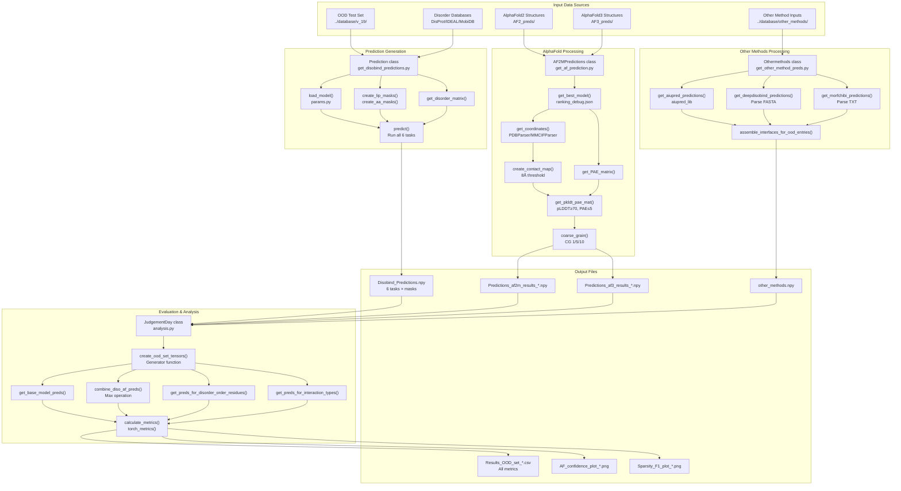
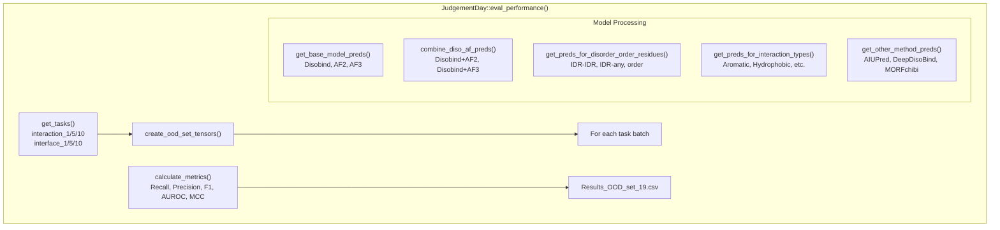

# Analysis and Evaluation

> **Relevant source files**
> * [analysis/README.md](https://github.com/isblab/disobind/blob/5fffcf84/analysis/README.md?plain=1)
> * [analysis/analysis.py](https://github.com/isblab/disobind/blob/5fffcf84/analysis/analysis.py)
> * [analysis/get_other_method_preds.py](https://github.com/isblab/disobind/blob/5fffcf84/analysis/get_other_method_preds.py)
> * [dataset/README.md](https://github.com/isblab/disobind/blob/5fffcf84/dataset/README.md?plain=1)

## Purpose and Scope

This document describes the comprehensive analysis and evaluation system for Disobind predictions. The analysis pipeline evaluates Disobind's performance on out-of-distribution (OOD) test sets and compares it against AlphaFold2/3 predictions and competing methods (AIUPred, DeepDisoBind, MORFchibi). The system generates predictions with specialized masks for disorder regions, amino acid types, and Linear Interacting Peptides (LIPs), then calculates performance metrics across multiple evaluation categories.

For information about running Disobind predictions, see [Running Predictions](/isblab/disobind/2-running-predictions). For details on model training, see [Model Architecture](/isblab/disobind/4-model-architecture). The subsections cover specific components: [JudgementDay Analysis Pipeline](/isblab/disobind/5.1-judgementday-analysis-pipeline), [Generating OOD Predictions](/isblab/disobind/5.2-generating-ood-predictions), [Processing AlphaFold Predictions](/isblab/disobind/5.3-processing-alphafold-predictions), [Performance Metrics and Evaluation](/isblab/disobind/5.4-performance-metrics-and-evaluation), [Disorder-Specific Analysis](/isblab/disobind/5.5-disorder-specific-analysis), [Comparing with Other Methods](/isblab/disobind/5.6-comparing-with-other-methods), and [IDPPI Dataset Evaluation](/isblab/disobind/5.7-idppi-dataset-evaluation).

## System Overview

The analysis system operates in three stages:

1. **Prediction Generation**: Generate Disobind predictions with disorder and amino acid masks for the OOD test set using `get_disobind_predictions.py`.
2. **AlphaFold Processing**: Extract contact maps from AF2/3 structures with confidence filtering using `get_af_prediction.py`.
3. **Comparative Evaluation**: Calculate metrics across multiple dimensions and generate analysis results using `analysis.py`.

All scripts are located in the `analysis/` directory and process predictions from the dataset version 19 by default [analysis/analysis.py L31-L32](https://github.com/isblab/disobind/blob/5fffcf84/analysis/analysis.py#L31-L32)

**Diagram: Analysis Pipeline Architecture**

Sources: [analysis/analysis.py L25-L97](https://github.com/isblab/disobind/blob/5fffcf84/analysis/analysis.py#L25-L97)

 [analysis/README.md L1-L68](https://github.com/isblab/disobind/blob/5fffcf84/analysis/README.md?plain=1#L1-L68)

 [analysis/get_other_method_preds.py L14-L48](https://github.com/isblab/disobind/blob/5fffcf84/analysis/get_other_method_preds.py#L14-L48)

## Core Classes and Components

The analysis system is built around four primary classes, each responsible for a distinct phase of the evaluation pipeline.

**Table: Core Analysis Classes**

| Class | File | Primary Responsibility | Key Methods |
| --- | --- | --- | --- |
| `Prediction` | `get_disobind_predictions.py` | Generate Disobind predictions with masks | `predict()`, `create_lip_masks()`, `create_aa_masks()`, `get_disorder_matrix()` |
| `AF2MPredictions` | `get_af_prediction.py` | Process AlphaFold2/3 structures | `get_af2m_prediction()`, `get_af3_prediction()`, `get_plddt_pae_mat()`, `coarse_grain()` |
| `Othermethods` | `get_other_method_preds.py` | Parse competing method predictions | `get_aiupred_predictions()`, `get_deepdisobind_predictions()`, `get_morfchibi_predictions()` |
| `JudgementDay` | `analysis.py` | Orchestrate evaluation and metrics | `create_ood_set_tensors()`, `eval_performance()`, `calculate_metrics()` |

Sources: [analysis/analysis.py L25-L97](https://github.com/isblab/disobind/blob/5fffcf84/analysis/analysis.py#L25-L97)

 [analysis/get_other_method_preds.py L14-L36](https://github.com/isblab/disobind/blob/5fffcf84/analysis/get_other_method_preds.py#L14-L36)

### JudgementDay Pipeline Details

The `JudgementDay` class is the central orchestrator for evaluating results across multiple protein-protein interaction (PPI) tasks. It supports two primary modes: `"ood"` for the standard out-of-distribution test set and `"misc"` for case-specific datasets [analysis/analysis.py L42](https://github.com/isblab/disobind/blob/5fffcf84/analysis/analysis.py#L42-L42)

**Diagram: JudgementDay Evaluation Logic**

Sources: [analysis/analysis.py L125-L131](https://github.com/isblab/disobind/blob/5fffcf84/analysis/analysis.py#L125-L131)

 [analysis/analysis.py L192-L316](https://github.com/isblab/disobind/blob/5fffcf84/analysis/analysis.py#L192-L316)

 [analysis/analysis.py L438-L509](https://github.com/isblab/disobind/blob/5fffcf84/analysis/analysis.py#L438-L509)

## Task and Evaluation Categories

The analysis evaluates predictions across 6 tasks (interaction vs interface × 3 coarse-graining levels) and multiple evaluation categories.

**Table: Evaluation Categories Detail**

| Field Key | Data Type | Description |
| --- | --- | --- |
| `AF2_pLDDT_PAE` | np.array | AF2 predictions with confidence filtering [analysis/analysis.py L221](https://github.com/isblab/disobind/blob/5fffcf84/analysis/analysis.py#L221-L221) |
| `Disobind` | np.array | Disobind model predictions [analysis/analysis.py L213](https://github.com/isblab/disobind/blob/5fffcf84/analysis/analysis.py#L213-L213) |
| `IDR-IDR` | np.array | Binary mask for IDR-IDR interactions [analysis/analysis.py L254](https://github.com/isblab/disobind/blob/5fffcf84/analysis/analysis.py#L254-L254) |
| `order` | np.array | Binary mask for ordered region interactions [analysis/analysis.py L255](https://github.com/isblab/disobind/blob/5fffcf84/analysis/analysis.py#L255-L255) |
| `lips` | np.array | Binary mask for LIP interactions [analysis/analysis.py L261](https://github.com/isblab/disobind/blob/5fffcf84/analysis/analysis.py#L261-L261) |
| `Aiupred` | np.array | AIUPred interface predictions (interface_1 only) [analysis/analysis.py L302](https://github.com/isblab/disobind/blob/5fffcf84/analysis/analysis.py#L302-L302) |

Sources: [analysis/analysis.py L192-L316](https://github.com/isblab/disobind/blob/5fffcf84/analysis/analysis.py#L192-L316)

## Competing Method Comparison

The `Othermethods` class provides a unified interface for comparing Disobind against established disordered binding predictors. It handles the specific nuances of each tool, such as MORFchibi's minimum length requirement (26 residues) and thresholding heuristics [analysis/get_other_method_preds.py L188-L190](https://github.com/isblab/disobind/blob/5fffcf84/analysis/get_other_method_preds.py#L188-L190)

**Table: Competing Methods Integration**

| Method | Source | Thresholding Logic |
| --- | --- | --- |
| AIUPred | `aiupred_lib` | 0.5 propensity cutoff [analysis/get_other_method_preds.py L91](https://github.com/isblab/disobind/blob/5fffcf84/analysis/get_other_method_preds.py#L91-L91) |
| DeepDisoBind | FASTA result parsing | `protein_binary` field [analysis/get_other_method_preds.py L102-L105](https://github.com/isblab/disobind/blob/5fffcf84/analysis/get_other_method_preds.py#L102-L105) |
| MORFchibi | TSV result parsing | 0.775 cutoff + 4-residue window filter [analysis/get_other_method_preds.py L168-L181](https://github.com/isblab/disobind/blob/5fffcf84/analysis/get_other_method_preds.py#L168-L181) |

Sources: [analysis/get_other_method_preds.py L65-L218](https://github.com/isblab/disobind/blob/5fffcf84/analysis/get_other_method_preds.py#L65-L218)

## Dataset-Specific Evaluations

The pipeline includes specialized logic for different test sets:

* **OOD Set**: The standard non-redundant test set derived from PDB and disorder databases [analysis/analysis.py L51-L54](https://github.com/isblab/disobind/blob/5fffcf84/analysis/analysis.py#L51-L54)
* **Misc Dataset**: Case-specific entries (e.g., specific IDR complexes) where `JudgementDay` generates additional JSON summaries for visualization [analysis/analysis.py L63-L66](https://github.com/isblab/disobind/blob/5fffcf84/analysis/analysis.py#L63-L66)
* **IDPPI**: Evaluation on the IDPPI protein-protein interaction dataset is facilitated by `prep_idppi_input2.py` and evaluated using scripts like `idppi_preds.py` [dataset/README.md L43-L47](https://github.com/isblab/disobind/blob/5fffcf84/dataset/README.md?plain=1#L43-L47)

Sources: [analysis/analysis.py L56-L66](https://github.com/isblab/disobind/blob/5fffcf84/analysis/analysis.py#L56-L66)

 [dataset/README.md L43-L56](https://github.com/isblab/disobind/blob/5fffcf84/dataset/README.md?plain=1#L43-L56)

## Performance Metrics

Evaluation is performed using a standard suite of metrics implemented in `torch_metrics`.

**Table: Calculated Metrics**

| Metric | Code Symbol | Description |
| --- | --- | --- |
| Recall | `recall` | Sensitivity to true contacts [analysis/analysis.py L726](https://github.com/isblab/disobind/blob/5fffcf84/analysis/analysis.py#L726-L726) |
| Precision | `precision` | Accuracy of predicted contacts [analysis/analysis.py L727](https://github.com/isblab/disobind/blob/5fffcf84/analysis/analysis.py#L727-L727) |
| F1-score | `f1` | Harmonic mean of Precision and Recall [analysis/analysis.py L728](https://github.com/isblab/disobind/blob/5fffcf84/analysis/analysis.py#L728-L728) |
| AUROC | `auroc` | Area under the Receiver Operating Characteristic curve [analysis/analysis.py L731](https://github.com/isblab/disobind/blob/5fffcf84/analysis/analysis.py#L731-L731) |
| MCC | `mcc` | Matthews Correlation Coefficient [analysis/analysis.py L730](https://github.com/isblab/disobind/blob/5fffcf84/analysis/analysis.py#L730-L730) |

Sources: [analysis/analysis.py L709-L736](https://github.com/isblab/disobind/blob/5fffcf84/analysis/analysis.py#L709-L736)