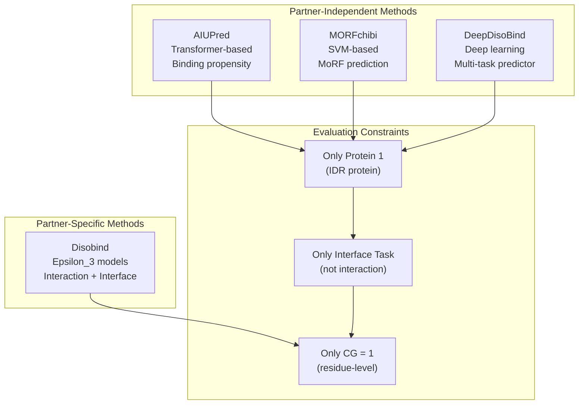
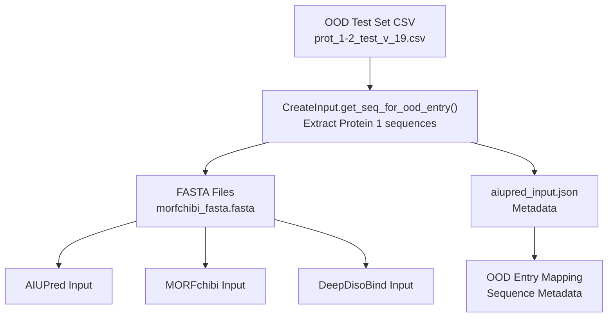
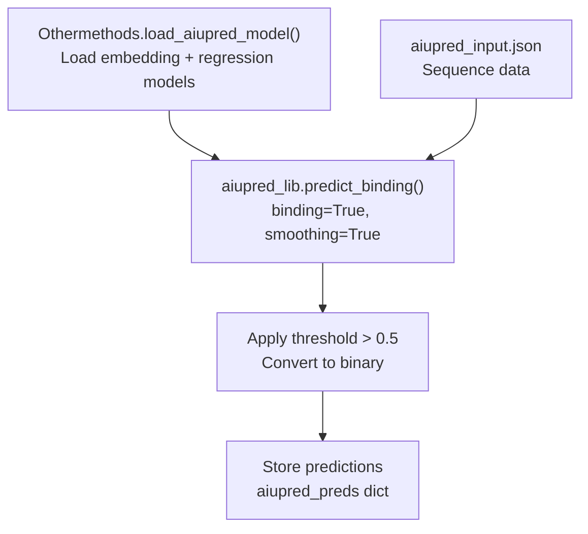
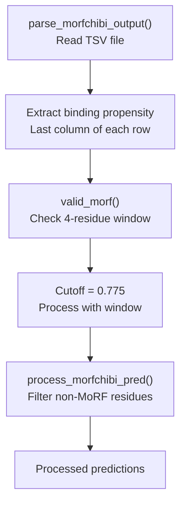
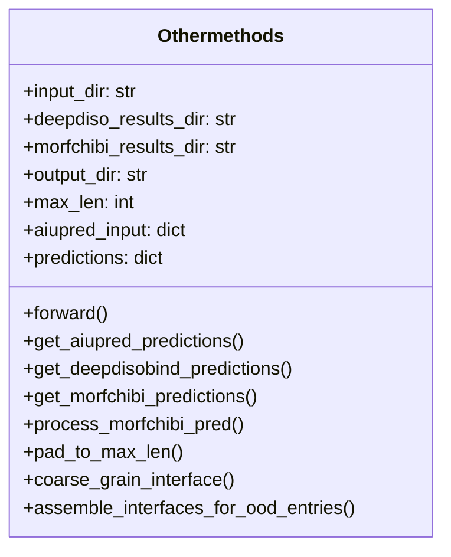
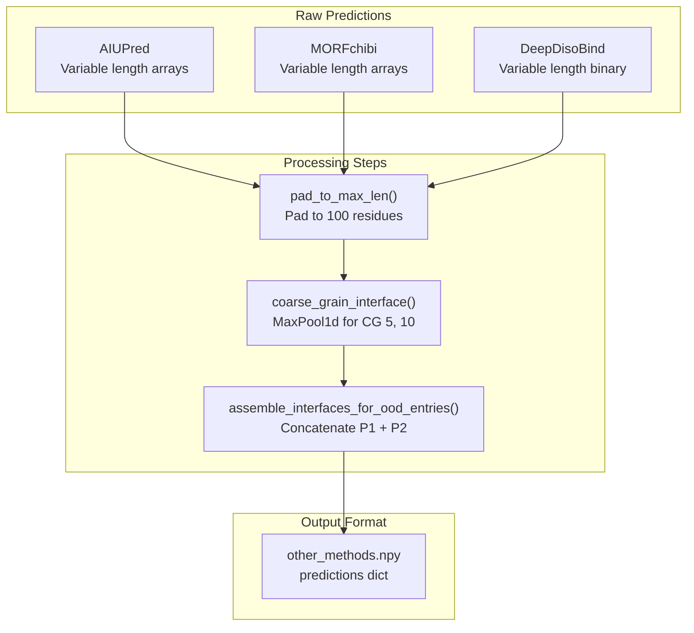
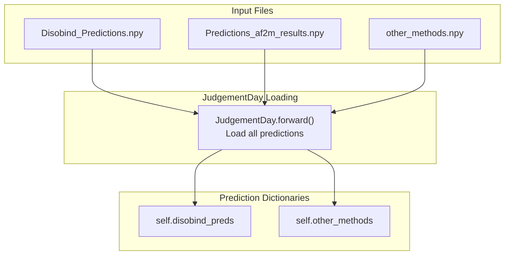

# Comparing with Other Methods

> **Relevant source files**
> * [analysis/analysis.py](https://github.com/isblab/disobind/blob/5fffcf84/analysis/analysis.py)
> * [analysis/get_other_method_preds.py](https://github.com/isblab/disobind/blob/5fffcf84/analysis/get_other_method_preds.py)
> * [dataset/prep_other_methods_input.py](https://github.com/isblab/disobind/blob/5fffcf84/dataset/prep_other_methods_input.py)

## Purpose and Scope

This page explains how to prepare inputs for, obtain predictions from, and evaluate Disobind against competing partner-independent interface prediction methods. These methods (**AIUPred**, **MORFchibi**, and **DeepDisoBind**) predict protein-protein interaction interfaces based on sequence alone, without requiring knowledge of the binding partner.

For information about the broader evaluation pipeline including AlphaFold predictions, see [JudgementDay Analysis Pipeline](/isblab/disobind/5.1-judgementday-analysis-pipeline). For disorder-specific analysis, see [Disorder-Specific Analysis](/isblab/disobind/5.5-disorder-specific-analysis). For performance metrics, see [Performance Metrics and Evaluation](/isblab/disobind/5.4-performance-metrics-and-evaluation).

**Key Distinction**: Unlike Disobind which predicts partner-specific interactions, the competing methods provide partner-independent predictions. Therefore, comparisons are performed only for the interface residue prediction task at CG=1 resolution, and only for the first protein (IDR) in each complex.

Sources: [analysis/analysis.py L1-L8](https://github.com/isblab/disobind/blob/5fffcf84/analysis/analysis.py#L1-L8)

 [dataset/prep_other_methods_input.py L1-L10](https://github.com/isblab/disobind/blob/5fffcf84/dataset/prep_other_methods_input.py#L1-L10)

 [analysis/get_other_method_preds.py L1-L7](https://github.com/isblab/disobind/blob/5fffcf84/analysis/get_other_method_preds.py#L1-L7)

---

## Overview of Compared Methods

Disobind is evaluated against three partner-independent interface prediction methods designed for intrinsically disordered regions:

| Method | Type | Input | Output | Threshold |
| --- | --- | --- | --- | --- |
| **AIUPred** | Disorder-based binding predictor | FASTA sequence | Binding propensity per residue | 0.5 |
| **MORFchibi** | SLiM/MoRF predictor | FASTA sequence | Binding propensity per residue | 0.775 (with 4-residue window) |
| **DeepDisoBind** | ML-based interface predictor | FASTA sequence | Binary interface prediction | Pre-binarized |

### Method Comparison Framework



Sources: [analysis/get_other_method_preds.py L14-L35](https://github.com/isblab/disobind/blob/5fffcf84/analysis/get_other_method_preds.py#L14-L35)

 [analysis/analysis.py L416-L434](https://github.com/isblab/disobind/blob/5fffcf84/analysis/analysis.py#L416-L434)

---

## Input Preparation Workflow

### Step 1: Generate Input Sequences

The `CreateInput` class in `dataset/prep_other_methods_input.py` creates FASTA files containing only the first protein (IDR) sequences from each OOD test entry.



**Diagram: Input Preparation Pipeline**

The script generates:

* **FASTA files**: Protein sequences with headers in format `UniID_start_end` [dataset/prep_other_methods_input.py L100-L101](https://github.com/isblab/disobind/blob/5fffcf84/dataset/prep_other_methods_input.py#L100-L101)
* **aiupred_input.json**: Metadata mapping sequence IDs to OOD entries and sequences [dataset/prep_other_methods_input.py L125-L130](https://github.com/isblab/disobind/blob/5fffcf84/dataset/prep_other_methods_input.py#L125-L130)

Sources: [dataset/prep_other_methods_input.py L13-L46](https://github.com/isblab/disobind/blob/5fffcf84/dataset/prep_other_methods_input.py#L13-L46)

 [dataset/prep_other_methods_input.py L88-L107](https://github.com/isblab/disobind/blob/5fffcf84/dataset/prep_other_methods_input.py#L88-L107)

### Input File Format

Each method requires sequences in FASTA format. The `aiupred_input.json` file stores metadata for mapping predictions back to OOD entries:

```json
{  "UniID_start_end": {    "seq": "PROTEIN_SEQUENCE",    "ood_entry_id": "UniID1:s1:e1--UniID2:s2:e2_num"  }}
```

Sources: [dataset/prep_other_methods_input.py L103-L106](https://github.com/isblab/disobind/blob/5fffcf84/dataset/prep_other_methods_input.py#L103-L106)

---

## Obtaining Predictions

### AIUPred (Local Execution)

AIUPred is run locally via the `aiupred_lib` library. The `Othermethods` class in `get_other_method_preds.py` generates predictions programmatically.



**Diagram: AIUPred Prediction Flow**

Key implementation details:

* Uses `aiupred_lib.init_models("binding")` to load models [analysis/get_other_method_preds.py L57-L62](https://github.com/isblab/disobind/blob/5fffcf84/analysis/get_other_method_preds.py#L57-L62)
* Calls `aiupred_lib.predict_binding()` with `binding=True, smoothing=True` [analysis/get_other_method_preds.py L86-L89](https://github.com/isblab/disobind/blob/5fffcf84/analysis/get_other_method_preds.py#L86-L89)
* Applies threshold of 0.5 to convert propensities to binary predictions [analysis/get_other_method_preds.py L91](https://github.com/isblab/disobind/blob/5fffcf84/analysis/get_other_method_preds.py#L91-L91)

Sources: [analysis/get_other_method_preds.py L57-L97](https://github.com/isblab/disobind/blob/5fffcf84/analysis/get_other_method_preds.py#L57-L97)

### MORFchibi (Web Server)

MORFchibi predictions are obtained through the web interface.

**Workflow**:

1. Upload `morfchibi_fasta.fasta` to MORFchibi web server.
2. Download result `.txt` files (TSV format).
3. Place in `../database/other_methods/morfchibi_results/`.
4. Name files as `_{seq_id}.txt`.

**Special Processing**: MORFchibi requires a 4-residue window validation implemented in `valid_morf()` [analysis/get_other_method_preds.py L143-L157](https://github.com/isblab/disobind/blob/5fffcf84/analysis/get_other_method_preds.py#L143-L157)



**Diagram: MORFchibi Processing with Window Validation**

The `valid_morf()` function checks if at least 4 consecutive residues exceed the 0.775 threshold. Residues not meeting this criterion are set to 0 in `process_morfchibi_pred()` [analysis/get_other_method_preds.py L176-L178](https://github.com/isblab/disobind/blob/5fffcf84/analysis/get_other_method_preds.py#L176-L178)

Sources: [analysis/get_other_method_preds.py L125-L181](https://github.com/isblab/disobind/blob/5fffcf84/analysis/get_other_method_preds.py#L125-L181)

### DeepDisoBind (Web Server)

DeepDisoBind predictions are obtained through the web interface.

**Workflow**:

1. Upload batches of 20 sequences (generated by `write_deepdiso_fasta_file()`) to the server [dataset/prep_other_methods_input.py L109-L123](https://github.com/isblab/disobind/blob/5fffcf84/dataset/prep_other_methods_input.py#L109-L123)
2. Download result FASTA files.
3. Place in `../database/other_methods/deepdiso_results/`.
4. Name files as `result_deepdiso_{range}.fasta`.

The `get_deepdisobind_predictions()` method parses the `protein_binary` field from the result string [analysis/get_other_method_preds.py L116-L119](https://github.com/isblab/disobind/blob/5fffcf84/analysis/get_other_method_preds.py#L116-L119)

Sources: [analysis/get_other_method_preds.py L100-L122](https://github.com/isblab/disobind/blob/5fffcf84/analysis/get_other_method_preds.py#L100-L122)

---

## Processing Other Method Predictions

### The Othermethods Class

The `Othermethods` class in [analysis/get_other_method_preds.py](https://github.com/isblab/disobind/blob/5fffcf84/analysis/get_other_method_preds.py)

 orchestrates the collection and formatting:



Sources: [analysis/get_other_method_preds.py L14-L35](https://github.com/isblab/disobind/blob/5fffcf84/analysis/get_other_method_preds.py#L14-L35)

### Output Format Conversion

All predictions are converted to Disobind's format with padding and coarse-graining:



**Diagram: Prediction Format Conversion Pipeline**

Key conversion steps:

1. **Padding**: Each sequence is padded to `max_len=100` [analysis/get_other_method_preds.py L207-L214](https://github.com/isblab/disobind/blob/5fffcf84/analysis/get_other_method_preds.py#L207-L214)
2. **Coarse-Graining**: Applied using `nn.MaxPool1d` for CG levels 5 and 10 [analysis/get_other_method_preds.py L223-L225](https://github.com/isblab/disobind/blob/5fffcf84/analysis/get_other_method_preds.py#L223-L225)
3. **Assembly**: Protein 1 and Protein 2 interfaces are concatenated into shape `(2*max_len//cg, 1)` [analysis/get_other_method_preds.py L284-L288](https://github.com/isblab/disobind/blob/5fffcf84/analysis/get_other_method_preds.py#L284-L288)

Sources: [analysis/get_other_method_preds.py L207-L291](https://github.com/isblab/disobind/blob/5fffcf84/analysis/get_other_method_preds.py#L207-L291)

---

## Integration with JudgementDay Evaluation

### Loading Other Method Predictions

The `JudgementDay` class loads these predictions at initialization [analysis/analysis.py L117-L118](https://github.com/isblab/disobind/blob/5fffcf84/analysis/analysis.py#L117-L118)



Sources: [analysis/analysis.py L73-L74](https://github.com/isblab/disobind/blob/5fffcf84/analysis/analysis.py#L73-L74)

 [analysis/analysis.py L112-L119](https://github.com/isblab/disobind/blob/5fffcf84/analysis/analysis.py#L112-L119)

### Evaluation Pipeline for Other Methods

Competing methods are evaluated only for interface predictions. The `get_other_method_preds()` method extracts only the first protein's interface predictions [analysis/analysis.py L416-L434](https://github.com/isblab/disobind/blob/5fffcf84/analysis/analysis.py#L416-L434)

```sql
if "interface" in task:    if self.mode == "ood":        other_methods_dict = self.get_other_method_preds(ood_dict=ood_dict)        preds_dict.update(other_methods_dict)
```

Target maps are sliced to include only Protein 1: `target[:self.max_len]` [analysis/analysis.py L426](https://github.com/isblab/disobind/blob/5fffcf84/analysis/analysis.py#L426-L426)

Sources: [analysis/analysis.py L416-L434](https://github.com/isblab/disobind/blob/5fffcf84/analysis/analysis.py#L416-L434)

 [analysis/analysis.py L473-L476](https://github.com/isblab/disobind/blob/5fffcf84/analysis/analysis.py#L473-L476)

---

## Evaluation Results

### Output Files

| File | Content | Location |
| --- | --- | --- |
| `Results_other_methods_{version}.csv` | Metrics for competing methods | `Analysis_OOD_{version}_{iptm}/` |
| `other_methods.npy` | Formatted predictions | `./other_methods/` |

Sources: [analysis/analysis.py L86-L87](https://github.com/isblab/disobind/blob/5fffcf84/analysis/analysis.py#L86-L87)

 [analysis/get_other_method_preds.py L33](https://github.com/isblab/disobind/blob/5fffcf84/analysis/get_other_method_preds.py#L33-L33)

### Metrics Calculated

For each competing method, the following metrics are computed via `torch_metrics`:

* Recall, Precision, F1-score, Average Precision, MCC, AUROC, Accuracy.

Sources: [analysis/analysis.py L438-L509](https://github.com/isblab/disobind/blob/5fffcf84/analysis/analysis.py#L438-L509)

 [analysis/analysis.py L709-L736](https://github.com/isblab/disobind/blob/5fffcf84/analysis/analysis.py#L709-L736)

---

## Key Considerations

### Evaluation Constraints

1. **Partner-Independence**: Other methods don't use partner information.
2. **Protein 1 Only**: Only the IDR protein (Protein 1) is evaluated [analysis/analysis.py L426](https://github.com/isblab/disobind/blob/5fffcf84/analysis/analysis.py#L426-L426)
3. **Interface Task Only**: Not compared for interaction contact maps.

### Method-Specific Thresholds

* **AIUPred**: 0.5 [analysis/get_other_method_preds.py L91](https://github.com/isblab/disobind/blob/5fffcf84/analysis/get_other_method_preds.py#L91-L91)
* **MORFchibi**: 0.775 with 4-residue window [analysis/get_other_method_preds.py L168-L169](https://github.com/isblab/disobind/blob/5fffcf84/analysis/get_other_method_preds.py#L168-L169)
* **DeepDisoBind**: Pre-binarized [analysis/get_other_method_preds.py L118](https://github.com/isblab/disobind/blob/5fffcf84/analysis/get_other_method_preds.py#L118-L118)
* **Disobind**: 0.5 (`self.contact_threshold`) [analysis/analysis.py L38](https://github.com/isblab/disobind/blob/5fffcf84/analysis/analysis.py#L38-L38)

Sources: [analysis/get_other_method_preds.py L90-L91](https://github.com/isblab/disobind/blob/5fffcf84/analysis/get_other_method_preds.py#L90-L91)

 [analysis/get_other_method_preds.py L168-L169](https://github.com/isblab/disobind/blob/5fffcf84/analysis/get_other_method_preds.py#L168-L169)

 [analysis/analysis.py L37-L38](https://github.com/isblab/disobind/blob/5fffcf84/analysis/analysis.py#L37-L38)